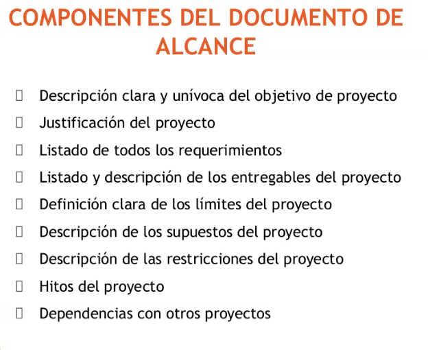
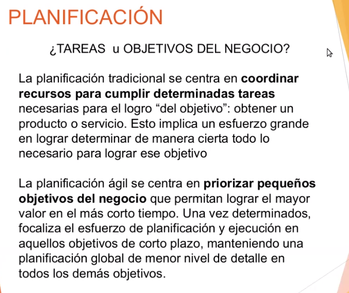
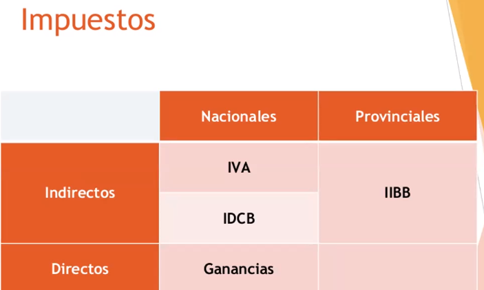
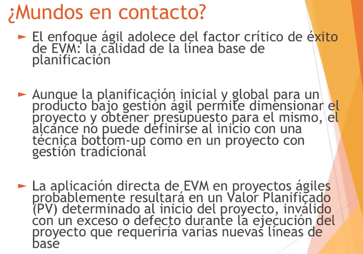
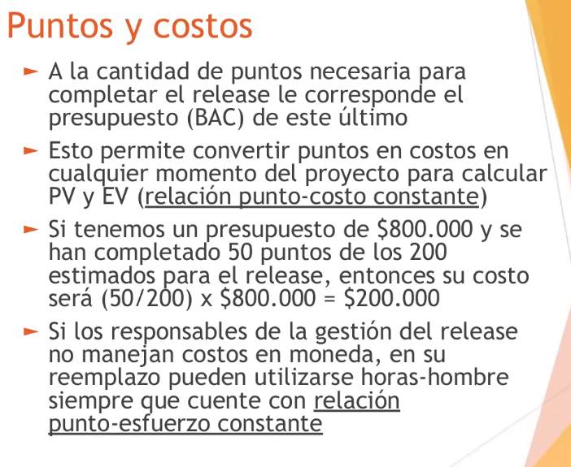
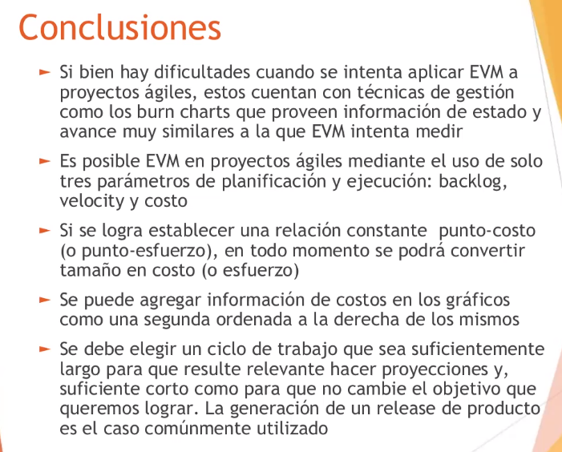
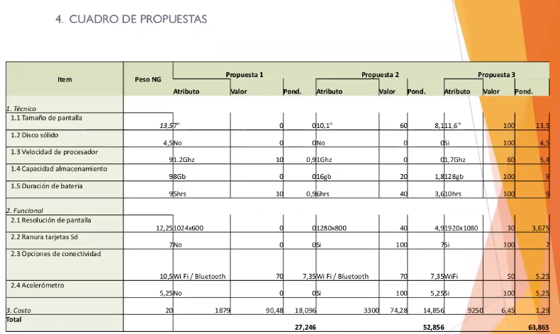
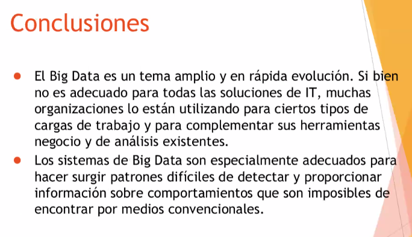
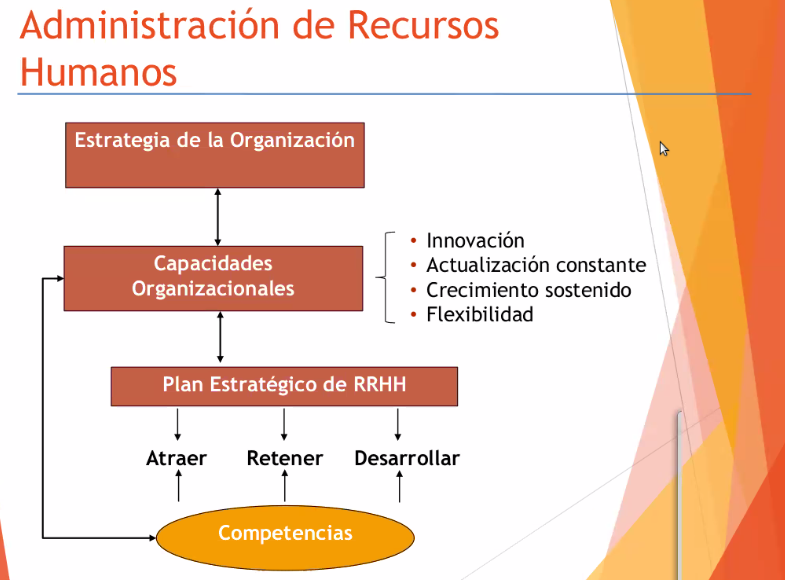

# **ADMINISTRACION DE RECURSOS**
## todo en el resumen en .pdf
## UNIDAD 1 , 2 y 4 entran en el primer parcial el 28 de junio de la facultad.

---
# **Gestion y control de proyectos**
## Porque utilizar una metodologia para gestionar
 

## Dos estandares mas conocidos
 

# <ins>Definicion de proyecto</ins>
## Segun PMI
- No puede haber proyectos infinitos segun el PMI

 

## Segun PRINCE
- Es una vision mas puntual y concreta que el PMI, se fija en los impactos, el contexto de la organizacion, etc..

 

## Enfoque a Medida
- Nos da otra vision de como gestionar
- Nos dice que tenemos que tener el foco en factores en particular, y que debemos adaptar nuestra forma de gestion a esos factores.
- Cuanto mas alejado del centro estamos, pasan ciertas cosas.. ver el grafico
- Movernos en los ejes nos da como resultado una forma de adaptacion del proyecto

 

## TALLE UNICO VS "A MEDIDA"
- Recordar que siempre para un proyecto tenes 3 variables:
    - Alcance
    - Tiempo
    - Recursos

 

La diferencia basica entre el talle unico y a medida es que uno es recontra mas flexible que el otro, y el otro es mas "defino todo al principio y veo".

# Fases 
## CICLO PDCA (Plan, Do, Check, Act)
 
 

# <ins>Fases de un proyecto(dividir a los proyectos en fases)</ins>
- Sirve para clasificar en cada una de esas fases distintas cosas que necesitamos hacer en distintos momentos de la evolucion del proyecto.

 
 

---
# **Riesgos y Problemas**
## RIESGOS: algo que puede pasar o no pasar
- Tiene una probabilidad de ocurrencia.
- Nos interesa porque puede tener la potencialidad de modificar nuestro proyecto o nuestro resultado del objetivo.. entonces hay que gestionarlo
- Se puede aprovechar para bien, o nos puede dar un problema

 

## Caracteristicas
 

## Atributos del riesgo
- **PIS** : Probabilidad x Impacto = Severidad
- El foco principal es ver si esto es poco probable o muy probable que pase como tambien si es muy potencial el riesgo o no

 

## Ejemplo riesgo
 
 

## <ins>Gestion del riesgo</ins>
- La gestion del riesgo es un proceso sistematico que involucra 4 pasos:
    - Identificacion: ver las fuentes del riesgo y sus consecuencias
    - Analisis: determinar la necesidad y la prioridad del tratamiento del riesgo
    - Tratamiento o respuesta: seleccionar opciones para actuar sobre el riesgo
    - Monitoreo y revision: ver como va la implementacion del tratamiento

 

## <ins>Tratamiento o respuesta a riesgos</ins>
 

Ejemplo de mitigar:
```go
- Comprar un server identico al que tengo andando en caso de que se caiga y 
que este funcione, asi el otro no es un SPOF
- Lo mismo con las personas, pones a otra persona en caso de que la que esta se vaya
```
 

## Estrategias: nivel de riesgo / habilidad para gestionarlo
 

# <ins>Problema</ins>
Basicamente es un riesgo que se generaliza y provoca un cambio, es decir, deja de ser un hecho con proabilidad de ocurrencia y simplemente **OCURRIO**.
- Esta definicion es si el problema es **esperado** en caso de no serlo, osea , que el problema sea **no-esperado** podria ser tambien una regulacion del gobierno o algo que nos afecto a nosotros sin esperarlo, Por ejemplo "ahora todos los dominios de argentina deben terminar en .arg en vez de .ar"

 

## Gestion de problemas
Similar a los riesgos, tiene 4 pasos:
- Registro
- Evaluacion
- Resolucion
- Monitoreo

 

## Proyectos exitosos?
Las de arriba no son suficientes, por mas que se cumplan, tenemos que evaluar las de abajo.

 

## Complejidad de los proyectos
El enfoque de diamante dice que nos va formando un diamante en el grafico segun lo que vas tomando, porque siempre hay alguna de las variables que empuja mas que las otras. \
Es una herramienta de diagnostico que nos sirve para definir de que tipo de proyecto estamos hablando.

 

### Ejemplo
 

---
# ALCANCE Y PLANIFICACION
## Que es el alcance?
- Alcance de producto
- Alcance de proyecto: puedo tener un alcance de producto dentro

 

## Documento de alcance
 

## REQUERIMIENTOS que debemos tener en el documento de alcance
 

## Caracteristicas de los requerimientos
 

## Componentes del documento de alcance
- Deben estar todas, si falta una estaria mal el documento de alcance o mal definido el proyecto.

 

## Verificar el alcance
Tratamos de conseguir la aceptacion de que la cosa esta entregada y que esta entregada acorde a los requerimientos..
- Nos permite evaluar que estamos bien acorde a lo planeado
- TODAS LAS FASES deberian tener una verificacion del alcance para aseugrarnos que cumplimos la face

 

# EDT (estructura de desgloce de trabajo/tareas)
 

# EJEMPLO EDT
 

# <ins>PLANIFICACION</ins>
## pasos para desarrollar una planificacion
- Seuenciar las actividades no le vamos a dar alta atencion

 

## PLANIFICACION: Definir actividades
 

## PLANIFICACION: Estimar recursos
 

## PLANIFICACION: Estimar Duracion
 

## PLANIFICACION: Desarrolar cronograma
 
### GANT para desarrollar el cronograma
Ese 0 dias dice que la tarea se cumplio (esta al final)

 
### Hitos y entregables
 

## Desarrollar cronograma: GANTT
 
 

---
# PROYECTOS AGILES
## Planificacion: trabajamos por tareas u objetivos del negocio?
La idea de la planificacion agil es una especie de `"divide and conqueer"` donde descompones el objetivo del negocio en pequeños objetivos.

 

## REPRESENTACION TRADICIONAL
 
 

## REPRESENTACION AGIL
La diferencia aca es que tenes distintos niveles
- **Planificacion estrategica**: nos da la "foto global" de a donde queremos llegar, es decir , nos da la defincion del producto y que componentes como tanto funcionalidades del producto.
Aca se trabaja con iteraciones incrementales.. a diferencia de la tradicional.
- Aca no planificacmos tareas, sino que planificamos funcionalidades que tiene que tener nuestro producto. esto nos permite establecer una linea de tiempo para establecer objetivos de corto alcance, tambien conocido como "SPRINTS" de 2 a 4 semanas. La planificacion del sprint (que cosas entran o no) van a surgir de toda la lista de funcionalidades que hallamos definido inicialmente + todas las funciuonalidades quew se vayan agregando a medida que aumente el tiempo. Es hacer entregas pequenias (de mayor valor) y a medida que avanzamos en el tiempo y vayamos generando iteraciones de este sprint, vamos a sumarlas desde el backlog (recontra igual a tu laburo).
- **Planificacion tactica**: la que actua antes de que inice cada sprint y es donde se toman las decisiones que cosas se pueden incorporar o que es conveniente incorporar 
    - aca se ponderan tambien cosas que se refieren a "modificaciones" de cosas existentes
    - con esto tenemos nuestros objetivos de corto alcance
    - todo lo no incluido queda en el backlog para que uno lo pueda retomar cuando haya un tiempo asignado en el futuro
- **Replanificacion operativa**: una vez ya empeza el srpint, esto le da un seguimiento a las tareas, en forma de "dailys" para ver como va todo ,es una especie de control

 
 
 


## ROI:
- Nos define en cuantos periodos de tiempos , cuando se hace una inverison por ejemplo para mejorar un producto.. nos permite medir cuanto "Esfuerzo" nosotros tenemos que poner y cuanto ese esfuerzo nos genera una mejora.. el ROI nos dice cuantos periodos necesito para que la acumulacion de esa optimizacion (mejora/ganancia) se recupera
- Nos ayuda para ver "que me sirve mas" si realmente el esfuerzo vale la pena, en cuanto lo recupero y eso.. 

---
# COMPLEJIDAD DE PROYECTOS
## <ins>Diagrama STACEY</ins>
Forma de poder diagnosticar situaciones y entender que es lo que esta pasando, como las variables que nos traccionan para tomar decisiones

 

- Certeza: que tenemos que desarrollar? cual es el alcance? que tecnologias tenemos que usar? esto es el nivel de certeza
- Acuerdo: referido quienes participan del proyecto(todos, los devs, los que planifican, qas, todos). Hace referencia en que nivel de acuerdo tienen sobre las variables mencionadas antes
    - necesidad y como resolverla

Podriamos decir que necesitamos estar en la zona verde al inicio, tanto en ambas representaciones..
En una va en los inicios de cada sprint y en la otra al inicio de todo el proyecto. Siempre se trata traccionar y llegar a esa zona.

- Al salir de esa zona, nos movemos a la zona compleja
**ZONA COMPLEJA**: hay distintas visioens de como resolver la situacion, bjaos niveles de acuerdo y de certeza.. aca necesitamos apuntalar que los expertos para que se logre unifiar criterios y ver que vamos a encarar, los expertos son (por ejemplo en IT) los **ingenieros** que son quienes tienen que definir bien que vmaos a hacer porque tienen el mayor conocimiento tecnico sobre lo que se tiene que lograr. \
otra problematica es tener distintas "visiones" de como hacer las cosas esto significa que no haya acuerdos, es titubear entre resolver las cosas de distintas maneras
**ZONA CAOTICA**: Sumando ambas
    - no tenes certeza de que hacer
    - tenes multiples visioens de como hacer las cosas \

Entras en esta zona, que es el peor escenario

 

---
# BUSINESS PLAN - Plan de negocios (Vamos a ver conceptos dentros metidos de este concepto, no la defincion en si)
 
**BUSINESS PLAN**: evaluacion economica y financiera sobre como se va a llevar adelante un negocio


- **Economica**: resultado de una determinada actividad : que resulta un perdida o una ganancia     (costos de los recursos y demas)
    - intervienen todos los activos pasivos de la empresa
- **Financiero**: flujo de los bienes dentro de ese negocio (pagos a los empleados y demas)
    - interviene la disponibilidad (ingresos de activos, efectivos, transferencias)

Los proyectos se costean con -> horas hombre

## IMPUESTOS

- **Carga Impositiva/Tributaria**: En otras palabras, la carga tributaria es una razón matemática que sirve para calcular el peso de los impuestos sobre los ingresos netos de los ciudadanos. \
Este indicador puede calcularse respecto a un individuo o grupo socioeconómico. Igualmente, se puede hacer la medición para un país, considerando al universo global de contribuyentes.

- **Fisco**: El fisco es el término utilizado para hacer referencia al Estado como persona jurídica que tiene la facultad de recaudar impuestos, los cuales sirven a su vez para financiar el gasto público. Es decir, el fisco es el Estado en su rol de ente recaudador de tributos.



## IVA
 

- Vos cuando pagas algo (viendolo del lado de la empresa) siempre pagas el IVA, es decir, pagas los impuestos
- El fisco te ayuda a compensar, al momento de vender tu producto/servicio de **cobrarte** ese impuesto al vendedor como para recaudar lo que gastate en lo que pagaste. \
Si la cantidad de impuesto es mayor a lo que vos pagaste, surge porque el bien que vos generaste tiene valor.. entonces esta diferencia es la que vos le tenes que devolver al fisco, y la otra diferencia es la que vos te guardas 

**Conclusion**: si lo que compra no lo logra vender, porque pagas impuestos. Cualquier impuesto puede hacer que nuestro negocio funcione o no funcione, entonces tenemos que prestarle atenicon y no pasarlo por alto. Lo que nosotros no podemos dejar de lado es la decisiones que vamos a tomar desde el punto de vista tecnologico, porque yo deberia poder determinar si mi decision es comprar o contratar o alquilar.. porque voy a tener una afectacion por impuestos y estos impuestos actuan de distintas maneras.

 

**Devengada**: El concepto de devengado hace referencia al registro de una transacción económica (venta o cobro de servicio, por ejemplo) en el momento en que se realiza, pese a que el pago derivado de ella se vaya a percibir en el futuro

## Ejemplo impuestos
Ejemplo de como arrancaria un costo y como termina

 

- Rentabilidad : lo que espera la organizacion obtener como beneficio
## Ejemplo 2
 

## Ejemplo 3
 

- Los costos muy rapidamente se disparan fijate, solamente hubo 3 pasamanos y el costo final se duplico.

## Alicuotas
 
**Alicuota**: Para explicarlo de forma sencilla, si dividimos una tarta en 10 trozos exactamente iguales, cada uno de los trozos es una parte alícuota de la tarta. \
Hace referencia a **proporcionalmente** a repartir o dividir cosas en partes iguales o equivalentes.

## Ingresos brutos
 


## Impuesto a los debitos y creditos bancarios
 

## Ganancias
 
 

## Inversion y Gasto
 
 

# Amortizacion
En términos empresariales, este término puede tener diversas acepciones según a qué objeto se ciña o de qué modalidad. En todos los casos se relaciona el valor de un bien o pasivo con el tiempo o vida útil del mismo, ya que como podemos intuir, todos los bienes van perdiendo valor con el paso del tiempo, por tanto, es una de las formas de cuantificar la pérdida de valor.

En este sentido, para un activo la amortización (contable) será el disminución o pérdida de valor a lo largo del tiempo, mientras que para un pasivo se refiere a la disminución del crédito, de la deuda.

Se suelen amortizar cualquier bien que forme parte del inmovilizado material, como una grua, una fotocopiadora,, etc.

**Otra definicion**: sirve para recuperar o compensar los fondos invertidos en alguna empresa.
## Inversion vs Gasto
 
 

# LEASING
Usado por ejemplo para equipos de procesamiento (computadores) y vehiculos, que mierda es? \
Es un mecanismo que le permite a un vendedor de un producto/servicio entregarlo a aquel que es el comprador bajo el contrato de leasing, donde la operaicon de compra no se ejecuta nunca a menos que se quiera ejecutar que en general es al final del periodo de contrato (tiempo), aca siempre hablamos de algo de largo tiempo, generalmente de valor alto. \
Ej un contrato de leasing de 200 computadoras.

Usado en contextos de organizaciones obviamente. \
- No hay ningun pago inicial, se paga mes a mes una proporcion.
- El valor final de compra suele ser bastante irrisorio/bajo. Porque lo que se busca es una especie de contrato
- Tambien puede haber una opcion de renovacion.
- Es util y mas barato tambien para las empresas al iniciar, dado que los productos suelen ser muy caros.

 

Actua como un contrrato de alquiler con opcion a compra, que se ejecuta a la finalizacion del plazo. Supongamos que tengo muchos puestos de trabajo, entonces llamo a una empresa que nos da equipamiento personal y lo que vamos a hacer es recibir ese equipamiento y pagar mes a mes esa especie de "alquiler". Si el contrato es a 36 meses, cuando se finaliza la ultima cuota, hay una opcion de adquisison. Se suele ofrecer esto a grandes cosas que son muy caras, como aviones.. porque es un beneficio bilateral.
- Se podria tener una contratacion de renovacion al final y que no sea una venta.
- Las cuotas del leasing son consideradas gastos y permite la deduccion del impuesto a las ganancias

# Costo laboral
 
 

- Cargas sociales: se suman al sueldo bruto

 
 

# INFRAESTRUCTURA IT
 

# CAPEX - OPEX - TCO
 

**OPEX**: gastos que la organizacion necesita -> parte de la inversion del trabajo, pero NO SON INVERSIONES.


---
# Gestion del valor ganado (Earned Value Managment)
# <ins>EVM</ins>
- Tecnica que trabaja desde que inicia el proceso hasta que termina.
- En la medida que vas avanzando en la evolucion del proyecto tenes tus puntos de control para analizar todo (que tareas hechas, costos, que falta hacer, etc)

 
 
# Variables principales
 

## PV: Valor Planeado
Para una determinada tarea, cuantos recursos voy a tener involucrado para su desarrollo? entonces esos recursos involucrados son los que nos permiten calcular el valor planificado para la tarea.
- Si esa tarea tiene 10 unidades (monetarias) es porque involucra determinadas cosas que la **suma valen 10 unidades**.
- Es al inicio del proyecto , este **PV se conoce siempre de antes** de iniciar el proyecto.

## AC: Costo Real
Cuando empezamos a ejecutar tareas , esa ejecucion de tareas va insumiendo recursos, esos **recursos insumidos** al momento del analisis nos da lo que es el ACTUAL COST, o **costo real**.
- Es como "la verdad en la mano" despues de ejecutar, es como "lo que paso"


## EV: Valor Ganado (TODO AQUELLO QUE PUDIMOS HACER)
El eje principal de todo el analisis, el Earned Value. Se define como la **cuantificacion de las tareas realizadas en funcion de lo planificado**. \
- Ej tengo una tarea planeada de **10 unidades** que se va a ejecutar en una semana ( 7 dias)
- Termina la semana (logrando ejecutar todo en 1 semana).
- Cuando vamos a ver la cuenta esa tarea ejecuto **2 unidades monetarias**
- Entonces el **Valor Ganado aca seria 10**, independientemente de que fueron 2 unidades monetarias.
- El costo real va a ser de 12, porque esta tarea consumio mas recursos de lo que tenia planificado para la ejecucion. (10 + 2)

# Ejemplo
- Supongamos que tengamos que hacer un proyecto que consiste en hacer un producto que sale 1000 pesos cada producto, y tenemos que crear 6 productos en 6 meses (entonces estimamos que vamos a tardar 1 mes para hacer 1 producto).
- Suponer que medis en cualquier momento del proyecto y te da 4 unidades , sin importar cuanta plata gaste, **EL VALOR GANADO** es de `4000`. 

# Rendimiento y Avance
## Notar que estas cuentas se hacen siempre en un determinado momento de tiempo
Con las variables principales podemos ir viendo como le va al proyecto midiendo el EV con el AC y el PV

 

## EV <-> AC
- Cuando comparamos lo ganado contra lo gastado, nos da si estamos gastando mas o menos de lo previsto. en el ejemplo de leo, estamos en **costo** es decir, venimos bien (gastamos lo que presupuestamos).
- Si el gasto fuera 3000, (EJECUTANDO LAS 4), pude ejecutarlas y solamente gaste 3000, estuve siendo mas eficiente y tuve un ahorro en costos.

## EV <-> PC
- Si comparo 3500 (3 tareas y media) contra 4000 , lo que me da como diferencia me representa un desvio de tiempo.
- Si EV < PV , porque lo gane en terminos de proyecto es menos de lo que planifique, estoy atrasado.

---

# Formulas de indicadores
 
```go
"COSTOS":
- "CV (variacion de costos) = EV - AC" , si diera positivo , ese valor positivo
representa nuestro ahorro en costos.
supongamos que:
- Ev = 4000 y gaste 4000 => 0 , estamos en los costos planificacods
- si AC= 3000 , EV - AC = 1000 y esos 1000 positivos es lo que me estoy ahorrando
- si AC= 4500 , EV - AC = -500 y esos 500 negativos es lo que estoy teniendo como sobrecosto

- "CPI (indice de desepenio de costos) = EV / AC" 
- Si EV > AC  , nos va a dar un valor mayor que 1 , si es mayor que 1 
estoy 
- si fuera negativo 
- si fuera 1 => estamos acorde a lo planeado

-----------------------------------------------------------------
"SCHEDULE":
- "SV (variacion de cronograma) = EV - PV"
Si yo tengo un valor ganado mayor que el PV para ese mismo momento, eso 
solamente puede darse si meti mas tareas de las que pense que iba a meter
Si PV: 10 y cuando termino la semana y hice 12.5, entonces tengo un valor
ganado de 12.5 , comparado este EV es mas grande, por lo que significa
que hice mas tareas, en la ecuacion nos daria 2.5 positivo, que significa
la "cuantificacion monetaria en cuanto el adelanto de tareas" (todo en plata)


- "SPI (indice de desepenio de cronograma) = EV / PV"
- Si EV > PV  , nos va a dar un valor mayor que 1 , si es mayor que 1 
estoy adelantado en el cronograma
- si fuera negativo, estoy atrasado
- si fuera 1 => estamos acorde a lo planeado

```
 
  
---

# Variables Secundarias
 

## BAC (presupuesto total)
Presupuesto total del proyecto, es como la sumatoria de todos los **PV**

## ETC (estimacion para finalizar)
Costo del trabajo que resta realizar (desde hoy) que es lo que me queda para adelante => todo lo que no hice => tareas que hoy no hice y se van acumulando en el calendario mas adelante.. lo mismo viceversamente

## EAC (estimado a la conclusion) = AC + ETC
Este proyecto => Cuanto creo que va a salir?, es una re-estimacion del costo del proyecto durante su ejeccuion, que se espera ser mas certera que el BAC.

## VAC (variacion a la conclusion) (overrun or underrun)
Diferencia entre BAC y EAC, desvio en el costo total de proyecto

# Desempeño atipico y tipico + cambio a desempeño diferente
 
 

# Nueva estimacion detallada
 

---

# Representacion grafica
 

- Pregunta examen: El EV y el AC solamente lo puedo tener **antes o hasta el momento del analisis** porque no puedo calcular el EV ni el AC proyectado, lo unico que puedo proyectar es el PV

# Calculo de PV/EV en tareas incompletas
 

# Estado del proyecto
 

# Lo bueno lo malo y lo feo
 
 

---
# EVM vs AGILE (metodologia)
 

## Mundos en contacto?
 
 

## Enfoque
 

## Meter EVM dentro de una metodologia agil
Como no podemos gestioanr todo el proyecto de agil con EVM porque no tenemos forma de calcular las tareas detalladas a lo largo del tiempo para todas las instancias de ese proyecto, lo que vamos a tener que hacer  es buscar un alcance termporal que nos permita a nosotros:
- tener un nivel de planificacion tal que nos permita implementar EVM porque tengamos el nivel de detalle que necesitamos para implementarlo.

Para hacer esto se hacen **"releases"**

 

Se hace algo parecido que se hacia con las tareas pero aca con las releases, determinar cuanta cantidad de trabajo vamos a dedicar a un release.
- Aca las unidades son las horas/hombre

# Relacion entre punto y costo
 

 

## Relacion en un cuadro
 

- El prespuesto ahora esata referido al release 
- Nuestro Baseline (antes pv) ahora es la cantidad de puntos que deben completarse en cada sprint
- Nuestro planed value (antes costo presupuestario) es la cantidad de puntos que deben completarse al finalziar el sprint

 

 

---
# Calculo de lineo base
 

# Mediciones necesarias
 

# Puntos y costos
 

# Burn_Down chart
 

---

# Formas graficas de representar como es la evolucion del trabajo realizado y el que nos queda por hacer
 

# Burn-up chart
 
 

# Ventajas
 

# Conclusiones
 

---

# EVM - PRACTICA
### Ejercicio 1 
 
 
```go
BAC = presupuesto total del proyecto
BAC = $4000 (te lo da el ejercicio)
 
Al finalizar el primer dia se generaron 160 paquetes
donde el costo de los ingredientes fue $720 

PV = 200 x dia* 40 galletitas * 0.1 costo
PV = $800

"lo que realmente paso":
EV(earned value) = 160 x dia* 40 galletitas * 0.1 costo
EV = $640
AC = $720 (costo actual de este primer dia)

a)  
CPI = EV / AC = $640 / $720 < 1
=> el proyecto esta por encima de los costos (gaste mas plata)
" nota importante aca:"
- notar que esto es bastante intuituivo, porque vos de una pensas
yy es obvio que te va adar menor que 1 porque esta scomparando
lo que realmente hiciste vs el costo actual del primer dia.
pero vos tenes que notar que esos valores estan acordes a lo
presupuestado.

b)
SPI = EV / PV = $640 /$800 <  1
=> el proyecto esta retrasado 

c) si al primer dia hice 160 paquetes, me quedan hacer 40 + 800 = 840 paquetes => 33600 galletitas
en 4 dias => tendria que hacer "210 paquetes por dia"

"note": este costo diario seria segun el prespuesto, pero 
nosotros no estamos performando segun el presupuesto, fijate
que estamos por encima de los costos, el CPI no es 1, es menor..
entonces para aplicar estos indices es "dividir todo por el cpi"
con esto estimamos que vamos a mejorar la capacidad productiva
pero no estamos estimando que el costo lo vamos a poder corregir
estamos asumiendo que este desvio de costo "VA A CONTINUAR" que
es lo esperado.. porque el enunciado te decia que si o si tenia 
que ser en 5 dias.

"costo diario": (210 * 40 * 0.1)/CPI = $945

"costo 4 dia" = AC + (costo diario x 3) = $ 720 + 3 * $945
"costo 4 dia" = $3555

d) estamos buscando una situacion que nos permita corregir
nuestro desempenio de costo futuro de manera tal que cuando
nosotros estemos al finalizar el proyecto, el BAC y el AC
sean iguales, es decir, que gastaste lo que presupuestaste.

TCPI: es lo que mide justamente esto
TCPI = (BAC - EV) / (BAC - AC) 
TCPI = (4000 - 640) / (4000 - $720) = 1.02439

"con el costo diario:" ahora lo vas a corregir, es decir:
en vez de ajustar para que todo termine como arranco el primer
dia, lo ajusto con el "TCPI"  para asi llegar a cumplir el presupuesto.

"costo diario": (210 paquetes* 40 galletita * 0.1)/TCPI = $945
"costo diario": $819,99

```

### Ejercicio 2
 
```go
duracion proyecto: 18 meses
dos casas por mes: 2 casas x 1 mes => 36 casas total
PV: $15,000 por casa


"comienzo del mes 15, construido 30 casas y CPI 0,90"
a) estado del proyecto?
CPI < 1 => estoy por encima del presupuesto
SPI = EV / PV
EV = $15000 * 30 => $450000
PV = $15000 * 28 => $420000
SPI = 1,071 

SPI > 1 => estoy adelantado
rta: c: por encima del presupuesto y antes de lo previsto

b) costo real del proyecto en este momento?
CPI = EV / AC
CPI = 0,90
0,90 = $450000 / AC 
AC = $500,000

c) suponiendno que la variacion de cost o continuara, cuanto dinero adicional se necesitara para completar el proyecto?

aca tenes que plantear el "desempenio tipico" que dice que 
la perofrmance de costos se mantendra hasta la finalizacion
del proyecto

EAC = BAC / CPI

el BAC es el presupuesto y lo puedo sacar:
BAC = $150000 * 36 = $540000

EAC = 540000/ 0,9
rta: EAC = 600,000

d) estimacion del proyecto a finalizar suponiendo que la 
variacion hasta ahora se detuvo

eac: estimado a la conclusion = AC + ETc
ETC = BAC - EV

EAC = AC + (BAC - EV) = 500000 + (540000 - 450000) = 59000

e) La alta gerencia quiere conocer el porcentaje del proyecto
que se ha completado. ¿Qué se debe informar?


aca podes hacer casas construidas / casas que faltan = 30/36 
o sino tambien EV/BAC => 450000/ 540000 = 83,33%

f) Imagínese si en lugar de 15 meses y con el costo que usted 
calculó, el proyecto estuviera en el mes tres y acumulara costos
por $8.300. ¿Qué fórmula podría usar para BAC?

Al inicio del 3er mes, AC = $8.300 y PV = 6 x $15.000 = $90.000

El desvío es muy significativo.

Respuesta: c. AC + nuevo ETC

```

---

# GESTION ABASTECIMIENTO
 

## Secuencia de etapas o sub-procesos
`ejemplos con el software`

- Definicion requerimientos: que quiere el cliente como software
- Seleccion del mecanismo de compra: computadoras, licencias, servicios, software para testing
- Llamado y recepcion de ofertas: debe participar el que conoce la cosa, osea, el software, las licencias, etc.
- Evaluacion de ofertas: evaluar que esta definicion sea cubierta, ver si el mercado nos va a servir
- Adjudicacion de ofertas
- Receicpion del producto o servicio
- Seguimiento y monitoreo de la compra

 

## Formas de hacerlo
## 1 Definicion de requerimientos
 


## 2 Seleccion mecanismo de compra
- Notar que licitacion privada se diferencia en 2:
    - abierta: cuando cualquiera puede participar
    - cerrada: cuando concursan solos los proveedores invitados por la instituciuon. 

 


## 3-4 Llamado y recepcion de las ofertas y Evaluacion propuestas
- Se presenta el pliego (documento de requerimientos)

 

## 5-6-7 Adjudicacion de ofertas, recepcion del producto y seguimiento y monitoreod e la compra
 

---
# Consideraciones de abastecimiento en IT
 

## Caracteristicas del Hardware
 

## Caracteristicas del Software
 

## Actualizacion tecnologica de los RRHH
 

## Garantia y soporte tecnico
 

## Referencias y antecedentes del producto/servicio
 

## Referencias y antedecendetes del proveedor
 

---
# Metodologia de evaluacion de propuestas
- Precio: incluye todos los componentes tecnicos requeridos, no solamente el precio del objeto.

## Pasos
- Previo a la evaluacion de las propuestas:
    - 1 Armar el cuadro de pesos relativos
    - 2 Armar el cuadro de valoracion de atributos: peso con la plata 

- En evaluacion de propuestas:
    - 3 Armar el cuadro de ponderacion de propuestas: las ordenas segun su peso relativo, ej el lector de huellas me importa mas que el slot de ssd (un ej muy random)

El peso relativo lo pongo yo, segun los aspectos que me sumen o resten. Se parte de `100 puntos` y esos puntos se dividen en cada propuesta, no tendria sentido que sea equitativamente obvio.

```go
ej: tenes dos propuestas en el mercado
    - la mas cara
    - la mas barata
aca, en tu cuadro de valoracio nde atributos, le pones 
100 de una a la mas barata, porque es la mas valiosa para
vos
```

 

## Requerimientos
 

## 1. Cuadro de pesos relativos
 

## 2. Cuadro de valoracion de atributos
 
 

Los atributos pueden ser:
- **Mutuamente excluyentes**: para un producto existe en e lem ercado una determinada caracteristica toma solo un valor, por ej, el tamanio de la pantalla (o tiene 7'' o tiene 8'' o tiene 12'') \
Esto nos permite que siempre haya un atributo que menos satisfaccion me de y uno que mas satisfaccion me de (en el medio puede haber valores infinitos)
- **Binarios**: version simplificada de un mutuamente excluyente, nada mas que solo puede tomar 2 valores (como el disco, si es SSD=100 puntos, sino 0 puntos)
- **Aditivos**: items que tienen que caracterizaciones que pueden darse en un mismo producto o servicio de manera alternativa (unos, otros o todos juntos) \
Ej: la resolucion de pantalla fijate: vos podes modificar siempre la resolucion de tu pantalla sea cual sea la que tengas. Aca ninguna de las opciones por si misma nos va a dar la totalidad de la valoracion, sino que esa totalidad de valoracion la alcanza el producto que pueda satisfacer todas esas caracteristicas de manera simultanea. Fijate como la sumatoria da 100 entre los 3. \
    - Si tuviera un producto que admite dos de esas resoluciones, su valor es la suma de ambos `(30 + 40) = 70` por cada resolucion.
    - Si tuviera uno que no cumpla nada ahi = 0
    - Si tuviera uno que cumpla todos = 100

Otro ejemplo es tambien la conectividad fiajte

```go
- "LO QUE NO ENTRA POR LA IZQUIERDA, SE DESCARTA"

- "SIEMPRE TIENE QUE HABER UNO QUE SEA EL MAS IMPORTANTE. 100"
"(a excepcion de los puntos aditivos)" y tambien uno que "SEA SIEMPRE 0"
COMO EN CONECTIVIDAD -> el Wifi
COMO EN RESOLUCIONES -> 1280 x 800

- la funcion de costo a la derecha, siempre con el menor valor 
incluido en el intervalo debe darte = "0" dado que este es el peor
caso

- y acordate que se no puede pasar de 100
```

## 3. Cuadro de ponderacion de propuestas
- Para ponderar, tenes que ver que tanto completo el valor de tu atributo con respecto al peso que tenia en el valor general. Es decir, fijate que en la propuesta 3.. tenes un atributi de 11,6 pulgadas, eso con respecto al valor que tenia en tu NIVEL GENERAL es un 100, por lo tanto, a la ponderacion le pones el valor que representaba en tu nivel general: 13,5
- Lo mismo con la velocidad del CPU, fijate..
- Se dice que la propuesta que mas nos satisface es la que tiene mayor ponderaicon, en este caso; la 3

 

---

## Costos - calculo del uso - Funcion
 
 
 

## Punto de ponderacion (analisis complementario)
 

---

# METRICAS - Benchmark
"No se puede controlar lo que no se puede medir"
- SIEMPRE en el proceso de BenchMarking tiene que haber una unidad de medida en el algoritmo, aca vamos a ver los famosos KPIS
- El proceso de benchmark debe permitir la recalibracion del mismo en cada iteracion.

 
 

## Factor Critico de Exito CSF
 

## Indicador clave de desempeño - KPi
 

## Relacion entre KPIs, CSFs y objetivo 
 

## Categorias de mediciones
### Cumplimiento
 
 

### Calidad
Ejemplos de KPI:
    - Porcentaje de incidentes mal asignados
    - Porcentaje de incides no resueltos luego de ser marcados como resueltos

 

### Rendimiento
 
 

### Valor
Kpis que nos indiquen si la organizacion esta ganando algo

 
 

---
# HOJA DE KPI
 
 

## Calculo de progreso del proceso
 

# Conclusiones
 
 

---
# Objectives and Key results
 

## Conceptos
 
 

## Ejemplos
 

## Caracteristicas
 
 
 
 

# **BIG DATA**
 

# lAS 5 V de big data
 

# CASOS DE USO
 

# CONCEPTOS RELACIONADOS
## DATA SCIENCE
 

## DATA ANALYTICS
 
 

## PROCESOS RELACIONADOS
 

## TECNOLOGIAS
 
 
 
 
 
 
 

# SEGURIDAD
 
 

## SEGURIDAD -  TECNOLOGIAS
 

## RESPONSABLES DE SEGURIDAD
 

# CONCLUSIONES
 

# <ins>BLOCKCHAIN</ins>
Basicamente, (viendolo con lo que sabes) es una super mega base de datos, distribuida e INMUTABLE. nada cambia.
``` TOKENS
 

- We just gonna replace the data with these transactions.
- Now is usefull, because if we change the value of a transaction, the next block will be broken.
- We are not listing the names of "Darcy" we are only remember money movements.

## Coinbase transactions
 

- Coinbase is saying that 

## Mining
- Es como que un minero busca en un lugar oro, es como buscar lingotes de oro en el rio.
- El minero no sabe que va a encontrar oro, sabe que hay probabilidades
- En blockchain, vos estas encontrando valores sin saber que es, el que lo encuentre, le agrega **seguridad a la red**
- El minero es como que ayuda a la blockchain, va encontrando firma de bloques.

---
# Recursos humanos
### mmm no le dio tanta bola diciendo que hay otra materia especifica q habla de esto
 

## Administracion de recursos humanos
 
 

## Liderazgo
 

- LIDERAR != ADMINISTRAR
- La principal diferencia es que liderar consiste mas en "influir" en el comportamiento de las personas

### LIDERAR IMPLICA ADMINISTRAR, pero ADMINISTRAR NO IMPLICA LIDERAR
 

## Caracteristicas de lider efectivos
 

## Desarrollo de equipos
### <ins>Importancia de los equipos</ins>
 

### <ins>Obstaculos al buen funcionamiento</ins>
 

## Gestion del cambio
Es un proceso, se necesita gestionar el cambio porque genera preocupaciones o situaciones no esperadas o conflictos.

 

## Niveles de cambio
Cuando se presenta la necesidad de ejecutar cambios, necesitamos liderazgos para acompañar estos procesos de cambio.. estos procesos o niveles tienes distintos nombres.

 

## <ins>Fuerzas impulsoras</ins>
 

## <ins>Fuerzas restrictivbas</ins>
 

## Piramide de maslow
 

## Objetivos generales de la administracion de RRHH
 

## Negociacion
 


---

# <ins>TRIX R4 KIDS</ins>

### Como PM revisas informes de costos reales de entregables finalizadops
 

Siempre que estas en EVM, no te importa aseugrar porque el trabajo ya esta hecho y se asume que se hizo bien.. lo unico que podes hacer en este caso es "mejorar lo que falta" que es reasignar el presupuesto a otras tareas que lo necesiten.

---

### Mal uso de las metricas
 

- Se produzcan comportamientos que no deseamos
- Se convierta en el objetivo dejando de lado cual es el proposito de porque las utilizamos
- Definamos muchas metricas y eso dificulte la toma de decisiones en forma rapida

---

### EVM - hacer
 

---

### MEP
 

---