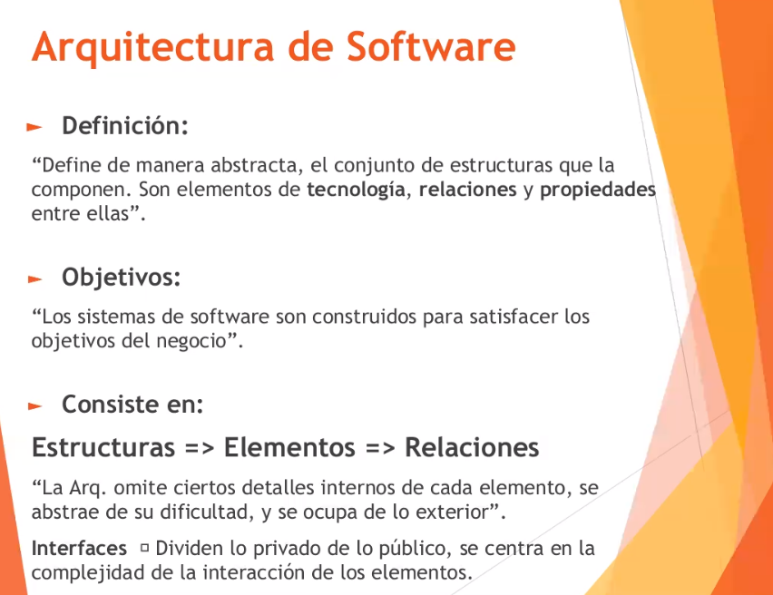
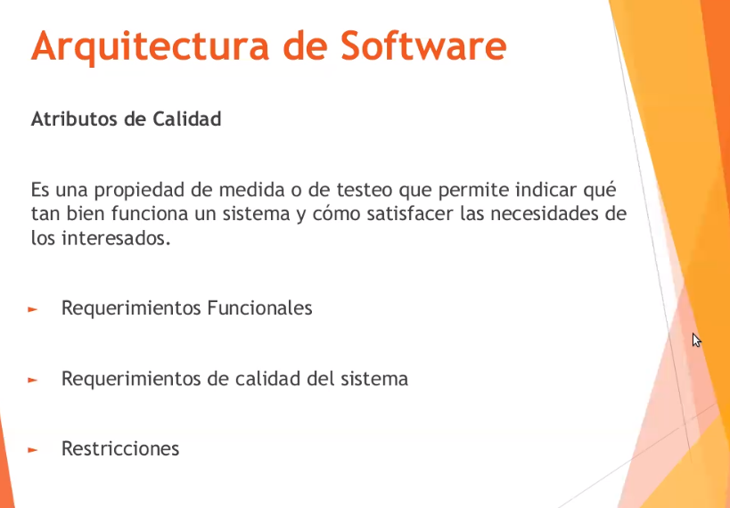
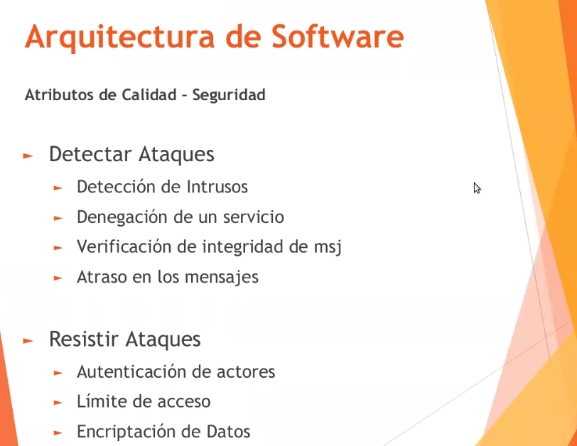
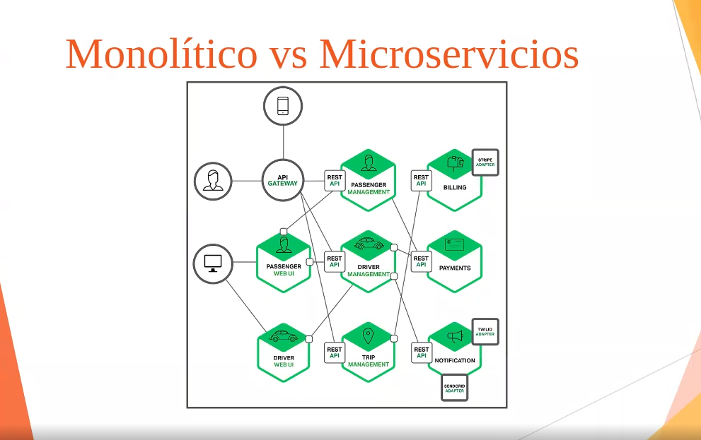
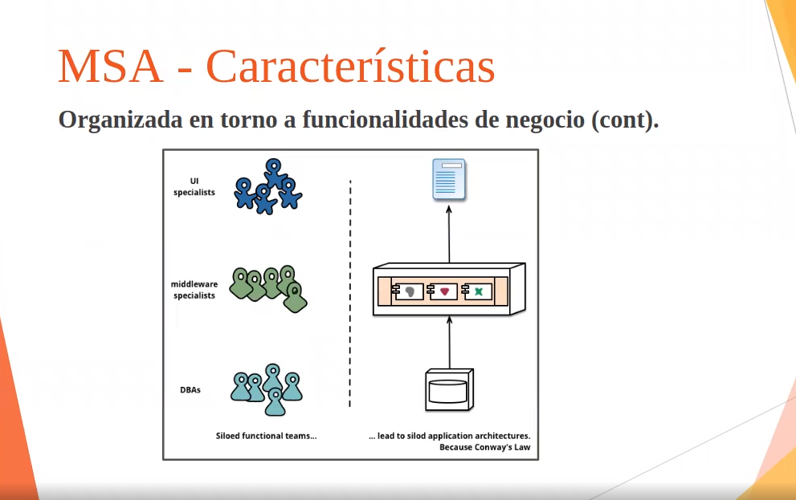
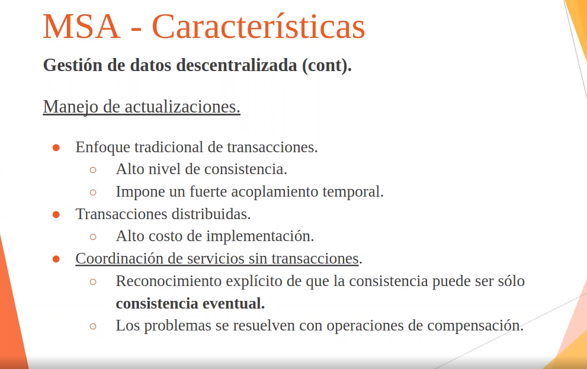
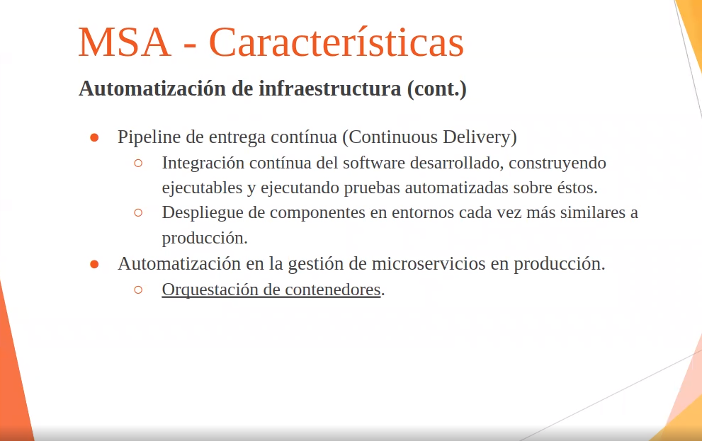
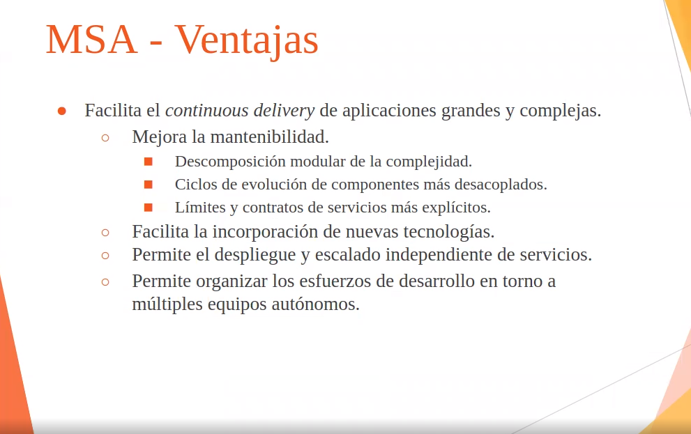
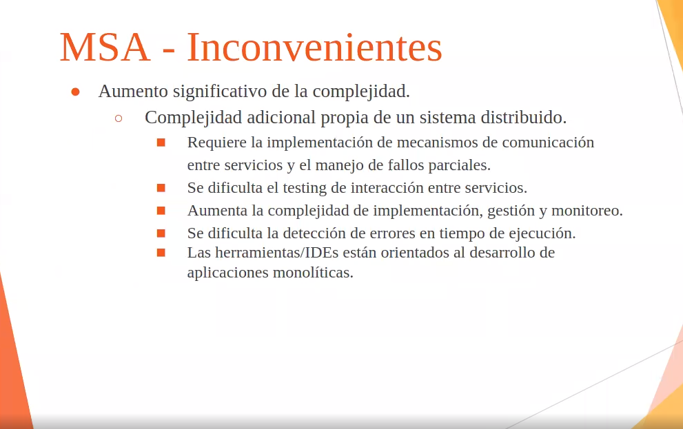
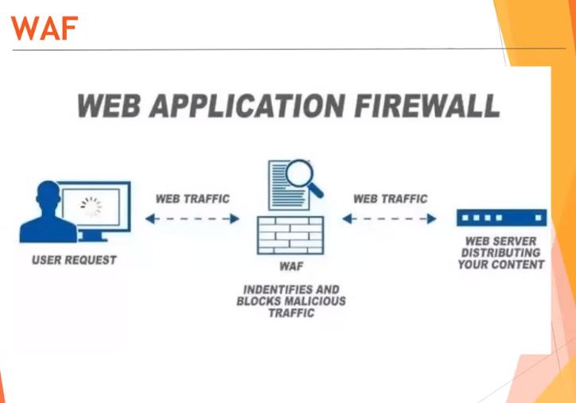

# Segunda parte - adr 
---
# Arquitectura
- Poder definir una buena definicion de arquitectura nos evita poder tener riesgos.

 

Notar como la arquitectura depende de varias cosas, como los atributos de calidad del sfotware...

 

## Interesados de una arquitectura
 

## Decisiones de design
 

# Atributos de calidad
 

## Disponibilidad
 

## Interoperabilidad
 

## Adaptabilidad
 

## Performance
 

## Seguridad
 

## Usabilidad
 

## Capacidad de prueba y testeo
 

## Otros atributos
 

---

# Tacticas de arquitectura y patrones
- El contexto siempre nos limita algunas cosas, es conocer esas limitaciones para saber que estrategia vamos a usar 

 

## ASR: Architecture Significant Requirements
 
 

## Arquitectura en proyectos agiles
 
 

## Evaluacion de una arquitectura
 

## Organizacion
 

## Arquitectura cloud
 
 
 

---

# API REST
## Microservicios
 

## Monolito vs microservicios
 
 

## Monolito
 

## Microservicios
 

## Ventajas e inconvenientes del monolitico
 
 

# MSA : MicroService Architecture
## MSA - caracteristicas
 
 
 
 
 
 
 

### Productos, no proyectos
 

### Smart endpoints and dumb pipes
 

### Gobierno desentralizado
 

### Gestion de datos descentralizada
 
 
 
 

### Automatizacion de infra
 

### Design tolerante a fallos
 

### Design evolutivo
 

### Metricas
 

## Ventajas
 
 

# Cuando usar una MSA?
 
 

---
# Clase 4 - On Premises, persistencia
Remember:
- **Persistencia Volatil**: no necesitan ser almacenados, datos almacenados que son accesibles mas rapido, (recorda la RAM)
- **Persistencia NO Volatil**: deben perdurar mas alla del procesamiento, usada si queremos tener datos a futuro y que nos van a servir.

## Transaccion + ACID
 

Que sistema tiene estas caracteristicas? ---> una **DB RELACIONAL**

## Definiciones basicas
 

- **Tol a la particion**: cuando tenemos todos los datos repartidos en distintos subsistemas que estan conectados por algun tipo de sistema de conectividad o red, el sistema de datos que gestiona esos nodos tiene que tener la posibilidad que ante la falla con la comunicacion con uno de esos nodos, pueda **seguir respondiendo**. 

Un sistema no es tolerante a la particion si no puede seguir operando (o deja de dar servicio) cuando se **pierde la comunicacion con uno de esos nodos**.

- **Disponibilidad / Availability**: si el sistema puede seguir respondiendo a partir de la falla, entonces tiene **disponibilidad**, si no fuera asi.. tendria disponibilidad limitada, por ejemplo, si se te cae un nodo y se rompe todo? la disponibilidad esta limitada a ese nodo.

OBS: que tenga tolerancia a la particion no tiene nada que ver con la disponibilidad

## SQL vs NO SQL
# SQL vs NoSQL
## **SQL**: (PostgreSQL, MySQL, SQLServer, ..)

Se guardan datos como si fuese una planilla de hoja de calculo, es decir, columnas y filas. Usos de PK y FK que permiten joinear datos, tambien acordate del grado de normalizacion, podes tener una base de datos `usuarios` y otra llamada `turnos` y si queres actualizar solamente la info de usuarios, tocas la primera base nomas sin necesidad de tocar la otra.
- Pros: mejor estandar, normalizacion, escalar verticalmentem=
- Contras: **leer datos** , pensa que la lectura de datos es mucho mas lenta porque tenes que ir a varias tablas(aunque solamente se nota en grandes escalas)
- Usos:
    - cuando vos sabes que va a ser una database que se va a estar modificando/escribiendo mucho, te combiene SQL
    - cuando queres normalizar cosas, y automatizar la escritura, por ejemplo, modificar el nombre de un usuario, ponele que tenes un turno asignado al usuario, si modificas el nombre del usuario, la tabla de turnos no va a necesitar modificarse dado que vas a tener la FK a ese usuario y vas a poder traerlo como es actualmente: con el nombre cambiado


## **NoSQL**: (DynamoDb, Redis, MongoDB, ..)
Notar que una NOSQL no significa que  **NO EXISTAN RELACIONES** significa que no estan implementadas en la base de datos o tu modelo de persistencia, obviamente hay relaciones.

(mal usado el nombre actualmente, deberian llamarse No-Rel por "no relacionales"). aca se modela mas orientado a las vistas, es decir, por ejemplo un listado de productos donde tenes datos del cliente, de los productos, fechas .. y va todo en una sola ""tabla"" o coleccion. Aca el problema es que si el usuario cambia el correo/imagen lo que sea, el dev esta encargado de actualizar los registros a c/u de las colecciones donde se modificaron esos datos.
- Pros: son realmente muy buenas al momento de leer datos, mucho mas rapido, tenes todo de una... es mas sencilla, mas rapida, y estan orientadas mas a los documentos (json), los esquemas son libres a diferentes de la SQL, mucha redundancia. [se escalan horizontalmente], basada en grafos/documentos.
- Contras: malas al momento de escribir, pensa que tenes que actualizar todas las colecciones/tablas. No hay una estructura definida como un DER en SQL
- Usos: 
    - cuando no se va a escribir mucho en la DB, sino mas que se va a **leer** y obtener los datos rapidos, en vez de ir modificando constantemente datos como en una SQL
    - se prioriza el accesso rapido a costas de la normalizacion de datos.
### Clasificacion de NOSQL
 

- Basadas en grafos: relaciones basadas en grafos

## No SQL - Arquitectura de modelo de sistema elastic
 

Nos permite un sistema de procesamiento distribuido para hacer principalmente buscas, esta orientado para buscar informacion rapidamente (esa info esta indexada), con esa info podemos ir a buscar otros datos o directamente responder el requerimiento.

En general, se lo ve combinado con otro sistema relacional que guarda datos.


# Teorema de CAP
 

Un sistema distribuido no puede cumplir estas tres caracteristicas, eso dice este teorema.

Para resolver esta situacion hay que hacer redundancia

# MEMCACHE
 

En lugar de ser yo quien codea el "bueno, estos datos los guardo en la RAM porque se que pronto los voy a usar" implemento un sistema que ya existe en mi solucion, llamado **MEMCACHED**.

## Sistema MEMCACHE
 

## Sistema VARNISH
 

Nota que bueno esta este, se fija en los Static Files antes de pegarle a los servers y te los trae si estan, sino los llama al server y el server los trae de la DB.

Hay expiracion de CACHE en este contesto

## Sistema REDIS
 

Usado para guardar **listas de valores**, tan complejas o sencillas como las querramos hacer (tengo claves, tengo valores y los que ponga en los valores dependen de mi criterio). Esta pensado para un uso en memoria **Volatil** a pesar de que podria usarse en memoria **No-Volatil** ( es decir, podria ser persistido a fileSystem).

Si leo datos de un redis tengo la maxima velocidad porque es la velocidad que me da un RAM, pero si estoy escribiendo tengo otro tiempo de respuesta mas alto.

## Sistema S3 - (como el de AWS)
 

Nos permite persistir archivos, funciona como un sistema web que nos provcee un api o una interfaz, y que nos liber aa nostroos de preocuparnos como es toda la capa real de persistencia de eso que tenemos que guardar, S3.

## ElasticSearch
Una base de datos NoSQL, pensada para la velocidad de busqueda, usada en grandes volumenes de datos.
Los datos sin procesar fluyen hacia Elasticsearch desde una variedad de fuentes, incluidos logs, métricas de sistema y aplicaciones web. La ingesta de datos es el proceso mediante el cual estos datos son parseados, normalizados y enriquecidos antes de su indexación en Elasticsearch. Una vez indexados en Elasticsearch, los usuarios pueden ejecutar consultas complejas sobre sus datos y usar agregaciones para recuperar resúmenes complejos de sus datos.

Elasticsearch almacena datos como documentos JSON. Cada documento correlaciona un conjunto de claves (nombres de campos o propiedades) con sus valores correspondientes (textos, números, Booleanos, fechas, variedades de valores, geolocalizaciones u otros tipos de datos).

Elasticsearch usa una estructura de datos llamada índice invertido, que está diseñado para permitir búsquedas de texto completo muy rápidas. Un índice invertido hace una lista de cada palabra única que aparece en cualquier documento e identifica todos los documentos en que ocurre cada palabra.

Durante el proceso de indexación, Elasticsearch almacena documentos y construye un índice invertido para poder buscar datos en el documento casi en tiempo real. La indexación comienza con la API de índice, a través de la cual puedes agregar o actualizar un documento JSON en un índice específico.

## HDFS (Hadoop Distributed File System)
 

Usado para grandes voluemesn de datos, rapido acceso y HA. 

## CDN - Content Delivery Network
 

Una CDN nos da una solucion de frontera, que de alguna forma nos permite acercar o acortar la distancia entre los consumidores de contenidos y los lugares donde se distribuye esos contenidos.

Para que? bueno, menor **latencia** , menos **hopes** (saltos) --- > + `PERFORMANCE`

Y en que esquema lo utilizaria? : **para que me carge mas rapido sea lo que sea que este ejecutando**.

El CDN distribuye los lugares de donde traer la informacion segun el usuario para que asi esten mas proximos, onda como el `us-east-1` de AWS. 

El cliente de contenido para en algun lugar que lo elije el CDN en funcion de reglas (maximizar el ancho de banda o reducir los hopes), es una especie de redireccion.

Es un beneficio para el usuario y para la red, porque libera camino para la fuente del contenido de la red, la implementacion de un CDN favorece a todo, al distribuidor del contenido y a los usuarios (porque ahorras ancho de banda)

Ej? cualquier plataforma de video a demanda implementa CDM, como amazon, twitch, youtube, etc.. todos estos corren un CDM, como mierda podrias ver netflix en tu lugar si corre en un server de US? bueno usa una CDN.

(obviamente hay servers rack aca en arg y todo eso)

# ON PREMISES
Ver un poco que pasa en la capa por debajo de lo que vimos antes, es decir, **INFRAESTRUCTURA** , a pesar de que tengamos sistemas de nubes privados.

# DAS - Direct Attach Storage
 

Dispositivos que lo que tienen son **chasis con muchos discos**. Esto mismo lo usamos nosotros cada vez que conectamos un USB o un disco externo a la PC, estamos conectando un DAS.

Son usados para dar servicio en linea, o para dar resguardo... un das admite tantos servidores como tantos puertos/interfaces tiene tu dispositivo de almacenamiento (2 puertos ? -> 2 servers)

Aca no hay un S.O corriendo ni un FS, me estoy conectando directamente a un disco remoto mediante un protocolo (cables que van directo entre el almacenamiento y el que lo consume), entonces, quien maneja esto? el S.O del server que agarra data de esos discos.

 

- La conexion es 1 a 1, no existe la congestion poque te conectas mediante un cable.

# SAN (red de almacenamiento de datos)
 

Es como el DAS pero montado en una red dedicada por fibra optica. Ahora tenemos un switch SAN donde tenemos N servers y N dispositivos de almacenamiento en ese switch, entonces aca tenes todo conectado

- Que viaja por toda la red? **blocks de disco** es decir, blocks como de tu FS

 
 

# NAS: dejamos el mundo de los bloques
 

Se caracteriziza porque se utiliza una red datos (ethernet), la diferencia aca es que estos tienen sistemas operativos que estan dentro de estos dispositivos NAS (es la mas comunmente utilizada)

Ej una red compartida en windows, ese compartido es la implementacion de un NAS, es un server de windows con protocolos para compartir files.

Resumen un sistema de almacenamiento con un sistema operativo.

Aca siempre se comparten **ARCHIVOS** no bloques.

Diferencia crucial aca, es que como tenes archivos pueda ser accedido por mas de uno de los clientes, porque cuando le llega una orden de escritura / lectura , el ultimo que llegue es el que va a quedar, es decir, concurrencia, gracias al S.O que tiene. (obviamente esto lo hace mas lento)


 

# Summary NAS - SAN - DAS
 

# Escalamiento vertical / horizontal en almacenamiento
 

## Aumentar la disponibilidad en almacenamiento
 

# ON-LINE vs OFF-LINE
 

- Ejemplo de online: S3, por ejemplo, porque es un sistema de resguardo en linea porque lo que persisitmos queda disponible.
- Offile: NAS

Por que querria tener un of-line? bueno principalmente por seguridad

---
# Clase 5 
# **Cloud Computing**
Modelo para permitir el accesso ubicuo, conveniente y bajo demanda a traves de la red a un conjunto compartido de recursos informaticos configurables (por ej redes, servers, almacenamiento, aplicaciones, servicios).

 
 
 

# Modelos de servicio
- **SaaS**: una aplicacion que corre en un navegador, asi es como la vemos y la consumimos, ejemplo Github, Correo via web, etc

- **PaaS**: servicio de plataforma, aca hablamos de "quien es el proveedor servicios" nos da un entorno de ejecucion para nuestra aplicacion, ejemplo Heroku. Pero aca nosotros no somos responsables ni de la virtualizacion, ni de la capa fisica, ni de nada, solamente somos responsables de armar la aplicacion. Aca la concurrencia, el soporte de la escalabilidad, cuantos usuarios, disponibilidad.. todo eso lo hace to proveedor, se presume que ese servicio siempre va a estar disponible.

- **IaaS**: infraestructura como servicio, aca como clientes nos darian los servers, redes, almacenamientos o lo que fuese y nosotros somos los encargados de instalar el S.O, configurar las redes, ejecucion, etc. Que la aplicacion responda, que el S.O responda, que los servicios respondan, todo eso.. es **responsabilidad nuestra**. No somos repsonsables de la virtualizacion, servers, storage o networking. 

- **CaaS**: Container as a Service, aca la diferencia con el PaaS es que desplegamos container engines, no aplicaciones como en el IaaS.

# Modelos de despliegue
 

# IMPORTANT SUMMARY
 

- Que el runtime lo hagamos nosotros, significa que tenemos que provisionar no solo el binario, o el compilado que va a correr, sino que tambien tenemos que proveer el contexto de ejecucion, como si fuera una maquina virtual de java, es la gran diferencia entre `CaaS` y `PaaS`.

Y aca te cierra bien el concepto de `On-Premises`.

## Serverless -> tambien llamado FaaS (Function as a Service)
En un serverles vos pones el codigo de una funcion, no subis todo un paquete de clases, o una aplicacion , subis **funciones independientes**. Es usado bastante para hacer pequenios microservicios donde invocas funciones, ejecuta una accion y termina, sin necesidad de una aplicacion.. pensado para contextos simples.

Ej? AWS Lambda es una plataforma informática sin servidor basada en eventos proporcionada por Amazon como parte de Amazon Web Services. Es un servicio informático que ejecuta código en respuesta a eventos y administra automáticamente los recursos informáticos requeridos por medio de código.

# Resumen
 
 

> Si la informatica empresarial era como comprar un auto, y cloud computing era como alquilarla por un dia, **serverless** es como tomarse un taxi.

# DataCenter vs Cloud publico
 

---

# Redes de datos
 

La disponibilidad de todo esta ligada a la disponibilidad que tengas en tus redes, no te sirve tener 20 HA clusters 20 LB-C clusters si tu red no anda, entonces por esto es importante.

## Tipos de servicios
- Enlaces a internet
- Punto a punto (P2P)
    - Redes privadas virtuales (RPV)
    - LAN to LAN (L2L)
- Enlaces punto a multipunto (P2MP)
- Fibra Oscura

## Redes MPLS
 

---

# Firewall
 

# IDS & IPS
 

IDS: registra acciones en funcion de reglas que nosotros definimos, escucha el trafico adentro de una red, y como definimos reglas 

IPS: al ver esas reglas, las rechazamos. Tiene una vinculacion con el firewall o t iene la capacidad de implementar un filtrado

# WAF: Web application Firewall
 

# SIEM
 

Sistema de procesamiento de informacion en funcion de eventos.

Reciven info desde las aplicaciones o cualquier elemento (del server, del IDS, del IPS o del WAF)

- Genera alarmas tambien y guarda todo en sus DB


# TRIX R4 KIDS
# Virtualizacion
 
Es una representacion o imitacion de un sistema (fisico). Con esta virtualizacion vos creas un servidor de manera virtual que como tal **no existe** tambies podes virtualizar **redes(como el packetracer), aplicaciones, datos, etc**.

Como se virtualiza? con un **Hypervisor** que es el sistema o capa que esta encima del servidor fisico, y este software es el encargado de ejecutar las maquinas virtuales. (obviamente tenes que tener una PC para virtualizar).

El hypervisor es el encargado de la asignacion del os recursos, como la ram, disco duro y demas caracteristicas a la hora de crear un sistema o varios sistemas virtuales. (Obviamente existen limitaciones, si tenes una PC de 6 gb de ram, no podes virtualizar un docker con 18GB de ram, lo mismo sumando, no podes tener dos dockers con 6 gb de ram, deberias tener dos de 3gb)

## Tipos de virtualizacion
- Procesamiento
- Almacenamiento
- Redes
- Seguridad de informacion
- Software
- Datacenter
- Escritorios de trabajo

viste que vos pensabas, como mierda hacen los nodos del cluster para conocerse entre si? o sino como definiar una infra dentro de esos mismos? bueno, virtualizando networks.

Ejemplo? el docker-network es una virtualizacion de red.

obs: podes virtualizar hasta un sistema de cluster

## Por que es importante?
**Beneficios**: por que quiero virtualizar? la respuesta es para lograr mas **eficiencia** en tu infraestructura o empresa, mejorar lso procesos, reducir costos, etc.
- Podria levantar una server virtual con 3 servidores fisicos (onda un cluster de high-performance) para poder levantar esa **maquina virtual** con la suma total de la ram, disco, cpu de c/ servidor. (esto te da tambien HA)

- optimiza el uso de recursos
- aumenta la velocidad de despliegue y redimensionamiento de recursos
- aumenta los niveles de disponibilidad de los servicios
- permite delegacion de gestion de recursos
- permite compatibilidad con el hardware real

## VM vs Container

 

Siempre hay un fierro abajo de todo, y siempre vamos a tener un sistema operativo. (en la VM se lo llama Host porque es el que corre en tu hardware)

 

EN los contenedores, tenes el SO, el gestor de contenedores (docker) y el entorno de ejecucion, donde ponemos las aplicaciones, donde **no HAY instancias de sistemas operativos** en cada instancia, pero el sistema operativo es unificado para todos los sitemas que corren en esa instancia de containerazacion. 

Docker Engine se encarga de lanzar y gestionar los contenedores con nuestras aplicaciones, pero en lugar de exponer los diferentes recursos de hardware de la máquina de manera discreta (es decir, 1 procesador y "x" GB de RAM... para cada aplicación), lo que hace es compartirlos entre todos los contenedores optimizando su uso y eliminando la necesidad de tener sistemas operativos separados para conseguir el aislamiento.
Cuando se lanzan uno o varios contenedores a partir de una imagen, a efectos de nuestra aplicación es como si estuviese ejecutándose en su propio sistema operativo, aislado de cualquier otra aplicación que hubiese en la máquina en ese momento. Pero la realidad es que están compartiendo el sistema operativo "host" que hay por debajo. Un contenedor ve su propio sistema de archivos, el resultante de "superponer" las capas de las que hablaba antes, y los recursos hardware se van asignando dinámicamente en función de las necesidades, de lo cual se ocupa Docker Engine (o el equivalente si usamos otro tipo de contenedores). Es decir, Docker aísla aplicaciones, no sistemas operativos completos.


        

# BackOffice
Backoffice hace referencia a las secciones de una empresa relacionados con los recursos humanos, contabilidad, gestion o logistica. 

Ahora, un **sistema de backoffice** es un sistema pensado para estas personas, mas como para un admin.

# Plan de contingencia
Un plan de contingencia es un conjunto de procedimientos alternativos a la operatividad normal de cada institución. 

Su finalidad es la de permitir el funcionamiento de esta, aun cuando alguna de sus funciones deje de hacerlo por culpa de algún incidente tanto interno como ajeno a la organización.

# Plan de mitigacion
Se denomina Plan de Mitigación a las **estrategias** definidas por tu empresa que tratan de reducir la probabilidad de ocurrencia del riesgo o reducir el impacto que pueda causar.

Es importante entender que el objetivo de mitigación de riesgos es reducir la exposición al riesgo con la intención de llevarlo a los límites de los umbrales aceptables para cada organización.

# Clase 3 
# Server Tower , Server Rackeables y Servers Blade
 
 

la principal diferencia es la disponibilidad que tienen los servers **Rackeables** a diferencia de los **Tower** que no lo proveen.
- fuente extraible en los rackeables, los towers son mas como una PC.

# Cluster
 

Un cluster es un conjunto de computadoras, procesadores o lo que fuese que permiten intercomunicarse entre si.

El principal principio del cluster es poder procesar varias cosas en paralelo, cuando una computadora pasa a ser parte de un cluster es un nodo.

Imaginate una f1, cuando paras en boxes.. tenes 8 mecanicos que hacen tareas en paralelo, como **cargar nafta, cambiar la rueda, cambiar volante**, etc.. cada uno de estos mecanicos podria ser un computador y el f1 representa el sistema.
Si un mecanico se desmaya, otro mecanico puede suplantarlo y terminar la tarea igual.

Se conectan mediante una red LAN de alta velocidad y se comunican mediante el middleware, que es el servicio intermedio que permite el funcionamiento de todos los equipos como un unico cluster.

Cada Nodo de un cluster tienen las **mismas funciones** (obviamente, pueden hacer diferentes cosas) pero lo que se busca siempre es cumplir con el mismo objetivo, que en el ejemplo de la F1 seria **reparar el auto**.

## High Availability  Cluster
 

En los HA cluster, siempre hay uno llamado el **master**, o **nodo primario** que es la instancia de ejecucion que responde los requerimientos o las peticiones del servicio. 

Todos los demas nodos son denominados **secundarios** o **esclavos**, y entran al serivcio de manera automatica cuando el software de gestion del cluster detecte que el master deja de responder, ante esa situacion alguno de los demas nodos disponibles que este actuando como esclavo, se promueve a maestro.

La unica escalabilidad de aca es la vertical, es decir, podes agregar mas nodos.. pero va a existir un solo nodo que va a ser el que va a estar respondiendo.

## Load Balancing Cluster (LB-C)
 

Cuando nosotros neceistamos poder extender nuestra capacidad de atencion a los requerimientos mas alla de las capacidades fisicas o virtuales que estemos instanciando en c/u de nuestros nodos, podemos recurrir a la tecnica del **loadbalancer** o (balanceo de cargas)

Aca aparece un nuevo elemento llamado **LoadBalancer** que basicamente es un gateway, que lo que hace es repartir los requerimientos que recibe en los distintos nodos que compongan el cluster del balanceo de carga.

En este caso no es que hay un nodo **master** y atiende todo hasta que falle y un secundario lo ayude, aca **todos estan contestando cualquiera de las peticiones que le lleguen**. en resumen, todos estan disponibles para recibir carga.

EL que regula cuantas le llegan a c/uno o como distribuir, es el loadbalancer, que es el cerebro de la ejecucion, que es el que menos carga tiene porque hace un pasamanos entre los diferentes clusters

El problema aca es, que tenes un solo loadbalancer.. ahora si se cae? que haces? bueno.. High Availability
 

### Ejemplo de uso de clusters combinados
 
t
## High Performance cluster
 

El cluster de alta performance tiene un nodo **master** que no distribuye cargas, sino que controla la ejecucio nde la unica carga que va a estar procesando.. porque este cluster tiene como objetivo acumular recursos fisicos independientes para que sean utilizados por una solucion de procesamiento distribuido como si fueran un unico equipo... esto seria lo del ejemplo de la F1.

La supercomputadora tiene como elemento tecnologico la implementacion de un cluster como estos, que sirven para implementar el concepto de supercomputadora.. puedo tener clusters obviamente que no sean computadoras.

Lo que distribuye el master son como "funciones" o distintos pedazos a los distintos nodos para cumplir el objetivo en comun.

# Consejos
- Acordate de pensar siempre que podes hacer un sistema de auto-gestion como lo son los que hay en McDonalds, Burgerking, etc... en el que podes operar ahi, fisicamente digamos entendes? eso es un golazo y soluciona varias cosas.

# Ejercicio resuelto
 

- Que diga que tiene un gateway de pago nos dice que (no solo que le tengo que pegar un API) sino que tambien tengo que tener algunas regulaciones para el gateway de pago. 
- es decir, debemos agregar una capa extra de seguridad para garantizarla
---
 
 

- Esto estaria mas orientado a como armar el registro de pases, y de alguna forma nos esta diciendo muy indirectamente que si a las personas que compran ticket elijen un dia y hora, si yo estoy otorgando algo para un horario en particular: ese ticket debe funcionar para ese dia y horario en particular, es decir, que ese ticket SEA VALIDO.. contexto man, te esta diciendo que alguien lo va a tener que controlar, sino no tiene sentido que me lo digan.
- Para cumplir con esto, voy a necesitar un dispositivo en el museo para poder autenticarme/validar el ticket que estoy usando. (Un QR en el museo que valide, el profe hablo de tipo un molinete o un totem)
- El totem se tiene que comunicar con el sistema de nube

---

 

- Este parrafo nos dice " si o si necesitan un sistema corriendo en el museo "

---

 

- Ojo con esto, es logica que no le diste bola.. y te da a entender lo que hablamos arriba de la validacion de los tickets, fijarse la franja y eso.

- Tambien te dice que lo podes usar mas de una vez en el mismo museo o en distintos museos,.

---

 

- Esto nos dice que en algun sistema vamos a necesitar gestionar estas promociones y que probablemente estas promociones puedan cambiar a lo largo de ltiempo, por lo tanto resultaria conveniente que haya una entidad que sea un sistema que gestione eso. (mas abajo decia lo del CMS)

---

 

- Esto nos dice que no tiene cubierto todos los casos, que no tiene HA, basicamente.
- Pero tambien nos dice que no tenemos capacidad para dar soporte a esto

---

 

- Nos dice que debe haber dos sistemas (uno de compras y otro del sitio web) y estos dos tiene que tener 7/24, es decir, HA.
- Que el otro te diga que esta en una franja horario te chupa un huevo, en el diagrama de implementacion es lo mismo, el cluster HA va a estar.

---

 

- estos requerimientos siempre hay que prestarles atencion para ver si nos condicionan la solucion, vos aca lo hiciste mal.. no tenias que hacer un sistema de concurrencia, esto es un chiste.. pones una PC y lo anda... tenes que prestar atencion aca para ver si poner clusters, o cosas en paralelo para poder soportar la concurrencia (como dijiste, aca es poca, no te interesa)

---

 

- acordate de las responsabilidades, cada sistema hace su deber (lo sabes a esto igual)

- pensarlo como un ETL( como hiciste vos) estaria perfecto, pero tambien poner de donde sacas todos los datos (online-offline)

---

 

- el CMS: es como wordpress, nada hacer un sistema asi.
- "de manera independiente a los modulos anteriores, la solucion debnera incluir un sistema de comunicacion via email" esto dice que tenes que hacerlo, no tercerizarlo, modulo nuevo? adentro de tu sistema? eso lo decidis vos y justificas vos.

---

 

- lo de los lapsos podes poner como comentario "che bueno, capaz monolito en algunas cosas estaria bueno ya que el plazo nos limita" pero no mas, no abuses del monolito o decir que todo corre en el museo estaria mal

- el ultimo parrafo te dice que podes vender tickets adnetro del museo a pesar de que el museo este offline

- el tiempo de obsolencia te dice cuanto tiempo tenes para reaccionar ante el problema ,aca tenes 24 hs

---

### Reso- arch
 

### Reso - impl
 

- cosas redundantes siempre que quieras HA esta muy bien.
- el profe agrego el VPN para que puedan acceder los admin localmente como remotamente y ADEMAS el DATA COLLECTOR, porque accede por internet.
- por lo menos dos molinetes (esto lo re dejaste pasar)
- el cuadrado azul del museo es tipo una nube privada (vos lo pensaste asi tmb)
- la idea de data collector (+ ETL) es muy buena, se ve que al profe le gusto
- es muy precario que el data collector lee la base de datos, lo mejor seria exponer un api (esto lo define la flecha, si el collector le esta pegando al servicio, es que esta usando su servicio de api rest para tener los datos instead of hacer un select a la DB)
- Servidor VPN: Poder acceder al servidor desde cualquier lado de una forma segura. Para que el colector de datos (extrae datos de los 5 sistemas de venta) pueda acceder. Si el sistema target de la conexión esta expuesto y segurizado con un canal seguro no hace falta vpn (ejemplo un sistema publicado en la nube que expone los datos por medio de un protocolo https), si el sistema al que le pegas no esta expuesto y segurizado entonces necesitas vpn. Para el servidor vpn no necesitariamos tener redundado el servidor vpn pq no es necesaria la HA, si no puede hoy se conectará todo mañana y se llevará todos los datos acumulados.

# Segundo parcial - consideraciones

 

- Aca no habla de que este integrando un servicio de moodle, sino que tenes
que hacer un componente moodle, esto nos dice que tenemos que implementarlo y consumirlo como servicio.
esto preguntarlo, el profe dijo que la idea no era que sea tipo un api, osea un servicio que utilizas, pero preguntalo.

- Lo de GMAIL, estaba bueno pensarlo como API, onda un servicio que te brinda google y vos podes tirarle peticiones para qcyo, crear usuarios, etc. En realidad , varias cosas las podes interpretar como APIS y asi hacer todo mas facil, pero preguntalo obvio.

 

- El parrafo este te dice de una "tenes que tener infra aca adentro" porque como es offline (de a ratos) tenes que tener la capacidad de teneru n sistema para anotarte e inscribirte , validad, etc.
- Acordarte de poner la impresora, dice que tiene que llevarse un papel.

 

- De alguna forma en el sistema online tenemos que tener conocimiento de todos los certificados que se dieron aunque esos usuarios no tengan usuario en la plataforma online, y que de alguna forma que cuando se registren, hacer la vinculacion de ese nuevo user y salir a buscar si tenes certificados de esa persona y attachearlos a su perfil. 
Esto lo podria hacer el sistema de certificaicon que hiciste, o el de registro, para asi validar siempre que se registre esa query contra la DB (codigo)
- La validador de cuit, no era para ver si pertenecia al curso o se podia anotar, es para ver quien era realmente, es decir, si el que va es quien dice ser segun su DNI

 

- esto nos dice garantizar un sincronismo entre lo offline y lo que estaba en cloud. El inconveniente aca era que no tenias siempre conexion en los trailers.
- si un alumno hacia algo en 1 dia y volvia al otro, deberia estar todo como lo dejo.

## Ejemplo de resolucion
 

- te olvidaste de poner la entidad externa, que es la empresa que quiera validar o ver el certificado.

- lo del SSO sarpado com ote lo olvidaste, la conexion con el google workspace es basicamente el que te permite logearte con tu cuenta de la facu, eso era

- PLAN RESGUARDO: NO HACER NADA "replicacion semanal o diaria", lo que queria que hagas era escribir "aca va un backup"

- PLAN DE CONTINGENCIA: todas las medidas tecnicas y administrativas que ante el evento --> siga funcionando

- xq no puedo replicar el moodle on-premise con el moodle de la nube? 
ej: yo y lauri nos inscribimos online, y mati y agus se escriben on-premise. (en la DB online tamos lauri y yo, y en la on-premise estan mati y agus). quien replica a quien? de la del trailer a la central. ahora que pasa si la DB se replicara y de la del trailer paso los datos a la central, pasarian estar inscriptos los usuarios del trailer. YO NUNCA PUEDO REPLICAR ALGO ASI. lo que se hace es replicar por datos parciales, lo cual nos dice que no puede ser en codigo, debe ser manual.

- RECORDAR: en vez de poner (aveces) **UNA COPIA DEL SISTEMA MOODLE** en mi trailer, deberias poner una **INSTANCIA** de tu sistema moodle.

- la posta seria: suponete que tenes datos incrementales en la base de datos B , y tu base original cloud A tiene todos los datos "generales".
Vos si queres agregar participantes del B al A, no podes **REPLICAR** , la unica forma es gestionar nosotros una migraciones de datos **PARCIALES** (manual, NO AUTOMATIZADA) asincronica o sincronica lo que fuese (eso no importa aca), pero xq no automatizada? y pensa esto:
    ```sql
    # SISTEMA CLOUD
    PK user
    1  guido
    2  lauri

    # SISTEMA ON-PREMISE
    PK user
    1  elon
    2  cobratate
    ```
    como se te va a ocurrir **REPLICAR** esto? pedazo de mogolico, no vez que pisarian los IDS ? cambiarian los estados? no podrias inscribirte online porque el estado que tenes seria uno viejo. mil cosas, se hacen migraciones o actualizaciones o como le queiras decir ----> **PERO PARCIALES Y MANUALES** (LO QUE NECESITO)


- algo muy importante es pensar esto: siempre que tenes escenarios donde tenes conectividad "inestable" (que esto puede refererise a tener conexion o no tenerla) te combiene siempre disparar desde **ese escenario** al general.