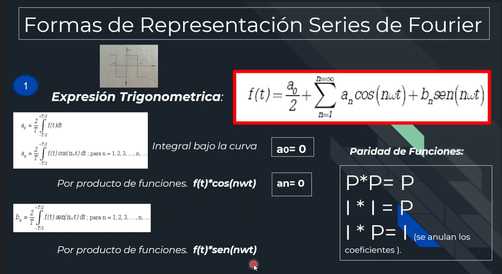
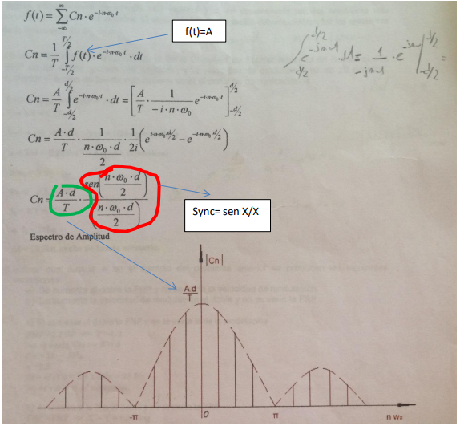
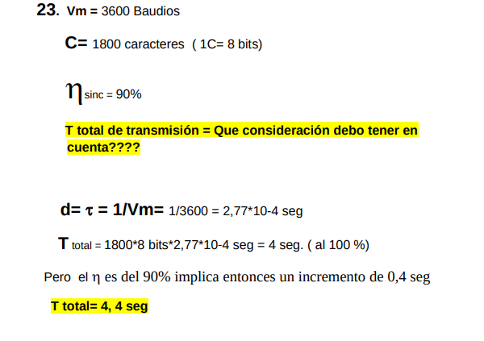
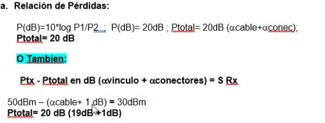

# Simulacion
## [Practica]
---
gbiau@frba.utn.edu.ar

### **UD N1**
- **Transmision de datos**: transmision de la informacion previamente codificada por los codigos de linea, de un PaP o de un PaM a traves de señales opticas, electropticas o electricas.
esto puede ser en forma **remota** o **local**
- Un computador genera señales digitales, en cambio la red analogica genera señales analogas 
- El MODEM es el modulador encargado de adaptar las señales digitales a analogas.


`**Atenuacion - Distorsion - Ruido**` \
**α D N**

---

- el receptor regenerativo se encarga de regenerar señales perdidas o distorsionadas, para asi tener lo mas preciso a la señal original.
- aca es necesario tambien usar un MODEM, pero sin `modulad`or.. puesto que todas las señales son digitales, este modem se suele llamar **modem de banda base**
---

- el **CODEC** es un reversed MODEM, comvierte de señales analogas a digitales
```c
OBS, si la red es analogica , no deberia haber NADA, ni un receptor regenerativo, ni un modem, ni nada.. lo que si, tal vez un amplificador para mantener la precision de la señal
```
---


### **Internet**: red de redes
es una red internacional formada por un conjunto de miles de redes independientes operados en forma autonoma, que estan interconectadas por medio de protocolos y procedimientos normalizados como estandares de internet, que permiten comunicaciones entre dos equipos terminales host to host que pertenezcan a algunas de las redes que la integran.
composicion internet: 
- ETD (Host) - Dir IP
- **Routers**: enrutadores, todo el trafico generado por los terminales, el router los maneja.. busca la mejor ruta, etc. Estos mismos estan instalados en los NODOS
- Redes
```
cada equipo terminal tiene asociada una **direccion IP**
```
---
## Ejercicios TP 1 + repaso

```java
'R = p * L/S (resistencia de un conductor)'
p: resistividad del material conductor
L: longitud del conductor
S: seccion del conductor
```
obs: un conductor que tiene una seccion no adecuada, se tiende a calentar. con la primer formula que viste podes sacar varias conclusiones, como por ejemplo, si tenes una seccion chica, tenes gran resistencia, si tenes gran longitud tambien.

```java
POTENCIA = V * I (Watt = Volt * Ampere)
ENERGIA CONSUMIDA = P(consumida) * tiempo (Watt *hora)
```

1. hallar resistencia de una estufa que consume 3A y se alimenta con una tension de 120V \
`V = I R -> R = V/I` \
` R = V/I` \
` R = 120V / 3A` \
` R = 40 (ohm) ` 

2. determinar la resistividad de un conductor que tiene 4km de longitud, 16mm2 de seccion y una resistencia de 20 ohm \
` R = p * L/S ` \
` 20 = p * 4 / 16 ` \
` p = 0.08 ` 

3. similar 

6. sacas la REQ y usas la ley de ohm, facil tambien lo sabes
` da 100 ohm` 

7. recontra facil tmb

8. un televisor consume una potencia de 200W y permanece encendido durante 8 horas . y un calefactor de 500W permanece encedido durante 3h. Cual de los dos artefactos consume mas energia en los tiempos indicados.
si el kw/h vale $50 calcule el gasto ocasionado por los dos artefactos.\
` energia consumida tele = 200 * 8 ` \
` energia consumida calefactor = 500 * 3 ` \
` U1 = 1600 ` \
` U2 = 1500 `\
entonces -> la tele consume mas \
`gasto total = $186 ` \
sale con regla de 3 

# Unidad 2- signals


### **Repetidor Regenerativo**: encargados de atenuar la signal, le da forma a una signal deformada.. SIEMPRE DIGITAL, en las analogas se llama amplificador.


## **Sincronismo:** procedimiento donde tanto la fuente como el colector, adoptan una base de tiempo comun, de forma tal de no equivocarse en la Tx de un 1 o un 0


## Protocolo asincronico:
```java
un ejemplo, podria ser una central de alarmas donde tengo sensores en
determinadas zonas.. active el mecanismo con la presencia de algo, con lo cual, no necesito que este debidamente los clock en la base de tiempo , no requiere altas velocidades, etc.
```


## Protocolo sincronico:


## Espectro electromagnetico: todo los dispositivos generan determinadas frecuencias, el celular, el microondas, el GPS , todo.. es decir, todo dispositivo genera señales.
Existen varias banda de frecuencias:


```java
A MAYOR FRECUENCIA -> MAS DIRECTO, el AS que se transmite es muy directo
pero repercuta en el alcance
A MENOR FRECUENCIA -> MAYOR ALCANCE
```

FRP: frecuencia de repeticion de pulso

---

## **Trabajo practico N2:**
5. Calcular el rango de variación de la longitud de onda para las señales electromagnéticas portadoras de las emisoras de radio comerciales ubicadas en la banda de FM de 88 a 108 Mhz.


13. Si se utiliza un MODEM que transmite a 1200 baudios cuanto tardaría en transmitir los 1000 caracteres.


14 . Indicar bajo que condiciones la velocidad de modulación es igual a la velocidad de transmisión.


15 . Calcular el tiempo total de transmisión de 1500 caracteres enviados uno a continuación de otro en un sistema de transmisión asincrónica de 75 Baudios. El código utilizado es el Seudo Baudot, los caracteres son ASCII de 8 bits con un bit de paridad. 


16. Para un sistema que transmite a 1200 Baudios se  quiere aumentar la velocidad a 4800 bps. Indicar cómo se logra y cuál es el ancho de pulso resultante.


20. Indicar las causas por las cuales no se puede aumentar, en determinados canales de comunicación, la velocidad de modulación.
```java
Relacionar que pasa entre la Vm y el AB
```

22. indicar los factores que condicionan o limitan la velocidad efectiva de transmisión de datos en una línea digital de comunicaciones.
```java
Cuales serán: AB, Vm, relacion S/N, BER, la duración del pulso, la
modulación, etc
```
--- 
**clase 3**
# Unidad 2 segunda parte - series de fourier

```java
Signals periodicas: signals que se repiten sistematicamente durante un periodo de tiempo T 
```



---


---
### **Trabajo practico n2 2da parte**

**8.** Dada una señal rectangular periódica, en base a la serie de Fourier, calcular los coeficientes si la señal rectangular tiene los siguientes valores:
f(t) = 1      0 < t < T/2
f(t) = -1    -T/2 < t < 0





**9.** Hallar el espectro de amplitud de la Serie Compleja de Fourier teniendo en cuenta que la FRP es de 4 pps (pulsos por segundo) y la velocidad de modulación es de 20 Baudios. Calcular el ancho de banda que deberia tener el canal de comunicaciones.


**11.** Dado los siguientes datos, FRP = 300 pps (pulsos por segundos), velocidad de modulación = 1200 baudios y la amplitud del pulso (A = 1 V). Se solicita realizar el gráfico de amplitud del espectro de Fourier. Calcular el ancho de banda, cantidad de armónicas y el valor máximo de Cn.


**17.** Calcular el rendimiento de una transmisión sincrónica cuando se envían bloques de datos de 1500 bytes y se utilizan 14 bytes de cabecera y 4 bytes de terminación.


**18.** Calcular el rendimiento de transmisión asincrónica que utiliza un código que tiene 1 bit de arranque, 1 de parada y 7 de datos.Efectuar el calculo con y sin bit de paridad.


**19.** Dada una transmisión sincrónica de 1024 bytes , y si no consideramos la cabeza y la cola de dicha transmisión, determinar la disminución del rendimiento si se utiliza una transmisión asincrónica mediante un código que emplea 8 bits de datos, 1 de paridad, 2 de parada y 1 de arranque. Para ambos casos se emplea una velocidad de modulación de 2400 Baudios. Indicar también el tiempo total de transmisión en ambos casos.


**23.** Calcular el tiempo total de transmisión de 1800 caracteres de datos enviados en un sistema de transmisión sincrónico de 3600 Baudios. El rendimiento de la transmisión es del 90%



# Unidad 3- dB - Calculo de Enlace - Unidades de transmision

### Propiedades de los logaritmos


```java
obs: notar el coeficiente que acompaña al logaritmo adelante, 
cada uno corresponde segun en que unidad operamos VOLT, AMPERE o POTENCIa
```


#### Ejemplo: calcular ganancia de este amplificador segun la potencia de entrada y de salida (3 casos)

```java
obs: el ATENUADOR es la inversa del AMPLIFICADOR, para calcularlo
deberias invertir el numerador P2 y el denominador P1
```


```java
vinculo: cable
conectores: torres, demas
empalmes: los que generan perdida
FD: factor de disenio
GendB: ganancias en el circuito

OBS: siempre la ganancia del receptor tiene que ser igual o menor
es imposible que sea mayor

OBS: trabajar siempre todo en dB, mV, o la unidad que sea, pero respetarla
```
- Ecuacion de calculo de enlace

```java
PTx: potencia del transmisor
SRx: sensibilidad del receptor

PTOTAl: PERDIDAS TOTALES 
{
    Atenuacion del conductor: 0,9db/100m, esto es perdida por distancia
                             se pierden 0,9 db cada 100 metros

    Largos del cable: como por ej 1500m

    Atenuacion del conector: 0,25 db x ejemplo y se multiplica por la 
    cantidad                
}

Ptotal en db: perdidas totales en decibeles
FD: factor de diseño
G: ganancia

obs: La sensibilidad del amplificador es como señal mínima que recibe 
en la "entrada" del amplificador , por eso toma el primer tramo que le pega

```
## TP3
1. dado un canal de tranmision de datos coaxil con una atenuacion al a frecuencia de operacion de 0,9 db/100 metros y donde la sensibilidad del receptor es -15dBm. Calcular la potencia minima que debera tener el transmisor si la longitud del coaxil es de 1200 metros

```java
-> no hay ningun tipo de ganancia
-> te da la perdida del vinculo
Ptx - Ptotal en dB (αvinculo) = S Rx
```


2. calcular la potencia de salida de una linea de tranmsision de 100 metros donde la atenuacion del cable coaxil es de 5dB/100m y la potencia del transmisor que excita a la linea es de 0dBm, se pierde en conectores y empalmes 2dB


```java
OBS: variable que no te dan, variable que es = 0, 
aca queda ->
```


3. que sensibilidad minima en mQ debera tener un receptor para un enlace a traves de una linea de transmision de 1800 metros, donde la atenuacion del cable coaxil empleado es de 0,5 db/100m. la potencia del transmisor que excita la linea es de 2 watts
```java
Ptx - Ptotal (αvinculo + αconectores + αempalmes + FD) + Gen dB = S Rx
```

rta: 24dBm, 251,18 mW

4. dado un enlace de fibra optica entre un emisor y un receptor con los siguientes parametros:
Atenacion de la FO = 3dB/km \
Atenuacion del conector = 0,6dB \
Potencia de transmision = 3dBm \
Sensibilidad del receptor = -10dBm
calcular la distancia maxima entre receptor y transmisor suponiendo un factor de disenio FD = 10 dB , empleandose un conector en el transmisor y otro en el receptor. Repetir el calculo para una FO cuya atenuacion es de 0,2 dB/km 


```java
Ptotal = 3db
1,2 es por los dos conectores = 0,6 * 2
3dBm - (3dB/1000m*D + 1,2dB + 10dB) = -10dBm

RTA : 600m y 9000m
```

5. dos dispositivos de transmision de datos se encuentranm vinculados por un enlace de comunicaciones construido por cable coaxil de atenuacion igual a 0,8 dB/100m. la distancia que separa a estos ewquipos es de 5000 metros. Calcular la potencia minima que debe aplicarse en el extremo transmisor, si la sensibilidad del dispositivo receptor es de -10dbm, considerando un FD de 3 dB


6. se requiere montar un enlace de fibra optica uniendo dos equipos separados a 30000 metros uno de otro. la potencia del transmisor es de 2mW y la sensibilidad del receptor es de -60dBm. cual sera la especificacion de atenuacion maxima a requerir de la fibra que se debe emplear, expresada en dB/km

 \
7. si se tiene un enlace de 1000m entre un transmisor que entrega una potencia de 100w y un receptor con una sensibilidad de 1w y se pretende utilizar las siguientes lineas de transmision, indicar cuando se debera utilizar amplificadores. considerar en ambos casos dos conectores de 0,5 dB c/u 
a. usando coaxil fino RG 58 con At = 5 db/100m
b. usando coaxil grueso RG 218 con At = 0,8dB/100m
En caso necesario calcular la ganancia del amplificador correspondiente.
```python
OBS: fijate que tenes conectores de 0,5 dB c/u .. entonces
al tener 2, tenes ya un alf perdida conectores = 1dB = 0,5 dB +0,5 dB

obs: el cable grueso va a ser mejor fijate, tiene menor atenuacion

```




```python
fijate que con el otro cable, el alf del vinculo te dio 8dB
que es menor que la perdida total de 20, entonces, no necesitas
usar un amplificador
```
--- 
# TP PRESENTACION EN CLASE--
# Unidad N4 - Codificacion, teoria de la informacion, transmision en banda base y otras yerbas
obs: esta clase fue igual a la de echazu, hay ppts que no pusiste print porque literal son iguales, anda a 0-teoria.md para ver si te falta algo
```java
señales de banda base: aquellas que, generadas por una fuente de informacion
no sufren ningun proceso de modulacion o tratamiento a su salida
señales moduladas: estas son las pasan por un proceso de modulacion
o tratamiento a su salida.

```
## **Codigos de linea o banda base**
```java
Codigos de linea o banda base:
-> son para eliminar o dimsinuir el componente de corriente continua
    de una señal
-> garantizar el sincronismo
-> detectar la presencia de señal en la linea
```
**clasificacion de las señales/ codigos de linea**


NRZ = no retorno a zer0
RZ = retorno a zer0

## **Teoria de la informacion**


---
## TP 4


1. Indicar las principales características de la transmisión en banda base, en que circunstancias se emplea una transmisión de éste tipo? ¿Que otro tipo de transmisión existe, que características presenta ?
```java
-> se aplica en las redes de area local
-> menos costo , disenio e implementacion de tecnologia
-> emplea codigo de linea de banda base
-> no precisa transformacion/modulacion a su salida

y que otro tipo de transmision existe?: la MODULADA
-> y bueno, es bastante la oposicion a la de arriba, mas costo,
    etc etc
```

2.3 -> se hacen como en el grafico del profe [PRACTICALOS PA POSTA]

4 -> deberias hacerlo con Bipolar RZ

5. Calcular la cantidad de información asociada a una palabra de cuatro caracteres proveniente de una fuente equiprobable de símbolos. Considerar un alfabeto de 32 símbolos.
    ```java
    aplico la expresion I(xi) = logb 1/P(xi)
    la probabilidad aca es 1/32
    P(alf) = 1/32
    I(caracter) = log 2 32 = 5 Sh
    I: cantidad de informacion
    Rta = TOTAL * 4 = 5 * 4 = 20
    ```

6. Dado un tren de pulsos correspondientes a la siguiente secuencia: 010101000001,  calcular la información suministrada con la aparición de un uno o de un cero y la ENTROPÍA de la fuente.
    ```java
    aca hay 2 simbolos nomas : 1 y 0
    ```
     \
     \
     \
    

7. Dados 3 mensajes con la siguiente probabilidad de ocurrencia: \
       p1 = 20 % \
       p2 = 50 % \
       p3 = 30 % \
Calcular la cantidad de información suministrada por cada uno de ellos. Calcular la información promedio por mensaje de esta fuente.
    ```java
    esto te esta pidiendo la entropia
    ```
    
    
8. hacelo vos

9. Suponiendo una fuente con los símbolos A B C E L  donde cada uno tiene asociado la siguiente probabilidad: \
A = 1/4 \
B = 1/4 \ 
C = 1/8 \
E = 1/4 \
L = 1/8 \
Calcular la información suministrada con el mensaje: CABLE
    ```java
    hay que sumar la cantidad de shanon de cada 
    caracter, es decir, calcular la informacion de cada caracter
    y sumarlos
    ```
    

10. hacelo vos

11. Suponiendo una imagen de 600 líneas horizontales y 300 puntos discretos por línea donde cada punto tiene 8 niveles equiprobables de brillo y un vocabulario de 100.000 palabras equiprobables. Demostrar el proverbio que dice que una imagen vale más que 1000 palabras.
    
    ```java
    b. P(voc) = 1 / 100.000
    I(palabra) = log2 100.000 = 16,60 Sh
    16,6Sh * 1000 
    I(1000) = 16600 Sh
    ```

12. Se tiene una fuente binaria con igual probabilidad de ocurrencia. Calcular la entropía H y graficar la curva correspondiente que relaciona a la misma con la probabilidad de ocurrencia de cada símbolo.
    
    
    

13. Se transmite una imagen en modo gráfico de 640 x 480 pix, si cada punto tiene 256 niveles equiprobables de brillo. Calcular la información de la imagen y el tiempo total de transmisión si se utiliza un canal que permite enviar información a razón de 33.600 Shannon/seg. Comparar con una transmisión en modo texto que utiliza 25 líneas x 80 columnas utilizando un código ASCII de 8 bits. Ambas imágenes se transmiten sin comprimir. No tener en cuenta el overhead.
```java
P(.) = 1/256
I(.) = log2 256 = 8 Sh
I(imagen) = 8 * 480 * 640 = 2457600Sh
T(total Tx) = 2457600 Sh / 33600Sh/seg = 73,143 seg
Rta: 73,143 seg

b).
OBS: al decirte codigo ASCI de 8 bits, 
en realidad la cantidad de caracteres 
son 2^8
e
entonces P(.) = 1/256
I(texto)  = log 2 256 = * sh
I(m texto) = 8 * 25 * 80 = 16000 Sh
T(total Tx ) = 16000 Sh/ 33600Sh/seg =  0,476 seg 
```

14. Calcular la tasa de información T [shannon/seg], de una fuente telegráfica, sabiendo que: \
P punto = 2/3 \
P raya = 1/3 \
T punto = 0,2 seg \
T raya = 0,4 seg \


15. una imagen de TV tiene 625 líneas con 500 puntos por línea. Cada punto tiene 128 niveles equiprobables de brillo. Si se transmiten 20 imágenes por segundo. Calcular la tasa de información y la capacidad del canal.
    ```java
    P(.) = 1/128
    I(.) = log2 128 = 7Sh
    I(Imagen) = 7*625*500 = 2187500 Sh

    se transmiten 20 imagenes p/seg
    entonces..
    T= 20imagenes * 2187500 Sh = 43750000 Sh/seg

    ahora bien la relacion debe ser
    T <= C 
    
    ```

--- 
# UNIDAD 5 - CAPACIDAD DE UN CANAL
# Ultima clase antes del parcial: repaso capacidad de canal + ejercicios y parcialito
canal fisico, canal de informacion, canales de comunicaciones
canal ideal, canal real, canal de informacion
teorema de nyquist
señales binarias
señales multinivel
hartley
shartley
señales binarias
multinivel
## Canal Real


```java
OBS: la relacion señal ruido S/N SIEMPRE tiene que estar en 
veces, para poder calcular la capacidad.. entonces tenes que aplicarle
el anti-logaritmo.
```

## Canal Ideal


--- 
## Ejercicios de capacidad

1. teniendo en cuenta que en un canal telefonico el valor de la relacion
S/N tipico es de 30dB, FCI = 300Hz, FCS=3300Hz.
FCI = frecuencia de corte inferior
FCS = frecuencia de corte superior
cual es el limite superior de la tasa de transmision de datos
confiable?
```java
LEASE- capacidad de un canal como limite superior de la tasa 
de transmision

como estas en un canal telefonico, se aplica la capacidad 
real, es decir, el teorema de shanon
```


2. calcular la relacion señal a ruido S/N expresada en dB 
para los siguientes casos

```java
aca simplemente tenes que hacer un despeje, nada mas
obs: la capacidad del canal es la misma en todos los casos fijate
```


```java
si aumento el AB del canal, la C aumenta
si aumento el S/N , la C aumenta

conclusion: a capacidad constante , aumentando el AB
la relacion S/N disminuyte
```


3. la capacidad maxima de un canal sin ruido?
```java
C = 2 AB * Log2 N (bps)     -> para señales multinivel
C = 2 AB = Vtx max (bps)    -> para señales binarias
```

4. necesitamos duplicar la capacidad de transporte de informacion de un canal de datos cuyo aB es de 4Khz, y su SNR=20dB. Sabiendo que utilizaremos el mismo canal, necesitamos saber cuantas veces debemos aumentar la potencia de señal original para lograrlo. Cual es la nueva S/N medida en dB? \


5. tenemos un canal cuyo ancho de banda AB es de 4Khz y su SNR=20dB sabiendo que por desperfectos aumenta el doble de su potencia de ruido, estimar en forma porcentual la caida en la capacidad de transporte, cual es la nueva SNR medida en dB?


6. se mide el rendimiento de una linea telefonica (3,1 Khz de AB) cuando la señal es 10 voltios, el ruido es de 5 milivoltios.
cual es la tasa de datos maxima soportada por esta linea telefonica? \

