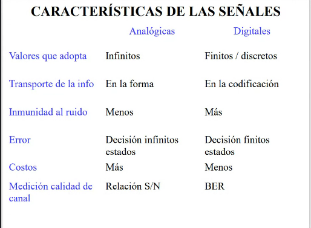
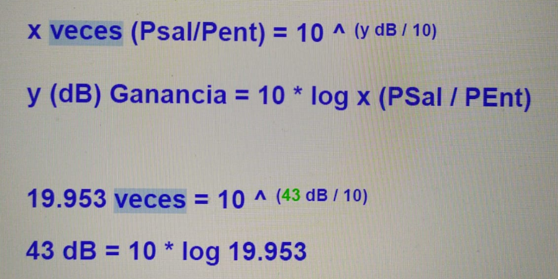
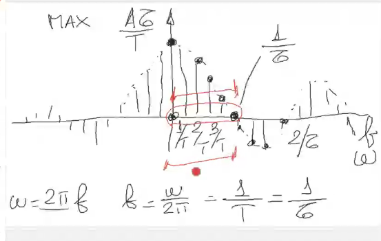
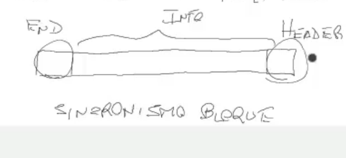
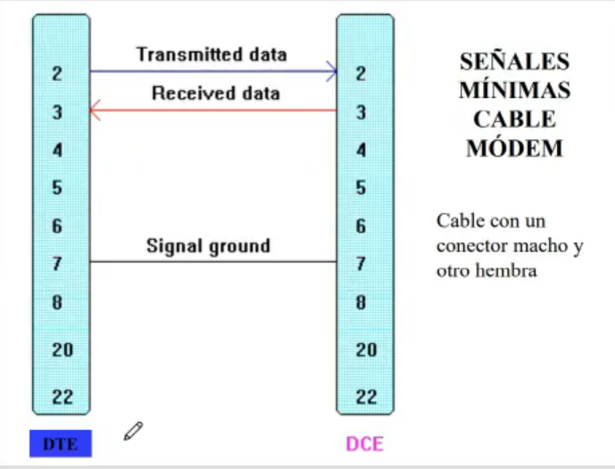
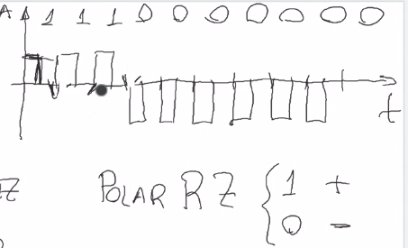
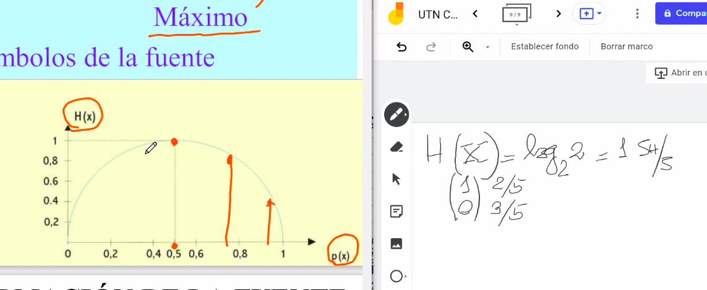
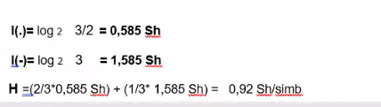
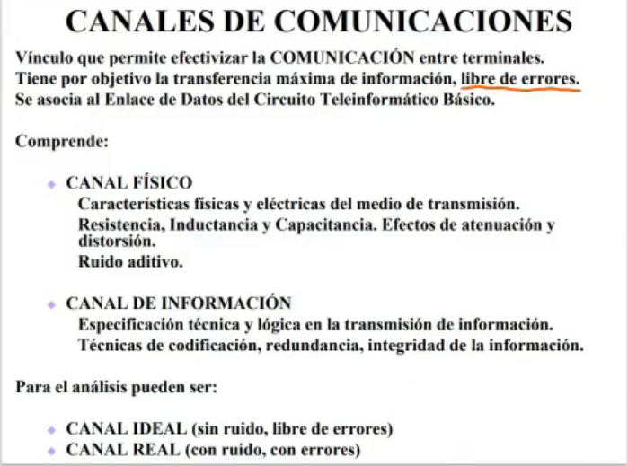

#  **Comunicaciones**

## **Teleinformatica y redes**
- **ETD**: equipo terminal de datos (*DTE=data terminal equipment*)
- **ECD**: equipo de comunicacion de datos (*DCE*=data comunication equipment) es el que adapta la informacion para que pueda viajar por el medio de comunicacion (fibra optica, coaxil, UTP, STP, etc)
- **Interfaces**: vincula al ETD con el ECD
- **Controlador de comunicaciones**: mini-procesador que controla las comunicaciones
- **A**: emisor, **B**: receptor


El siguiente es el denominado circuito teleinformatico basico, que basicamente lo que hace es intercambiar informacion. \

```java
OBS: entre el ETD y el ECD existe lo que es llamado las interfases 
digitales 
```

- **CD**: circuito de datos que incluye al medio y a los equipos de comunicacion de datos.
- **ENLACE DE DATOS(ED)**: incluye al controlador de comunicaciones, al circuito de datos y al controlador del otro lado


## **Modelo simplificado de la comunicacion de datos**


```
hoy en dia tenemos todo en una misma red, internet, television, telefonia, etc..
```

**Normalizacion** : concepto como el de base de datos, estandarizar, etc.
Existen organismos de normalizacion como la **ISO** entre otras, que es para definir estandartes/protocolos en comun para el envio de informacon.

## Modelo OSI
- La ISO presento el modelo OSi
- OSI: open system interconnection


```java
- HTTP es por ejemplo capa 7, cada dispositivo, protocolo o lo que sea, se lo puede asociar a un capa del modelo OSI.

- TCP/IP tiene un modelo de capas propio (tambien como las redes LAN), que referencia al OSI. no significa que cumpla con las 7 capas del OSI , sino que hace referencia.

-ENCRIPTACION por ejemplo va en capa 6
```
---

- Entre capas iguales voy a usar -> protocolos
- Entre capas adyacentes -> interfases
---

```
lo marcado en rojo, es la informacion que le manda A al B, el resto no marcado es solo informacion de protocolos.. donde se puede apreciar que es mucho mayor que la informacion que se manda
```
---
### Nivel 1 : FISICO
- **Servicio**: conexion fisica al medio transmisor
- **Funciones**: definicion de las caracteristicas mecanicas, electricas, funcionales y de procedimientos
- *Ej*: Interfaz RS 232

### Nivel 2 : ENLACE
- **Servicio**: establecer , mantener y liberar conexiones del nivel 3
- **Funciones**: control de errores y de flujo de datos, delimitar secuencia de bits asegurando transparencia, resolver problemas de danio, perdidas y duplicidad.
- *Ej*: protocolo HDLC

### Nivel 3 : RED
es el encargado de elegir los caminos, las rutas, nodos, etc..  para la informacion.
- **Servicio**: servicio orientado a la conexion o sin conexion al nivel 4.
- **Funciones**: encaminamiento(**enrutamiento**), tratamiento de congestion y facturacion, reenvio por sistemas intermedios, interconexion de redes heterogeneas
- *Ej*: IP, IPX

## Nivel 4 : TRANSPORTE
es el encargado de asegurar de un extremo a otro extremo, no es lo mismo que elegir la ruta de como hacerlo
- **Servicio**: conexion extremo a extremo sin errores
- **Funciones**: ocultar detalles de capas inferiores a las superiores, regular flujo de datos, mutliplexion.
- *Ej*: TCP, SPX

## Nivel 5 : SESION
apunta a las aplicaciones, TOKEN y demas.
- **Servicio**: gestionra el control del dialogo, sincronizacion y administracion del testigo
- **Funciones**: estabecimiento y liberacion de conexion, usuarios de distintas maquinas establezcan sesion, mejorar servicios.

## Nivel 6 : PRESENTACION
por ejemplo aca estaria SSH, aca va todo lo que es seguridad y demas
- **Servicio**: codificacion de datos, manejo de abstracciones y conversiones, compresion y criptografia
- **Funciones**: comunicacion entre equipos con distintas representaciones, adecua sintaxis, no necesariamente entiende sobre la semantica
- *Ej*: SSH

## Nivel 7 : APLICACION
encuentro distintas funciones , correo electronico por ejemplo
- **Funciones**: Definicion de terminal virtual , interfaz de usuario, establece autorizaciones, autenticidad de datos.
---
# **Unidad 2**: transmision de datos
Como ya viste, tenes dos señales comunicacionales por donde viajan los datos:


## **Analogicas**: signals representadas por funciones sinoseidales continuas
```java
-> el grafico es parecido a las funciones sinoseidales como el sen , 
cos etc.. los valores que adopta son infinitos

-> el ruido N interfiere mucho en estas señales

-> la informacion viaja en las variaciones

-> aca hay infintos estados, entonces el error (generado por el ruido) va a 
ser mayor

-> el costo es mayor

-> por ejemplo, en los auris hyperx, el sonido analogico suena mucho mejor 
al tener mas variantes en su grafico, en cambio el digital suena peor

-> la medicion de calidad del canal se mide en la relacion S/N (signal-noise)
una relacion entre dos potencias P1/P2 = ej = 10W/1W => esta relacion de potencias da
10 VECES , la relacion S/N se da en 'VECES'

-> el alcance de la transmision es finito, por eso se usan amplificadores de 
ganancia
```

### Ganancia y demas



## **Digitales**
```java
-> el grafico es parecido a las funciones discretas, en el grafico podes tener 
8 valores para la señal, **no siempre son binarias como conocias** . 
en caso de aparecer un valor no justificado en el grafico de su señal digital,
seria una especie de error

-> hay mas inmunidad al rudio

-> la informacion viaja en los niveles discretos 1,2,3,4,5,6,7,8

-> como aca solo hay 8 niveles.. el error va a ser menor, solamente en 8 valores.
esto se da a que hay solamente 8 estados

-> el costo de estas señales es menor (segun cuantos niveles se tome)

-> la medicion de calidad del canal se evalua en BER : ('Bit Error Rate'): tasa erronea de bit
(bits con error) / (bits totales)
ej: este enlace tiene un BER = 10 ^ -4 , entonces significa que tiene 1 bit errado sobre 10k bits 
transmitidos.
ej2: este canal tiene un BER = 10 ^ -7, este ber es "MEJOR" tiene 1 bit errdao sobre 1m bits

-> el alcance de la transmision es INFINITO, se usan repetidores regenerativos

```
## Modem - CODEC, digitalizador
- el modem convierte de digital a analogico(**'conversor digital-analogico'**)
- el CODEC/digitalizador convierte de analogica a digital (**'conversor analogico-digital'**)

**ATENUACION**: reducirle la amplitud a una señal analogica \
 \
fijate aca tenes atenuada la señal original \

```java
AMPLIFICADOR (⊳): G(ganancia) = P2/P1 
obs: cuando trabajo con señales analogicas, el alcance esta limitado
entonces, se usan amplificadores para aumentar este alcance.

los amplificadores agregan ruido Na   
- no se pueden agregar mas de una cierta cantidad porque generan ruido
- lo que hace el amplificador es incrementar el nivel ademas del ruido
```


```java
REPETIDORES REGENERATIVOS: (supon uno que entiende -1 y 1 voltz)
- se pueden poner una gran cantidad de reps
- si el rep recibe un 0.6V automaticamente lo interpreta como -1
- si recibe un 1.1V lo interpreta como 1
- EL UMBRAL DE DETECCION es el limite que voy a tener impuesto por 
la caracteristica de los reps. ejemplo 0,1 y -0,1 V
si llega un 0.05V el rep no va a saber que hacer.

```


---
# Señales de comunicaciones (periodicas - no periodicas)
 
- **funcion periodica**: son las que se pueden definir como f(t) = f(t+T) donde T es el periodo T=1/f (f=frecuencia)

- **funcion no-periodica**: f(t) != f(t+T)

obs: las funciones periodicas siguen un patron, por lo tanto, no transportan
tanta informacion como las funciones no-periodicas
(hablese de funciones = señales)

```java
1GHz = 1x10^9 Hz
= 1x 10^6 Khz
= 1x 10^3 Mhz
```


- para pasar del dominio del tiempo al dominio de la frecuencia se utilizan SERIES DE FOURIER (en periodicas)

- en no periodicos, se usa TRANSFORMADA DE FOURIER

**las signals periodicas se utilizan como portadoras de la informacion**

## **Señales periodicas**
OBS: lAS PORTADORAS NO LLEVAN INFORMACION, REPITEN UN PATRON
ejemplo: (estas de aca son portadoras)
- senoidal armonica simple
- onda cuadrada
- pulso rectangular


```python
a(t) = A.sen(wt + phi)
w: frecuencia = 2pi.f = 2pi/T
t: tiempo
A: amplitud
phi: fase inicial (aca la fase seria 0 porque arranco en 0)

```
---

```python
esta tiene 3 Hz
```

---

## **"TREN DE PULSOS o PULSO RECTANGULAR"**
```java
el ancho del pulso de define como Tao, que es como la amplitud
el periodo de repeticion es T

```


---

### **Longitud de onda**: representa la la distancia que se recorre en un ciclo de una señal
```java
λ(longitud de onda) = C/f 
C: velocidad de la luz [m/s]
f: frecuencia [Hz]
fijate que esta marcado como λ en el grrafico
OBS: si la absica es distancia, es longitud de onda 
peeero si la absisa es tiempo, es PERIODO T
```

---
## Fourier
```java
para pasar del dominio del tiempo al dominio de la frecuencia se utilizan SERIES DE FOURIER (en periodicas)
 ```
 \
```python
- cada uno de los componentes acompaniados al **An** es una frecuencia
- el nw me esta representando las distintas componentes de frecuencia
- el a0/2 es la componente constante/continua
- n=1 : f1 fundamental 
- n=2 : f2 = 2f1 = 2da armonicas
- n=3 : f3 = 3f1 = 3ra armonica 
- n=i.. : fi.. = if1 =  I armonicas
```


```java
ESPECTRO DE AMPLITUD/MAGNITUD: el grafico de la funcion en frecuencia
la amplitud es Y
obs: el espectro siempre hace referencia a la frecuencia
```


alfa: fase


```java
ESPECTRO DE FASE: el grafico de la funcion en frecuencia
la fase es Y
```
---
---
## Esto es lo concreto


---
# **Ancho de banda [AB]**: se define como la variacion de la frecuencia
```java
el ancho de banda es la parte del espectro (intervalo de frecuencias) donde 
se concentra la mayor cantidad de energia de la señal
ancho de banda : Δf = f2 - f1
es como cierta ubicacion en un rango

osea, pensa esto: tenes una señal con cierta forma no?
bueno, pensala como si fuera un seno pero sin patrones
e imagina que en 5mhz tenes la mayor amplitud,
bueno tu AB ahi es de 5mhz, creo.. pregunta capaz

obs: mientras menor ancho de pulso, mas ancho de banda.. es inversamente proporcional

OBS: ESPECTRO -> ya se refiere a frecuencia
es decir, se trabaja en el diagrama de la frecuencia.
```

```python
OBS: ancho de banda infinito? se ve en el primer
grafico fijate, no estas limitando ninguna componente de la serie de fourier 

- ahora fijate , AB = 4000Hz es el segundo, lo 
que viaja es el azul, del otro lado se van a dar cuenta
que es un tren de pulsos.

- en AB = 900Hz, fijate.. ya la cosa se complica, podria 
detectarse.. pero esta bastante atenuada

- AB= 300Hz, ya aca no se entiende una verga, si es una 
funcion senoidal o si es un tren de pulsos

entonces como que todo depende de la cantidad de componentes
de frecuencias que pones
el AB es el que permite distintas componentes de frecuencia.
OBS: AB != cantidad de cosas que se transmiten, no confundir
```
### **Ejemplo con AM-FM**: ancho de banda


```python
ENTENDIDISMO PA, ahora si.. fijate:
imaginate una cancion como esa linea que dice MUSIC, fijate
que si tuviera el ancho de banda que tiene un telefono
, perdes una BANDA de informacion, entendes?
y fijate, el telefono.. tambien pierde, pero es poca, osea
se concentra su maxima energia en ese rango, por eso tiene
ese ancho de banda.


fijate, porque FM se escucha mejor que AM? porque tiene 
mas AB, fijate donde corta la FM y donde corta la AM

observacion: la musica necesita de 30hz a 18khz para escucharse, en cambio la voz va de 100hz a 8 khz (lo cual es mucho menos que la musica)

el canal telefonico va de = 300hz a 3,4 khz

y porque es esto? simplemente porque es necesario.. por eso cuando llamas por telefono y se escucha una joda de fondo, la musica no se aprecia tan bien, no se escuchan los graves, la voz se distorziona, etc.
```
---


- la maxima amplitud aca es 1 porque senx/x = 1 (infinitesimo)

---

```java
lo que esta en rojo, es el ANCHO DE BANDA que esta ocupando este tren de pulsos
que en esta caso va desde 0 hasta 1/tao
```

---
## Medidas de la velocidad

```python
'Velocidad de modulacion': se define como el pulso que se 
transmite en un tiempo determinado, mira el grafico de abajo:

obs: se toma el pulso(Tao) de menor duracion, en
este caso es el Tao3 por que? porque 
es el que necesita 'mayor ancho de banda'
pensa que como que estas definiendo el AB y definilo bien
por eso tomas el mas pequeño, porque es el que te toma
mas ancho de banda

'Velocidad de transmision': (o BINARIA):
(cantidad de bits con o sin informacion)/ segundos :
entran todo los bits, los de protocolo, headers, lo que fuese

se mide en : bps(bits/seg) -> kbps, mbps, etc..

'Relacion entre ambas': Vtx = Vm log2 n
```


```python
'Velocidad de transferencia de datos': THROUGHPUT
esto ya esta definido en el enlace de datos, es decir, desde 
un DTE a otro DTE
es la cantidad de bits CON INFORMACION por segundo
se mide tambien en bps, pero aca podes usar tambien el 'Byte'
porque lleva informacion

entonces => bytes/seg o bits/seg

'Velocidad REAL de transferencia de datos': ahora, ya hablando
de lo real, es lo mismo, datos.. PERO-> sin ERRORES
cant de bits con info sin errores/unidad de tiempo

'Relacion entre todas':
Vtx > Vtd > Vrtd

obs si Vtd == Vrtd : NO HUBO ERROREES, es real esto? si , puede pasar

```
---
## Clase 3 : **+ ancho de banda**

```java
el costo de las comunicaciones esta dado por el ancho de banda 
obs: la velocidad de transmision esta relacionado con el AB

para transmitir a mayor velocidad de transmision, voy a requerir
mas ancho de banda .
ojo esto FIbertel te vende cosas a por ejemplo 50Mbs pero ojo
te tendrian que decir te vendo 50Mhzs (si te esta hablando de AB)

Vtx = Vm log2 (n) = (cant bits c/sin informacion)/tiempo
Vmodulacion = 1/tao = AB (esta relacion se da al hablar de tren de pulsos)
```
---
### **Transmision multinivel N**: donde N son los niveles del pulso
 

```python
OBS: la Vtx = Vm log2 N
el termino 'log2' hace que la velocidad de transmision
sea mayor que la de modulacion
'para recordar:'
'Vmod = vinculada al CD (circuito de datos)'
'Vtx = vinculada al ED (enlace de datos)'


En la transmision multinivel de la imagen, el N = 4, porque hay 
4 niveles de pulso fijate
si N = 8, la cantidad de bits son 3 porque 2^3 = 8

para saber la cantidad de niveles tenes que hacer
2^b = N donde b son los bits
```

### **TIPOS DE TRANSMISION** 

```python 
- 'SIMPLEX:' 1 solo canal , uno manda el otro recibe
  es decir, uno solo puede mandar y el otro solo puede recibir
- 'HALF DUPLEX/ SEMI DUPLEX:' 1 solo canal, pero el uso esta sincronizado.. es como los walkie-takie, 'PUSH TO TALK' como los que tienen los policias, anmbos pueden mandar y recibir
- 'FULL DUPLEX / DUPLEX:' 2 canales, ambos reciben y mandan y no necesitan sincronizacion, ejemplo el telefono celular
```

### **TRANSMISION SERIE - PARALELO**
 \

```python
'*Transmision en serie:*' transmito de a 1 bit, uno atras del otro 
es decir, en cada instante transmito un solo bit
- mayor alcance
obs: puede haber errores de todas formas porque el bit t1 ponele 
puede ir mas rapido que el t2 y pisarlo

'*Transmision en paralelo:*' es mas rapido, porque no van de a uno
es decir, se transmiten de a tandas.. cada un instante, transmito una tanda
- menor alcance


ejemplo: maraton, seria tranmisison en paralelo
donde cada corredor, va por su propio camino y no tiene que esperar
a nadie mas, ni nada.
por ejemplo en el 1km todos los corredores vamos juntos, pero cuando 
ya pasas un rato, los mejores runners se van distanciando , por lo tanto:

mayor distancia -> mayor dispersion de corredores, y en la transmision
                   en paralelo pasa lo mismo
por lo tanto -> la paralelo se usa para distancias cortas (por ejemplo
en la pc)
en cambio, la tranmisison serie se usa para distancias largas
```

## **Sincronismo - Asincronismo**:
```java
'SINCRONISMO DIGITAL': es esencial que cuando trabajo en forma digital, 
tiene que haber sincronismo.. el sincronismo esta relacionado con el 
clock, es decir, con la base de tiempo.
obs, imaginate una transmision solamente con:
0
1
como mierda mando tanta informacion con esto? no para.. el 0 y el 1
tiene distinto significado segun la posicion que esta ocupando
en una base de tiempo, por eso es esencial el sincronismo para trabajar
con señales digitales.

- Sincronismo de bit: identifica cada cuanto se transmite un bit

- Sincronismo de caracter: el sincronismo en donde se marca temporalmente lo que constituye un caracter, ejemplo, cada caracter se compone de 5 bits, entonces, cada cuanto tiempo se compone ese caracter
BIT DE PARADA: el bit de nivel alto (toca la max amplitud)
BIT DE ARRANQUE: el bit de nivel bajo (toca el 0)
estos bits son usados para saber cuando comienza y cuando termina un caracter, son utiles para no producir mezclas ni confusiones

- Sincronismo de bloque: sincronismo de bloques de datos, como por ejemplo 5 caracteres, como que cada uno engloba al otro.


codigo ASCII = 7bits, cuantos caracteres? 2^7 = 128
codigo PC8 = 8bits ; 2^8 = 256
codigo BAUDOT = 5bits; 2^5 = 32
```
**Sincronismo de caracter**  \

```java
OBS: este tipo de transmision , con sincronismo de caracter se
denomina ASINCRONICA:
porque transmito un caracter y puedo esperar bastante tiempo hasta 
transmitir el otro caracter, no estoy obligado a transmitir todo en rafagas.
```

**Sincronismo de bloque** \

```java
el END y el HEADER son usados para saber donde comienza y donde termina.
el sincronismo de bloque requiere sincronismo de bit
```
## **Protocolo asincronico** 

```python
OBS: existe una relacion directa entre la transmision asincronica
y el protocolo asincronico.

en una transmision asincronica que usa protocolo asincronico, tengo
sincronismo de caracter y sincronismo de bit.
esta transmision se basa en estos dos sincronismos.

- vel bin bajas: porque transmito de a uno

- bajo rendimiento: porque Mtx = (bits c/info)/bits totales
es decir, al tener bits de parada y de arranque, son bits 
sin informacion, entonces tu rendimiento va a ser bajo

``` 

## **Protocolo sincronico o transmision sincronica**

```java
-vel bin alta: transmito de a varios  

- alto rendimiento: porque Mtx = (bits c/info)/bits totales
y al tener muchos datos a transmitir, y tener poco bits de 
header o lo que fuese.. tu rendimiento es casi al 100%. 
tengo poca carga de protocolos, los headers/final/end
son BAJOS.

obs: los rendimientos van a depender del tamanio del bloque

el 'PROTOCOLO SINCRONICO' puede ser 
-> orientado al caracter: el header o el fin, es informacion de los protocolos
si trabajo orientado al caracter, la informacion viene de los codigos
ejemplo el ASCI, el BAUDOT, etc.. entonces uno toma caracteres de esos 
codigos y los usa en el final/end/header
-> orientado al bit: se utilizan patrones , para poder obtener mediante 
patrones de bit la informacion de protocolos. NO SON CARACTERES.
son campos

```

---


---

# Unidad 3: unidades de transmision


```python
'Relativas': el decibel se define como 10 log P2/P1 (relacion entre potencias)
porque es relativa? ejemplo
un amplificador tiene 20dB , me da la relacion que hay entre p2 y p1
  P1                P2
------AMPLIFICADOR------
yo no se la potencia que entro o que salio, entonces es relativa 
porque es una 'relacion' entre potencias

en resumen, el decibel me sirve para relacionar potencias, tensiones
o corrientes.

'Absolutas': dBm = 10 log Pi/ 1mW => es absoluta porque uso una potencia
de referencia que es 1mW

si tenes 20 dBm -> como pasas a potencia?
P = 1mw 10 ^dBm/10 

si tenes 20dB-> como pasas a potencia?
vas a obtener la relativa
P2 = P1 10 ^dB/10

'OBS: dB y dBm se pueden SUMAR sin problemas'

```
### DB - veces y demas

---
**Ejercicio: hallar P2** \

```java
P1 = 100dBm => P1 = 10mW
G = 10dB => G=10 veces
P2 = ?
G = P2/P1
P2 = P1 * G
P2 = 10mw * 10 veces => 'P2 = 100mW'

// otra forma
P2 = P1 + G
P2 = 10dBm + 10dB
'P2 = 20 dBm' 

```

---
**Ejercicio** : hallar la potencia de salida


---
---
## Amplificacion y atenuacion

```java
OBS: si los dB te dan negativos, significo que hubo una perdida
es decir, una atenuacion en vez de una amplificacion.
y si te da G = -10dB? tambien.. hubo una perdida de 10dB

obs: si te dicen que hay una atenuacion de 20dB, y lo vas a 
trabajar con ganancias, te quedaria G = -20dB

```
---
### Definicion de ancho de banda de una linea de transmision usando dB


 
```java
// resolucion del ejercicio de la PPT

Srx = Ptx + G - At
dbm   dbm   db  db

Srx = -5dBm + 20dB - 1dB - 0,4dB - 3dB
Srx = 10,6 dBm (siempre en abosluta)
Srx = a [mW] => 'Srx = 10 mW'


factor de diseño
obs: que es el FD? el valor por el que quiero que este por arriba
es decir, garantizar una intensidad para el receptor
es como lo que 'agregas' a la sensibilidad

```
### Resolucion ejercicio disipador de potencia
```java
obs: la potencia de perdida se mide en DB, esta mal en Watzz
```


---
# **Clase 4 - Interfases Digitales**

```python
el entendimiento entre el CC y el ETCD esta dado por la interfaz digital
es donde actua la interfas digital

pueden ser interfases serie o paralelo, fijate la foto de abajo
concuerda con lo que es una transmision en paralelo (envio de tandas de bits)
las de abajo son todas interfases en paralelo
```

```python
algunas en serie:
todas estas son estandares propuestas por el UIT-T, nosotros nos vamos a quedar
con una: 'RS-232C'
```

**Resumen comparativo de normas**

**Normas conexas**: van acompañadas entre si

---

```python
los niveles de las interfases nos dice diferentes 
caracteristicas de las interfases
el que mas interesa a los usuarios son los niveles LOGICOS

```
---
## Ya generalizando, la RS 232 / v.24(norma equivalente)

```python
se define como una interfaz digital serie para un dialogo entre 
un DTE y un DCE - equipo de comunicacion de datos - equipo de transmision de datos
Dmax = distancia maxima
Vmax = velocidad binaria maxima
FULL DUPLEX, con o sin sincronismo = se refiere al sincronismo de caracter
DB-25 : dice que tengo 25 pines [pin out]

```

```python
- 0 Tx > 5v: esto me dice que si el bit es 0 voy a estar transmitiendo a mas de 5V
- 0 Rx > 3v : lo mismo 
- 1 Tx < -5v: que si el bit es 1, transmito a menos de 5V 
- 1 Rx < -3v : lo mismo

Margen 2v: atenuacion

valores maximos: -25 y 25 V
```
---


```java
ETD(macho) = imagina que es una PC
ECD(hembra) = imagina que es un MODEM

entonces imaginate esta transmision como una PC a un MODEM

---señalES // prestar atencion a los sentidos

TD: Transmited Data-> 'el ETD envia el TD '
RD: Received Data-> 'el ECD le dice, que recibio, enviando el RD'
RTS: Request to send -> 'el ETD le manda una peticion para mandar'
CTS: Clear to send -> 'el ECD dice, ok, manda'
DTR: Data terminal ready -> 'el DTE esta listo'
DSR: Data Set Ready -> 'set significa MODEM, esto dice que el model esta listo'
GND: tierra de proteccion -> 'nos da la proteccion electrica a tierra'
SIG: tierra de señalizacion -> 'el retorno de lo de arriba, puede tener ambos sentidos'
DTD: Data Carrier Detect -> 'deteccion de portadora de datos, es del ECD al ETD'


el famoso 'HANDSHAKE' = RTS + CTS, es la coordinacion inicial fijate
uno le dic "quiero mandar" y el otro le dice "ok manda"
el requerimiento o el establecimiento de las cosas es lo denominado
HANDHSAKE
obs: podria ser otra cosa el handhshake, depende mucho de las interfases
y en que contexto estoy
```
---
## **Secuencia de intercambio entre las señales de arriba**: ejemplo de intercambio


```python
'lado a'
PORTADORA: onda senoidal armonica simple, se da cuando se manda
el RTS del ETD al ECD

PORTADORA MODULADA: ya aca lleva informacion, y se da cuando se manda
el TD(transmited data)

'lado b'
cuando llega la portadora, dispara un DCD (data carrier detect)
y cuando llega la modulada , dispara un RD (received data)
```

**CABLE-MODEM: de un DTE a un DCE** \

```python
fijate que van a ver pines que estan en vacios, es decir, tirando
tensiones al vacio, entonces para solucionar esto se hacen puentes:
```

**Puentes** \

```python
PUENTES: son como enganios a si mismo, como faltan los pasos de RTS,
CTS, DSR, etc.. el propio DTE se auto-puentea para simular que los 
recibio.
lo hace porque no puedo dejar pines abiertos, porque me puede 
entrar RUIDO

'OBS:' nunca circuitos abiertos, porque generan ruido los pines abiertos
porque estos esperan recibir tension.

```
---
### Ejemplo de un DTE a otro DTE (PC con PC)

```python
esta interfaz esta pensada para un DTE - DCE, pero para poder 
trabajar asi, tengo que usar una modelidad llamada NULL-MODEM
o CABLE CRUZADO
porque tengo que cruzar las señales..

el pin 2 va al pin 3 fijate, porque uno recibe y el otro manda
igual en el segundo DTE

lo que no se cruza nunca es el 7, porque es el retorno a tierra
, la tierra de señalizacion de un circuito.

'OBS:' se podria cruzar el RTS al CTS del otro DTE (del 4 al 5)
igualmente en el otro lado

```
---
## **Codigos de linea**


```python
CODIGO DE LINEA: es el que se aplica cuando la señal va a viajar
por la linea, estos codigos de linea son tambien llamados 
'señalES BANDA BASE'

'Codificar': genera una señal con un codigo fuente 
a otro codigo que es llamado codigo de linea, basicamente
,es pasar de un formato a otro formato
obs: lo que voy a transmitir va a ser DIGITAL

el elemento que va a codificar se va a llamar 'MODEM BANDA BASE'
y no va a MODULAR, aunque se llame modem 
```

```python
el paso de un codigo a otro es para adaptar la señal a la linea
de comunicacion
por ejemplo la señal puede tener una AB distinto que la de la linea
ABS: anchoo de banda de la señal
ABI: ancho de banda de la linea

si ABS > ABI -> se va a generar distorsion
entonces yo tengo que cumplir que el ABS < ABI
para que no haya distorsion
```


```java
F = 0hz = f(t) = cte -> señal continua, una recta
```
---
## Clasificacion de los codigos de linea


```python
UNIPOLAR: trabajo con una polaridad positiva o negativa para uno de los
simbolos y para el otro 0.
aca tu componente continua es -1
fijate que de un codigo fuente binario 100110 lo convertiste a un codigo
de linea
```


```python
POLAR: alterno entre positivo y negativo.
tu componente continua ahora es 0, que es algo deseado
porque sino vas a tener perdidas de informacion
```


```
BIPOLAR/seudo-ternario: trabajar con los bits 1 alternando y los bits 0 
directamente 0
esta alternancia me puede ayudar a reducir la componente continua


```
---
**Respecto del ancho del pulso** 
```python
INTERVALO DE SIMBOLO: IS
el intervalo de tiempo que ocupa un simbolo
```

```python
NRZ: no retorno a cero
tiene pesimo sincronismo, pero el AB es menor
```


```python
RZ: retorno a cero
ocupa mas ancho de banda porque la duracion del pulso es menor
pero gano sincronismo, porque fijate.. que si tuvieras muchos 1 
tendrias ese retorno a cero que hace que compenses tantos 1 
que son subidas digamosle
```


---
# Clase 5 - continuacion codigos de linea / codigos banda base
### estos cuadro scomparativos son importantes


---


**Codigo AMi** \

```python
'AMI' -> bipolar NRZ
El codigo AMI tiene problema en el sincronismo con los 0.
corro el riesgo de perder el sincronismo cuando tengo muchos 0
la transicion que se ve en el grafico me ayuda a sincronizar.
el codigo AMI esta pensado para que no halla mas de 3 ceros seguidos.
fijate en el grafico como queda una componente constante al haber 
muchos 0, a pesar de que los 1 te ayudan a sincronizar, al haber muchos 0
```
**HDB-3 (High Density Bipolar)** \

```py
'PREGUNTA DE PARCIAL'
el HDB-3 (High Density Bipolar) surge para mejorar el AMI
HDB-3 = Ami + Aleatorizacion

el HDB3 es el protocolo ami al que se le aplica la aleatorizacion
para evitar la perdida de sincronismo. permite hasta 3 ceros, al superarlos
se aplica la aleatorizacion.
HDB-3 surge para arreglar los problemas cuando vienen muchos 0.
en su momento no existian codigos de linea , y este fue alto 
golazo para resolver ese problema.

000V y R00V son impulsos que se colocan para sincronizar.

obs: OOOV pones cuando la cantidad de impulsos(numeros 1) es impar
R00V cuando la cantidad de impulsos es par.

'OBS': fijate que cuando pusiste el R00V , no lo pusiste porque 
habia 4 impulsos atras.. lo pusiste porque habia 0, apartir del 
impulso agregado anteriror se empieza a contar..
y fijate que despues del 000V venian 3 ceros denuevo.
```

---
### Codificacion diferencial

```py
la INFORMACION en la codificacion diferencial va mediante 
los cambios de estado, que quiere decir? que no va con valores
absolutos, es decir lo absoluto deja de ser informacion y lo que te importa
en esta codificacion es el cambio del estado, la informacion pasa
a ir en cambios.. por ejemplo "si hay cambio, es 1, sino hay cambio es 0"

la 'señal codificada' la podes leer fijate, cada ascendencia
y descendencia representa un 1 , que es una transicion 
la particularidad de esta señal viaja por los cambios, si hay 
cambio hay un 1 sino, hay un 0.
fijate como cambia el grafico a medida que aparecen unos (1)

```

### Polar RZ

```java
'PREGUNTA DE PARCIAL'
fijate que a la mitad de los intervalos retornas a cero
, eso por ser RZ, te permite mucho sincronismo
siempre que una señal sea RZ tiene sincronismo incorporado.
tenes costo de ocupar mas ancho de banda.

ocupa mucho ancho de banda, es sincronico.
se lo conoce como auto-sincronizante porque es altamente sincronizado
en forma propia, con el costo del ancho de banda..
es el codigo que mejor perfomance da respecto a la sincronizacion
gracias al retorno a 0 que tiene.

fijate como no existe componente continua

'COMPONENTE CONTINUA': valor medio de una señal.
y porque se debe reducir?
porque cuando hay transformadores, la componente continua
f0 no pasa de un circuito a otro circuito, por eso hay que 
tratar de minimizarla.. porque si tuviera componente continua
NO pasaria y por lo tanto se perderia informacion.
pensa que el transformador trabaja con corriente alterna, entonces
, las componentes 'continuas' no pasan (corriente continua).. entonces
si vos tenes , y encima no pasa.. perdes informacion.


el ancho de banda ocupa mas en los RZ por retornar a cero

OJO: el bipolar RZ no es auto-sincronizante, que sea RZ no significa
que sea autosincronizante.. porque es bipolar
el Polar si es autosincronizante porque con los 0 hace algo, en cambio
el bipolar con los 0 los dej pasar por alto
las transiciones -> es el sincronismo

```


---

## **Codigo Manchester 2 tipos: BIFASE/BIFASE DIFERENCIAl**
## **BIFASE**


```python
DATA: codigo origen que sale de la fuente
-> si es un 1, la transicion es ascendete
-> si es 0, la transicion es descendente

el Thomas fijate que lo invierte, es la unica diferencia

el codigo tiene buen tema con respecto del sincronismo 
como tanto de la componente continua
```

### **BIFASE DIFERENCIAL**
#### **OBS , esto se pregunta en los parciales, comparar codigos de linea y cosas asi, por ejemplo comparar el manchester bifase diferencial con el hd13**

```java
siempre en la mitad tenes transiciones, pero lo que te dice este.. es que si
tenes un 0, tenes tambien una transicion al inicio

si tenes un 1, solamente tenes al medio
->  lee la PPT
```
**ANALISIS ESPECTRAL DE CODIGOS** \

```java
OBS: VER ESTA COMPARACION POR EJEMPLO se piden en parciales
fijate de una vez que el NRZ tiene componente continua

el AMI tiene igual ancho de banda fijate, por ser NRZ tambien

COMPONENTE CONTINUA: valor en 0


-> la ventaja que da el AMI es que no tiene componente continua
fijate que sube y baja. y compoennte en 0 no tiene

-> el HDB3 no tiene componente continua, mejora banda el AMI
por la aleatorizacion

-> el NRZ tiene componente continua (fijate que no parte de 0)
```


---

## **FILTROS: utilizado en los procesamiento de las comunicaciones, son usados para dejar pasar algunas señales y otras no**
```java
-> el parametro de un filtro es la SELECTIVIDAD, si tengo un filtro
+ SELECTIVO -> esto es mas costozo
- SELECTIVO -> menos costozo
este parametro se mide en Q (quality/calidad), los filtros 
se representan en el dominio de la frecuencia f(hz)
y como componente en Y el decibel dB o la atenuacion At
```

 \
**FILTRO IDEAL** \
 \

```python
fijate, tenes un intervalo de frecuencias (que es el ancho de banda del filtro)
y ese filtro, segun su tipo, va a ser mas selectivo dependiendo de la pendiente
de la frecuencia.. si fuera IDEAl la pendiente seria una recta derecha para arriba
como en el grafico

entonces -> esto te dice que dentro de f1 y f2 la atenuacion es 0.. pero
por afuera de f1 o f2 es infinita, esto es lo denominado filtro ideal

```
**FILTRO REAL:** \
 \

```java
el parametro de un filtro es la "SELECTIVIDAD"
si tengo un fitrlo +selectivo es + costoso
si tengo un filtro -selectivo es - costoso

dentro de f1 y f2 la atenuacion es 0
y fuera es infinito, en cambio en un filtro REAl
la atenuacion fuera tiene valores, no es infinito

'filtro real:'
menos selectivo-> pendiente mas pobre
mas selectivo -> pendiente mas grande
```

**Donde se arman estos filtros? en circuitos LC, Cristales, Amplificadores Activos**


```java
"Ecualizadores": dispositivos en audio que atenuan algunas componentes 
y otras las dejan pasar, aca estoy haciendo un filtrado de componentes
de audio
```
---

### Tipos de FILTRO

```java
Filtro PASA-BAJOS:
-> tiene una frecuencia de corte fc y pasan todas las frecuencias
que esten por debajo, y las que vayan por arriba van a estar
atenuadas

el grafiquito fijate que te tacha los altos y los medios
y pasan los bajos solamente
```


```java
FILTRO PASA_ALTOS:
-> tambien tiene frecuencia de corte pero pasa todas las frecuencias
que esten por arriba, el simbolo es el invertido al de pasa bajos
```


```java
FILTRO PASA-BANDA:(medios)
-> se rechazan determinadas frecuencias y deja pasar otra, aca
se usan dos frecuencias de corte fc1 y fc2, tambien tenes el flanco
(entre fc1 y fc2 todo paso y rechaza todo lo de afuera)
el simbolo es el que te queda, arriba y abajo tachado y medio sin tachar
nace de los dos filtros, el pasa alto y el pasa bajo

obs: un canal de comunicaciones se comporta como un filtro 
pasa banda

un canal de comunicaciones, la mejor representacion de un canal
de comunicaciones.. lo mas general posible, el mejor comportamiento
se da en un filtro pasa banda
lo mas general es que haya componentes bajas que no pasen y altas que no
pasen.
```

```java
FILTRO RECHAZO de BANDA:
-> pasa todo lo que esta afuera de fc1 y de fc2
el filtro pasabajo esta a la izquierda y a la derecha el pasa alto
la combinacion -> rechazo de banda
el simbolo es la rechazacion de la del medio
```
---
# **TEORIA DE LA INFORMACION**

```python
Xi: mensaje
P(xi): probabilidad de que se elija ese mensaje

bueno, ahora la probabilidad de que se elije ese mensaje
y que contenga informacion, esta asociado a una probabilidad
(esto aplica al codificador tambien)
```
**MEDIDA DE LA INFORMACION** \
 \

```java
-> en una fuente de informacion, yo tengo mensajes
y la probabilidad de ocurrencia de que ese mensaje sea seleccionado
lo mismo para el codificador
luego, eso viaja por un canal

OBS: la suma de las probabilidades de cada mensaje deberia darte 1
no quiere decir que todos sean equiprobables, uno puede tener mas 
probabilidad que otra

OBS: si tenes un mensaje que tiene probabilidad 1, es decir, es el unico
mensaje posible, no TIENE informacion, esto es importante 
si tenes varios sucesos con probabilidades bajas, tenes ALTA
informacion
```


```java
probabilidad de las letras en el abecedario en el espaniol/ingles
```


```java
1:  p(xi) = 1/2
0:  p(xi) = 1/2
```

## Entropia

```java
Entropia:es la ESPERANZA MATEMATICA de probabilidad, nada mas
que aca es llamado entropia.
es la cantidad de informacion promedio o valor medio que emite 
una fuente, es medido en SHANON/SIMBOLO
mientras mas entropia hay, hay mas desorden, entonces
mientras mas desorden hay -> HAY + INFORMACION

-> la entropia H se mide en SHANNON
obs: shannon es el mas comun y el que mas se va a asumir en los
ejercicios
P(a/b) = p(a^b)/p(b) = p(a)/p(b)

ejemplo: entropia de una fuente binaria->

```

 


```java
la mayor entropia la tengo en 0,5
```

### **TASA DE INFORMACION DE UNA FUENTE**

```java
OBS esto es una propiedad de la fuente, por ejemplo las propagandas
esas que dicen todo rapido en un tiempo corto, bueno esa fuente 
tiene mucha tasa de informacion

r = H(x)/tiempo

la tasa de informacion es la cantidad de informacion producida
por la fuente en un tiempo determinado. se mide en Sh/seg
```



---

# **U N5 - Canales de comunicaciones**


```python
#pointer: canal fisico, canal de informacion, canal ideal, canal real
el canal de comunicaciones uno lo relaciona con el
ENLACE DE DATOS, es un elemento que forma parte de 
lo que se llama enlace de datos.
```
### **Donde se ubica cada uno de los canales?**

---

### **Capacidad de un canal**

```python
capacidad de un canal: maxima velocidad de transmision (o binaria)
que se puede cursar libre de errores (ideal)

se mide en bits per second (bps, kbps, etc etc)

obs: si la tasa de informacion de una fuente es mayor
que la capacidad de un canal, se genera lo denominado
cuello de botella, que genera ERRORES.
es decir, querer transmitir a una velocidad mayor de 
la que permite el canal, definido por su capacidad, eso
implica error

# es como pasar mucha agua por una botella

```
---
### **Teorema de nyquist o del muestreo**

```python
TEOREMA DE NYQUIST: me dice que dada una señal con ciertas
caracteristicas: - limitada en banda
el teorema dice que voy a poder tomar muestras de esta señal
en una cantidad determinada tal que el dispositivo que recibe
las muestras pueda reconstruir SIN PERDIDA DE INFORMACION
es decir, basicamente, reconstruye con las muestras.

fijate que tenes dos formulas, dependiendo si la señal es binaria
o si es multinivel.

el log2 n me permite sacar en base alos niveles un numero
de bits => es decir, por ejemplo N(niveles) = 2^n
si transmito en 8 niveles, entonces la cantidad de bits que transmito
es de 3, porque 2^3 es 8.
y asi..

```

```python
[dominio en el tiempo]
mira esta señal: cada puntito son las muestras, donde esa 
cantidad de muestras deben ser suficientes.
```


```python
[dominio en la frecuencia]
que este limitada en banda significa quiere decir que su espectro
o sus componentes de frecuencia deben estar dentro de un ancho 
de banda.. (marcado en el grafico como AB fijate)
lo que este por arriba se va a perder

si no esta limitada en banda-> se le hace pasar por un filtro 
pasa bajos, entonces con ese filtro la limito en banda y le puedo
aplicar el teorema

fijate aca que la fN : frecuencia de nyquist, es 2*4000Hz
porque la fMax de la señal es 4000Hz
'entonces la fN >= 8000 muestras/segundo'

obs:
en los CANALES REALES: hay limitacion del canal
en los CANALES IDEALES: no hay limitacion

```

### **Uso de la medida de la informacion**
### Canal ideal

```python
en este canal ideal podrias incrementar lo que lo quieras
es decir, la capacidad maxima la podes ampliar lo que quieras
```

## **Teorema de SHANNON HARTLEY**
### para canales REALES

```python
en una canal real existe el ruido auditivo que se agrega
entonces, este ruido genera un limite en el incremento 
de la velocidad con los niveles, porque mientras + ruido
hay confusion entre un nivel y otro nivel
ejemplo: capaz recibo un 3v pero aparece en el 1v.. eso
es la confusion

en estos canales reales, la cantidad de niveles esta limitado
mientras mas niveles -> menos distancia entre nivel a nivel
los problemas de ruido se resuelven mejorando la relacion S/N

C = Vtmax log2 nmax [bps]
aca, no podes incrementar todo lo que quieras el Nmax.. 
porque el ruido generaria el error, entonces al limitar 
ese numero.. estas limitando la capacidad tambien.

Shanon planteo el Nmax = (1 + S/N)^1/2

entonces remplazando
C = AB log2(1+S/N) [bps] donde AB es el ancho de banda o delta f

condiciones:
- S/N se mide en veces
- el AB debe estar en HZ

lo unico que podes cambiar en la formula es la señal
o la relacion S/N, porque el ancho de banda no lo podes 
modificar
```
## **Grafico Teorema de SHANNON-HARTLEY**

```python
CONCLUSION: este teorema nos permite relacionar ancho de banda AB
con la relacion señal a ruido S/N para obtener la capacidad de un canal, 
que es la capacidad de transmision maxima
acordate siempre que en este teorema tenes un limite que no se 
puede superar

```

## **Fenomenos en los canales de comunicaciones**: que generan errores

```python
'ATENUACION': ya sabes lo que es , disminucion de la intensidad 
de la señal util (crece con la frecuencia)
para levantarle el nivel, se usan amplificadores
a pesar de que baja el nivel, mantiene la forma.. por eso
es facil con un amplificador mejorarla.
esta vinculado a la parte resistiva
Z = 'R' + jX -> la parte resistiva 'R' esta asociada a la atenuacion

obs: a mayor frecuencia -> mayor atenuacion

'DISTORSION': deformacion de la señal original por los efectos
reactivos.
que quiere decir?
que en la formula
Z = R + j'X' -> el 'X' es la distorsion
resolver la distorsion es mas complicado que remediar la atenuacion
porque para des-atenuar se usan amplificadores..
pero al deformarse la señal, el amplificador amplificaria la 
señal deformada..
la distorsion es el fenomeno que mas impacta, se puede resolver
utilizando ECUALIZADORES

'RUIDO': perturbacion o interferencia no deseada que se suma a la
señal util, es como agregarle un pedacito de funcion no deseada.

```

### **Atenuacion**

```python
(ver grafico)
si P2 > P1 , seria un amplificador.. porque le estaria dando ganancia

si P2 < P1, es un atenuador.. tenes perdidas

- el peor de los casos es que P2 = 0
- y lo mejor de los casos es que P2 = P1 (porque no perdi nada)
  no hubo atenuacion

```

### **Ruido**

```python
hay distintos nombres para el ruido
RUIDO BLANCO, TERMICO, GAUSSIANO o de JOHNSOn

k = constante boltzman

OBS: los ruidos se compensan con la potencia S
a mayor temperatura -> mas ruido termico
por ese motivo se enfrian los servers, o las computadoras
cuando hay temperatura -> hay ruido termico
mientras menos ancho de banda, mas se ve el ruido termico
```

### **DIAFONIA (Crosstalk)**


```python
tiene que ver con la ley de Ampere: la circulacion de corriente
por un conductor induce un campo magnetico
y al inducirlo en el otro circuito, tambien se relaciona la ley
de faraday

se mide tomando la potencia que va por un circuito, y la potencia
que se induce en el circuito vecino

DIAFONIA CERCANA (NEXT): esta genera el fext, porque es la primera
que se genera
DIAFONIA LEJANA (FEXT):

la que tiene mas peso es la NEXT, porque la corriente que se va 
induciendo en todo el conductor, al final se va atenuando

la formula es NEXT[dB] = 10log (P2/P1)

CASOS:
- mejor: P2 = 0, que la induccion sea 0 y si P2 = 0, NEXT=-infinito
- peor: P2 = P1, aca el NEXt=0

```

## **Par trenzado**

```python
la solucion para todo esto?
'PAR TRENZADO': es decir, trenzar los pares.. el trenzado
hace que la induccion se auto-compense y anulandose(o reduciendose)
el trenzado entonces permite sacar el fenomeno de la induccion.

```

## **Ruido Impulsivo**


```python
'RUIDO IMPULSIVO:' son picos Ni
puede depender de varias cosas, como una descarga electrica, 
generadores de señales, etc.

EEC = compatibilidad electro magnetica.
un televisor puede generar ruido impulsivo en otro dispositivo
una lamparita tambien.. cualquier elemento que pueda emitir una 
señal en el espectro electromagentico, puede generarnos ruidos impulsivos

'RUIDO DE INTERMODULACION:' productos de intermodulacion
entre f1 y f2 distintos al esperados
ejemplo f1 + f2, f1 + 2f2, f1f - f2 .. etc

```
## **Ruido de amplificadores**

```python
# recourdar O:output/salida I:input/entrada, en el ppt figura asi fijate
los amplificadores generan ruido porque:
el amplificador va a gregar ruido Na:

si S(salida) = G * S(entrada)
tambien va apasar que 
N(salida) = ruido de la ganancia  + Na

la mejor condificon es que el factor de ruido = 1
porque quiere decir que el ruido del amplificador es = 0

el peor caso es que el factor de ruido Fr >> 1 (mucho mayor que 1)
```

## **DISTORSION** por atenuacion , por retardo de grupo


```python
DISTORSION POR ATENUACION:
el "ECUALIZADOR" lo que hace es , a cada componente
le meto diferentes atenuaciones a una mas, a una menos
para que todas tengan las mismas atenuaciones

DISTORSION POR RETARDO DE GRUPO:
se evaluan tiempo

```

---