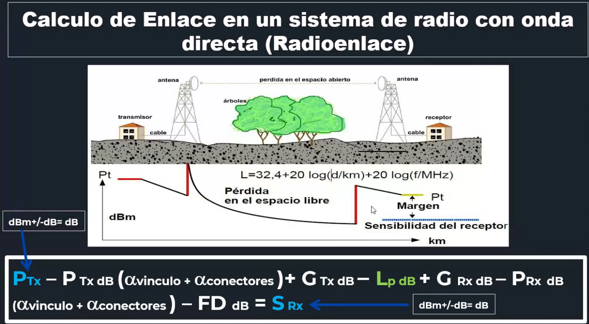
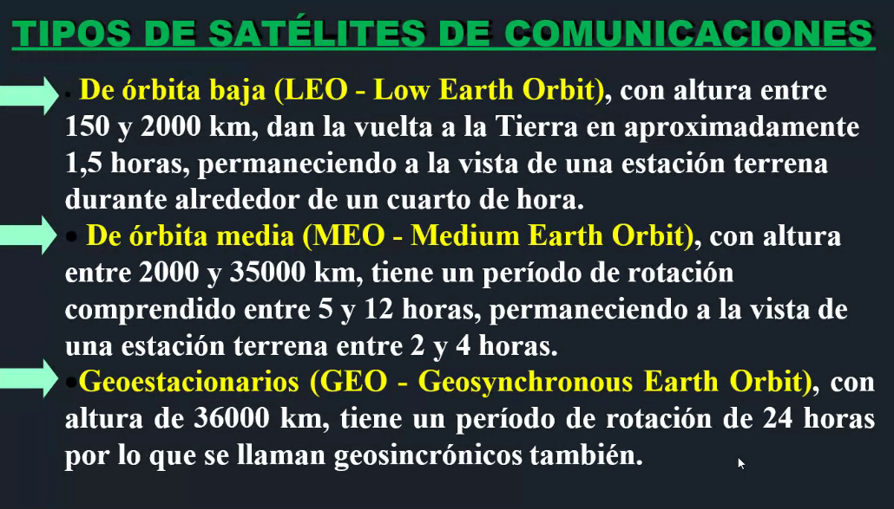
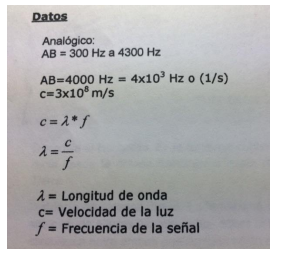

# 2DA PARTE
---
# **Tratamiento de errores**
## Tipos de errores


```python
# pointer ERROR, aislado, simple, rafagas, agrupados

error: alteracion que hace que un mensaje recibido n osea una replica
del mensaje transmitido
```

## Causas de los errores
```python
#pointer: ruido, atenuacion, distorcion, ab, T>C, deteccion, correccion
T>C: tasa de informacion mayor que un canal
```

## Calidad de servicio de un sistema
```python
#pointer: BER, red LAN, S/N, red telef
al decirte que 10^-9 te esta diciendo que hay un error cada
1k millones, significa que es un buen servicio
esto es el BER, la cuenta de bits errones del receptor sobre los 
bits transmitido
```

## Correccion - retransmision


## Correccion FEC correccion hacia adelante


## Correccion ARQ


## Codigo auto corrector: HAMMING


# **TP 6**
1. indicar las principales causas de errores en las redes de datos:
```python
se producen cuando hay ruido, hay distorsion, atenuaion
cuando el AB es mayor que el ancho de banda de canal, cuando
la VTx de una señal es mayor que la que tiene un canal entonces 
aca tendria perdida y tendria errores
tambien cuando el AB es insuficiente y cuando T > C
```

2. que politicas se emplean para el tratamiento de los errores:
```python
deteccion - correccion
```

3. como incide la correccion de errores en la calidad de los servicios de las redes
```python
se mide en BER: bits erroneos sobre transmitidos
pero como incide?

cuanto mayor es la correccion de errores detectados, mas alta es 
la calidad de los servicios de las redes, se mide en BER o S/N
```

4. en una red de transmision de atos se reciben 20 bits errones de
200.000 bits totales, cual es el BER?
```python
20/200000 = 0,0001
fijate tenes 4 ceros =>
1*10^-4 
```

5. la medicion se ha realizado sobre una LAN-ETHERNET , que comportamiento
se espera de dicha red?
```python
la red tiene una alta tasa de errores 10^-4
```

6. dado el siguiente mensaje a transmitir M(x) y teniendo como polinomio
generador G(x) = x^4 + x + 1 aplicar el metodo para deteccion errores CRC
determinando la informacion a transmitir
M(x) = 1 0 1 1 0 1 01 1 1 0 1 \


7. cite por lo menos cuatro protcolos para saber donde se emplea la 
deteccion de errores de CRC
```python
1. PPP(protocolo punto a punto): se emplea a nivel de capa de enlace(capa 2)
2. ETHERNET (estandar usado en las redes LAN para definir caracteristicas
de cableado, senializacion, formato de tramas, etc)
3. HDLC(control de enlace de alto nivel): protoclo de comunicaciones en 
la capa de enlace
4. FRAME RELAY: tecnica de transmision de comunicaciones mediante la 
conmutacion de paquetes, permitiendo la Tx de tamanios variados de ramas
de datos y de voz
```

8. cite por lo menos cuatro protocolos que emplean para deteccion de errores
el metodo de suma de verificacion
```python
1. TCP: protocolo de capa de transporte en el modelo OSI
2. IP : protocolo de internet
3. PDU: protocolo de unidad de datos, utilizado para el armado de la 
informacion del cabezal de un paquete, en el modelo de capas OSI
4. ICMP (protoclo de control de mensajes en internet): es utilizado
para enviar mensajes de error e informacion operativa indicando, por ej, 
que un host
```

9. cuando se emplean codigos correctores de errores, cite ejemplos
```python
se utilizan en transmisiones muy particulares donde nose puede aplicar
el metodo de retransmision del paquete daniado, se emplea en transmisiones
donde la informacion va ENCRIPTADA y no en CLARo, ej la informacion que 
va entre terminales bancarias.
```

10. como se manifiesta el error en las redes de datos y como se mide
```python
se manifiesta por la perdida de paquetes, se mide en porcentajes de 
paquetes perdidos en un determinado tiempo, lo podemos medir a traves
del BER, osea la tasa de bit-error.
```

---
# **Ud 7 - medios de comunicaciones**
## Calculo de enlace en un sistema de radio con onda directa

```python
OBS: aca hay transmision inalambrica, es la diferencia 
entre los calculo de enlace anteriores.. porque fijate
que viaja por las antenas

aca tambien hay perdida en el espacio libre.. LP: que va
a ser nuestra nueva variable incluida en el calculo de enlace

el 32,4 sale de toda la perdida en este espacio libre

OBS: si los arboles estuvieran mas arriba -> habria mas perdidas
una solucion seria elevar la altura de las antenas.

```
## Espectro electromagnetico en las distintas bandas


## Modos de propagacion

```python
#pointers- onda ionosferica, onda terrestre, ionoesfera, onda directa
#onda de superficie

onda ionosferica es para un uso exclusivo para determinada banda denominada
HF, que aprovechan el rebote de la ionosfera para tener un alto alcance

el radio enlace en cambio se hace mediante la onda directa, mediante microondas
porque

OBS: la onda directa es una componente de la onda terrestre
OBS: se tienen que ver ambas antenas en la onda directa

```
## Antenas


## Comunicaciones satelitales


## Tipos de satelites 

```python
# pointers: orbita media, orbita baja, geoestacionarios
# medium low 
```

## Retardos satelitales


## TP 7

---
1. [POINTERS]un equipo radiotransmisor se vincula a su atena mediante la llamada
linea de transmision que se ocupa de la trasnferencia de energia..
400 mhz.. 35W RG 213/U.. etc etc
cual es la potencia aplicada a la antena debido a la atenuacion.. \


---
2. para el ejercicio anterior calcular la sensibilidad del receptor
si este ultimo se construye con el mismo tipo coaxial del transmisor y
la misma distancia entre atena y receptor : 30m, ambas antenas tienen 
una ganancia de 30db y se encuentra separadas entre 1k \
 \
 \
 \
```python
LP: es la perdida en el espacio libre, la nueva variable
que se agrega aca

```

---
3. dado un enlace radioelectrico funcionando a 300Mhz.
cual es la longitud necesaria de las antenas para un buen rendimiento
si las mismas son de media longitud de onda? \
**RTA: 0,5m. podria ser un equipo de comunicaciones en la banda 
HF/VHF va de 30 a 300 Mhz , equipo que el frente de onda se 
propaga a traves de la ionosfera/onda terrestre** \


---
4. cual deberia ser la longtidu de la antena de un telefono celular
cuya protadora opera a la frecuencia 1 Ghz? la antena es de media 
longitud de onda.
**(podria ser un telefono celuilar en la banda de UHF)** \


---
5. si un receptor de FM utiliza una atena de 75cm, de que tipo 
de antena se trata? la banda de FM corresponde a 88-108 Mhz \


---
6. que longitud deberia tener una antena de media onda para que 
pueda transmitir voz humana en su espectro original? tomar 
como referencia el ancho de banda del canal telefonico (que es 4Khz)
 \


---
7. calcular el retardo total que ocasiona la transmision satelital
para los satelites de orbita baja, media y alta respectivamente \


---
8. dada una linea telefonica con los siguientes parametros distribuidos
L = 2 micro Hy/Km
C = 0,058 uF /km
a que frecuencia la impedancia es resistiva?


def
---
# UD 8: modulacion y multiplexacion
```python
mira todo denuevo papa porque tas pa tras

```

# TP 8 - modulacion- multiplexacion digital: PDH, SHD y SONET

1. Se tiene que transmitir una señal analógica que pasa a través de un filtro de 4000 Hz de ancho de banda. Dicha señal entra a un modulador PCM donde se toman muestras cada 125 microsegundos, codificándose cada muestra según un proceso de cuantificación de 128 niveles. Hallar la capacidad que debe tener el vínculo de salida del modulador.
Cuál sería dicha capacidad si fueran 256 niveles cuánticos? \


---
2. Se dispone de un modem que trabaja con el tipo de modulación 16-PSK
Calcule el desfasaje entre estados que adopta la señal modulada.  


---
3. que relacion hay entre la velocidad de transmisión Vt y la velocidad de modulación Vm , con respecto al ejercicio anterior? \


---
4. Se tiene un modem cuyo tipo de modulación es 8-PSK. Indicar: \
• De la señal moduladora, portadora y modulada, cuáles unkson analógicas y cuáles digitales? \
• Proponer una asignación de fases a secuencias de bits y realizar el diagrama de fases. \
• que relacion existe entre la velocidad de modulación y la velocidad de transmisión? \


---
5. Se quiere transmitir por un canal telefónico a 9600 bps y se cuenta con un modem de 2400 baudios que opera con transmisión multinivel y modulación PSK. Hallar:
• que tipo de modulación PSK debe emplearse para transmitir a la velocidad de transmisión requerida. \
• El diagrama vectorial y la asignación de fases correspondiente. \


---

6. Una portadora de 100 Mhz se modula en frecuencia con una señal sinusoidal de 10 Khz (fm) de manera tal que la desviación máxima de frecuencia (f) es de 1 Mhz. Determinar el ancho de banda aproximado de la señal de FM en este caso. \


---

7. Confeccione un cuadro resumen de los tipos de modulación especificando para cada uno si la señal moduladora, portadora y modulada son analógicas o digitales.


---

8. que tipos de modulación se ven menos afectados por el ruido y por que?
    ```
    La modulación que se ve menos afectada por el ruido es la FM ya que ésta al enviar
    información a través de variaciones en la frecuencia y no en amplitud, la cambios
    repentinos en la misma introducidos por el ruido son de baja o nula relevancia.
    ```
---

9. Que tipo de señales (analogicas o digitales) se obtienen despues de un proceso de multiplexion FDM y TDM? \


