# **ACA ARRANCA EL SEGUNDO PARCIAL**
# **Clase 6 - TRATAMIENTO DE ERRORES**
```java
errores: se producen cuando hay ruido, hay distorsion
cuando el AB es mayor que el ancho de banda de canal, cuando
la VTx de una señal es mayor que la que tiene un canal entonces 
aca tendria perdida y tendria errores 
```

solamente en canales digitales. \


```java
fijate aca que al sacar componentes de frecuencia, es decir, achicando
el ancho de banda.. lo que pasa es que la señal que atraviesa ese canal
tiene el formato que ves en azul, se acoto mas, tengo un formato digamos 
con una mayor diferencia respecto del ideal y se acoto mas , ya se convierte
en una señal muy distinto del original y puede generar ERRORES

el CANAL se comporta como un filtro , porque se rechazan determinadas
frecuencias, osea, va a ver un intervalo donde se transmite mayor 
cantidad de informacion 
```


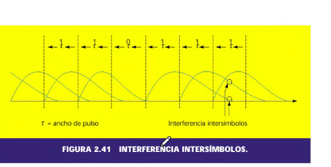

```java
INTERFERENCIA INTERSIMBOLOS
t = ancho de pulso
```

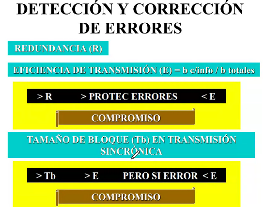
```java
si tengo una secuencia : 110011
y detecto que el cuarto bit tiene error, simplemente 
lo que haces cambiarlo, porque tenes solamente dos opciones : 1-0
entonces el 4to bit se combierte a 1
esto pasa solamente aca, pero si es una señal multinivel no se puede
hacer esto.

todo depende del tipo de las señales, aca estamos analizando
las binarias.

redundancia: R agregar datos
le agrego a la secuencia 110011 + 0011 y obtengo un menor 
rendimiento de transmision
porque tenes mas bits sin informacion

entonces ahora BITS TOTALES = 10 
BITS CON INFO = 6 
Entonces tu rendimiento Mtx = 0.6 => 60%

entonces mas datos adicionales o mas redundancias bajas el rendimiento

+ Redundancia => + Proteccion de los errores pero -Rendimiento/eficiencia de transmision
(mira el grafico para entender esto)

+ Vtx(velocidad binaria/transmision es lo mismo)
+ probabilidad de tener errores (porque esta relacionado al ancho de banda)

TEOREMA DE SHALON HARLEY: capacidad
relacion señal a ruido: se mide en veces = 1 + S/N
C = AB log2 (1 + S/N )

```
---
## Metodos de deteccion y correcion de errores


```java
obs-> los que estan en rojo son los que vamos a ver y los + importantes

CRC: control de redundancia ciclica
CHECK-SUM: SUMA DE VERIFICACION
```

### Deteccion


```java
trabajar por paridad es agregar un bit: y como se agrega? 

PARIDAD PAR 
depende de con que paridad vamos a trabajar, si trabajo con paridad 
PAR quiere decir que voy a sumar los 1 que hay y la suma total
tiene que ser una cantidad PAR en la secuencia completa, entonces,
por ej 1 1 0 1 1 y te da 4, que es par, entonces se agrega 0
porque esta secuencia ya es par 

PARIDAD IMPAR
trabajar con paridad impar:
ejemplo 0 1 1 0 1 1 0 1 1 0
fijate que la suma te da 6, entonces, tenes que agregar un 1 
para que sea impar

ese bit que se agrega va en el BUFFER, todas estas paridades
son VERTICALES, esta dentro de la PARIDAD VERTICAL

ejemplo: Tx: transmisor, Rx: receptor

Tx           00011        Rx
1100|0  --------------> 0|0011  : OK
Par                       Par


Tx           01011        Rx
1100|0  --------------> 0|1011  : FAIL - hay error
Par                       Impar

el error se genera en el CAMINO, no lo genera ni el Tx, ni el Rx
vamos a ver otro caso:

Tx           01111        Rx
1100|0  --------------> 0|1111  : 2 ERRORES          
Par                       Par

por mas que te haya dado PAR como si estuviera OK, hubo 2 
errores de bit.

conclusion: las tecnicas de deteccion/correccion de errores no son INFALIBES
entonces lo que se hace es utilizar varias, porque cada tecnica 
tiene un capacidad o una eficiencia determinado, no es infinito

```
### Paridad longitudinal

```java
M: mensaje

M1  M2  M3  M4  BP (bit de paridad)
0   0   -   -   0
0   0   -   -   1
1   0   -   -   0
1   0   -   -   1
0   0   -   -   1

fijate que en el grafico se ve piola
BCC : Caracter Control de Bloque, es un byte mas que se agrega
son todos los que estan a la derecha
(mirar grafico)

esto es agregar + Redundancia R


```


```java
obs: podrias decir que el error esta en el cruce que marco el profe
tomando las dos paridades : vertical y longitudinal
```

### Paridad Ciclica: dos bit de paridad


### CRC: chequeo de redundancia ciclica

```java
se basa en operaciones de polinomio:
yo tengo un polinomio dividendo D(x) y un divisor d(x) 
, un cociente C(x) y un resto R(x)

lo que se hace es por ejemplo tener una secuencia binaria 
S = 1 0 0 1 
son 4 bits
y c/bit tiene un peso , esto hay que pasarlo a un polinomio S(x)
donde el orden es el grado, si son 4 bits, es 1x^3 + 0x^2 + 0x^1 + 1x^0
entonces 
S(x) = x^3 + 1 : esto tiene orden 3 ->
cant de bits - 1 = orden

en que consiste la mecanica:
d(x) = G(x) = polinomio generador: estan normalizados por distintos
organismos como la UIT 

D(x) = M(x)*X^r = donde r es el orden del G(x)
y este M(x) va a tener un orden 'm'

y ambos van a tener un orden m + r

el C(x) no me interesa, lo que me va interesar es el R(x)
porque el resto va en un lugar determinado segun el protocolo
denominado CRC , el R(x) va a ser generalmente 1 0 1 1 0 1 .. etc
es decir, una secuencia binaria

=>

T(x) = M(x).Xr + R(x)
esto es lo que se transmite por el medio
es decir , T(x) es lo que se transmite


G(x)                         G(x)
Tx ------------------------> Rx
     T(x)               T'(x)                               
'

T'(x)' / G(x) = C(x) R(x)

si el R(x) = 0  => no hay error
si el R(x)!= 0  => tengo un error, en donde? nose

obs: el polinomio generador G(x) debe ser el mismo en el Tx
y en el Rx

```


## Ejercicio sobre esto:

```java
como se hace? primero en el cociente multiplicas
por 1 o por 0 , y despues , en la resta: donde los
bits son iguales = 0, si son distintos = 1
Y LA POSTA ESTABA ACA MIRA:
"""
vos cuando vas bajando los bits, tenes que preguntar
si es divisible, si no es divisible, tenes que 
bajar los bits que bajaste tambien en el cociente
"""

obs: en el transmisor puede ser que te de un resto no nulo,
pero no quiere decir que eso tien error, recien podes definirlo
cuando haces la division en la parte del receptor.. fijate
en la foto

obs2: estos polinomios NO SON INFALIBLES, podria darse que el resto
fuera 0 y que hubiera algun error
```


## CHECKSUM

```java
CHECKSUM: a una secuencia le asigno un valor decimal que le corresponde
paso binario adecimal
despues SUMO todas las secuencias (en binario) y me deberia dar 
7 = 0 0 1 1 1 
si es 7 esta todo bien..

pero fijate que en la segunda la suma no da 7, entonces esta mal

(mirar foto)
```

## **Correccion de errores** - Hacia atras

```python
ARQ : Automatic Repeat-reQuest

supon que 
A manda un paquete a B y por algun metodo, hace deteccion de errores
y en funcion de eso va a contestar con un:

ACK Acknowledge (+)
NAK Not-Acknowledge (-)

segun lo que se haya recibido, A tiene que repetir el envio o 
continuar con el que sigue.

el ARQ tiene incluido un metodo de deteccion para poder dar la conformidad.

este metodo se puede llevar a cabo entre dos variantes:
'STOP AND WAIT': parar y esperar
'SLIDING WINDOWS': ventana deslizante

a este metodo se lo considera como un metodo de control de flujo.
los NAK y los ACK manejan casi todo, porque dicen que hacer, hacen el 
control de errores y control de flujo

```

### **ARQ- STOP AND WAIT**

```java
A manda un mensaje #1 a B
A no puede continuar hasta que B conteste,
si B responde ACK1 , A continua con el mensaje #2
pero si B respondia NAK1, A tendria que volver a mandar
el mensaje #1

Si A mandara el mensaje, y B nunca manda nada
se genera un TimeOut(tiempo de espera)
```

### **ARQ- SLIDING WINDOWS**

```java
este me permite continuar transmitiendo sin tener que parar
es como cuando haces un 'ping google.com.ar' y viste que manda
hasta que vos lo paras, si un paquete te falla, sigue

'VENTANA': cantidad de paquetes que voy a transmitir
sin esperar la confirmacion
en la foto, el tamaño de la ventana es 3, porque fijate
que no seguis hastas que no recibis el ACK del primero

la ventana puede ser fija o variable:
'FIJA': ventana 8
aca no puedo hacer control de flujo

'VARIABLE': 8 - 128 
al tener una ventana variable, me permite para hacer el control de flujo
es decir, controlar los flujos.

'OBS': tengo que usar BUFFERS siempre, porque tenes que ir almacenando
los paquetes, porque si te llega un NAK , tendrias que retransmitir 
los paquetes

'OBS2': se trabaja en FULL-DUPLEX porque tengo que poder estar 
transmitiendo y recibiendo mensajes

PIGGY BACK: 'llevar en la espalda'


```

---
## **Correcion hacia adelante FEC**

```java
tiene una ventaja respecto de la otra, porque se peude llevar a cabo
entre varias estaciones.. porque se basa en enviar 2 veces un mismo mensaje
en un tiempo diferido.

entonces podes tener las estacioens A-> B , C , D y yo mando a las 3
dos veces el mismo mensaje repetido con una diferencia de tiempo

    B
  /
A --- C
  \ 
   D
```
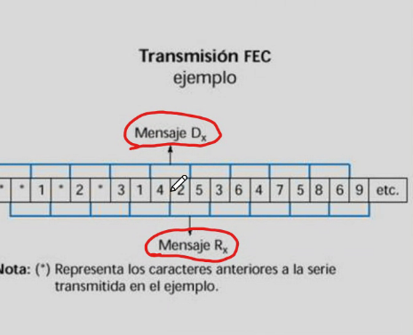


```java
esta correcion es Punto a MultiPunto
```

---

## **Codigos AutoCorrectores**
### Codigo Hamming

```python
'HAMMING': codigo auto corrector
se basa en un concepto que se conoce como 'DISTANCIA-HAMMING' (dH)
este es el fundamento de este codigo.
y que es la distancia hamming? el numero de bits en los que difieren
dos secuencias binarias de la misma longitud.. es decir:

S1 0 0 0 0 
S2 1 1 0 0

la distancia hamming entre S1 y S2 es 2, porque la diferencia
de bits que hay entre estas dos secuencias es 2.

S3 0 0 1 1 
S4 1 1 1 1

aca tambien la distancia es 2
------------------------------------------
'DISTANCIA HAMMING minima':(dHmin) menor distancia hamming en un codigo
determinado, es decir, tengo un determinado conjunto de mensajes
y calculo la distancia HAMMING MINIMA: ejemplo, estas 3 secuencias ->
0 0 0 S1
1 1 1 S2 
0 1 0 S3

entre S1 y S2, dH = 3
entre S1 y S3, dH = 1
entre S2 y S3, dH = 2

entonces para este codigo , la dH=1, porque es el menor de las
tres combinaciones
```
---
## Capacidad de deteccion o correccion

```python
siempre hay que obtener la dH minima, para poder obtener 
la capacidad que tiene para detectar errores o para corregirlos.

la cantidad de bits maximos que voy a poder detectar
se calcula como:
E detec = (dH(min) -1)

y la cantidad de bits que uno puede correjir
se calcula como:
E correc =< (dH(min)-1)/2

obs: notar el menor igual, si la cuenta te da menor que 1
no podes corregir nada, ejemplo que te de 1/2

=> entonces..

por ejemplo en la secuencias de arribas s1,s2,s3 
como la dHmin = 1  => no puedo detectar errores
# fijate en la ppt que esta detallado el D2 C1 
# como Detecto 2 y Corrijo 1, segun el codigo
------------------------------------------------
'Ejemplo': de transmision, basandose en el codigo
000
111
con dHmin = 3
D2 y C1


Tx  -------------> Rx
000               000 -> ok
                  111 -> si recibo esto, no lo puedo detectar
porque tu capacidad de detectar era hasta 2 errores


Tx  -------------> Rx
000               001 -> si lo recibo, puedo detectar el error
y corregirlo al 1 para hacerlo 0


Tx  -------------> Rx
000               011 -> si lo recibo, puedo detectar ambos errores
pero solamente puedo corregir uno.

-----------------------------------------
REDUNDANCIA: combinaciones que se utilizan
por ejemplo, en el codigo R no tenes redundancia, fijate
que tenes todas las combinaciones posibles con 3 bits
que son 8.

otro ejemplo:
7bits => 2^7 => 128 combinaciones
y en tu codigo vas a usar 64 mensajes, entonces te sobran
64 mensajes , que es tu REDUNDANCIA.
```

---
## Codigo HAMMING concreto

```python
CODIGO HAMMING: se define con caracter en 4 bits
y 3 bits de paridad
```

---

# **Medios de comunicaciones**
## Lo del medio fijate, vamos a analizar los distintos medios de comunicaciones

## Ondas electromagneticas


```python
Yo tengo una composicion de campo electrico E y campo magnetico H
hay una relacion entre los campos, dado que variaciones entre un 
campo me generan otro campo, es decir, el H genera E y viceversa.

las OEM: ondas electromagneticas, representadas como seniales senoidales
tienen una amplitud A, su frecuencia f, su fase phi, etc..
y estas ondan van a viajar por un determinado medio a una velocidad
determinada.. esta OEM puede viajar en distintos medios (agua, atmosfera, etc)

lambda = 'longitud de onda': la distancia que recorre en un ciclo esa onda

el grafico de esta ppt tiene dos cosas mezcladas: el grafico de la longitud
de onda y el del periodo, uno medido en distancia y el otro en tiempo.

notar en el grafico los vectores: P es pointing, E electrico y H magnetico
en el grafico se puede apreciar la OEM variando en dos dimensiones: espacio y tiempo

la onda electromagnetica es el TRANSPORTE de informacion.. el principal
elemento necesario en los medios de los comunicaciones es la OEM, que 
es la que va a llevar la informacion, esta se propaga de distintas maneras
segun sea el medio : una fibra optica, un coaxil, un par trenzado, paralelo,
etc..
```
## Grafico: longitud de onda vs periodo, uno en distancia y el otro en tiempo


## **Espectro electromagnetico**
```python
el espectro electromagnetico es una norma dada por la UIT 
union internacional de telecomnicaciones.
define al espectro electromagnetico mediante bandas, donde cada una tiene 
un nombre normalizado, un rango de frecuencas.
en las bandas, yo voy a tener distintos canales de comunicaciones.:

obs: la OEM cuando se incrementa en frecuencia, tiende a 
comportarse como la luz

BANDAS: obs, cada banda se toca con el limite
inferior de la anterior
a|b => de a hasta b, a:limite inferior, b:lite superior

Khz
300|3000 -> MF(Medium Frequency)
usada por radios AM comerciales

Mhz
3|30 -> HF(High Frequency) o AF(Alta frecuencia)
usada por comunicaciones a largas distancia

Mhz
30|300 -> VHF (Very High Frequency)
usada por las radios de los handis, 
radio FM comercial

Mhz
300|3000 -> UHF(Ultra High Frequency)
ejemplo, 2.4Ghz (que es la seniales de 
los routers por ejemplo), la banda de Wifi
que usamos todos de 2400Mhz esta dentro de UHF

Ghz
3|30 -> SHF(Super High Frequency)
ejemplo aca tambien estan las 5.8Ghz del wifi
que es como tu gdtrez_boosted, los wifi super powered
usan esta banda
los microondas tambien trabajan en esta banda
para poder calentar comida
o tambien los satelites, para la transmision
de informacion.

Ghz
30|300 -> EHF (Extremely High Frequency)

obs: los microondas son una jaula de faraday, porque
sino podrias estar afectando el exterior.

obs: la longitud de onda tambien tiene que ver 
con la capacidad de penetracion en distintos medios.

obs: cuando uno sintoniza una radio en el auto
uno esta sintonizando la portadora

obs: a mayor frecuencia -> mayor atenuacion

cuando ya voy al espectro visible, se usan longitudes de ondas
porque son mas precisas.. entonces se dejan de usar intervalos de frecuencias.
que es lo mismo, nada mas que es una adaptacion ya a lo que es 
altas frecuencias.

obs: la luz ademas de ser fotones, tambien puede ser OEM.

```


```python
a la izquierda, es lo denominado INFRAROJO
a la derecha, ULTRA VIOLETA


```

## Unidades longitud de onda

```python
con la longitud de onda definimos las OEM

```

## Caracteristicas fundamentales de los medios de comunicaciones:

```java
/*ANCHO DE BANDA/ VELOCIDAD DE  TRANSMISION
COSTO
parametros fisicos
atenuacion alcance y distorsion
inmunidad al ruido y interferencia
confiabilidad
facilidad para instalacion y estetica
flexibilidad */

```

## Tipos de medios de comunicaciones

```python
# ver ppt
esta clasificacion es segun como se propagan las ondas
notar que la onda electromagnetica se propaga dentro de 
estos medios, y no sale de ahi


'ESPACIO LIBRE': 
 - satelites, HF VHF UHF radiocomunicaciones, microondas,
 - laser (por ejemplo LiFi)

'GUIADA': cables y demas: fibra optica, telefonico, trenzado

```
## Caracteristicas Electricas Distribuidas
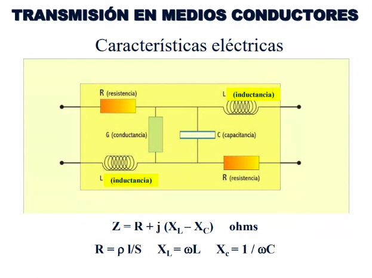
```python
# mirar ppt
fijate aca tenes dos conductores arriba y abajo
obs: siempre que hay dos conductores -> voy a tener una capacidad

un medio de comunicaciones tiene un circuito
equivalente electrico donde existen distintos 
componentes, como resistencia, inductancia, etc.

cuando tengo dos conductores:
G: conductancia: inversa de la resistencia = 1 / R
C: capacitancia: capacidad entre conductores
```


## Impedancia Caracteristica
https://drive.google.com/drive/u/1/folders/1UeUiEPDOX6nt3Fm-89HJ0bW_UyK_Eb7Y

```python
obs: la impedancia de fisica 2 se definia como Z = V/I
aca vamos a hablar de impedancia caracteristica
'Impedancia caracteristica :' (se refiere a un medio conductor)
al colocarte el Z0 se refiere a la impedancia caracteristica
que es aquella se manifesta cuando el medio conductor tiene 
una longitud 'infinita'

la impedancia caracteristica es funcion de la frecuencia, la resistencia
etc etc.. fijate la ppt
segun la senial que aplique, voy a tener distinto comportamiento

w: frecuencia
R: resistencia
G: conductancia
L: inductancia
C: capacitancia

# linea de bajas perdidas, cuando R y G son muy pequenias
# entonces se desprecia y se utiliza esta formula
Z0 = Raiz (L/C)

obs: para que se aplique este concepto, se tiene que poner
en la punta del medio una carga con la Z0 que calculamos.
si no colocara esa carga, la OEM se reflejaria.. entonces
al colocar la carga con la misma Z0 se comportaria como si 
fuera una linea infinita.(grafico de abajo)

obs: esto es importante porque para los cables coaxiles, en las puntas,
hay que colocar cargas asi, para que la OEM llegue al infinito
y no exista reflexion que generaria ruido.
```
## **Efecto Pelicular**

```python
EFECTO PELICULAR: profundidad de penetracion que tiene la OEM cuando se 
propaga por el medio. esta vinculada a la corriente electrica
es una particularidad de la onda electromagnetica.

I: corriente electrica = A sen(wt + phi)
I = (f) (es funcion de la frecuencia)

cuando I opera a frecuencias bajas, los electrones se distribuyen
en toda la seccion del conductor, pero cuando incremento la frecuencia
de esta corriente (alterna) los electrones se distribuyen por la 
periferia, y mientras + frecuencia + por la perisferia se distribuye.

a mayor frecuencia, menor profundidad de penetracion
fijate en el grafico, la ultima tiene menor profundidad de penetracion
generalmente cuando se trabaja a frecuencias altas, hago el centro
hueco.. porque directamene no va a circular corriente por ahi.
```

## **Pares telefonicos - Par telefonico**: para trabajar en frecuencias bajas

```python
son usados para la telefonia.. su AB:
AB telefonico = 0,3 | 3,4 Khz -> son frecuencias bajas..

por lo tanto => no voy a tener problemas de diafonia (que se daba
cuando habia mucha frecuencia)

aca existen todas normas, protocolos.. como los pares de colores, para
ver cual va con cual, y demas cosas.
```

## **Par trenzado**

```python
es el que viste para evitar la Diafonia, que se usaba para compensar
la induccion magnetica que se producia entre los cables, por eso 
la deformacion y todos los cables mezclados asi.

UTP: par trenzado sin blindar
STP: par trenzado con blindaje (hay distintos niveles de blindaje)

fijate en la ultima foto que tenes un cable de acero, que es 
para evitar la torsion y la traccion
```


```python
este ESTANDAR nos da dos formas de conectar los 4 pares..
```
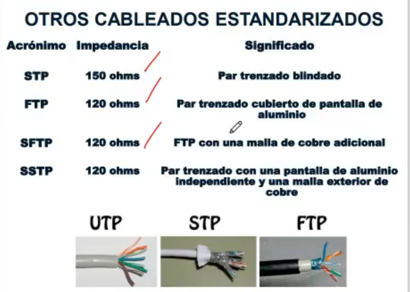

## **Longitud del trenzado**

```python
el de 5 tiene mas trenzas que el de 15, esto hace referencia
a que se repiten cada menos cm las trenzas..

el NEXT es mejor en el de 5 que en el de 15..
el de 5 tiene mas costo porque tiene mas material y trabajo.
```

## NEXT, repaso


## **FOLLETO TECNICO DE CABLE UTP**

```python
'frequency'Mhz: nos da los distintos valores de frecuencia
de la señal que puede transmitirse por este cable

'attenuation': fijate como aumenta a medida que subo 
la frecuencia, la atenuacion se incrementa, como vos sabes..
fijate que hay dos atenuaciones: nominal y maxima
  'nominal': seria el valor medio, pero podria tener 
  una mayor atenuacion siendo la maxima

'NEXT'(diafonia cercana): valores que se miden, acordate que
esto tenia que ver con la ley de faraday y la diafonia que se 
generaba por la corriente de los cables y tenerlos cercas, see lee asi fijate:
  -a menor db, voy subiendo de frecuencia
  y el db va bajando (que es peor) , lo mejor seria infinito dB
  y lo peor seria 0dB

'impedancia': esto es la impedancia caracteristica, fijate que es de
100 Ohms, y me dice que esta impedancia es la que se estima con 
una OEM que viaje entre 1-100 Mhz

'capacitancia mutua': me da la capacidad que hay entre un conductor
y otro conductor


```

# **Cable Coaxil**


```python
el cable coaxil se compone de un nucleo, una malla que proteje su 
periferica(que es conductora)
entre el conductor central y la malla circula corriente, que genera 
la OEM que al final viaja por el dielectrico
ademas de la malla se le condoja un blindaje que es para proteccion 
y una cubierta externa para proteccion tmb.

OBS: la corriente electrica si va por el conductor, pero 
es tambien la que genera la OEM que viaja por el dielectrico.
```


---
# **Guia de onda**

```python
medio que se utiliza con frecuencias de las bandas mas altas
que cumple la funcion de propagar las ondas electromagneticas
de una manera confinada, es decir, se propaga en el aire que
esta dentro, y en ese aire hay campo electrico y campo magnetico
fijate que se deriva segun como este hecha la guia de onda
SHF - Super High Frequency 
EHF - Extra High Frequency
```
---
# **Comunicaciones por radio**

# Antenas

```python
basicamente una antena es un conductor que transmiten o reciber
ondas electromagneticas..
la ANTENA tiene la capacidad de liberar la OEM para que viaje
en el espacio libre 

obs: en el grafico de abajo, lo rojo del medio es la antena
que tiene un lado positivo y negativo, que oscila digamos
y genera los espectros esos que ves al lado

```

```python
- la ganancia en las antenas se mide en dBi porque
se la esta comparando con una antena isotropica
que es una antena ideal representada por un punto
donde salen varias lineas para todos lados
- la directividad es hacia donde va, puede ser omnidireccional
direccional, etc.. 

OMNIDIRECCIONAL: distribuye su energia en todas las direcciones
UNIDIRECCIONAL: distribuye su energia en una direccion
BIDIRECCIONAL: dos direcciones
MULTIDIRECCIONAL: dos o mas direcciones
(esto se puede notar en los diagramas de irradiacion)

- polarizacion: es el como circula la corriente electrica
es decir, el sentido de circulacion de la corriente me define
la polaridad, que a su vez es el campo electrico E porque deriva
de la corriente electrica

 
obs: si te dicen que una atena tiene 3dbi, significa que gana
     3 veces mas que una atena isotropica
obs: hay una atenuacion por cada diferente polarizacion

las ANTENAS tiene relacion con la longitud de onda..
la construccion de una antena tiene una relacion con la longitud de onda
yo tengo antenas de : 4to de onda, media onda, etc..
si me dicen, la longitud de la antena es de media onda, tengo 
l/4 y l/4 en los extremos, que en el centro forman l/2
```

## **Modos de propagacion ( de las ondas de radio )**

```python
'modos de propagacion': manera en que se propagan las ondas

la atmosfera tiene :su troposfera, estratosfera y ionosfera

ONDA IONOSFERICA: las moleculas de gas se ionizan, es decir, se cargan 
electricamente (positiva o negativa), esta ionizacion lo que logra 
es una refraccion sucesiva, es decir, muchas refracciones que terminan
viendose como una reflexion

ONDA TERRESTRE: se compone de tres posibilidades:
  - ONDA DIRECTA: cables mediante antenas, como en calculo de enlace
  - ONDA REFLEJADA: (en la superficie terrestre)
  - ONDA DE SUPERFICIE: donde la onda viaja pegada a la tierra, dado
  que la tierra es un conductor

existen otros modos, como modos espaciales, o modo troposferico..
es decir, hay varios.. estos dos son los mas grandes y conocidos
```


```python
OBS: la OEM tiene componentes en distintos modos, es decir, pueden salir
varias partes en onda directa, otras en onda ionosferica, otras en 
ondas de superficie, etc..
esto depende tambien mucho de las bandas en las que estoy, ver grafico
de abajo.
```


## Onda Ionosferica

```python
la capa mas baja es la ionosfera ( de 60 a 350km)
es la capa que mas enfasis le vamos a hacer aca en comunicaciones

F= durante el dia: tengo dos capas: F1 y F2, es decir, la atmosfera
  va a ser mas densa, por lo tanto voy a necesitar que la frecuencia
  de operacion sea mayor ,para poder atravesar la atmosfera
  
obs: la ionosfera de noche es mucho menos densa
```


```python
'salto': emision de una OEM de un Tx hacia un Rx reflejandose por la 
capa ionosferica.

fijate que podes tener varios saltos, es decir , una salida del Tx
y que le pegue a la capa ionosfera y asi hasta darle la vuelta a la tierra

'FRECUENCIA DE CORTE': frecuencia maxima que se aguanta la capa ionosferica
sin que pase por esa capa, es decir, la frecuencia de corte cambia
del dia a la noche
```

## Onda directa
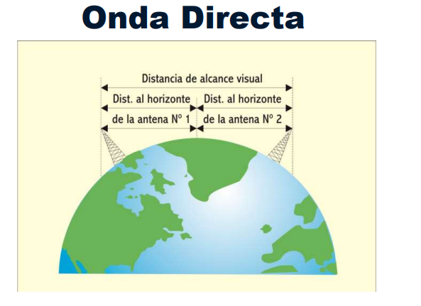

# **Calculo de enlace en un sistema de radio con onda directa - radioenlace**

```python
en este tipo de enlaces se utilizan antenas constituidas por una parabola
basicamente este grafico explica la ecuacion de un enlace, la potencia
con la que sale, la que llega.. cosas que ya sabes.

lo que se van a considerar como perdidas aca, van a ser las perdidas
en el espacio libre: arboles, montanias etc etc

obs: la Prx = Srx + FD (potencia que se recibe) obs: es distinto
de Ptx

```

# Comunicaciones satelitales

```python
'Estacion terrena transmisora': dos terminales satelitales
el que transmite, tiene un enlace ascendente y el que recibe: descendente
'Estacion terrestre de control y monitoreo': la que se ocupa 
de el gobierno del satelite
'Multiplexor':

obs: cuando hablamos de microondas, si tengo un obstaculo
en el medio, deberia poner un repetidor para que la comunicacion
pueda pasar por el obstaculo

       f1                      f2
Tx ------------ obstaculo ------------ Rx
              ('repetidor')

la frecuencia f1 y f2 deberian ser distintas, porque si fueran iguales
existira ruido / interferencia mutua (esto esta establecido, existe un 
delta f1 y f2 definido)
al repetidor obviamente hay que alimentarlo, a veces existen repetidores
pasivos, como un 'espejo' por ejemplo


obs: en SHF y EHF se dan las comunicaciones satelitales

```

## **Tipos de satelites de comunicaciones**

```python
# super importante la ppt aca
LEO: gran uso en este momento (starlink por ejemplo usa estos) 
MEO: por ejemplo los de GPS
GEO: los que orbitan alrededor de la tierra, onda la luna (no tan lejos igual)
```


## Caracteristicas de interes


## VSAT : 

```python
sistema de antenas de pequeñas antenas que trabajan en forma centralizadas sobre una estacion maestra, donde distribuyo la informacion en todos
```

---

# **Comunicaciones Opticas**: mediante fibra optica

```python
los dos medios de comunicacion son: 
1. satelital
2. fibra optica
siendo estos dos los medios de mayor uso en el mundo.

-> el potencial de la fibra optica es la CAPACIDAD:
muchos GHz o THz de ancho de banda.. entonces una gran capacidad
de velocidad de transmision, es el medio de MAYOR CAPACIDAD
pero estoy acotado a un cable.. va por el cable la comunicacion

(generalmente las fibras opticas son de vidrio)
NUCLEO: es vidrio o material transparente
RECUBRIMIENTO: tambien es vidrio o material transparente

-> la diferencia entre ambos es el INDICE de refraccion n1 o n2
que esto equivale a decir la densidad, que es la velocidad 
de propagacion en la luz dividido la velocidad de propagacion
en el medio que sea..
y como la C(velocidad de la luz), siempre N >= 1 .. porque el numerador
va a ser siempre mayor.

obs: el indice del nucleo va a ser siempre mayor que el del recubrimiento
n1 > n2
```
## **Ley de SNELL de reflexion**

```python
mientras mas aumento el angulo tita1 -> mas se va a reflejar 
la luz.. es decir, no se va a refractar nada.. voy a tener 
TOTAL reflexion.

-> siempre voy a meter un tita1 con un determinado angulo
para que se cumple la ley de snell , cosa de que no exista
refraccion.. (siempre va a depender del angulo de incidencia)
```
# Cono de aceptacion

```python
-=> la luz tiene que entrar por este cono de aceptacion


```
# Tipos de fibra optica

```python
"modo" es camino

MULTIMODO:
  - multimodo escalon: fibra menos costoza, por su forma escalonada
    (es la primera en la foto de arriba)
    fijate que se genera una dispersion modal, por esa gran
    diferencia que hay de n1 a n2

  - multimodo gradual: mas costoza, comienza desde n2 y paulatinamente
    va cambiando el indice hasta n1.. ese cambio lleva a que los modos
    se reflejen de manera tal que tengan una descripcion coherente
    bastante mejor, logrando que se reduzca la dispersion.. tambien
    logrando una atenuacion menor
    tambien logra que puedas tener mayor ancho de banda
    100 a 1000 Mhz x Km

MONOMODO: tengo un solo camino y en este caso no existe la dispersion
por ende la atenuacion es casi nula, por eso es que tengo ademas
un TERRIBLE ancho de banda de 10Ghz..

obs: observa el tamanio de las secciones que tenes en los distintos
modos, las dos primeras tengo secciones grandes-> que eso es lo que tenga
varios modos, en cambio en la monomodo no tengo gran seccion
por eso las monomodos son mas costozas de fabricar, porque tendrias que 
tener un nucleo super chiquito para asegurarte de tener una seccion chica

obs: si tengo 10Ghz x Km, y el  AB de mi FO monomodo es de 10km
el AB = 10Ghz . km /10km = 1Ghz

el ANCHO DE BANDA DE UNA FO:
-> disminuye a medida que nos alejamos de la fuente
-> limitado por la dispersion de la luz (modal y cromatica)
-> ensanchamiento del puslo transmitido: cuando el pulso
  se va ensanchando, se reduce el AB
-> se expresa en GHz x Km

obs: en sitios donde la distancia es corto, se utilizan las FO
multimodo: son ideales para una sala de servidores por ej
es decir, en contextos de poca distancia
en cambio las monomodos son aplicables cuando trabajamos en 
distancias mas importantes

```

# Rango de las fibras

```python


```

# Folleto cable coaxil - atenuacion 

```python
- este grafico no muestra DIAFONIA, lo que muestra es atenuacion
- tenes distintos tipos de cables coaxiles
- la impedancia caracteristica medida en ohms
- la capacidad
- la velocidad de propagacion: si yo tengo que calcular
  la longitud de onda, tengo que usar la Vp en el coaxil
  correspondiente l = Vp/f
- tension maxima o de ruputura: cuando se rompe el dielectrico


a la derecha: 
"""
en funcion de la frecuencia (la parte de arriba 10 - 1000)
abajo tengo las atenuaciones segun el tipo de coaxil
aca se puede ver como se incrementa la atenuacion con la frecuencia
de trabajo
"""

```

# Ventanas de operacion
#### se pide en todos los finales
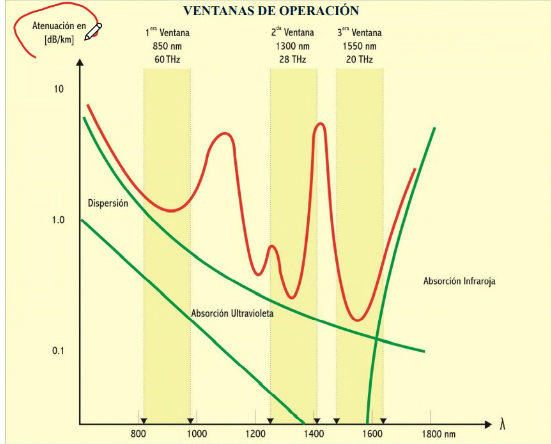
```python
aca se representan las atenuaciones en funcion de la longitud de onda.

1 ventana: frecuencia mas alta, fijate que la atenuacion es de 
1.0 dB/km

y asi con las demas.

a esos picos, se los llama 'picos de agua' en donde la atenuacion
es muy grande, debido a un tema de oxidacion, construccion, etc..

obs: la mas costoza para fabricar seria la 3er ventana
dado que tiene menor atenuacion en Db/km, a pesar de 
que tene menor frecuencia
tambien tiene mayor longitud de onda

```

# Tipos de fibra optica segun ventana
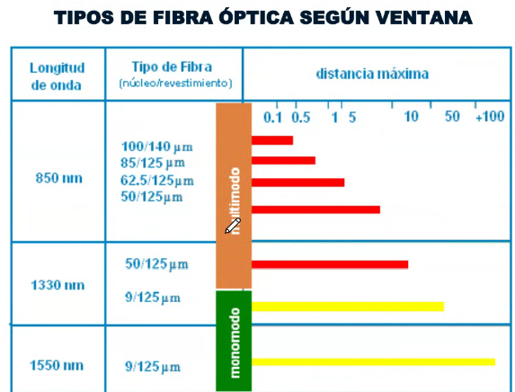
```python
la mas costoza es la tercer ventana, porque tenes menor atenuacion
y mayor longitud de onda.. es decir, es la mejor a largas distancias
en esta hay una mayor carga de industrial, es decir, la construccion
del material

observa el grafico bien, en el medio estan los tipos de fibra optica
que se utilizan
```

# Perdidas en la fibra optica

```python
# dispersion modal, cromatica, radiacion, absorcion, acoplamiento, rayleigh
```
# Sistema OPTOELECTRONICO

```python
# pointers: emisores de luz, laser,  led, fotodiodos, fototransistores,
# celulas solares

```

# Emisores de luz comparados
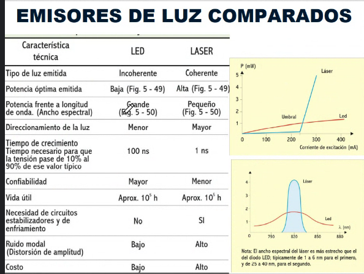

# Cables opticos

```python
# empalmadora, monofibra, multifibra, conectores, caja de empalme

```

# Fibra optica plastica POF


```python
fijate en el grafico, cada puntito dice con que puede ser usada
cada fibra

esta fibra se suele usar en los instrumentos medicos, porque
son mas dobables.. pensa que si fuera de vidrio al doblarse
podria afectar la senial.
todo depende su radio de curvatura

```

# Resumen de propiedades

```python
-> este grafico: a tener en cuenta para la fibra optica
```

# Empleo de FO

```python
FTHH: fiber to the home
y asi todos sus empleos (en donde se usan)

```

# Datos para decisiones

```python
#pointer: comparaciones entre los medios
```

# Laser

```python
LASER MODULADO: es un rayo que podes modular y transmitir informacion
-> tiene GRAN AB
-> su limitacion es que si hay niebla, rayos o lo que sea.. se interrumpe
   y no tengo comunicacion.
```

---

# **Modulacion**

```python
importante pa, para esto vinimos dijo el profe.. lee lo que dice
que es importantisimo

```

### Esquema basico de modulacion


```python
'MODULACION'
en el modulador, hay una señal que se llama portadora p(t)
ej: señal senoidal armonica simple, un tren de pulsos
[LA PORTADORA NO LLEVA INFORMACION]
la portadora va a ser modificada mediante una señal llamada moduladora
m(t), donde la moduladora es la que lleva informacion.
es decir la m(t) modifica la portadora para que lleve informacion
y 'M(t)' es la final: señal modulada
->la modulada es simplemente: la portadora modificada llevando informacion 

el proceso inverso se lo denomina
'DEMODULADOR'
```


# Esquema de transmision modulada


# Tipos de modulacion

```python
# pointers
# continua, analogica, digital, pulsos, FM, AM
# ASK , FSK, PSK, DPSK , PAM, PDM, PPM, DELTA
# DPCM, DELTA ADAPTATIVA
# continua analogica, continua digital, por pulsos analogica
# por pulsos digital
```
# Modulacion por ONDA CONTINUA

```python
es aquel proceso por el cual la señal portadora, caracteriziada
por una señal sinusoidal, va a ser modificado alguno de sus parametros
caracteristicos A , Fr, Fase, por medio de la señal moduladora, siendo esta
A o D. segun el parametro a modificar, sera el tipo de modulacion.

se modifican en funcion de la informacion

obs: moduladora - contiene informacion
obs: portadora - carry , es decir, transporta informacion
```

## Modulacion AM

```python
a(t) = informacion
p(t) = portadora

la frecuencia de la señal con informacion es bastante
mas pequeña que la frecuencia de la portadora
porque existe un teorema llamado teorema de traslacion
por el cual yo voy a mantener constante la frecuencia
Wp, pero voy a modificar la portadora en funcion de 
a(t) y al hacer eso traslado la frecuencia

```


```python
obs: cuando se hace el proceso de modulacion, fijate
ahi dentro del modulador, ya tenes la señal modulada
y despues al salir, podes optar por poner un filtro
y que pase una banda o las dos.. al pasar las dos
ocupas mas ancho de banda, porque el AB que yo tengo
incialmente es 2 veces B , si trabajo con 
BLU (banda lateral unica) la tengo una sola vez
```

# Modulacion por pulsos
```python
proceso por el cual la portadora (que aca es un tren de pulsos) va a ser
modificado alguno de sus parametyros caracteristicos: A, duracion o posicion
por medio de la senial moduladora, siendo esta A o D. segun el parametro
a modificar, sera el tipo de modulacion
```

# Clasificacion de las tecnicas de modulacion

---

## AM

```python
obs: TODO, aca como que explico mucha math.. fijate
si es necesario copiarlo denuevo, eran tipo las 21:00

```


```python
esto es como un handi, fijate que en sin modulacion es como si apretas el handi
y no hablas, y si empezas a habalar tenes informacion -> tenes la senial moduladora
```


## ASK variacion de nivel de portadora

```python
aca son saltos de amplitud, 'Amplitud SHIFT KEY'
fijate como con la moduladora vas modificando 
las amplitudes

```

### ASK por supresion de portadora

```python
fijate que aca con la señal binaria, la moduladora, 
vas anulando amplitudes.. es decir, vas suprimiendo
la señal final modulada
```
---
## FM: modulacion en frecuencia

```python
se mantiene constante la amplitud y la fase
y se varia la frecuencia (referido a la portadora) 

fijate como en los graficos en la de la amplitud,
varia la amplitud pero no la frecuencia, y viceversa
en la de frecuencia.. cambia la frecuencia pero nunca
la amplitud

'BANDA ANGOSTA': cuando el desvio es mucho mas 
pequeño que la frecuencia maxima
AB = 2fa

'BANDA ANCHA': el desvio es mayor que la frecuencia
de la moduladora maxima
AB = 2(desvio + fa)
esta es muy superior a la de la AM , dado que tiene
mucho mas ancho de banda
```

## FSK, lo mismo.. pero cambian el tipo de las señales


---


```python
1: omnidireccional: corresponde a la antena varilla
2: direccional
```

- Los satelites de comunicaciones en que tipo de orbita giran y que forma describen?
```python
orbita geostacionaria y descripcion circular
```

---
# **Modulacion [continua]** - continuacion
```python
modulacion continua: la portadora es analogica, y esta portadora tiene
parametros como la Amplitud, frequencia y fase

'AM - FM' -> tienen moduladoras analogicas
'ASK - FSK' -> tienen moduladores digitales
[podes verlo en el grafico]

----
'PSK' -> salto llaveado de fase o salto de fase
  - M PSK: n me indica la cantidad de saltos, si M=2 -> 2^1 => n=1
           M= 2^n, donde n representa la cantidad de saltos
  - M QAM: combina saltos de fase con saltos de amplitud

obs: la moduladora va modificando los saltos de fase, fijate
cuando es continua(la senial modulada) como que no hay saltos de fase..
pero al cambiar de bits, tenes saltos de fase.. mira el grafico

```

## **PSK**


```python
aca hay dos saltos:
de 0 a 180, aunque podria haber tambien de 90 a 270, o de 45 a 225

no interesa el valor en si, sino que interesa el delta, que en este caso
es 180

```
## M-PSK - Q-PSK 

```python
siempre lo importante de todo es el delta tita, que es cuantos grados
saltas
ejemplo abajo:
```

## Codigo reflejo de gray

```python
teniendo los grados y esos, pones esas secuencias de cero al lado siempre
(en este caso tu n = 2) por eso 4 saltos (2 ^ 2).
se hace asi, para que solamente exista 1 bit de diferencia entre
las distintas secuencias, fijate
```

### Diagrama de constelacion

```python
fijate hace referencia al ejercicio de arriba, basicamente fue poniendo
los puntos segun los angulos.. y esos puntos son los saltos de fase

esto es llamado 4 PSK o Q PSK (por QUAD)

obs: lo que va en el Tx es lo que va saltando en esas fases del grafico
la idea de todo esto, es que, al ser una secuencia.. te equivocarias en un solo bit

obs: la amplitud (radio) nunca cambia
```

### EJEMPLO CON 3 BITS

```python
obs: aca la construccion fue distinta a como hizo el profe
va, al princiio fijate..
tenes el primer bit: 01 -> lo espejas
despues agregas lo que agrega el profe, que es poner 00 y 11 
(respectivamente reflejados), una vez que ya tenes ese espejo
formado:-> volves a reflejar todo y como paso final
agregas denuevo todos los 0 y todos los 1 debajo


DeltaTita = 2pi / M => 45 grados

a medida que aumentas los n, mas probabilidad de errores tenes
pero envias mas bits, entonces tenes mas velocidad de transmision..
el BPSK tendria menor velocidad de transmision pero menor error

obs: la probabilidad de error la podes reducir agregando + potencia , es decir,
ampliando la amplitud, cosa de que la separacion entre los bits
sea considerable. 
```


## Modulacion 8 PSK - M PSK (resumen)


---
## Modulacion M QAM (en cuadratura)

```python
aca combinas dos portadoras desfasadas 90 grados entre si -> entonces
la senial modulada va a ser una suma:
'm(t) = I sen Wt + Q cos (Wt + tita)'

fijate en el diagrama como se aprecia la combinacion
obs['primer grafico']: cada una de las circunferencias es un salto 
de amplitud y adentro de esas circunferencias, tengo saltos de fase

obs: generalmente la QAM tiene menor probabilidad de errores
en igualdad es mejor siempre el QAm, porque en el PSK
tengo todos los estados sobre una circunferencia, en cambio
en el QAM lo tengo en varias circunferencias y varias amplitudes
mejorando la diferencia-distancia entre los distintos estados.
```
## **8 - QAM**


## Esquema de circuito con las dos portadoras en cuadratura

```python
FLUJO DE DATOS: salen digitales
los D/A: son conversores digital - analogico
FILTRO PASA BAJOS: cajita con la linea de abajo sin tachar
PORTADORA: circulito con logo de corriente alterna
```

```python
fijate que en el transmisor tenes exacto lo que sale
pero en el receptor te llegan cosas mas o menos iguales
```

```python
fijate como cambia la relacion senial a ruido : SNR 
en la 64 QAM necesito una potencia de 19dB para poder distribuir
los estados y tengan una distancia considerable, en el primero
con baja potencia estoy mas o menos bien, pero menos info obviamente  

```
### Comparacion de modulacion M-PSK vs M-QAM

```python
Eb/No => es como la relacion senial a ruido S/N pero usadas en seniales
digitales


Rendimiento espectral (mspec) = Vtx / AB (medido en veces)


Eb = energia x bit = Potencia x Tiempo de bit
No = densidad espectral de ruido = Ntotal / AB del ruido = N * tiempo

```
---
### Variantes M-PSK (diferencial DPSK gray mapping)

```python
lo que se hace aca, es que en vez de saltar a extremo a extremo,
se salta primero al bit de al lado y despues al que querias ir
[mirar grafico]
```

### Diferencial PSK [DPSK]


### Variante M-PSK o M-QAM


---

# **Modulacion Analogica o Pulsada o Por pulsos analogica**

```python
la portadora aca va a ser una senial digital : el tren de pulsos

aca la salida van a ser digitales obviamente, donde la senial
modulada es analogica

PAM: modulacion de pulsos en amplitud
PDM: modulacion de pulsos por duracion
PPM: modulacion de
```
## Digitalizacion de una senial analogica

```python
'A/D': conversor de analogico a digital
que tiene como input una analogica y output una digital

hay 3 etapas para esto:
- 'MUESTREO': aplicar el teorema de nyquist ->
  frecuencia muestreo >= 2fmax
  al salir del muestreo, tenes muestras (que son como 
  lineas verticales) fijate que se parece a un tren
  de pulsos modulado por amplitud
  el muestreador nos da una señal de salida PAM

- 'CUANTIFICACION': el cuantificador, toma como entrada
  cada una de estas muestras y genera niveles digamosle
  (transmision multinivel) llamados : 'niveles de cuantificacion'
  entonces lo que hago es a cada muestra le aproximo 
  un nivel de cuantificacion, obteniendo como salida una señal digital
  con valores discretos

- 'CODIFICACION': cada uno de esos niveles de cuantificacion
   los codifico, por ejemplo:
   000
   001
   010
   etc.. cada nivel, en lugar de transmitir 1v, 2v, 3v, transmito
   000, 001 etc.. estas codificando los voltajes, y a la salida
   del codificador tengo una señal binaria '010010'


abajo tenes todo graficado
```

```python
esto es tipo una transmision multinivel fijate, en vez 
de transmitir 1V , 2V , 3V estas transmitiendo 000 - 001 - 010 -etc.
lo que quiere decir, que en vez de transmtir voltaje estas transmitiendo
informacion..
```

## Tipos de cuantificacion

```python
obs: a mayor cantidad de niveles, voy a tener que usar una mayor
cantidad de bits para codificar.. hay una mayor complejidad, a costas
de menos errores

```
---
## Leyes de cuantificacion :  UIT G.711

```python
estas leyes son usadas en telefonia

```

## 13 Segmentos - Europea

```python
hay 128 bits de cada lado
hay menor compresion en el segmento 7 y menor compresion
en el segmento 1


```

# Modulacion por pulsos digital : es el esquema del profe
## PCM: modulacion por codificacion de pulsos

```python
aca esta mas bonito, pero el del profe se entiende mas
```

### ** **

```python
fijate, al salir del cuantificador tengo los pulsos, y ahi
es donde los codifico, aca entra el PCM

```
# **PCM** - o **MIC** (english): digitalizacion para PCM

```python
# A europa y america del sur, 256 niveles por muestra
obs: si tengo 256 niveles voy a necesitar 8 bits para 
codificar cada nivel

es decir, fijate como se asocia el tipo de codificacion
con las leyes, cada uno corresponde a otro por la conversion
de los bits
```
---
## **EJERCICIOS PCM**


```python
supon que tenes en el espectro el AB de un canal telefonico 0-4Khz

-> aplicas el teorema de nyquist
frecuenciaMuestreoMinimo = 2 frecuenciaMaxima
fm = 2 * 4000Hz => 8000 Muestras x segundo

-> ahora teniendo las muestras, cuantos bits transmite cada muestra?
8 bits porque estas usando la 'ley A' (usada en argentina)
Vtx = 8bits * 8000muestras =  64000 [bps] = 64 [kbps]
Vtx = 64 [Kbps]
"""
  si usara la ley u, cada muestra llevaria 7 bits => 
  7 * 8000 => 56 [Kbps]
"""
```


```python
'calculo de otra manera'
fm = 8000 muestras x segundo
Tm = 1 / fm 
entonces -> Tm = 125[us]

Vtx = 8b / 125 * 10^-6 s => 64000[bps]

entre muestra y muestra tenes un intervalo de muestreo, como 
se calcula este intervalo?
```
## Modulacion delta


## Modulacion delta adaptiva

```python
aca tengo escalones de tamanio variable que acompanian a 
todo momento a la senial 
```
https://drive.google.com/drive/u/1/folders/1UeUiEPDOX6nt3Fm-89HJ0bW_UyK_Eb7Y 40:00 minutes
## Modulacion PCM diferencial


---
# **MODEMS**

```python
y ahora? quienes hacen toda la modulacion: LOS MODEMS, nuestros ECD
MODEM: Modulador / Demodulador
```

## Funciones de los modems

```python
codificar: adaptar la informacion para que viaje por el medio

obs: los codigos de linea los hacian los modem banda base (no
modula)

```

## Modem rango vocal

```python
solamente preparado para trabajar en el canal de voz
```


## Modem banda base


## Modem X-DSL

```python
buscan aprovechar al maximo el ancho de banda que puede
proveer el cobre

```

## ADSL : https://drive.google.com/drive/u/1/folders/1UeUiEPDOX6nt3Fm-89HJ0bW_UyK_Eb7Y


## Cable Modem


## Comparacion cable modem vs ADSL
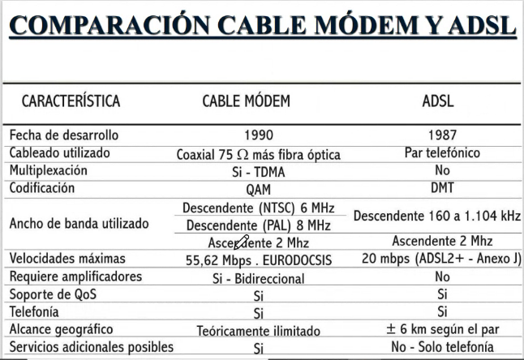

---
---

# **Multiplexion o Multiplexacion**


```python
termino parecido al de multiplicar:
yo tengo un cierto terminal, otro terminal,
otro y asi.. 
A, B y C

y del otro lado tengo el receptor
de cada uno de ellos

multiplexar: la idea es utilizar un dispositivo puesto
en un extremo y en el otro pero que trabajen sobre un solo
medio, es decir, el medio ser compartido por todos..
entonces yo voy a tener un unico enlace donde van a ir 
todas las comunicaciones
(distintos medios)
todo esto para mejorar el ancho de banda

el equipo encargado de esto es llamado 'MULTIPLEXOR': Mpx

```
## Requerimientos de multiplexar

```python
['leer ppt, data piola']
obs: la capacidad total debe ser mayor o igual que la suma
de la capacidad de los n terminales a la izquierda, no debe
ser menor

el Mpx es un ETCD, ubicado en la capa 2 del modelo OSI
```

## Multiplexacion: voz/datos

```python
en este enlace en donde estoy trabajando con multiplexion
puedo llevar distintos tipos de informacion, es lo que 
se muestra en el grafico.. datos por un lado y por el otro
lado voz.. y todo viaja por el mismo enlace

```

## Tecnicas de multiplexacion

```python
obs: el medio tiene distintos recursos, y esos son 
los que se comparten en cada comunicacion
fijate en la ppt, tenes cada tecnica distinta de multiplexacion
y te dice que es la cosa que se comparte
```

## FDM: multiplexacion por division de frecuencias


```python
vas trasladando los canales (banda base) a diferentes parte 
del espectro esto es modulacion, entonces el multiplexor lo que hace
es ubicar los espectros uno al lado del otro, para que vaya
por un mismo canal de comunicaciones.
es como juntar todo y mandarlo de una

FDM es una tecnica de multiplexacion analogica porque 
estoy modulando como las que estudiamos MPSK
```


## protocolo de la UIT


---
## **TDM**

```python
el TDM en cambio, es una multiplexacion digital.. 
el recurso que se comparte aca es el tiempo
el tiempo que provee un medio de transmision lo 
voy a dividir en time slots y estos time slots
van a ser ocupados por distintos usuarios (A, B, C , D)

'TIME SLOTS': ranuras de tiempo, que son ocupadas por 
distintos usuarios
```


```python
'TRAMAS': son paquetes, es decir, un bloque de datos
que vos armas, y tiene una serie de campos que lo definen
las normas que estan ahi en la PPT

```
## **TDM - PCM** (pcm integrado a TDM)


```python
PCM: modulacion por codificacion de pulsos, pero a su vez
ahora esto lo voy a integrar a la multiplexacion por division
de tiempo, donde cada uno de los canales los voy a integrar
a una trama, a un bloque de datos..

fijate en cada grafico corresponde todo

'LEY A:/ PCM-30' cada uno de los canales digitales que tengo
en el PCM lo voy a integrar a un bloque de datos, si 
estoy en la ley A, voy a armar 30 canales de informacion
1 canal de sincronismo y 1 canal de senializacion
en total = 32 CANALES.
a esto se lo va a llamar PCM-30 (que significa que voy
a estar haciendo TDM) 
al ser 8 bits por canal, cada canal tiene 8 bits.. y si tengo
32 canales * 8 => 256 bits por cada trama

(esta trama es llamada la E1)
---------------------
| | | | | | | | | | |  -> todo esto es la trama de 256 bits
---------------------
PCM - 30 (TDM)
256 / 125 = 2048 Mbps


'LEY B(norma americana)/ PCM-24': 24 canales de informacion con 
cada uno de 8 bits, y esos 8 bits van a tener 7 con info
y 1 de senalizacion..
y al final de la trama se agrega 1 bit de codificacion
8 * 24 = 192 + 1 bit de cod => '193 bits'
193 / 125 = 1544 Mbps

T1 es la norma aca
```

## **Norma E1(europea) - PCM 30**

```python
el canal 0 es de sincronismo de bloque
hasta el canal 15 inclusive es informacion 
y hay un canal que es el canal 16 que se llama de senializacion
en donde llevo informacion de cada uno de los canales de informacion
pero que tipo de info? informacion de senializacion, la senializacio
es toda la informacion de llamada, de establecimiento de una llamada
todo esto es senializacion...

y despues completo los otros 15 con informacion

```

## **PCM - 24 (norma T1)**

```python
tengo 7 bits pero hay un ultimo bit que es de senializacion
y eso se repite en los 24 canales.. pero finalmente
se agrega un bit para sincronismo del bloque

```
---
## **Ordenes superiores de Mpx TDM**

```python
PDH: jerarquia digital plesiocrona: este ordenamiento toma T1, E1
y va a armar ordenes superiores, E2, E3, E4 y E5

PLESIO: significa : casi igual a lo sincronico pero con 
una pequeña diferencia

como queda armado esto? -> abajo
```

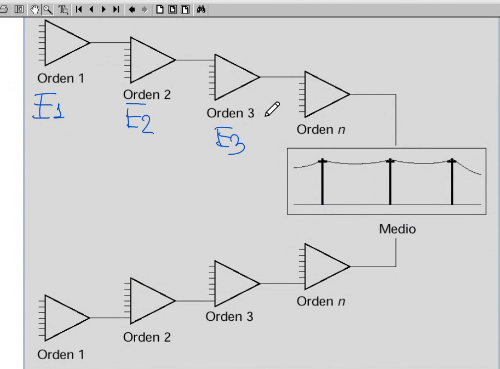


```python
por ser plesiocoronca, hay que agregharle algo mas para que 
sea sincronico
```

## SDH : jerarquia digital sincronica

```python
todo lo que dijo esta basicamente en la ppt -> importante      

```


## STDM: multiplexacion por division de tiempo estadistico

```python
es una variante del TDM, una mejora, porque aprovechas la trama
capaz velo denuevo

```
---
## **WDM: muiltiplexacion por division de longitud de onda**

```python
el WDM transmite varias longitudes de onda entre 
distintos canales simultaneamente
lo que yo voy a estar compartiendo es el recurso de la longitud de onda
(con otros canales)
el medio que utilizo aca es la FIBRA OPTICA
por un mismo pelo de fibra optica transmito varios canales 
con distintas longitudes de onda cada uno, de distintos usuarios
tal vez.. ['mirar grafico']

es unidireccional, fijate los amplificadores a donde apuntan
los amplificadores lo definen porque trabajan en forma direccional
```


```python
alto grafico, es la epxlicacion de arriba miralo
```

## CDWM y DWDM

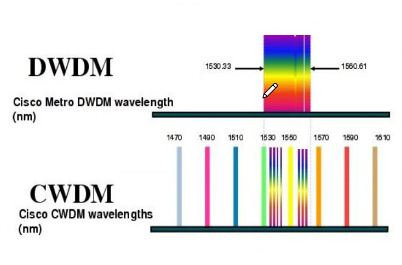

## CDM: multiplexacion por division de codigo

```python
lo que usa el wifi es esto, es una tecnica de espectro
ensanchado que esta asociada con esta multiplexacion
lo que se hace es: a travez de un codigo yo espando el espectro
entonces cada usuario distitno tiene un codigo distinto
y no existen interferencias, por eso es que puedo multiplicar
el uso de un medio

```

## Multiplexion como metodos de accesos multiple

```python
una metodologia de acceso que esta asociada a la multiplexacion

```
---
# UD 9
# **Redes de telecomunicaciones**

```python
una RED se componene de enlaces, nodos y equipos terminales
el objetivo de una red es compartir recursos
enlaces y nodos hacen lo que hoy conocemos como clouds
```

```python
aca tenes los distintos enlaces fijate el grafico muy bueno
```

```python
'COMNMUTADOS': cuando hay conmutadores de por medio
  -> comnmutacion de circuitos
  -> conmutacions de paquetes

```

```python
'linea conmutadata': es como privada, no se comparte ninguna
informacion.. es unica

```

## Conmutacion

```python
obs: una vez que A se comunico con B mediante el recorrido
que esta en el grafico, queda reservado exclusivamente para
A y B -> esto es comnmutacion de circuitos fisicos


'grafico abajo'
en cambio, la conmutacion de paquetes.. la informacion
esta paqetuizada
aca esta todo compartido, los nodos, enlaces y lo que sea
aca no hay un monopolio de recursos

```

## Conmutacion de paquetes y circuitos


## Topologia redes
