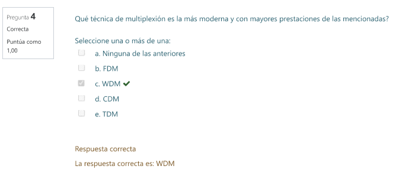
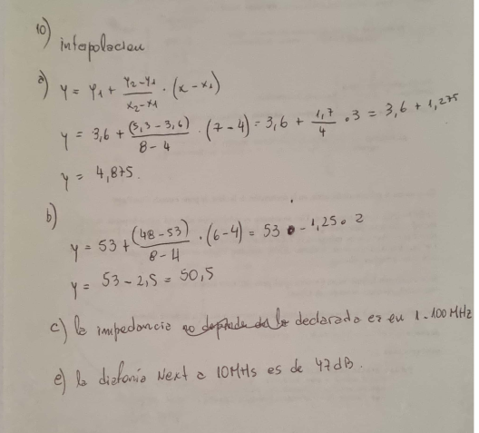

# **2do - PARCIALES RESUELTOS**

1. sobre el metodo de control de errores ARQ ventana deslizante\
    a. en que consiste? detecta o corrige errores? \
    b. que es la ventana? que es el tamanio de ventaja? que consideracion hace si es igual a 1? \
    c. si se recibe la secuencia 110101011100 que incluye un bit de 
    paridad par , quie indicacion de trafico transmitiria la estacion
    respecto de esta secuencia? 
```python
a. el metodo ARQ ventana deslizante es una tecnica que consiste
en el envio de mensajes entre terminales
de modo que si existe algun error al ser recibido,
el transmisor vuelve a enviarlo, es un metodo de correccion
de errores

b. la ventana hace referencia a la cantidad de paquetes
que voy a transmitir sin esperar la confirmacion por parte
del receptor (ACK).
el tamaño de la ventana se refiere a dicha cantidad de paquetes,
la cual depende del buffer que posea el emisor.
si el tamaño de la ventana fuera 3 por ejemplo, el emisor
podria enviar 3 paquetes sin problemas, es decir, sin respuesta
del receptor, una vez enviado estos 3, para continuar enviando
deberiamos recibir el ACK del receptor
ahora, si el tamaño fuese igual 1 entonces seria la tecnica
de ARQ - STOP AND WAIT, donde se manda de a 1 mensaje 
y no se puede seguir mandando hasta que el receptor conteste
si B respondiera NAK1, se deberia volver a mandar ese mensaje

c. secuencia 110101011100 
al ser paridad par, la suma de los uno debe darme una cantidad 
par => 1 * 7 = 7 => es impar, por lo tanto como estoy
trabajando con paridad par, hubo un error en el mensaje..
por lo que el receptor deberia mandar un NAK al emisor 
para que vuelva a enviar el mensaje.

```

---
2. 

```python
a. eligiria la de menor frecuencia 2Ghz, porque a menor frecuencia
tendria menor atenuacion en el transmisor

Lp = 32,4 + 20log (F[Ghz]) + 20log*(d[Km])

aca la parte de las frecuencias es la que importa, porque 
la otra parte (Distancias) permaneceria constante para ambas
elecciones, entonces al analizar el 20Log(F[Ghz]) es conveniente
usar una baja frecuencia, lo que nos dara una menor atenuacion
para el espacio libre.

b. aca tendriamos que tener en cuenta la longitud de onda 
para dicha frecuencia

l1 = C / f1 => l1 = (3*10^8) / 2*10^9 => 'l1 = 0,15m'
l2 = C / f2 => l2 = (3*10^8) / 5*10^9 => 'l2 = 0,06m'

por la frecuencia f1 (2Ghz) debera usarse la antena enrejada
y por la f2(5Ghz) la antena solida.
esto se debe a que la longitud de onda de la primera sera mayor
que la segunda, y por l otanto aunque la antena es enrejada
la señal sera recibida sin problemas ya que se comporta
como si fuese completamente solida
```

---

1. dado la secuencia de bits T, aplicar el metodo CRC teniendo
en cuenta el polinomio G(x) dado, explicando el procedimiento
e indicar si se produjeron errores \
**T = 1010011101 \
G(x) = x^4 + x^2 + 1**
```python
busco el S(x) = x^9 + 0x^8 + x^7 + 0x^6 + 0x^5 + x^4 + x^3 + x^2 + 0x^1 + 1x^0

quedando: S(x) = x^9 + x^7 + x^4 + x^3 + x^2 + 1

ahora, G(x) es = 10101 => tiene 5 bits => k=4

- multiplico el mensaje M (en este caso T) * x^k
=> (x^4) * (x^9 + x^7 + x^4 + x^3 + x^2 + 1) =
=> x^13 + x^11 + x^8 + x^7 + x^6 + x^4
=> pasando a bits =>  14 bits
=> 1 0 1 0 0 1 1 1 0 1 0 0 0 0

- ahora divido a G por el producto obtenido
G: 1 0 1 0 1
T * x^k : 1 0 1 0 0 1 1 1 0 1 0 0 0 0

'REGLAS PARA DIVIDIR':
0 : 0 = 0
0 : 1 = 0
1 : 0 = 0
1 : 1 = 1


# TODO -> ya sabes hacerlo, acordate no seas bldo
como?: cuando terminas de hacer una division
siempre tenes que bajar un 0 y NO ponerlo en 
el cociente, solamente se pone cuando el 
numero que te queda no es divisible y ya 
bajaste el primer 0 despues de la divisoion,
fijate que despues hay varios pasos del CRC
```

---
1. que afirmacion sobre cableado UTP es correcta, teniendo en 
cuenta el folleto tecnico \


```python
obs: la C, que dice que NEXT es de 49,25 a 7Mhz
podria ser cierta, porque no esta puesto justo el 7Mhz
en el grafico, pero fijate que el valor pareciera
que esta ahi, entonces podria ser correcta

OBS: esto se justifica haciendo interpolacion
fijate abajo
```


---
1. en la modulacion PCM30 se emplea el metodo de 
multiplexion:

```python
ctrl + g
LINE 1795 - 20teoria.md 
```

---
4. que opciones constituyen terminos relacionados 
correctamente?

```python
solamente E2 - PDH, dado que
PDH: jerarquia digital plesiocrona: este ordenamiento toma T1, E1
y va a armar ordenes superiores, E2, E3, E4 y E5

PLESIO: significa : casi igual a lo sincronico pero con 
una pequeña diferencia

como queda armado esto? -> abajo

```

---
1. dado un enlace radioelectrico a la frecuencia de 
15 Mhz
 \
 \
 \
```python


```

---
6. se transmite por un canal que permite una 
velocidad de modulacion de 4800 baudios con una 
modulacion 8-PSK

```python


```

---
7. que afirmacion sobre ARQ es correcta?

```python


```

---
8. el diagrama de irradiacion que se observa
corresponde a las antenas de este radioenlace

```python
Verdadero, puesto que ese diagrama de irradiacion
corresponde a las antenas direccionales, y se puede apreciar
en el grafico que ambas se apuntan directamente entre si

```
---
10. el tiempo maximo de muestreo de una señal analogica
en un ancho de banda de frecuencia maxima de 3Khz 
es de :
 \
```python


```
---

11. que afirmacion es correcta con respecto
al control de errores?
 \
```python
ninguna es correcta, dado que :
b/ checksum aplica una secuencia de bits que
corresponde a la suma de los valores checksum

c/ FEC es correcion hacia adelante
d/ ARQ es punto a punto
e/ CRC es una tecnica de deteccion, no de
correccion
```

---

12. que tecnica de multiplexion es la mas moderna y con mayores prestaciones \

```python
WDM, usada en comunicaciones opticas
line 1900
```

---

13. dado un enlace radioelectrico a frecuencia
de 15 MHZ


---

14. en la digitalizacion de seniales analogicas
que opcion incluye a todos los procesos
necesarios y en el orden corresp.

```python
linea 1512, muy completo

```

---
15. que afirmacion sobre comunicaciones satelitales
es correcta?


---

16. que afirmacion sobre cableado UTP
es correcta?




---
17. se transmite por un canal de  


