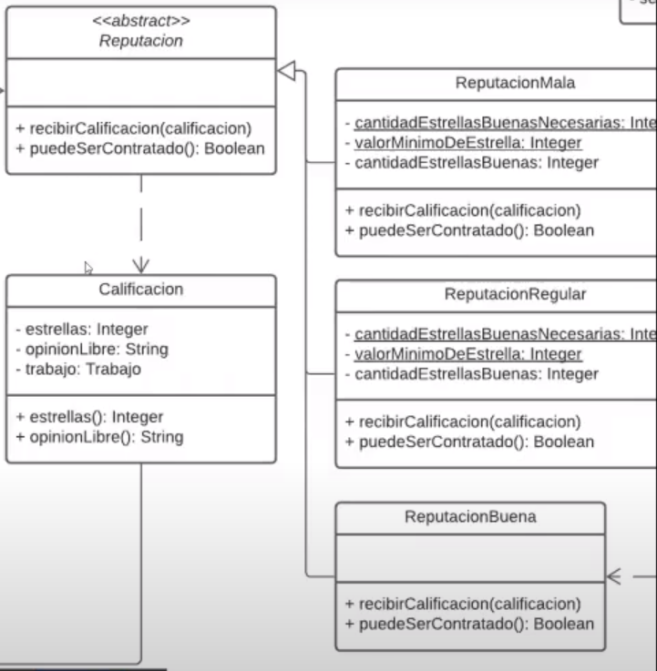

# TEORIA + TRICKS R4 KIDS-> FINAL DDS
## <ins>**TRIX R4 KIDS**</ins>
- En cuanto a como convertir "clases a otras" ejemplo, en el ultimo final
habia un `"Participante"` y un `"Referido"` donde el referido se podria convertir
en participante despues.. esto es facil, **NO HAGAS** lo trivial que es hacer una herencia
porque nunca pueden cambiar de estado, osea, un participante siempre es un participante
y un referido siempre es un referido, por lo que podrias haber hecho:
   - clase participante que tenga `campos en nulo` (osea, todos son participantes 
   realmente) y despues se llenaran
   - clase participante con un `method` que nos diga esto method esParticipante()
   - NO PONER NUNCA UN METHOD ADENTRO QUE DIGA `method completarDatosRestaTantes()`
      porque aca estarias haciendo como el backend, y en realidad esto es mas un caso
      de uso, que se puede dar en la web, lo maneja un controler.. y vos te olvidas
   
- Generalmente tema estadisticas, no hace falta crear entidades a nivel objetos, podes decir que haces todo de la DB y tenes miles de formas de hacer otra cosas. \
[DER] Otra cosa muy importante a considerar aca es el tema "sacar estadisticas" suponete que queres sacar la cantidad de intercambios, vos esto no lo podes decir como "ok, vamos a contarlos en toda la lista" porque pueden ser millones, lo mismo con la DB. Lo mejor aca, es "denormalizar" este dato, es decir, que por ejemplo una comunidad tenga un contador de intercambios realizados y se vaya actualizando, es decir, sumar +=1 . Entonces ese dato queda fijo siempre.

- Recordar: DENORMALIZAR:--> agregar redundancia a tu DB, esto significa "agregar" clases que no tienen sentido por si solas a la de otro. Por ejemplo:
   ```python
   class Estudiante
      nombre :: str
      apellido :: str
      dni :: str

   class Ubicacion
      latitud:: str 
      longitud:: str
   ```
   Como denormalizarias esto? fijar como la clase ubicacion no tiene sentido por si sola, entonces
   ```python
   class Estudiante
      nombre,apellido,dni :: str
      # ubicacion, notar como deja de existir
      latitud :: str 
      longitud :: str
   ```


- A pesar de que en los finales buscan la simplicidad, no te olvides de conceptos importatnes como el **Polimorfismo** que por exceso de simplicidad en el final de cartagram te lo pusieron mal, acordate que vos tenias grupos, bots y usuarios. TODOS eran completamente distintos lo que hacian, pero habia algo que tenian en comun: `recibirMensajes()` . entonces, el truco aca estaba en hacer una interface o clase abstracta con el nombre `Mensajeable` y que estas 3 clases hereden de la misma.

- Hacer clases de mas a veces es util, a veces no. Como por ejemplo una clase SUGERENCIA. que conteiene una publicacion. (final de recircular)

- Tema filtros: vos lo que pensas primero cuando ves esto es **que parametros recibe el method de la clase buscador?** eso esta mal amigo, vos lo primero que tenes que pensar, es que atributos va a tener tu clase, es decir, catalogo, ubicacio, estado, tipo, etc. Despues los filtros? pura UI, no te vuelvas loco con la firma del method.

- Olvidarse de los MAPS, no les gustan... es prefierible siempre que tenes MAP, hacer clases nuevas
 al estilo "Data class" es decir, clases al estilo "Campo" que tenga una List<Valor> y "Valor" sea otra clase.
 todo con string obvio, y ahi aprovechas lo de "obligatorio" como boolean.

 - No poner methods como `completarDatosRestantes()` o `modificarDatos()` justifica que eso se hace por UI

 - Los medios de notificacion de cada participante, tienen un method que es `enviar(msg)` en vez de recibir, es decir, pensa siempre que los notificadores (al tener acceso a todos los participantes) pueden acceder a sus atributos, como los medios, entonces usarlos . ES DECIR, **PUEDE EXISTIR methods con LOGICA "pesada" EN COMPONENTES COMO PERFIL, MEDIO, ETC**

- Cuando tenes interfaces y despues sus respectivos componentes que hacen cierta logica, siempre pensa: "es Stateless?" antes de definir si lo vas a persistir. (Acordate que las interfaces se pasan a clases abstracta para persistir), pero aca hay un truco, que es.. si la interfaz tiene puro comportamiento, podes mantenerla como interfaz y NO persistirla , pero crear otra claseEnum que contenga 

- Buena idea la de interfaces, que pensaste hoy xq dijeron eso de las validaciones. ponele que un tipointercambio no puede usarse en una comunidad, vos eso en el intercambio lo pensas como que ya esta instanciado y podes preguntarle "esUtilizable(param)" o algo asi, obviamente despues de haberlo instanciado con lo que necesites dentro de tu intercambio.

- Siempre que lees el objetivo y esta explicito en el
enunciado, ya si no haces eso.. olvidate, onda el ultimo de julio
decia que querias sacar las probabilidades de un integrante, ya no hacer
eso estaria re mal. 

- En cuanto a los medios de notificacion, siempre que haces la entidad
Notificador tenes que ponerle el method 
   ```python
   def notificar(mensaje, contacto):
      ...
   ```


- **"TRAZABILIDAD"** que te pedia el enunciado, acordate, esto siempre
es simple.. podrias haber hecho
que el participante tenga un atributo que sea `Boolean acepto` y listo y
una fecha como `DateTime fechaDeAceptacionORechazo`

    

- **OJO CON LAS HERENCIAS**: OJO CON ESTO AMIGO, OLVIDATE TOTALMENTE DEL STRATEGY - TEMPLATE METHOD Y ESO
te paso en tu final.. fijate como todo tiene el mismo comportamiento, es decir, 
esta bien.. cambian los valores, pero en realidad es todo lo mismo, entonces
no te rompas la cabeza y hace una unica clase y multiples `"INSTANCIAS o OBJETOS"`

   ```java
   // seguir siempre el principio de "simplicidad" 
   class Categoria{
      - cant referidos necesarios
      - costo
      - valor multiplicador de chances
      - nombre = "oro, plata, bronce"
   }
   ```

    
- Una linda abstraccion para hacer esto es hacer una clase general:
// dado que es algo muy trivial, es como el core, el nucleo de la aplicacion
   ```java
   class CalculadorDeProbabilidad{
      - probabilidadDeGanarDe(unParticipante)// y adentro arranca todo el quilombo 
   }
   ```

- Casi siempre que tenes estado en las clases, van `'ENUMS'`
casi nunca va un `'STATE'`, solamente va si con el tiempo
cambia el comportamiento de la clase..

- Siempre que leas "reportes" te re contra combiene
agarrar la birome y ponerle `mira, desde la base hago los reportes, es mucho mas performante que hacerlo en objetos`

- Notar que siempre el enunciado va a hablar de 
sistemas o componentes, leer todo el enunciado
y la parte de arquitectura que te va a tirar
mucha data de todo el contexto, y de que cosas
persistir como clases o no , recordar "actores de tu sistema"

- Notar que los enunciados hablan de clientes
con cuenta y sin cuenta a veces, si dice que 
necesita registrarse `-> entidad de una`, sino, se consideran esporadicos y no se modelan

- Los catalogos **'NO SE PERSISTEN'** pensa
que son como repositorios , vos tenes que modelar
la capa de dominio, no la capa de persistencia
o de controladores

- Generalmente los `"Fabricantes"` de cosas y eso
`'NO SON ACTORES DEL SISTEMA'` y mas si dicen que 
 " lo contacto por telefono " ok ? acordate
CONTEXTO , CONTEXTO , CONTEEEEEEEEEEXTO
el fabricante fabrica "FISICAMENTE" esta muy mal
que halla un `'method fabricar()'` pensalo como algo
totalmente externo, si habla de tech esta bien
hacelo..

- `'FACHADA'`: engloba un sistema entero, llamadas a muchas cosas
, muchas funcionalidades complejas
- `'ADAPTER'`: engloba algo "muy puntual"
onda el script de MIDI

- Es importante repetir en algunas clases
la `"Direccion"` o otras cosas que denomarlizas = (que significa **no hacer una clase**)
en demas clases que sientas que es necesario.

- Y hablando del diablo "direccion" hay muchos
contextos que tenes que tener en cuenta, como por ejemplo:
si un cliente tiene una direccion.. vos podes 
anticiparte y ponerle una List<Direccion> para
anticiparte de que el cliente quiera agregar mas 
direcciones a futuro
y es una entidad muy importante la direccion, 
para despues mapearla en el der

- No modeles nunca los carritos de compra 
y eso, aclara que esta en la vista

- Cada uno de los microservicios pasan a tener 
su propia estrategia de persistencia, cada uno 
guarda su estado propio.
Dejo de tener base de datos centralizada para 
empezar a tener servicios con persistencia 
distribuidos

- Si en los requerimientos figura la palabra
"listar" es obvio que tenes que crear la clase
que te pide, por ej "listar fabricas" y.. Fabrica
es una clase

- Modelar como enums las cosas que sabes que nunca
van a cambiar, onda el tipo de dni
`"DNI, CI, LIBRETA, ETC" `
en vez de hacer una clase documento, entonces en
tu clase metes como string el nro y despues el tipo
(y de paso estas embebienndo de una para el DER dsp ;)

- Muy importante que pongas los prametros
en los methods de las clases

- Acordate que `STATE` puede resultar similar al patrón Strategy, 
pero hay una diferencia clave. En el patrón State, los estados 
particulares pueden conocerse entre sí e iniciar transiciones 
de un estado a otro, mientras que las estrategias casi nunca 
se conocen.
el `def change_state(State state)` va en la clase que tiene el estado
ej: Player tiene varios States (pajoso, activo, masomenos)
el method va en el Player (tambien podria ir de cada estado al otro dado
que se podrian conocer)
---
# <ins>Final Audiencias - sujetos obligados </ins>
### <ins>Ejemplo de relacion: </ins>
El enunciado te decia que un sujeto obligado pertenece a una dependencia (Presidencia, Economia, AMAP, varias otras).
 

El DER quedaria asi, fijate que el `sujeto_obligado` tiene solamente una `dependencia_estatal` pero que la dependencia estatal puede estar en varios sujetos
- Notar que tenes que tener la `FK` siempre pensando que es el atributo, y como el sujeto tiene una dependencia, ahi va la FK
- Si miras del lado del sujeto -> dependencia es un `ManyToOne`

## **Solucion as it finest**
### Recordar que ACTORES != ENTIDADES, aca el ciaudado era un actor pero no una entidad fijate
 
- **SOLAMENTE IR POR HERENCIA CUANDO HAY DIFERENTE COMPORTAMIENTO, tratar de evitarla siempre**
- Jugar mucho con los `NULLABLES` , no pasa nada si tenes queseyo ponele un
```java
class Entidad{
   String Nombre
   String CUIT/CUIL [NULLABLE] //porque decia que solamente
   // lo tenian las razones sociales y no las otras.
   String DNI
}
```
---
# <ins>Final Internet - servicios, servicios prestados, repetidores </ins>
- Algo muy importante aca, y que define bien como tenes que modelar algo, es el **alcance** fijate que si te dice "poder gestionar nuevos tipos de servicios"
vos lo primero que tenes que pensar aca es que no tenes que hacer ni de una una `HERENCIA` porque pensa que deberias tener 
una pantalla (para el admin o quien fuese) capaz de agregar nuevos servicios con X caracteristicas, por lo que , no podrias crear una `class` de java
desde una pantalla. 
 
- Notar mucho lo de los archivos de configuracion `.json .properties` y demas, es muy util para no hardodear cosas, en vez de hacer clases o cosas asi, justificas con esto.

- **Tipo de servicio mal mapeado: en objetos es un enumerado, por lo cual en datos no podría ser UNA TABLA (se mapean como strings o integers).** enbebidos en la entidad que lo necesite.

- LOS ENUMS SE MAPEAN COMO STRIGNS O INTEGERS

### Aplica un patron STATE? 
 

Lo habias hecho bien:
```java
// esto por auditoria 
// NO ES UN PATRON STATE
class Estado{
   String motivoQueSeRechazo; // [NULLABLE]
   // esto es lo mejor por consistencia de datos, si fueran strings
   // podrian poner "En revision", despues "EN ReVision", etc..
   Enum estadoAudiencia (.REVISION, .RECHAZADA, .CONFIRMADA);
   DateTime fechaYHora;
   String usuario;
}
```


--- 
## FINAL PRO-SERVICES
   - DIAGRAMASTE UN CONTRATO , PARA QUE AMIGO? todo bien
  podria ser digital, pero la onda es separar lo fisico
  de lo tech, entonces, pensa que un contrato es algo fisico
  no hacia falta diagramarlo porque se arregla en persona
  tal vez, aunque con buena justificacion podrias hacerlo 
  pasar

- ej:"""un servicio es una coleccion de tareas"""
  listo, tenes que modelar tareas, OLVIDATE de str

- acordate de diferenciar mucho las cosas, en el 
  de servicios-tareas-prestador-consumidor.. acordate
  que vos pusiste servicio como entidad, es decir, el servicio
  es lo que va a ver el cliente, tiene tareas? si si, todo bien
  pero el TRABAJO es quien tiene las tareas posta especificamente
  no en el contrato

- fijate que el enunciado nunca te hablactoreo que el trabajo tenia
  un estado, pero vos tenes que avivarte ahi y darte cuenta
  que tenes que ponerle "REALIZADO" , "NO-REALIZADO", "RECHAZADO"
  es mucho mas flexible, algo muy importante, englobando
  la auditoria.. es que tu estado tenga 'fecha, hora, motivo'
  entre otras cosas
  no estaba tan mal lo del booleano, tipo el 
  bool realizadoSegunPrestador
  bool realizadoSegunConsumidor

- la reputacion te re contra servia que tenga 3 sub clases
  class Regular, class Mala, class Buena, entendes? 
  te ahorras mucha logica en los otros metods
  porque aparte, aca la reputacion es quien tiene 
  la calificacion, entendes?
  otra cosa recontra importante en la reputacion es que
  tenias que hacer un 'State' porque fijate que el comportamiento
  cambia segun la reputacion que tenga el prestador.
  " para mejor la reputacion los prestadores deben recibir ..
  " si tiene mala reputacion, no puede trabajar por n semanas ...
  etc..
  RECONTRA OJO A ESTO.
  ademas de `def puedeSerContratado()` pensa, la forma mas facil
  de saber esto es que lo sepa el stateReputacion, entendes?
  acordate que el STATE conoce a su siguiente



```python
- la disponibilidad tenias que modelarla como lo habias pensado
  class Disponibilidad:
      Dia dia;
      rangoHorario rangoHorario;
   ->   bool estaDisponible()
   acordate de las responsabiliodades, aca el que sabe
   decirte si esta disponible es la disponibilidad, no el
   prestador

- no te asustes, en este parcial habian serviciosPrestados
  ademas de servicio, como que separaba los servicios que se ven
  en la pagina, porque un prestador tiene una lista de 
  serviciosPrestados, y las tareas que realiza
  , donde ese servicioPrestado conoce a un servicio

```


### DATOS


# **Server-side vs Client-Side**
## **Client-side** (cliente pesado)
El cliente pesado se refiere a que mucho codigo de logica
esta en el lado del cliente, osea, el navegador, el uso de ram
de la pc del cliente, de cpu, tu smartphone, etc..
un ejemplo podria ser , mucho 'javascript' y todos sus frameworks
de moda, tales como React, Vue, etc... 


Donde en la primer request, te traes todo.. es decir, tenes todo
ya en tu navegador, a diferencia del cliente liviano donde 
**en cada request tenes que ir a buscar todo al server **

Es el mas utilizado cuando tenes miles de usuarios, por ejemplo el final este de audiencias.. tenes 40 millones de argentino, si corres todo en el backend amigo, no vas a poder bancartela.. tema costos? performance? etc.. pensa que es una banda, entonces aca te re contra conviene un cliente pesado y que corra todo en la pagina, es mas, tal vez que sea `serverless`

### **VENTAJAS:**
- Es más veloz, ya que no requiere de un permanente 
«ida y vuelta» con el servidor.
- Por lo anterior, si el usuario ingresa información
incorrecta el mensaje de error puede aparecer de manera 
inmediata (sin tener que recargar la página).
- Mucho mas barato, no necesidad de servidores
  (nube, ni nada de eso)

### **DESVENTAJAS:**
- Es fácil de sobrepasar: el código en lenguaje 
de scripting puede ser leído e incluso deshabilitado 
desde cualquier browser.
- Pensa en whatsapp, es un recontra cliente pesado porque 
tenes la base de datos corriendo en tu celu, hacer client-side
seria una muy buena solucion para aplicaciones parecidas.

---
## **Server-side** (cliente liviano)
Justamente lo contrario al cliente pesado, significa
que la mayoria de codigo "pesado" o logica esta del **lado
del servidor**, donde tu servidor es quien tiene el mayor
grado de computo.

### **VENTAJAS**:
- Es más seguro: el código no puede ser deshabilitado ni alterado con facilidad.
- Existe mas control, fiabilidad y precision
- Mas simple, rapido y es hibrido entre varios (osea la web la podes abrir hasta de un celu)
### **DESVENTAJAS**:
- No permite informar al usuario de los errores de su 
formulario a medida que lo completa. El usuario puede 
tener que llenar el formulario varias veces hasta haber 
mitigado todos los posibles errores.

---

## **MVC: (model-view-controller)**; es server-side rendering

```python
OBS: esto hace todo del lado del servidor, 'no tiene nada de 
client-side'
el principal objetivo del MVC es poder separar todo de todo
es decir, poder modificar cosas sin necesidad de cambiar
los demas
'MODEL': objetos que manipulan , gestionan y 
actualizan datos (DB)
'VIEW': vista, generalmente los HTMl, es la interfaz 
grafica final del usuario
'CONTROLLER': conector entre ambos, son los metodos
y funcionalidades que la aplicacion tiene que realizar
el controller recibe las intrucciones por la vista
y hace operaciones en base a esta, como pueden ser
algoritmos, servicios, llamadas, etc.

'ventajas':
- La separación del Modelo y la Vista, lo cual logra separar los datos, de su representación visual.
Facilita el manejo de errores.
- Permite que el sistema sea escalable si es requerido.
- Es posible agregar múltiples representaciones de los datos.
- separacion clara de donde va cada tipo de logica 

'Server Side Render'
el servidor renderiza los HTML y el navegador
simplemente los descarga, tambien al JS
Es decir, en vez de que un usuario obtenga un index.html 
vacío en la primera petición de nuestra Web, como suele
pasar en una SPA convencional, el sistema renderiza un 
primer esqueleto de la aplicación, para que el usuario 
tenga sensación inmediata de progreso. 
El contenido puede ser hidratado posteriormente si se desea.


```

## **SPA**: single page application


## **Atributos de calidad:** una propiedad medible de un sistema

- **Performance**: desempeño relacionado a la cantidad de recursos
   utilizados bajo determinadas condiciones, como tambien 
   el nivel del desempenio de software.
-  **Seguridad**: Capacidad de protección de los datos y
   programas/funcionalidades de manera que personas o 
   sistemas no autorizados no puedan leerlos o modificarlos.
- **Escalabilidad**: indica su habilidad para reaccionar 
   y adaptarse sin perder calidad, o bien manejar el crecimiento
   continuo ddo con el mismo:e trabajo de manera fluida, o bien para estar 
   preparado para hacerse más grande sin perder calidad en 
   los servicios ofrecidos.
   también se podría definir como la capacidad del sistema 
   informático de cambiar su tamaño o configuración para adaptarse 
   a las circunstancias cambiantes.
   ej: + usuarios concurrentes en el sistema
-  **Disponibilidad**: se trata de la capacidad
   de un servicio, de unos datos o de un sistema, a ser 
   accesible y utilizable por los usuarios (o procesos) 
   autorizados cuando estos lo requieran.
- **Usabilidad**: capacidad de un software de ser
   usado, comprendido y atractivo para el usuario.
   este atributo esta de la mano con la funcionabilidad
   y eficiencia
- **Mantenibilidad**: conjunto de atributos relacionados
   con la facdo con el mismo:ilidad de extender, modificar o corregir
   ERRORES en un software, o cambios en el mismo.
- **Extensibilidad**: Facilidad de adaptar el producto
   software a los cambios de especificación durante el 
   proceso de desarrollo.
- **Confiabilidad**: atributos relacionados a la habilidad
   para mantener el nivel de prestacion bajo a ciertas
   condiciones durante un periodo de tiempo determinado
   un atributo podria ser la 'tolerancia a fallos' que 
   hace referencia a mantener un nivel especificado
   de desempeño en caso de fallas de algun componente
   del software
   obs: hay varios baits en los finales, si te dice
   que el componente se cae, pero despues termina funcionando
   todo bien.. este atributo es el implicado
- **Interoperabilidad**: es la habilidad 
   de que diversos componentes diferentes de un sistema
   funcionen correctamente al intercambiar información, comúnmente 
   por medio de servicios.
- **Testeabilidad**: facibilidad de probar el sistema

---
# **Estrategias de integracion**
## <ins>REST-API</ins>
El API-REST es sincronico
sabes banda, acordate
- Los tokens son importantes en el tema seguridad
  onda podes dar tokens temporales
- Mucho mas segura que la base de datos
- En cuanto a interoperabilidad, el api rest es mucho mas util
  dado que conociendo la estructura y los recursos (/cliente/id/relojes)
  podes usarlo mas facil
```json
{
   method: "CREAR",
   cosa: "item"
   total: "1",
   cantidad: "50",
   etc..
}
```
## <ins>Base de datos compartida</ins>
- Consistencia, seguridad, independencia,persistencia, etc
- Tiene riesgo de integridad de los datos

## <ins>Cola de mensajes</ins>: es onda un buffer

- Una cola de mensajes es una forma de comunicación 
**'asíncrona'** de servicio a servicio que se usa en 
arquitecturas de microservicios y sin servidor. 
Los mensajes se almacenan en la cola hasta que se 
procesan y eliminan. Cada mensaje se procesa una 
vez sola, por un solo consumidor. Las colas de 
mensajes se pueden usar para desacoplar procesos 
pesados, para acumular trabajo y para clasificar 
cargas de trabajo.
- permite reducir trabajo, errores etc, dado que 
si se cae la aplicacion entera, los mensajes o 
cosas a mandar pueden quedar almmateria homogeneaacenados 
en la cola de mensajes, ademas de que si se caen
los componentes, puede continuar su trabajo
operando en la cola de mensajes
- e.g: hay un mensaje en la cola y el servicio de factura
va a la cola y lo agarra (asincronismo`)


---
## **Arquitectura - Aplicaciones (webservers vs .apk)**: 
**Hibrida**: aplicacion que puede correr en cualquier lado (web) \
**Nativa**: aplicacion que corre en un lenguaje base (Android, iOS)
