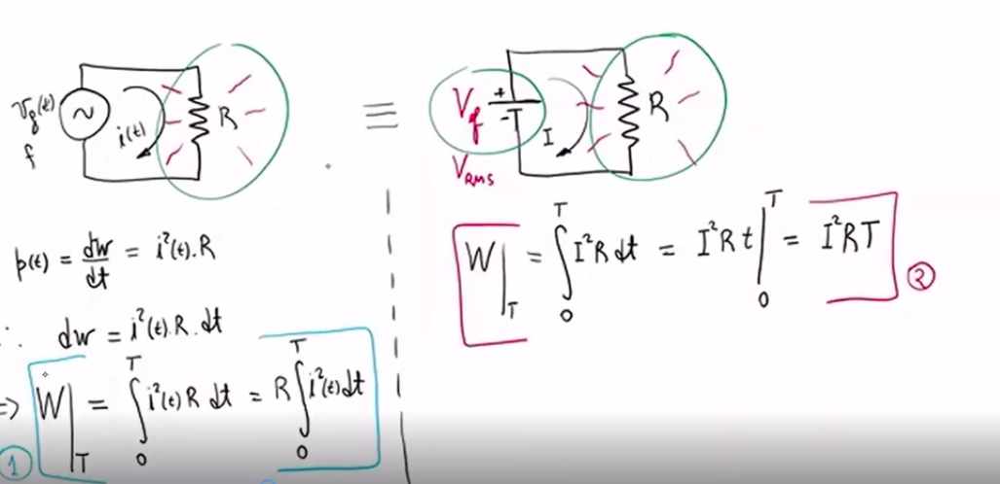
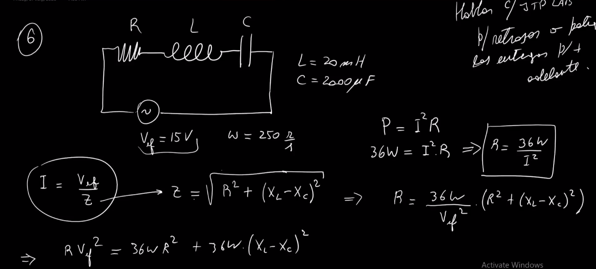
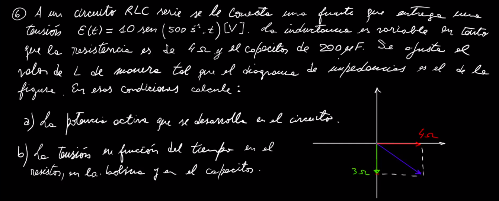

# **Corriente Alterna**
### (referencia al generador que vimos con la ley de faraday)


```python
Frecuencia: cada cuantos segundos se repitio
la signal
```
## Generador aplicado a un resistor
```python
- no existe desfasaje relativo
- lo de la derecha es un diagrama fasorial
```


---
## Generador aplicado a un inductor


---
## **Generador [COMPARACION corriente-tension]**


---

## Generador aplicado a un capacitor


## Regla **CIVIL**
```python
significa:
"CIVIL" -> que en un "[C]apacitor" 
           la corriente "[I]" siempre
           viene primero que la 
           tension "[V]" 

        -> la tension "[V]" viene 
           primero que la corriente "[I]"
           en una inductancia
```


---

## **Valor MEDIO de una señal**
```python
"VALOR MEDIO": dado una senial de alterna
buscarme un valor de continua, tal que 
implique el mismo transporte neto de carga
```


---
## Valor eficaz o **RMS** asociado a una senial de alterna
```python
'RMS': root medium square, esta asociado
a la energia, con el transporte neto de
energia.
basicamente es el valor de corriente continua (pila)
que habria que aplicar a identico resistor para
que en el mismo periodo de tiempo que se aplica
la senial de alterna, disipe la misma cantidad
de energia como hace la senial de alterna
```

```python
- justamente esto es ROOT MEDIUM SQUARE
osea, la raiz del valor medio elevado al
cuadrado
```

```python
- en un toma de una casa
el valor pico es 311[V] 
el valor de pico a pico es 622[V]
el valor 'RMS' es 220[V]
```


## y de donde salen los 220V entonces?

## y de donde sale ese 314 t?
```python
-ES LA FRECUENCIA 50[Hz] de la linea (argentina)

ojo que en usa la frecuenca es 60Hz, y entonces
el valor RMS de 110[V]
```


---

## **Circuito RLC serie**
### (NO VALE LA LEY DE KIRCHOFF aca porque es alterna)
```python
- ese angulo phi, lo que hace es separar 
la tension de la corriente

- (Vl - Vc) es la suma del vector
  del capacitor y del inductor, 
  por eso te queda arriba uno 
  mas chico del original que era 
  mas grande

- dependiendo quien gane, el circuito
  cambia el nombre, sea inductivo, 
  capacitivo o resistivo

'Vg': generador
'Vl': inductor
'Vc': capacitor
'Vr': resistor
```


## Condicion de resonancia: Z = R


## Potencia Instantanea


---
## ejercicio 5

```python
- en el de continua, el L se comporta
como un cable acordate
```


---
## Ejercicio 1
```python
-notar siempre que si no te dicen
que es una bobina ideal, tiene una
resistencia interna dada por el cobre

- aplicas trigonometria al diagrama
de potencias de abajo fijate, que se 
parte del RLC serie normal
```


---
## Ejercicio 4 

```python
- notar que este es un circutio RC, no 
hay L

-podes aplicar todo lo que es trigonometria
a los diagramas fasoriales y trabajar mecha asi
fijate como hace el profe 

- fijate el diagrama fasorial
usando la regla civil 
" en un capacitor la corriente I viene primero que V"
o adelanta en 90 grados la corriente al vc
```

Otra forma: \


---

## Ejercicio 6


  

---
## Ejercicio 8 


```python
-notar que cuando abris el modulo
tenes que fijarte con cual de las dos
partes del modulo quedarte
en este caso te quedaste con que
'Xl < Xc' porque XC va adelante


```


---
## Ejercicio final
```python
dice:
"""
a)
Un circuito en serie RLC esta conectado
a un generador de Vef = 15V
el w=250 radianes/segundos
la bobina es ideal y su inductancia es 20[mHenrios]
y la C del capacitor de 2000[uF]
calcular los valores posibles de la resistencia R para
que lograr que la potencia activa o media sea de 36[W]

b)
determine que capacidad C2 deberia tener
y de que forma deberia conectar un segundo
capacitor para que el circuito resuene con el 
mismo generador, la misma bobina y ambos 
capacitores juntos conectados de la manera
que usted considere adecuada (serie o paralelo)
"""

```

**NOTAR**: \
```python
INDUCTIVO: Xl > Xc > Xr
RESISTIVO: Xr > Xl > Xc
CAPACITIVO: Xc > ..
```


```python
sarpado, cuando pensas la resonancia
planteas que Xc = Xl , entonces te fijas
que tenes que hacer con el capacitor que agregas
para que el circuito resuene (Xc = Xl)
entonces para eso lo planteas en serie, dado que
la capacidad 'equivalente' termina siendo menor
```


---

## Ejercicio final

```python
lo hiciste en la hoja
```

---

## Otro ejercicio final


