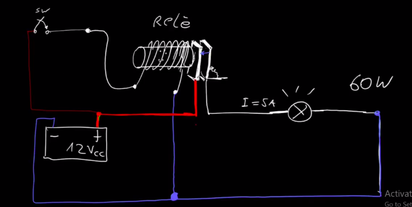
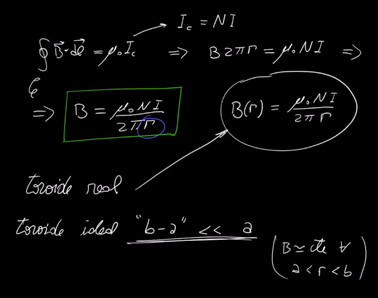
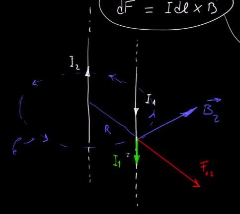

# **Ley de AMPERE**
```python
- supone dos conductores
metidos en una circunferencia
fijate que el 'I1' genera un campo B
en el 'I2' , por regla de la mano
derecha sabes como va..

luego , calculas la Fmg en el 'I2'
usando el campo que te genero el
'I1' y el 'idl2' propio del cable
y la 'Fmg' que genera el segundo cable
va a ir para el lado del cable 1
por regla de la mano derecha tmb

- va a pasar todo lo mismo viceversamente..

fijate que estas fuerzas terminan siendo
de atraccion, es decir, los cables
se atraen entre si

```


## Definicion del ampere


```python
- la definicion de AMPERE dice que 
las corrientes son iguales
entonces => I1 = I2 = I
```

---

## **Definicion de la Ley de Ampere**: analogo de la ley de GAUSS para el magnetismo

```python
- se toman positivas + las corrientes
cuando su sentido coincide con la 
regla de la mano derecha, sino, son
considerada negativas -

es decir, hace girar en el sentido
derecho la curva 'C' y fijate como
salen las corrientes, si tienen
el sentido de la regla derecha
son +

- la Iconcatenada es la sumatoria
de todas las corrientes encerradas
(parecido a gauss)
```


---
## Utilizacion de la ley de ampere
```python
utilizacion de la ley de ampere para calcular
el campo magnetico a una distancia 'R' de un 
conductor infinito donde se ha establecido
una corriente 'I'
```


```python
- fijate que estan alineados
por eso pones el cos(0) y te 
da 1
```

---
---
### Ejercicio profe
```python
- obtener campo magnetico B dentro y fuera
de un conductor rectilineo infinito
con corriente I, uniforme en toda la 
seccion del conductor
```
```python
-fijate que la curva azul es cuando
tomas la de afuera, la roja en cambio
tomas lo de adentro

- J es el flujo de corriente
es decir, flujo de las cargas
de 'I'
```


## Ejercicio 159
```python
podes usar el grafico de arriba
xq es exactamente lo mismo
```


---
## **SOLENOIDE - Ejercicio 161** - Induccion Magnetica


```python
N: numero de espiras o vueltas de cable
```
**Vista de corte**


**Planteamos ley de ampere**


**RELE**
```python
- con poca corriente , y gracias
a la induccion, puedo manejar
corrientes mas altas

- la chapita de la derecha
se atrae a la izquierda
por magnetismo

- sino pensa que tendrias que llevar
todos los cables gordos al volante
, vos lo que queres es una especie
de nanotecnologia en el interior
de tu auto
```


---
## **TOROIDE**
```python
- este no "expulsa" digamos 
el campo 'B' sino que lo tiene
todo dentro de si
```


---
## Limitaciones de la ley de ampere


---
### Ej 154

```python
- OBS: es un corte a un conductor
es como si fuera un cable y lo cortas
la imagen muestra la seccion, es decir
el corte
```


```python
- entonces, vas a ir aplicando ampere
en cada uno de los cables, haciendo
una circunferencia que justo pase por el 
punto 'p' cosa de no renegar con el radio
- aplicando la regla de la mano derecha
tenes donde va a ir cada campo 
```

```python
- quedando todo:
donde las componentes en X se van
a cancelar por la geometria
del problema
```


```python
- h: diagonal del cuadrado
- h/2: radio 
```

```python
- notar que te va a importar
solo el 'B(y)' por lo tanto
multiplicas por el cos(45)

- y como son todos iguales
multiplicas por 4 y listo
```

 
---
## Ej 158




## Ej xx - 2015

```python
OBS: aca no podes aplicar la 'ley de ampere'
fijate que el conductor no es infinito
y esta dividido en dos tramos encima
entonces aplicas 'biot-savart' tradicional
con diferenciales y chau 
```

```python
sumando ambos cambos, te va a 
quedar el 'Bp' total digamosle
```


---
