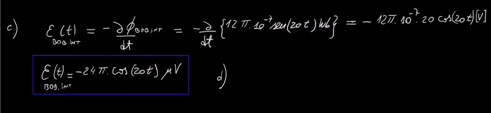

# **Autoinduccion L e induccion mutua M**

```python
- suponer que pones una corriente 'I1' en
  el primer bobinado azul, esa corriente
  va a generarte como bien sabes por ley 
  de ampere, un campo magnetico en el sentido
  que muestra el grafico y va a entrar
  por el otro lado 
  en 'C2' como bien sabes por faraday, 
  se va a generar una 'fem' y por
  lo tanto un campo magnetico que se opone
  a ese campo entrante

"FLUJOS PROPIOS:"
"Φ11": flujo propio que produce la propia
corriente I1

"Φ22": flujo propio que produce la propia
corriente I2

"FLUJOS MIXTOS":
"Φ12": flujo que influye en 1 gracias
al que genero la I2

"Φ21": flujo producido en 2 gracias
al que genero la I2
```

```python
- en este caso los campos se "contarestran"
  fijate que van en sentidos opuestos
```
### Otra vista: (dos circuitos)


---
## **Autoinduccion: L (tambien llamado inductancia)** 
### medido en [H] henrios- en honor a henry


---
## **Casos especiales en donde si se puede calcular el coeficiente de autoinduccion** 
#### (porque calcular en un circuito seria un quilombo dado a la cantidad de campos B que existen)
## 1. **SOLENOIDE**

## 2. **TOROIDE**


---
## **Induccion Mutua: M**


---
## Ejercicio 197


```python
- recordar que "M12" = "M21" es decir
  que el coeficiente de induccion mutua
  es el mismo en cualquiera de los 
  dos circuitos

- aca el flujo que te genera
  el solenoide, le va a terminar
  pegando a la bobina de adentro
```


```python
- notar que el flujo termina siendo
  el que varia, gracias a que la corriente
  tambien varia.. por lo tanto, hallar la 
  fem es derivar nomas
```



---
## Ejercicio 201 / diyuntor

```python
- notar , aca varia la corriente, vas
a terminar derivando el flujo
"""PERO NOTAR QUE LA CORRIENTE
VARIA EN 2 SENTIDOS, XQ TENES
UNA FUNCION SINUSOIDAL"""
entonces, el campo B va a variar
tambien y en distintos sentidos

- el cable ese te va a generar
un campo magnetico como bien sabes
por ley de ampere
```

```python
- se va a generar una 'f.e.m' entre
los dos cables

- el "TOROIDE" al no estar cerrado
no va a existir corriente inducida,
osea, pasa todo lo del campo opuesto de faraday
y eso, pero si va a existir una fem
```


---

## Energia que ingresa a un inductor en un dt


---
## Analisis de una rama RL - **transitorio de desconexion/conexion**
```python
- en las inductancias, hay energia almacenada
en el campo magnetico, recorda, los capacitores
almacenaban energia en el campo electrico, bueno..
el bobinado lo almacena en el campo 'magnetico'

- "OBS": fijate en el analisis de la primer malla
que la bobina esta tranquila y de pronto (cuando 
la conectas) le ingresa una corriente y se va a 
generar una variacion de flujo de campo magnetico, entonces,
ahi va a aparecer la 'f.e.m' que se oponga, generando
una corriente inducida 'contraria' a la que le entra
para asi compensar el campo generado y dejar 
tranquila a la bobina

- al principio hay una variacion muy brusca
pero luego la bobina se va acostumbrado , y
la corriente i(t) empieza a penetrar digamos
y termina habiendo un leve campo magnetico
```

```python
- el fenomeno fisico es lo ultimo: 
el tiempo en que tarda esa 
corriente entrante en establecerse
como 'peleando' vs la corriente inducida
```
---
### **Transitorio de conexion** 
#### **OJO: el profe le puso R1 a R en todos lados, vos no**


```python
t=0 : se cierra instantaneamente el switch
      la variacion de flujo es brutal, entonces
      se opone toda, el inductor se comporta
      como un 'circuito abierto' porque no
      pasa la corriente

t=inf (5tao): es como que cierro el cable porque la 
            corriente ya es normal
```
---

### **Transitorio de desconexion**: abro el switch

```python
- ACA pasa alrevez, como el bobinado
ya estaba acostumbrado a la corriente que tenia
ahora al cerrar el circuito le voy a querer 
sacar corriente, entonces, por ley de faraday
la bobina va a generar un sentido de corriente
inducida tal que agregue mas lineas de campo
entonces, la 'f.e.m' cambia el sentido para 
poder impulsar corriente en el sentido que iba
originalmente

- la 'f.e.m' termina siendo como una bateria
porque se cargo y esta devolviendo corriente
fijate al circuito cerrado, tu 'V' estaba
puesto en el switch pero lo abriste y ya
no entrega mas

- acordate que aca arranca justo como 
termino el otro razonamiento, entonces
tu corriente inicial termina siendo
i = V/R1 (que es lo que va en el limite
inferior de la integral)
y i'(t)' va a ser la final
```


```python
- notar el picotazo que se genera de -1212[V]
```

