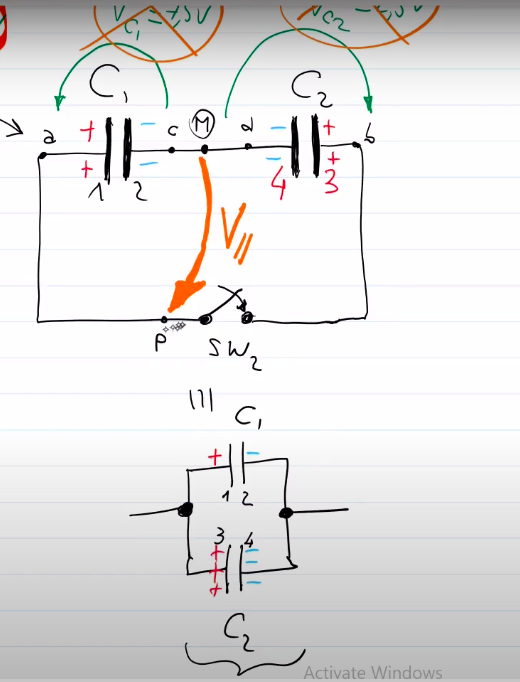
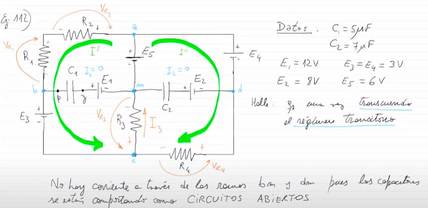
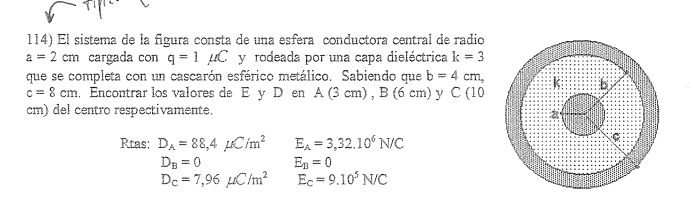

# **Capacidad** [C/Voltz] = Faradios(F)
## la capacidad es la propiedad que tiene un sistema de almacenar energia en el **campo electrico**

```python
aca 'V' se refiere a la diferencia de potencial
y no a el voltaje

- la carga se tomara siempre igual
  sea negativa o positiva
```

---
### Calculo de la capacidad de un capacitor esferico


---
### Calculo de la capacidad de un capacitor cilindrico
```python
- imaginate todo con placas, el de arriba tmb..
el cilindro de adentro esta cargado positivamente
y el que lo rodea negativamente, en el medio? 
nada, aire, mas adelante vas a ver dielectricos
```


```pyhton
- OBSERVAR: la capacidad depende
totalmente de la geometria del dispositivo
(fijate la formula)
```

---
### Calculo de la capacidad de un capacitor placas planas


```python
- aca depende del AREA (A) y la 
distancia entre las placas
mientras mas juntas estan las placas
mas capacidad tienen
```

---
## **<ins>Energia almacenada en un capacitor</ins>**
### (3 EXPRESIONES)


---

## **<ins>Capacitores en SERIE</ins>**
```python
- al cerrar el switch se induce carga positiva
en la primer placa, y negativa en la segunda
"recordar que en la rama serie, a corriente es constante"

- se induce el mismo tipo de carga entre las islas
 es decir +- +- +-

- NO PUEDE HABER MAS CARGA INDUCIDA 
  EN UN "CAPACITOR QUE EN OTRO", SINO   
  NO SE CUMPLIRIAN LAS LEYES DE KIRCHOFF
```


## **<ins>Capacitores en PARALELO</ins>**
```python
- suponer que C2 > C1, aca si el C2 
  va a tener mucha mas carga que el C1

- aca la corriente no es la misma 
  (ley de nodos de kirchoff)

```


---

### **Ejercicio 99**

```python
"ESCNEARIO 1": fijate que cerras el switch
y la fuente te va a cargar los capacitores
con la misma carga(estan en serie)
entonces q1 = q2
y el sentido de las placas queda +- +-

- la carga en cada capacitor te da '15uC'
esto quiere decir que la placa positiva tiene
'+15uC' y la negativa '-15uC' en cada capacitor

- la carga es la misma pero la diferencia
de potencial NO (xq depende de la capacidad)

```

```python
"ESCENARIO 2": 
al provenir estos dos capacitores de una conexion
serie terminan teniendo la misma carga
entonces terminan quedando los dos capacitores
en "paralelo" distribuyendose las cargas
en ambos capacitores
(si fuesen iguales no pasaria nada)
porque la "diferencia de potencial en ramas paralelas
"debe ser la misma"
entonces vos tenes que hallar la
V// que va a ser la diferencia de potencial
del paralelo 

```


```python
- la carga final esta ahi fijate
y no se puede ir para cualquier lado
entonces tiene que darte todo 30[uC]

finales:
q1' = 7,5 [uC]
q2' = 22,5 [uC]

```

---

### **ejercicio 100** : arrancan en paralelo

```python
- EL TRUCO esta en enfocarse en las islas
es decir, como queda el cable que une las placas
si quedan todas positivas, negativas o enfrentadas 
negativamente (++ , --,  +-, -+)
```
Escenario 1: \


Escenario 2: \
```python
- notar que pasa algo parecido,
si te fijas las caidas de potencial de los 
capacitores te dan 10V cada uno
y sumandolos al estar en serie estaria mal
porque daria 20V, entonces, es una conexion
en paralelo

- aca las islas quedan opuestas
entonces tenes que restar las cargas
```


---
### Ejercicio 105

```python
- el capacitor actua como fuente, es decir
  da energia pero no constante como una fuente
  y la carga que tiene se va a inducir en ambos
  capacitores
```


---

## <ins>**Transitorio de conexion de una rama RC**</ins>


**AHORA ANALIZAMOS QUE PASA EN DETERMINADOS SEGUNDOS**

```python
y en i(inf) -> se comporta como un circuito abierto
```


---
---
## <ins>**Transitorio de DES-conexion de una rama RC**</ins>
### (aca el capacitor ya esta cargado totalmente)

```python
- NOTAR que la corriente se invierte aca, es decir
  va a ir en el sentido opuesto al que se cargo
  (obviamente variable acordate, pero siempre en 
  ese sentido, porque el capacitor no es una bateria)
```

**y aca que pasa con la corriente y la tension?:** \


---

## Ejercicio 112

```python
- al decirnos "TRANSCURRIDO el REGIMEN TRANSITORIO"
  quiere decir que la corriente no existe, es decir
  que no va a circular corirente por las ramas
  que tienen capacitores, porque se comportan
  como circuitos abiertos
```



vos hallas entonces la dif de potencial entre 
V y P, y vas por el camino de afuera, porque
acordate que adentro no hay corrriente \


---
# **DIELECTRICOS**: materiales que no conducen la electricidad
```python
'Sigma': conductividad [siemens/metros]
```


```python
- notar que el campo original va del + al -
y se ve debilitado por el campo de polarizacion
del dielectrico que se opone

- en los extremos se generan cargas ligadas
  (qb - q bounded)
  en conjunto forman la sigma de polarizacion

- tambien existe la sigma free, que es la del campo
original

" SE OPONEN LOS SIGNOS DE LOS SIGMAS DE POLARIZACION vs campo E"
```

## Experiencia de faraday: inicialmente un C cargado sin dielectrico y despues le meto un dielectrico

```python
- obviamente, luego de ponerle el dielectrico
la diferencia de potencial en el capacitor
va a bajar porque como viste arriba, el campo
de polarizacion le saca fuerza al campo electrico
original
```


```python
- notar que la CAPACIDAD aumenta K veces
```
---

### Valores de K + propiedades de los capacitores 


---
## Ejercicio 113


---
## Ejercicio 132


```python
- recordar que la diferencia de potencial
entre placas de un capacitor de placas
planas->
  V = E . d (distancia de separacion)
```

```python
- notar que hay que hacer una fuerza
para mover el dielectrico afuera del capacitor

- tener las placas asi, es como tener 
un C con dielectrico + un C sin dielectrico en PARALELO
```


---

## Campo/sigma/carga de polarizacion/libre


---


## Ejercicio 114

```python
- encierro una SG gaussiana justo en 
los puntos que me piden y listo
```

```python
- recordar 
"""
(pide todo dentro del conductor)
POR LEY DE GAUSS, en un conductor
el campo E=0, por lo tanto  D=0
"""
```


---

## E y D en un cambio de medio material (falta toda esta teoria)

## ejercicio 120/122 ( falta tambien)


---
## ejercicio 123(piola)


## ejercicio 131


