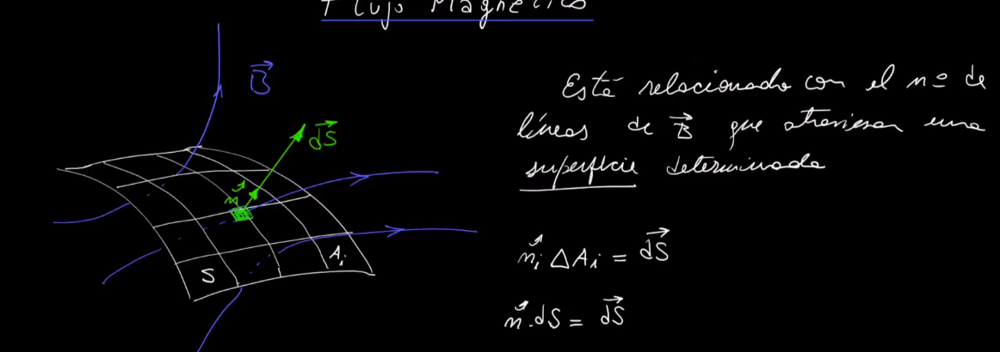
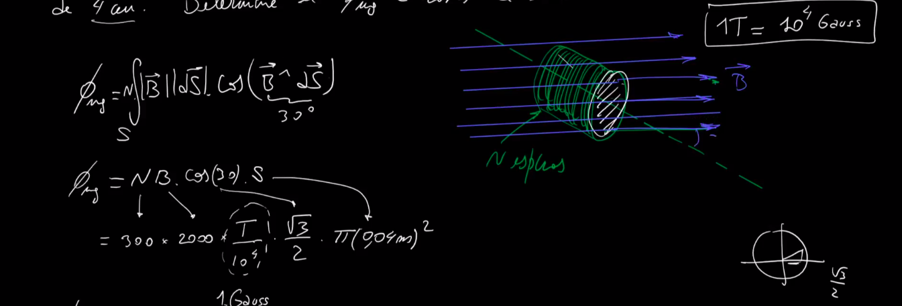
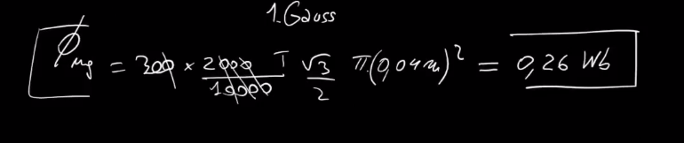
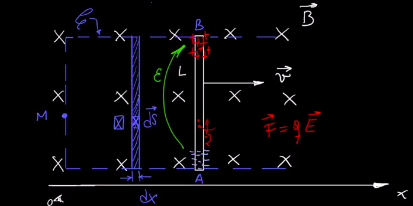
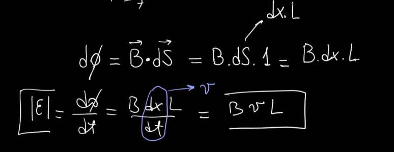
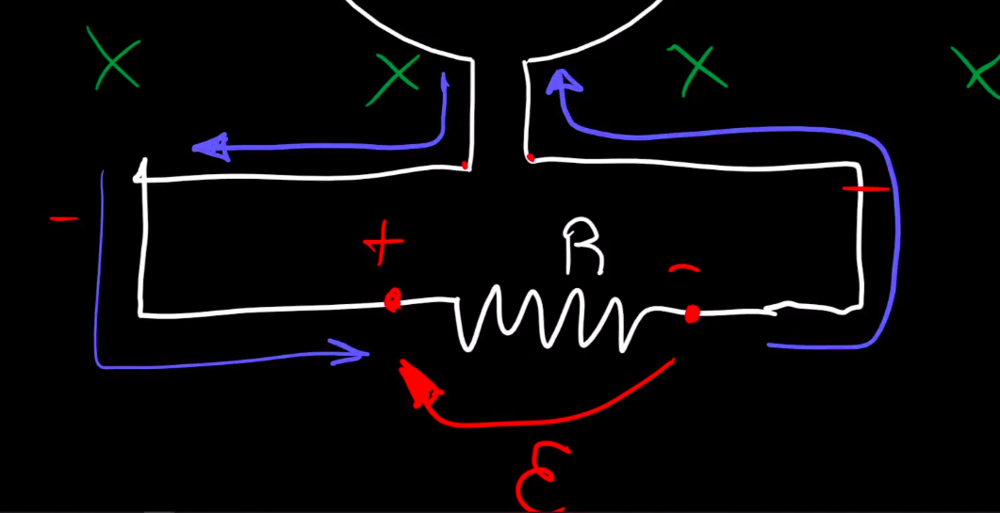
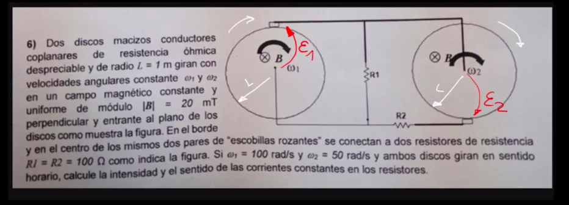

# **Flujo Magnetico**
```python
FLUJO: numero n de lineas que atraviesan
una superficie
```



---
---
```python
"ejercicio";
un campo magnetico uniforme B de 2000[Gauss]
forma un angulo de 30 grados con el eje
de una boobina circular de 300 vueltas y un 
radio de 4cm.
determinar el 'flujo magnetico'  a traves
de la bobina
```



---
## Ejercicio 170


```python
- notar que el campo varia segun el 'radio'
- tenes que tomar diferenciales de superficie
tanto como de campo 'B' porque varia. entonces
despues integras
```


```python
'dS'= CD * dr
porque vas a ir variando el radio
```

---

## ej 177

```python
NO-RESUELTO: pero tenes que hacer 
lo mismo que arriba y hacer 
superposicion , nada mas
```

---

# **Ley de INDUCCION de FARADAY**


```python
- mientras mas cerca el iman, + flujo
  fijate que le pegan mas lineas a 
  la espira
- aca no hay variacion de flujo porque
  esta estatico, pero al moverlo, 
  hay variacion de flujo
```

```python
- si metes de golpe, se encendio
  la lamparita, aca la corriente
  va a ir desde el lado derecho
  de la bobina al izquierdo, es decir
  el lado derecho.
  esto lo marca el voltimetro fijate
  (NO HAGAS CASO A - y + del voltimetro
  simplemente son dos cables)
  acordate, que sea positivo
  significa que tiene mayor potencial
```

```python
- sacando de golpe, tambien se 
  encendio la lamparita
- fijate que en el centor de la bobina
  hay aire, hay materials que conducen
  mejor el campo magnetico como teflon etc
```
### **Cuando existe variacion de flujo magnetico, se produce electricidad**
```python
CUANDO la bobina esta quieta, y se le mete
el iman en la punta, la fisica dice que 
tiene que haber un campo 'B' que se oponga
a esa variacion del flujo del iman
es como decir
"bueno vos me metes este iman? yo te genero
"un campo B que se oponga"
entonces aca tambien podes pensar el sentido
de la corriente fijate
```

```python
- esta 'FEM' es el campo 'B' que genera
la bobina para oponerse al campo magnetico
que genera el iman
acordate de pensarlo con la ley de faraday

- si disminuyo lineas que van en un sentido
el campo magnetico de la bobina debe ser 
tal que compense esas lineas faltantes
por eso cuando sacas el iman ('NS') 
el borne positivo es el de mayor potencial
```

```python
- notar que el N de la espira de arriba
es menor, por lo tanto la 'fem' inducida
es mucho de menor intensidad
```
### **Ejercicio**
```python
pensa aca lo sigueinte
"B": iman quieto metido en la espira
"DELTA B": como lo haces variar, es decir, como
lo metes

facil de pensar, """la espira esta tranqui
con su iman metido y sus lineas de campo
en cierta direccion, vos si le agregas 
mas lineas te va a decir: no para flaco
a mi dejame tranqui, toma este campo
que se opone al que me generas"""
```


### **Ejercicio**
```python
-determinar la corriente 'i2' en la bobina
del galvanometro
```

```python
-fijate que tu fuente de la izquierda
te genera un campo en sentido horario
y entonces como sabes, la bobina de la 
derecha estaba tranqui, le llega eso
y genera el campo que se opone y tambien
se establece la corriente en el sentido 
que se marco
```
---

# Ley de faraday concreta

```python
- el flujo en la ecuacion de la fem es el
flujo total
- la fem debe establecerse en un circito
- 'C' es la curva que delimita la superficie
```
**Recordar** \

```python
- si vas de un punto a un lado
y volves al mismo, la diferencia
de potencial es 0
```
---
## **Ley de induccion de faraday concreta**

```python
OBS: ese campo electrico "E'" es 
el encargado de hacer mover las cargas
de la corriente inducida que se genera
en la espira
```

### Ejercicio para entender

```python
- fijate aca se aprecia el 
campo "E'"(tambien llamado campo 
electrico inducido).. despues todo lo que vos sabes..
fijate que tiene un campo B que va incrementando
lo que quiere decir que la corriente debe ir
en sentido horario para generar el campo B
por la ley de ampere para que se oponga
al 'B'
```

### Ejercicio para entender
```python
- 'X' campo magnetico entrante 'B'
- varilla conductora que se mueve con velocidad 'v'
```

```python
OBS- """esta varilla moviendonse en el campo B
va a generar una f.e.m """
- faraday dice que tenes que tener si o si
una curva delimitante, entonces armas una 
vos
```

```python
si tenes un observador de afuera
lo que veria seria una fuerza magnetica
que surge del movimiento de la barra
con sentido para arriba, y esto va 
a poner cargas positivas arriba 
de la barra
```

```python
- entonces, esta barra va a generar
un campo electrico 
```

```python
la FEM tiene que tener un sentido tal que:
- si el circuito lo cerramos con una 'C'
por esa curva tiene que circular una corriente
inducida tal que el campo magnetico que produzca
esa corriente inducida se oponga a la variacion
del flujo, por lo tanto: 
el sentido de la corriente y el sentido de la f.e.m
"es siempre el mismo" osea fijate, cerrando
la curva y haciendo circular corriente en sentido
anti-horario vas a generar un campo 'B' que se 
opone al entrante 

- nota que aca el campo esta estatico
vos lo que estas variando es la varilla
entonces, si varias para la derecha
vas a tener mas lineas de campo, por lo que
es como si estuvieras metiendo el iman
entonces

- la f.e.m es una 'diferencia de potencial'
```

```python
al moverse la varilla en el campo magnetico
y generando ese campo electrico, termina siendo
una pila 
```
**Resolucion matematica**

```python
notar que aca solamente tenes variacion del 
circuito, no tenes variacion temporal del
campo magnetico

-planteas un diferencial de flujo con tambien
un diferencial de superficie
```


**Usando la segunda parte de la ecuacion de la fem**:
```python
notar que en la parte izquierda del circuito 
no existe velocidad
- sen en productos vectoriales
- cos en productos escalares
```


**Usando la primera parte de la ecuacion de la fem**:
```python
- como arriba, el campo "E'" no esta en 
la primera parte del circuito
```


---
### Calculo de potencial Vb - Va
```python
"CAMPO COULOMBIANO": "Ec" -> de + a -
"CAMPO INDUCIDO": "E'" -> de - a + (el que mueve las cargas)
```


---
## Ejercicio 185


**Otra forma** \ 


---
## Ejercicio 189

```python
- facil, pensa que aca tenes como
dos barras, porque tu eje esta en el centro
entonces, en ambas areas de las barras fijate
vas agregando lineas de campo entrante
entonces pensas la corriente que vaya 
en anti horario para que genere un campo
que se oponga
```


---
## Ejercicio 183


```python
"B") - hallar la fuerza necesaria para
mantener la barra en movimiento??

obs: si no hay corriente inducida circulando
por la barra, la 'Fext' no existe, es decir
la barra se mueve tranquilamente con velocidad
'v' sin pelear contra nada.. 
pero si hay corriente, se origina la 'Fuerza Magnetica'
que es la que "chupa" digamos a la barra hacia
la izquierda
(fijate, esto es de lo primero que viste, tenes
el campo entrante y el elemento 'Idl' de corriente
hacia arriba, haciendo regla de la mano derecha
te da para <-- , entonces, tu 'Fext' debe ser 
igual que la 'Fmg') 
```

```python
- como es valida la ley de OHM
fijate que aca tenes un circuito con
una 'R' y un 'V' (tu f.e.m) , entonces
la corriente circulante va a ser 'E'/'R'
```

```python
"C") basicamente comparar la potencia 
de la resistencia y la potencia mecanica
```


---
## Ejercicio 184

**Situacion inicial**: no hay flujo ni nada en la espira \

```python
- a medida que metes la espira, se va 
a producir una f.e.m y una corriente
- aca tu curva 'C' es el propio circuito
```
**Metiendola un toque** \

```python
- cuando entre toda, va a estar 
llena de flujo, por lo tanto
el flujo va a ser constante
(solamente por 1 cm, entre 4 y 5 
va a ser constante)

- fijate que la fem se origina
solamente en la posicion vertical
(acordate que es como una 'pila')
entonces, ya con eso vas a tener
corriente en todo el semi-circuito
metido en el campo 'B'
```

**Metiendola toda** \

```python
-notar que aca no va a existir
f.e.m ni corriente, porque 
no tenes variacion de area ni 
de flujo -> no existe corriente
inducida ni fem

(no le des bola a las fems aca)
```
**sacandola** \

```python
- aca la corriente cambia
el sentido a horario, facil
de pensar tmb

- en el ultimo tramo la pendiente
se torna positiva porque el 
flujo esta disminuyendo
(- * - = +)
```

**Grafico de la F.E.M**: \


## Ejercicio 181

#### Un mejor dibujo: \

```python
se puede pensar que el solenoide
termina siendo un iman, fijate que 
genera un campo 'B' en su eje
y le termina pegando a la espira
```

```python
- el sentido de la corriente
termina siendo" anti horario" fijate, 
es como lo que viste al principio
la espira esta tranqui, le llega
una variacion de flujo entrante
y esta tiene que oponerse, entonces
si la corriente va anti horario
(dedo indice) el campo inducido
tiene que contraponerse al entrante
```
### **b) si la espira estuviera abierta, cual seria el extremo mas postivo? a o b?**
```python
bueno, tambien parecido a lo que venimos haciendo
para esto hallas la 'f.e.m' ,  
la fuerza electromotriz es la encargada
de cargar o levantar las cargas
entonces para que circule anti-horario
tiene que ir para abajo, es decir
'Vb > Va'

"TRUCO" imaginate si la corriente circula
asi en un circuito abierto, es como que 
las cargas son corredores de maraton 
y si va en sentido anti horario, 
terminan yendo de A hasta B, entonces
se acumulan todas en B, por lo 
```


**OTRO TRUCO** \

```python
- supon que metes una resistencia
y sabiendo el sentido de circulacion
vas a saber que la caida de potencial
de la resistencia siempre es en sentido
opusto a la corriente, por lo tanto, 
esto es la fem
```
### **LISTO KING**

```python
LISTO PAPA, facil, la fem 
apunta la flecha a donde se concentran
todas las cargas, asi de simple
sentido? me chupa un huevo el sentido
fijate que la podes dibujar de las 
dos formas
```
otro ejemplo: \


---
## Ejercicio 192 - **variacion del flujo**

```python
- aca varia el "flujo" no la superficie
como veniamos haciendo, varia en el tiempo (t)
y como la formula de la 'f.e.m' es onda 
una derivada, derivas la funcion del flujo y listo

- obs: nota la funcion del flujo, si aumentas
el 't' el flujo va a aumentar, entonces el flujo
va aumentando metiendose en el sentido que 
esta presentado
```

```python
- entonces , como siempre, la espira
debe circular corriente anti horario para
poder producir el campo que se oponga
```

```python
- entonces la f.e.m como siempre, apunta
a donde se acumulan las cargas, o haciendo
el truquito de la resistencia (que aca 
ya te la dan fijate)
```
---
## **Generador electrico**
```python
la idea del generador es todo lo que es 
la ley de faraday, fijate que esa espira rota
en centido horario, entonces, vos pensa esto:
a medida que la espira rota, llega un momento
que el flujo es maximo, y cuando sigue rotando,
ese flujo se va disminuyendo (en el sentido rojo)
entonces, como estudiaste en faraday, la corriente
en la espira tiene que ser tal que ayude a ese
flujo a no perderse
espira:" yo estoy re tranquila con mi maximo flujo
"no me saquen lineas de campo, toma , ayudo con mi campo"
despues obviamente pasa lo contrario

- varia el area de la superficie, osea, 
se mueve y pegan mas o menos lineas de campo
```


---
## Todo explicado en un grafico
```python
0: el flujo es maximo porque la espira le da
   toda la cara, es decir , cos(0) = 1

- la pendiente de la recta tangente
es la f.e.m
```

---
## Aplicacion de la ley de faraday -
## **Eddy currents**: corrientes producidas en el metal
```python
- estas paletas que vas a ver, son de 
  "ALUMINIO" el aluminio, es un material que 
  no es magnetico, quiere decir que si yo
  le acerco un iman, no se generan atraccion
  ni repulsion (lo mismo el cobre)

- lo del eje es un iman

- fijate como al pasar las plaquetas se
  frenan

- imaginate esas plaquitas como un conjunto
  de infinitas espiras, que te llenan todo
  el elemento

```


```python
"SOLIDO": se clava de golpe: fijate que
va a generar alto campo magnetico opuesto
"REJILLA": se clava, pero pasa un poquito de largo
buen campo magnetico pero no tan fuerte como el 
primero dado que esta todo separado
"REJILLA no-encerrado": nunca se clava, tenes re 
poca area porque la reduciste banda cortando
las patas
```

---
## Ejercicio final piola

```python
- aca el truco esta en acordarte de encerrar
la barilla en una curva de 'faraday'
y olvidarte de que es un disco girando, porque
basicamente es lo mismo
entonces al encerrarla en la curva de farady
vas a saber el sentido de la fem y asi el de 
la corriente

- un disco es una 'SUCESION DE VARILLAS'
podes imaginarlo asi
```


