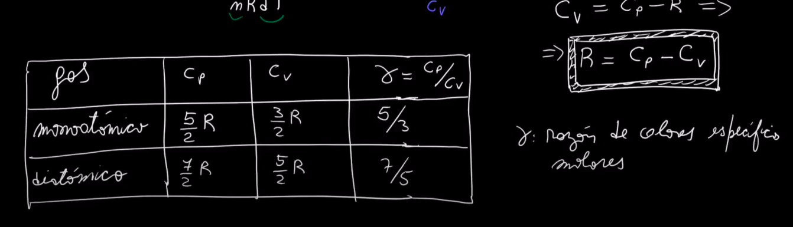

# **Termodinamica**


---
## **1 Ley de termodinamica**:


```python
"si el sistema adquiere calor": el Q>0
"si el sistema cede calor": el Q<0
"si el sistema realiza trabajo sobre el entorno": W>0
"si el entorno realiza trabajo sobre el sistema": W<0
```


---
### ecuacion de estado del sistema


## equilibrio de un sistema


## Reversibilidad de las transformaciones


---
## Ecuacion de estado del gas IDEAL


--- 
## **CLASIFICACION**


### trabajo en sistema termodinamico


---
## <ins>**Proceso Isobarico**</ins> (P=cte)

```python
i: inicial
f: final

cada posicion en el eje cartesiano
es un estado del sistema

- el area bajo la curva es el 'trabajo'
```

## <ins>**Proceso Isotermico**</ins>(T=cte)


## <ins>**Proceso Isocorico**</ins>(V=cte)


---
# **Primer principio de la termodinamica**



---
## Ejercicio 19
```python
el sistema llega del estado al estado b a lo largo
del camino 'acb' 
se entrega al sistema un calor de 80J
el sistema realiza 30J de trabajo

a) cuanto calor recibira el sistema 
a lo largo del camino 'adb' si el trabajo
que realiza fuera de 10J

```


```python
el sistema vuelve del estado b al estado a
por un camino curvo
```


```python
c) hallar el calor absorbido en las transformaciones
'ad' y 'db'
Ua = 0
Ud = 40J
```

