# Analisis de protocolo
no es mas ni menos que un protocolo en el cual el experto habla en voz alta y se traen los datos

# Etapas
## 1. Grabacion del protocolo
```go
- El Ingeniero en Conocimiento explica lo que espera del experto
y le dice todo lo que espera, el objetivo, lo que tiene que informar
y que instrucciones debe darle

- Puesta en situacion: se le proponen ejercicios al experto para darle confianza.

- Registro del protocolo: finalmente grabacion del protcolo con el experto
```

> ejemplo:
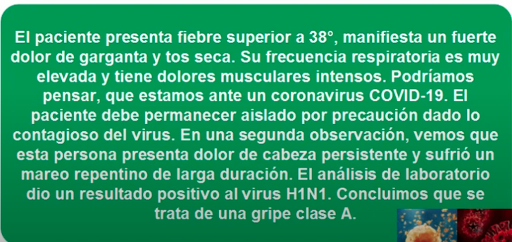 

## 2. Transcripcion
> Se segmenta por lineas
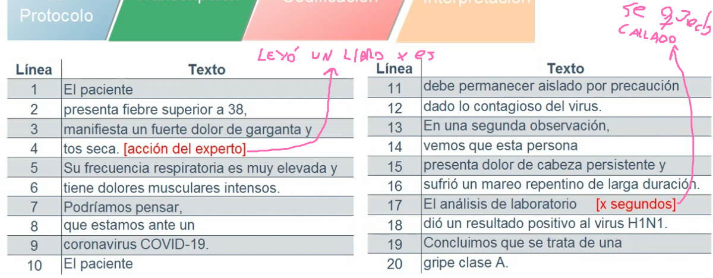 

Se carga **todo** hasta que hizo el experto `{accion del experto}` o los segundos que espero o estuvo callado `{x segundos}`


## 3. Codificacion
Etapa mas importante

```go
"Identificacion de conceptos caracteristicas, valores, relaciones y operadores":
la onda esta en tomar todo como una clase y esta tiene caracteristicas
y valores
```

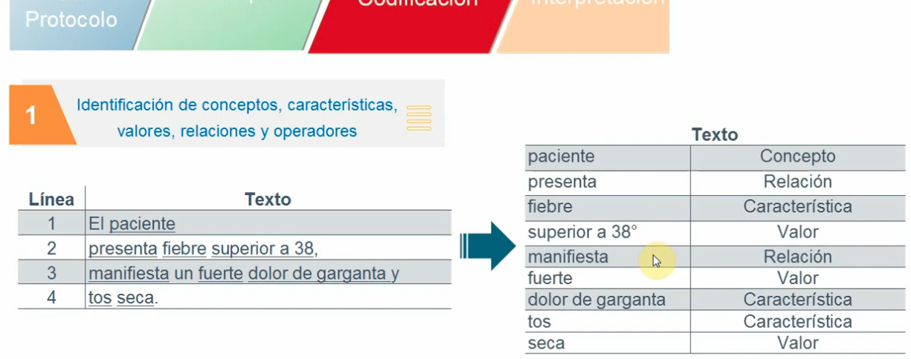 
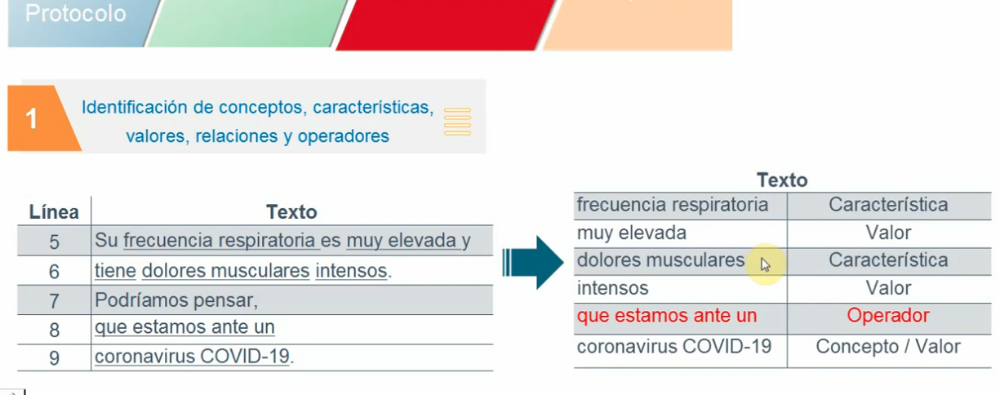 
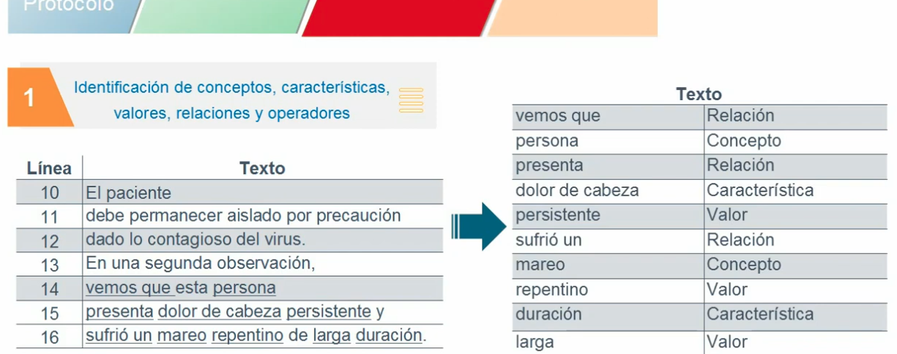 
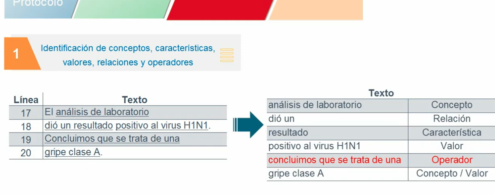 

> :warning: Pero esto es un kilombo papa, como lo ordenarias? asi:
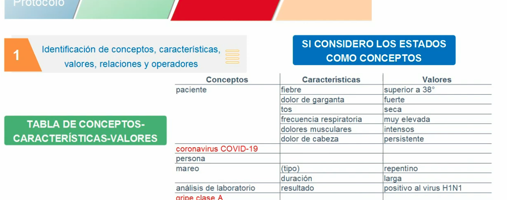 

> Nos decia "tiene un mareo repentino" entonces que pasa aca? porque repentino no nos dieron las caracteristicas, entonces se incorpora lo que se llama como:

**CARACTERISTICA IMPLICITA**: deberias poner `tipo` para el mareo y asi llenar si es repentino o no.

- No tiene que haber **huecos** 

- A los estados se les puede considerar como Valores o como Conceptos, es indiferente, osea podrias haber puesto coronavirus como valor

### Relaciones implicitas
Aquellas que se dan entre **conceptos**.

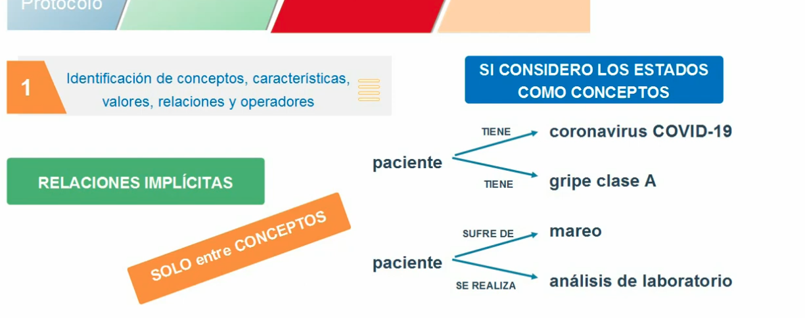 
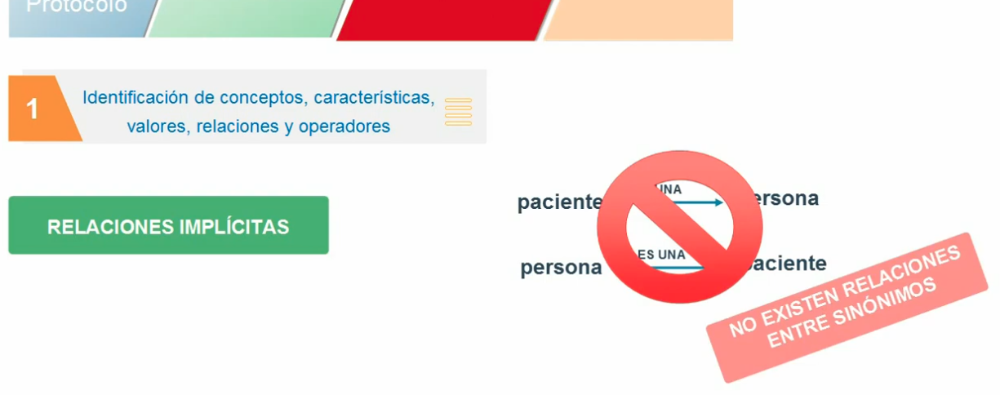 

---

```go
"Identificacion de la busqueda":
no hay que buscar nada, sino que se identifica los estados 
por el cual el experto paso dentro de su proceso de razonamiento
y los operadores que utilizo como asi tambien las condiciones que
tuvo en cuenta para llegar a esos estados
```

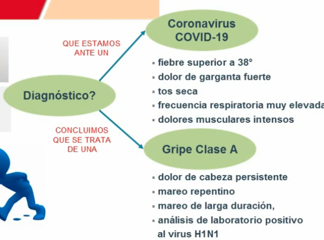 

> Ahora identificamos metacomentarios, sinonimos e incertidumbres.

### Sinonimos
paciente y persona, por ejemplo.

### Metacomentario
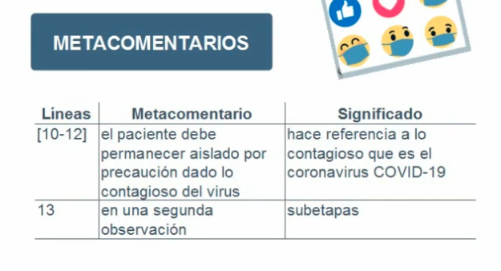 

aquellos comentarios que el experto hace y no aportan informacion **directa** a su razonamiento.

osea el objetivo era ver el diagnostico del paciente, y esto nos esta diciendo lo contagioso que es el virus.

### Incertidumbre
> "Podriamos pensar que se trata ..."

el estado del que hablo el experto 

## 4. Intepretacion
```go
Se identifcan las reglas de razonamiento del experto
```

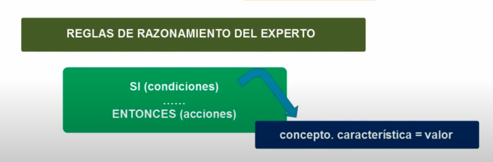 

hubo dos diagnosticos, entonces aca habria dos reglas:

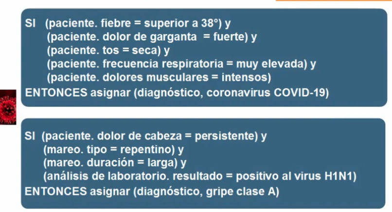 

y aca finaliza todo.