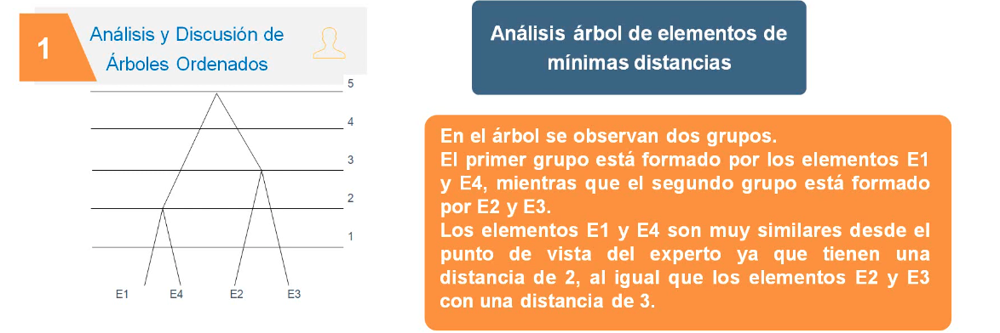
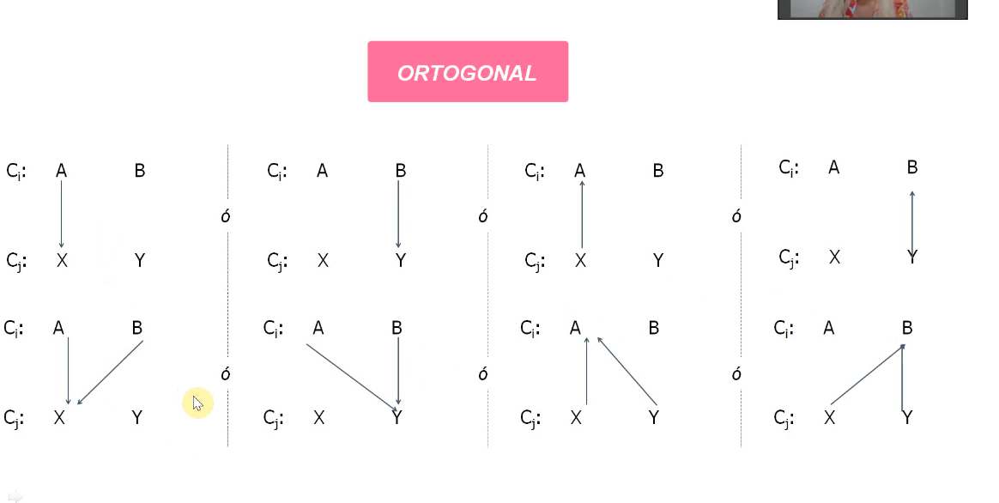
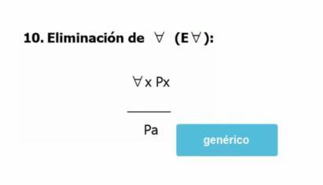

# """Inteligencia artificial"""
f
## Emparrillado
```go
- Tecnica para conocer el conocimiento de un experto, es una tecnica de educcion
que vincula una lista de elementos homogeneos y representativos sobre la base de un conjunto bipolar de caracteristicas.

- es considerada una tecnica intrusiva e incompleta (porque habla
de lo que el experto sabe)

- usada sola no es util para la construccion de una BDC
```

### Etapas
```go
* Identificacion de los elementos
* Identificacion de las caracteristicas
* Disenio de la parilla
* Formalizaacion
* Interpretacion o analisis de resultados
```

## Ejemplo ejercicio
### 1. identificar los elementos
objetivo del protocolo:
> "Identificar un diagnostico segun los sintomas que presenta el paciente analizado"

area de interes dentro del conocimiento del experto:
```go
sea E: elemento

E1: coronavirus covid-19
E2: coronavirus mersv-cov
E3: coronavirus sars-cov
E4: coronavirus 229e
```

### 2. clasificacion de las caracteristicas
```go
sea C: caracteristica (*notar los valores bipolares)

C1: frecuencia respiratoria (alta/baja)
C2: fiebre (alta/baja)
C3: intensidad del dolor de garganta (intenso/leve)
C4: intensidad del dolor de cabeza (intenso/leve)
```

### 3. Disenio de la parrilla
la parrilla identifica es la relacion entre estos elementos y caracteristicas

y se arma una matriz bidimensional


entonces construimos una parrilla evaluativa:

```go
recordando:

E1: coronavirus covid-19
E2: coronavirus mersv-cov
E3: coronavirus sars-cov
E4: coronavirus 229e

C1: frecuencia respiratoria (alta/baja)
C2: fiebre (alta/baja)
C3: intensidad del dolor de garganta (intenso/leve)
C4: intensidad del dolor de cabeza (intenso/leve)
```


esto se lee de la sigueitne forma:
> el elemento `E1` tiene un "grado 2" de la satisfaccion de la caracteristica `C1`

### 4. Formalizacion
#### a. clasificacion de los elementos

Es hacer calculos en esa matriz

lo que se hace es basicamente hacer otra matriz calculando las distancia entre los elementos de la matriz, por ejemplo `E1` y `E2`


> Notar que la matriz queda simetrica triangularmente arriba, entonces no hace falta calcular todo lo otro

> LA DIAGONAL PRINCIPAL NO SE CALCULA, VA, ES `0`


Una vez calculada la matriz -> **tomamos el minimo valor y fusionamos esos dos elementos** (si fuera max, tomariamos el mayor)

 

y construimos el arbol en funcion de las minimas distancias y el nivel donde se agrupan

 

#### b. clasificacion de las caracteristicas
Ahora hay que construir una matriz que relacione las caracteristicas

-> primer paso: llenar la matriz triangular superior y es todo igual

 

 

 

 

 

 


### 5. Interpretacion o analisis de resultados
es analizar esos dos arboles de mierda

 

 

 

 

 

 

 

 

---

# Logica proposicional
 

> cuando hay puntos, son `Y`.

> los "por lo tanto" se convierten en `->`

 

Esta logica nos queda re chica paras las AI, entonces no vamos
a utilizar esta logica de mierda que ya repasamos, vamos a usar otra logica un poco mas compleja, llamada:....

## Logica de primer orden
 

#### Variables
`X` podria aser una persona, es una variable generica

#### Constantes
`d` es "Diego" , representa a una persona en particular al conjunto de personas.

### Funciones de verdad
 

## Ejemplo 1 logica de primer orden
Igual que la logica normal, primero vas sacando elementos.
- habla de serpientes, entonces ahi tenes una S(x)
- habla de reptiles, ahi tenes un R(x) tambien
- habla de que algo es venenoso o no, entonces ahi podes poner V(x): no rd brnrnodo


 

```go
TRIX R 4 KIDS

" las serpientes " -> habla de todo
" algunas " -> ∃
" existen algunas que no son venenosas" -> intersectas (Sx ∧ Vx)

# operadores
∧
∨
∀
∃
→
```


### Ejemplo 2

 

```go
Notar que haces una funcion con 2 variables aca

esto se leeria

" 
si X es una rosa (Rx) 
entonces (=>) 
esa rosa tiene una y = (T(x,y))
y esa y es una espina = (∧ Ey)
"
```

### Ejemplo 3
Aca te das cuenta que la onda es hacer funciones genericas, como en este caso

`T(x,y) = x traza y`

entonces la podes usar para varias cosas fijate, ese Y puede ser un circulo o una figura, entonces te sirve despues.

> notar que "son" o "es" se traducen como entonces `→`

> cuando hay un `.` todas las variables se pueden resetear

> cuando hay un existe `E`, no hay que usar "entonces" `→`, y usar la interseccion

 

# Deduccion Natural
 
Vamos a ver que hace el motor con la logica.

Primero vamos a necesitar un conjunto de **HIPOTESIS** para hacer una **TESIS**.

## Reglas que necesitamos
### 1. introduccion a la implicacion (II)
 

> "Si al llegar una determinada etapa de la deduccion nos interesa demostrar que `A` implica `B` entonces se debe **SUPONER**`[SUP]` `A`"


### 2. Modus Ponens o Elminiacion de la implicacion (MP / EI)
 

> "Si en dos lineas determinadas aparecen las formulas de `A` y de `A->B` se puede escribir simplemente `B`"

### 3. Introduccion a la concjuncion (IC)
 

> "si en dos lineas determinadas aparecen `A` y tambien aparece `B` en una linea posterior se puede escribir la interseccion

### 4. eliminiacion de la conjuncion (EC)
 

### 5. introducion de la disyuncion (ID)
 

> "Simplemente agrego la formula que me sirve para seguir con la deduccion natural"

### 6. eliminacion de la disyuncion (ED)
 


> "una vez dada o deducida una disyuncion `A v B` se trata de comprobar si suponiendo cada uno de los terminos (por un camino primero A y por otro despues B), si por ambos cambinos se obitene el mismo resultado C, entonces se puede escribir todo como `C` porque no tenes certeza de cual es verdadera, asi que la reemplazas asi"

### 7. introduccion de la negacion (IN)
 

> "Suponiendo una formula `A` se llega a una contradicicon, en una linea posterior se puede escribir la negacion de `~A`"

### 8. eliminacion de la negacion (EN)
 

### 9. introduccion del para todo `∀` (i∀)
 

> "Se puede aplicar si A es 'generica' es decir, si no esta en ningun otro supuesto previo que la restrinja"

### 10. eliminacion del para todo `∀` (E∀)
 

> "Si de un conjunto se puede afirmar algo universalmente, como "todos estudiamos" entonces lo mismo se puede afirmar para un elemento de ese conjunto, por ejemplo "jorge estudia"

### 11. introduccion del existe `∃` (I∃)
 

> "Si se establece que un elemento tiene una propiedad, entonces existe un elemento de ese conjunto que la cumple, se puede partir de una generica o restringida, no importa"

### 12. eliminacion del existe `∃` (E∃)
 


# Deduccion natural (metodo) - ejemplos
## Ejemplo 1
 

y luego ir viendo que regla podes aplicar

en el ejemplo podemos:
- elminar los paratodo
- eliminar los existe

> SOLAMENTE SE PUEDE HACER UNA SUPOSICION `[SUP]` EN EL METODO

## Ejemplo 2: la hipotesis no tiene una implicacion
en este caso **NO PODES SUPONER NADA** porque no hay implicacion.

 

# Resumen Logica
 

