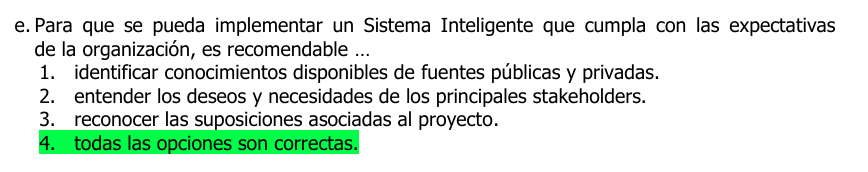
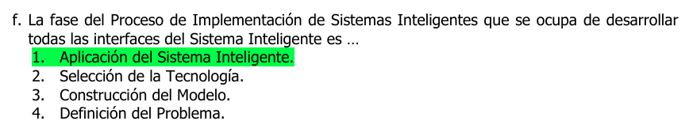
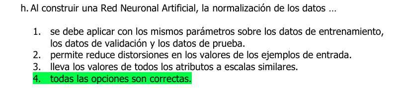
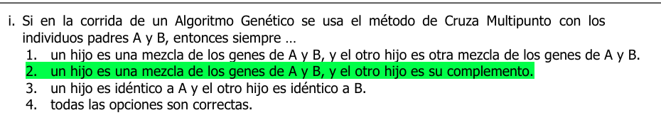
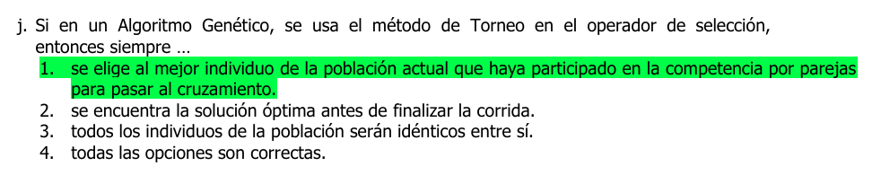
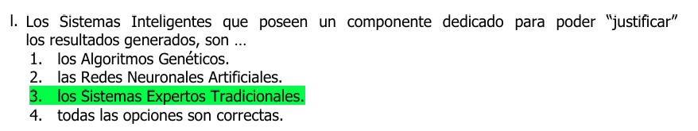
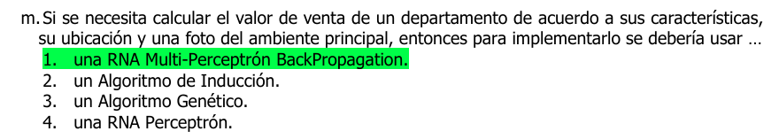
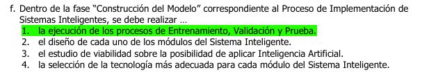
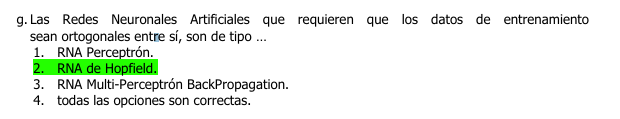

# Sistemas """""inteligentes""""" 
> _segun los profes_

 
```go
Todas son correctas porque:
1. super crucial tener una base de datos solida
y variada para permitir al sistema funcionar piola
2. esto nos aseguraria que el sistema va a ser util para 
los posibles usuarios o los uqe interactuan con el o los que 
se beneficiaran de sus funciones
```

---

 
```go
mas facil, estudiemos las fases:
- Definicion del problema: identifica y entiende el problema 
que el sistema tiene que resolver, implica comprender 
requisitos de negocio, limitaciones, etc.

- Seleccion de la tecnologia: elegir las herramientas, plataformas, tecnologias
lo que fuese, mas adecuadas para el desarrollo del sistema

- Construccion del modelo: desarrollar los modelos de IA, que pueden incluir 
algoritmos de aprend automatico, redes neuronales, entre otros.
(aca se entrena y se validan los modelos)

- Aplicacion del sistema inteligente: implementar el sistema en el entorno **Real**,
seria como armar el wrapper para usar el modelo, interfaces, UI para usuarios, etc.
```

---

 
```go
literalmente todas las opciones te dicen xq es importante normalizar.
siempre se trata de manejar dato sde manera consistente en todas las fases del 
prceso.
la normalizacion nos ayuda a que los valores de los datos enten todos en una escala similar
lo que puede reducir la influencia de otros valores con diferentes escalas, lo cual
podria generar distorsion
```

---

 
> (abstraction on this one)
```go
"Cruza Multipunto": metodo para seleccionar puntos de cruce a lo largo de la longitud
de los cromosomas de los padres y luego intercambiar los segmentos de genes entre 
los puntos de cruce para producir dos nuevos hijos.
```

---

 
```go
"Metodo del torneo": estrategia para seleccionar individuos para la reproduccion.
Se elijen al azar varios individuos para competir en un torneo.
los individuos compiten entre si, el ganador es seleccionado para reproducirse 
y pasar sus genes a la siguiente generacion.
(generalmente se elije el que mejor valor de aptitud tenga)

y luego los individuos seleccionados como ganadores se someten a operadores geneticos
coomo el cruzamiento y/o la mutacion para producir descendencia, que forma parte 
de la nueva generacion.
```

---

 
```go
La capacidad de justificar los resultados es una característica fundamental de los 
sistemas expertos, ya que permite a los usuarios entender cómo se llegó a una 
conclusión particular y evaluar la confiabilidad y la validez de esa conclusión.

y como "justifican esto"? bueno, por ejemplo:
usando el "Razonamiento basado en reglas": Los sistemas expertos suelen utilizar un 
conjunto de reglas que representan el conocimiento experto en un dominio específico. Cuando 
el sistema aplica una regla para llegar a una conclusión, puede explicar cuál regla se 
aplicó y cómo se relacionan los datos de entrada con esa regla.
```

---

 
```go
la razón es que una Red Neuronal Artificial (RNA) con una arquitectura de Multi-Perceptrón y 
entrenada con el algoritmo de retropropagación (BackPropagation) es capaz de manejar datos
complejos y extraer patrones significativos de múltiples tipos de datos, como 
características estructurales del departamento, datos de ubicación y análisis de imágenes 
de la foto del ambiente principal. Esta arquitectura puede aprender de los datos de 
entrada y ajustar los pesos de las conexiones entre neuronas para predecir el valor de 
venta del departamento.
```

---

 

```go
este es bastante intuitivo, fijate, ojo a la palabra diseniar, confunde
el disenio se haria en una etapa anterior, los estudios y la seleccion tambien, entonces
el construirolo es simplemente ejecutar todos los procesos para ir creando el modelo
```

---

 

```go
las Redes de Hopfield utilizan la ortogonalidad de los patrones de entrenamiento para minimizar la interferencia entre los patrones almacenados, mejorando la capacidad de la red para recordar y recuperar los patrones de manera precisa. La ortogonalidad asegura que los patrones sean más fácilmente distinguibles entre sí dentro de la red.
```