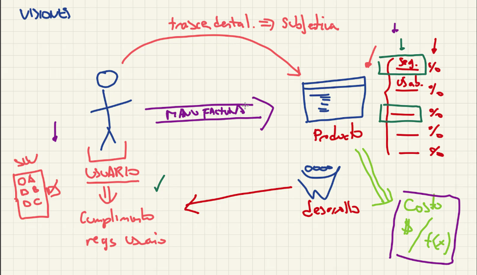
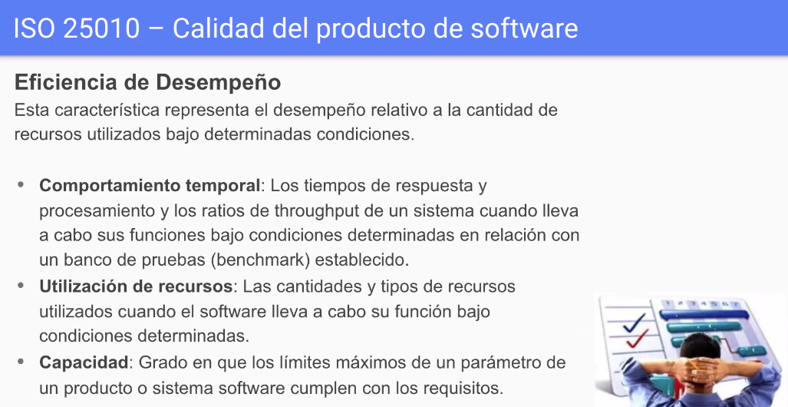
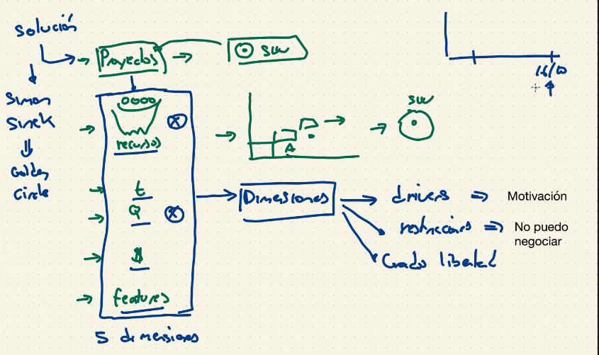
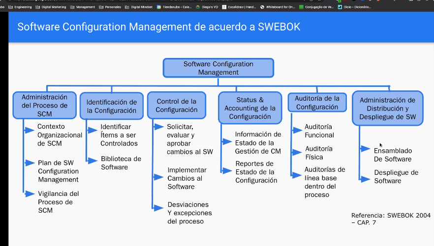

# Ingenieria de Software [K4571] - Software Engineering
## Monday - Night
- 1er Parcial: 14/11
- 1er Recuperatorio 1er Parcial: 28/11
---

# Clase 1
leer para la proxima clase 
- Classic Mistakes Enumerated (2008)

# Clase 2
- Bullet Proof? no existe, no existe tecnologia que nos resuelva un problema sin complejidad, puede haber mejores o peores, pero una que solucione todo? imposible.

## Diagrama Causa - Efecto
 

## Software Quality
 

**"Aquel software que cumple con los requerimientos explicitos e implicitos, esperados por alguien.. tanto las que dijo como las que no dijo."**

- Todas las soluciones son correctas porque todas hablan en referencia a un punto de vista (cliente, programador, persona, jefe)
- La calidad es **subjetiva**

## Visiones de la calidad de software
 

- **Transcedental**:(vision subjetiva) dice que un elemento es de calidad solo por cumplir con ciertas expectativas que la persona tiene, es simplemente por la percepcion que la persona tiene. `(e.g: Iphone o Samsung?)` si yo te pregunto cual es el mejor, estas expresando el resultado de toda la experiencia que tuviste y valoran uno sobre otro sin saber la explicacion correctamente del porque. Se considera por la experiencia.
- **Costo/valor**: mira la parte economica del escenario.. define que el software es de calidad si maximizo la relacion costo/beneficio o funcionalidades, eso dice que por una diferencia de 1 dolar al mes, tengo GMAIL.. eso me da disco gratis, correo, autogestion.. si yo tuviese que contratar a una persona que haga esto me saldria mas caro, entonces prefiero google.
- **Manufactura**: dice que el software es de calidad si el proceso por el cual se construyo fue de calidad, aca entran los procesos, como CMMI, HIL, etc.. hace referencia al proceso que yo segui para hacerlo. Es la que engloba todo el desarrollo, atributos de calidad y aspectos tecnicos del software. (mayormente), los ingenieros los que mayor trabajan son trascedental y manufactura.

---

## Calidad de producto
 

## Calidad del producto software
 

### Adecuacion funcional
 

- La que mas se acerca a la vision del usuario

### Eficiencia de desempeño-performance
 

Sabes bastante, acoradte.. uso del cpu, memoria, almacenamiento etc

- Desempenio: performance

### Compatibilidad
 

- compatibilidad tambien referido para interactuar con otros softwares
- se puede medir con la cantidad de aplicaciones que interactuas y cual es el esfuerzo que abria que colocar entre ese enchufe que vas a hacer
- uno es mejor que otro cuando tenes menos esfuerzo que el otro

### Usabilidad
 

---

### Fiabilidad
 

- Madurez: referida mayormente a los errores/fallos actuales del sistema
- Disponibilidad: el famoso "uptime", sabes lo que es .. se mide en tiempo que la app esta andando.
- Tolerancia a fallos: a ver que tanto se la banca tu software cuando te vas de la cancha, o pasa una operacion que no tenias prevista.. la tolerancia a fallos habla de que podes seguir operando a pesar de ese fallo no contemplado. esta muy relacionado con la `ROBUSTEZ`
- Capacidad de recuperacion: es la capacidad capaz medida en porcentaje de cuanto te recuperas en caso de una caida

### Seguridad
 

- El no-repudio es como el doble visto en whatsapp, eso implica que nadie puede negar que alguien leyo el mensaje..
- Responsabilidad: `logs`
- Autenticidad: doble factor, fingerprint, y demases metodos para verificar que alguien es alguien. 

### Mantenibilidad
 
 

- Modularidad: que tan facil es tocar algo en un solo lugar y que no tenga que tocar en todos los lados.
- Reusabilidad: que tan facil es usar algun componente que hiciste


### Portabilidad
 

- Anazalibilidad: que tanto esfuerzo tenes que hacer para encontrar el error, parte del codigo, o lo que fuese. que tanto te cuesta "identificar", como te paso en los ventis
- Adaptabilidad: cuanto tengo que tocar para algo que corria ne un lugar y tengo que hacerlo correr en otro
- Portabilidad: capacidad de un producto/componente para poder ser movido, transferido, de un entorno/ambiente a otro con el menor esfuerzo posible.

---
# Calidad de procesos
## Modelos de calidad de proceso
`cmmi, cmi, capability maturity model integrated`
 


## Areas de proceso - Process Areas - CMMI
 

## Proceso maduro y proceso inmaduro
 

## Modelos de calidad de proceso
 
 

---
## Clase 3
## The five dimensions of a software project
 

There are five dimensions that must be managed on a software project: features, quality,

cost, schedule, and staff (shown in Fig. 1). These dimensions are not all independent. For exam-
ple, if you add staff, the schedule may be shortened (although not necessarily), and the cost may

increase. A more common trade-off is to shorten the schedule or add features, and sacrifice qual-
ity. The trade-offs among these five dimensions are not simple or linear. For each project, we

need to decide which dimensions are critical and how to balance the others so we can achieve the
key project objectives.

An important aspect of this model is not which of the five dimensions turn out to be driv-
ers or constraints on any given project, but that the relative priorities of the dimensions be negoti-
ated in advance by the project team, the customers, and management. All five cannot be drivers,

and all five cannot be constraints. This negotiation process helps to define the rules and bounds of
the project. As in most games, we can play according to any set of rules, but all of the players
must understand and agree to the rules that are in effect at any particular time.

## Good Enough => calidad, 'suficientemente bueno' tiene 3 dimensiones
 

- Que seria ser good enough en un software que queremos para el dia de la madre? (hoy sep 12)--> dia de la madre 16 octubre: no puedo tener todo maximizado aca para cumplir el objectivo.. good enough empieza a ser un concepto en el cual entendiendo que hay distintas visiones de calidad lo que dice es "Yo tengo que entender que si maximizzo o priorizo uno alguna de las otras variables se va a ver perjudicada", tengo que entender, "que es lo good enough" para cumplir las expectativas del negocio.

- Que entendemos aca como good enough? una pagina de promociones lista para el 1 de octubre, entonces si ya tengo una fecha de tiempo (que es una restriccion) me fijo que puedo cortar de esta funcionalidad como para ver que realmente importa y llegar a ese 1/10.

- Podria tambien agregar mas personas a este proyecto atrasado, pero no cayendo en el classic mistake de "si agrego mas persona a veces me retrasa el proyecto".

- Otra solucion: tercerizarlo, pero me cuesta plata.. cumplo con el tiempo, la funcionalidad pero me cuesta mas plata..

- Modificando todo esto, estoy jugando indirectamente con la **Calidad** del software.

- En conclusion: **DEPENDE** totalmente del contexto, imaginate en el Avion.. si tenes un bug se cae, entonces aca tu good enough es la calidad.

## There are no small changes -> 'no hay cambios chicos'

- Por haber aceptado que el software es facil de modificar, se va a desenvolver una cadena de eventos que van a terminar en una reduccion de la calidad del software.

- Mega chamuyo aca, podes hablar sobre el equipo que no se adapta, calidad, tiempo, perdida de robustez, posibles bugs, etc..

---

# Software Engineering Approaches
## Gestionando en un contexto cambiante
### Proyecto - que es un proyecto? (sw = proyecto)
```go
a short note about this;
increible como la carrera se torna una poronga, preguntando lo mismo
en mas de 6 materias distintas, estoy mas cerca de recibirme que de no
por eso la termino, pero si fuera al reves, la dejo a la verga.
```
 

## gestionar - va de la mano con el paper de "ser sinceros y ser transparentes en lo que esta sucediendo"
 
 


- es basicamente esto, asignar recursos a determinadas tareas y asi ir construyendo el software.. el software se construye a travez de un proyecto.

- aca hay 5 dimensiones, en good enough hay 3..

## roles
 

## TE FALTO BANDA DE COSAS ACA del scrum y eso, roles, etc
---- repasar con el resumen y todo eso
opcional para el parcial es: 

---
## Otra clase incompleta
---

# Retotamos hoy sep 26
# Estimaciones de Software
 


---
# Software Communication Management
# Que mierda es el software?
esto: 

 

- notar que si sacas un modulo puede seguir siendo software.
- el software no es solo codigo, involucra varias partes y varias cosas

## Items de configuracion: elemento de nuestro software que representa algo significativo.

entonces, que es el software?

**Software: conjunto de items de configuracion** \ 
(leer ppt)

El Softawre Comunication Management es basicamente el manejo de esa configuracion

## Gestion de configuracion, que es ?
 

La gestion ayuda a que todas las partes que estan dando vueltas manternerlas integras, de forma que el producto software siempre pueda ser usado.

Ejemplo? el tp de operativos, si nos preguntan si podemos mostrarlo hoy en dia y la rta es si, entonces usamos la gestion de configuracion del software (SCM)

# Mapa de SWEBOK
 

# SCM en la vida real
 

## Etapa 1: identificar la configuracion
 
 
 

**Linea Base**: foto de todos los elementos de tu configuracion, que representa un momento importante en la configuracion que a nosotros nos indica algo, como "la verison que le mandamos a probar". son fotos de las configuraciones en un determinado momento, que me sirve a mi para el futuro, o para entender como funciona. 

Son importantes porque son los distintos momentos de mi software, entonces podes ir viendo por donde fue pasando tu software.

 

## Etapa 2 : control de la configuracion
 
 

## Etapa 3: status y accounting de la configuracion
 
 

## Etapa 4: administracion de distribucion y despliege de SW
 

## Summary
 
 

# El problema SISOP
 

# la "RAMA" che, una branch pajero
 

## Trazabilidad entre items de configuracion
 

## Auditoria de la configuracion
 

