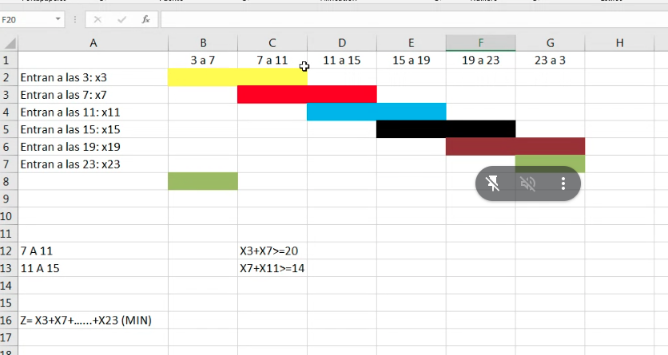

 

```go
X3: cantidad de empleados que entran a las 3 // (y saldrian a las 3 + 8 = 11)
X7: cantidad de empleados que entran a las 7 // asi con todos..
X11: cantidad de empleados que entran a las 11 // ..
X15: cantidad de empleados que entran a las 15
X19: cantidad de empleados que entran a las 19
X23: cantidad de empleados que entran a las 23

y ahora el truco esta en 

X3 + X7 >= 20, pero por que? simple
pensa que tenes dos tandas de empleados, se puede ver en cada intervalo porque pasa en todos y esto sucede ya que trabajan 8 horas

entonces, por ej, la suma de ambos empleados (X7 y X11) deberia darte >=14

- "notar el enunciado y como trabajan 8 horas"


las hacemos todas porque soy re piola

X3 + X23 > 7 
X3 + X7 > 20
X7 + X11 > 14
X11 + X15 > 20
X15 + X19 > 10
X19 + X23 > 5

```