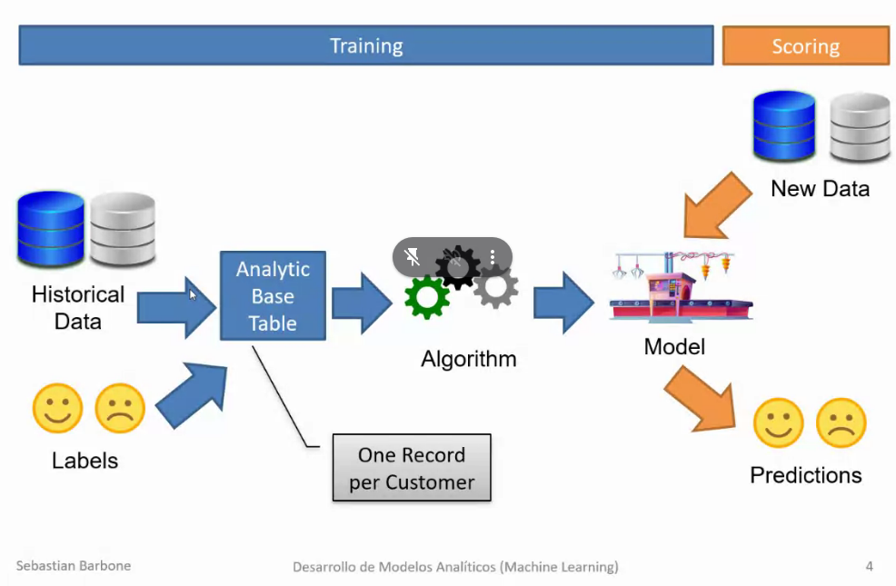
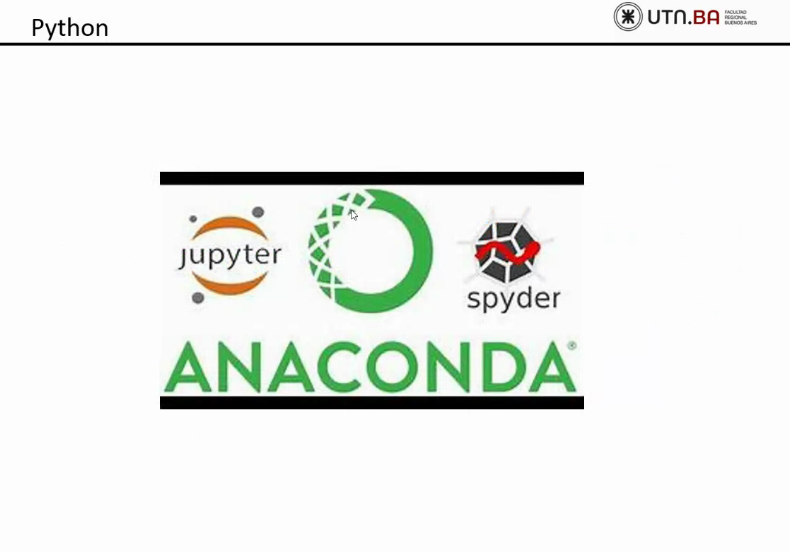
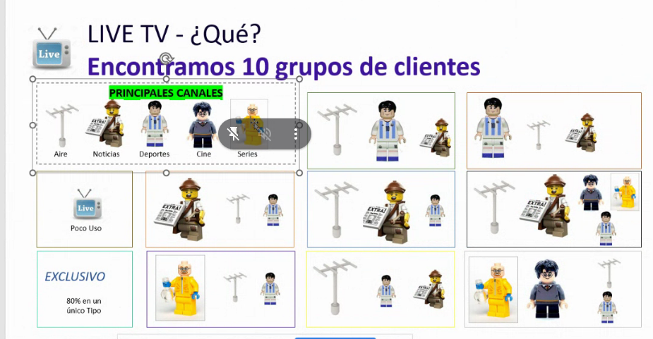

# Machine Learning K5551

# What is machine learning? (high-level explanaiton)
 

Labels: tu target/mercado -  alumnos, personas, etc

historical data + labels: la parte mas importante, 80% de un modelo de ML, buena data, ver bien el target, etc.
por ej: que significa que "un alumno se va a recibir"? que va aprobar todas las materias? que le van a tirar huevos?

# some machine learning types / use cases
 

Cross Selling: By recommending additional products or services to existing customers, businesses can boost their bottom line and improve customer loyalty. mejora el producto que tenias

Up selling: te quiero vender algo mejor, tenes un fiat te quiero vender un BM

Down selling: al revez, tenes un bm y te quiero vender un fiat

Attrition/Churn: dejar la compania, como cliente te vas, abandonar algo el curso

Credit scoring: trata de hacer modelos que predicen que si prestas plata te la van a devolver o no.

Clustering: agrupar gente con caracteristicas similares. dividir un conjunto de datos en grupos o clústeres, donde los elementos dentro de un mismo grupo son más similares entre sí que con los elementos en otros grupos. 

Recommendation Systems: recomienda en base a tus gustos nose.

# Processes: CRIPS and KDD to do machine learning
KDD: Knowledge Discovery Data

 

1. business understanding: entender el negocio, si quiero que me mejoren las ventas.. ok, de que producto? del telefono, ok que tipo? y asi hasta bajar al mas bajo nivel

2. data understanding: entnder la data
y el resto lo sabes todo


segundo grafico:

selection: seleccionar la data, por ej, si estas recibido - sos buena data? y bueno no

preprocessing: transformar, armar estas variables, ETL

transformation: lo mismo un poco, transformar etc etc

data mining: tabla bastante limpia despues de los dos anteriores 

interpreation: entender los resultados de eso , por que me dijo que una persona se iba a recibir y otra no?

knowledge: el resultado, quiere saber si uno aprueba y otro no 

# Knowledge discovery in databases - KDD
masomenos lo mismo

 

# Roles - Data Engineering - Data Science - Visualization
 

# Tools 
 

# What we gonna be using
 
 

instalar
- anaconda

# Clustering
- Los modelos clustering no tienen `labels` generalmente

why se clusteriza? es decir, why se junta gente con caracteristicas que compartan?
-> para mandar el mismo mensaje a ese grupito de personas, hablarle a las personas de los intereses que ellos tienen.

cuando sabes esto se haza esta tecnica llamada `Clustering`: (algunos algoritmos de clustering: k means, k means ++)

Clusterizar mucho -> no tiene sentido darle a pequenios grupos poca info'
Clusterizar poco -> y me llegaria un mail de un boliche donde van gauchos ponele

 

> Tecnicas buenas de cluster:
Tipos:
- Dividir los dispositivos en los cuales te conectas (TV, notebook, celular, etc)

- el "`Cuando?`" no es mas que un datetime? NO, mira esto.. tenes que como ir denormalizando todo


## Cuando?
 

Despues al modelo que le tendrias que poner?
- un registro por cliente

es decir, todo eso que dice cliente 1 tengo que llevarlo a un registro x cliente

 

y esto de aca arriba ya podrias meterlo en el modelo.

 

- la onda es que podes sacar las variables que quieras, mira por ejemplo la variable esa del %, dice el porcentaje de lo que mira
- asi es como se crea una tabla con variable
Esto es lo conocido `ABT: Analyitical Base Table``

## un poco del Que?
 Se agregan mas variables al mismo dataset

- La idea de todo esto es darle la vuelta a las variables, encontrar patrones , buenos set de datos y demases.. fijate como fuimos armando todo.

- Conocer el negocio, por ejemplo lo de los canales de aire y demas

## Agregando otra variable como ejemplo
 

## Que? 
 

- Poco uso: si la gente le da poco a la actividad, osea mira poca tv por ejemplo, te lo saco a la mierda. poca info - no va en en analisis

- Exclusiva: el 80% de lo que hace es una sola cosa, por mas que hagas muchas otras cosas siempre hay algo que haces mas que otro.

# Cluster tarjeta de debito
- Recencia (cuando vio la ultima)
- Frecuencia (cada cuanto compras)
- Monto (valor)

## 100k clientes dvididos en clusters
 
 

# CRM: arboles de decision: esto estimaba las 'intenciones' de baja, como por ejemplo de un ISP
- No va apuntado a los que se dieron de baja, sino a los que tuvieron la intencion.
 

- Fijaste el target a noviembre

Filtros parque: por ejemplo sacar a los morosos

Target: combinacion de cosas

## Que hacia el modelo?
## Arbol de decision: hoy en dia se usa Random Forest ( que son muchos arboles a la vez)

Target: se dara de baja o no?

Antes se usaba arboles de decision a mano, que es lo que realmente pasa por atras

 


### Como presentar el modelo a los que no saben cosas tecnicas
 

- Mira los reclamos tecnicos en 3 meses, esto refleja que los clientes a veces no saben mucho de su negocio.. piensan tal vez que una variable es importante pero no lo es.. y esta puede ser encontrada por nosotros, o por el modelo.

 

- Con el DNI podrias calcular la edad promedio de una persona
 

---

## Supervised vs Unsupervised
 


## Caso de uso: 
Clientes de un banco y vamos a ver si compramos el paquete o no.

```python
data.head(5) # show 5 first rows


data = pd.read_csv("path", sep ='|')

data.shape # how many registers and columns

data.columns # show columns

# case sensitive the columns
[x for x in data.columns if x.startswith('SavingAccount') >= 0]

[x for x in data.columns if ~x.startswith('SavingAccount') >= 0]

Guido Dipietro19:36
NaranjaX 100% ya
Federico Gonzalez20:11
Dejo otras opciones:

'SavingAccount' not in x

('SavingAccount' in x) and ('Active' in x)

~ es igual a not
| es igual a or
& es igual a and
'SavingAccount' in x
Federico Gonzalez20:15
es de fundamentalista nada mas, no cambia en la practiva.

Se hace porque es usarlo comodiccionario de python que siempre se accede con [], el .Field hace lo mismo porque usa un magic method de python para buscar ese atributo dentro del dict.
Federico Gonzalez20:35
los opcionales de python son por ejemplo:

def bla(a, b=20, c=30):
    ...

con eso b y c son opcionales con default

Si queres opcionales sin default tenes que usar ya def bla(a, *args, **kwargs)

```

