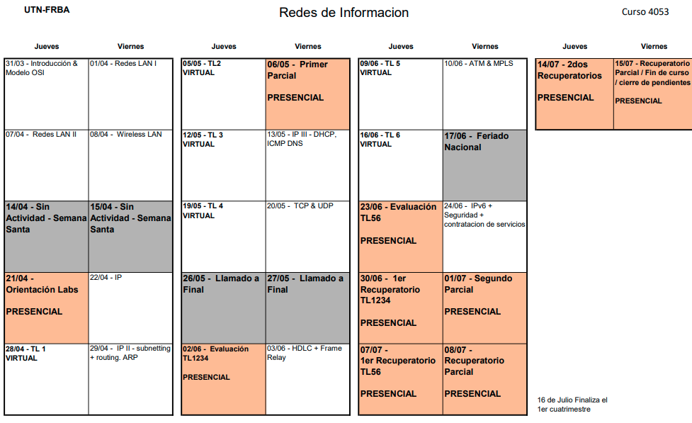
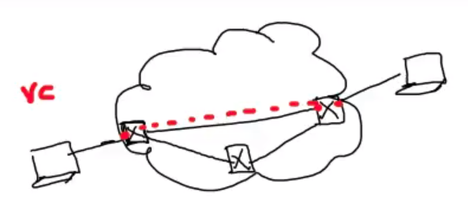
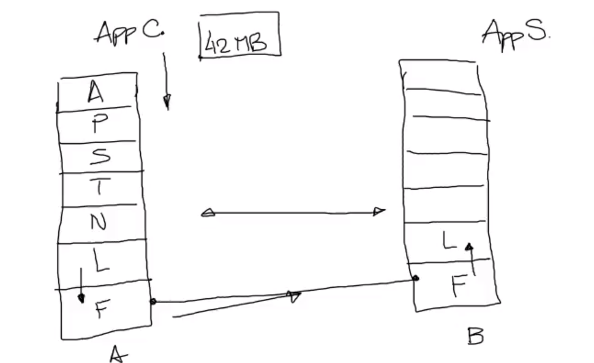
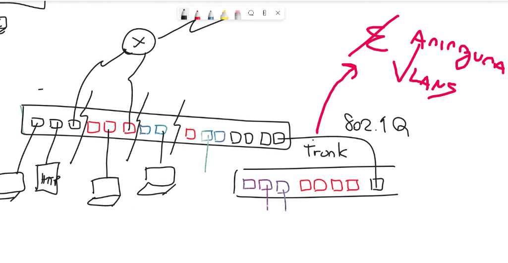
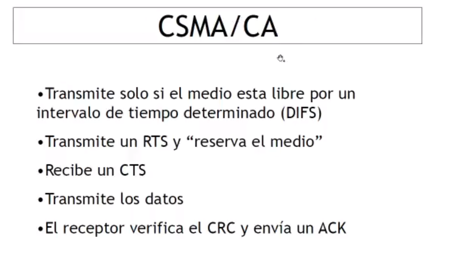
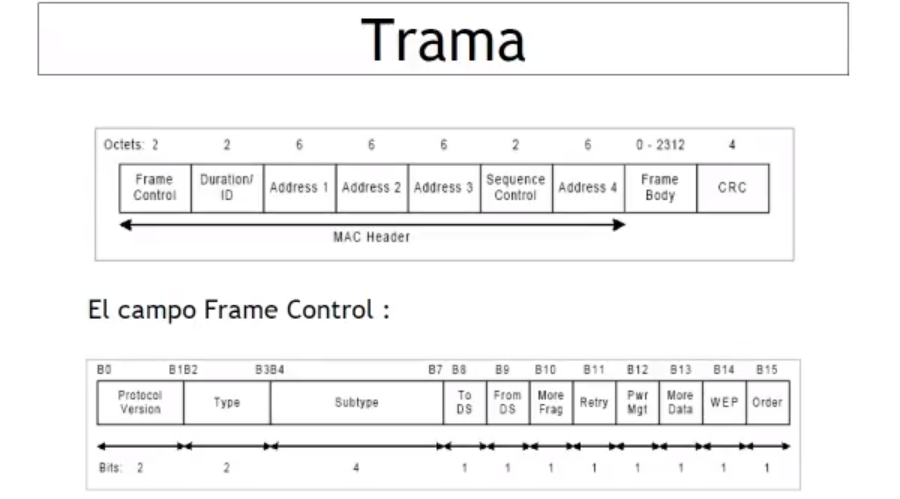
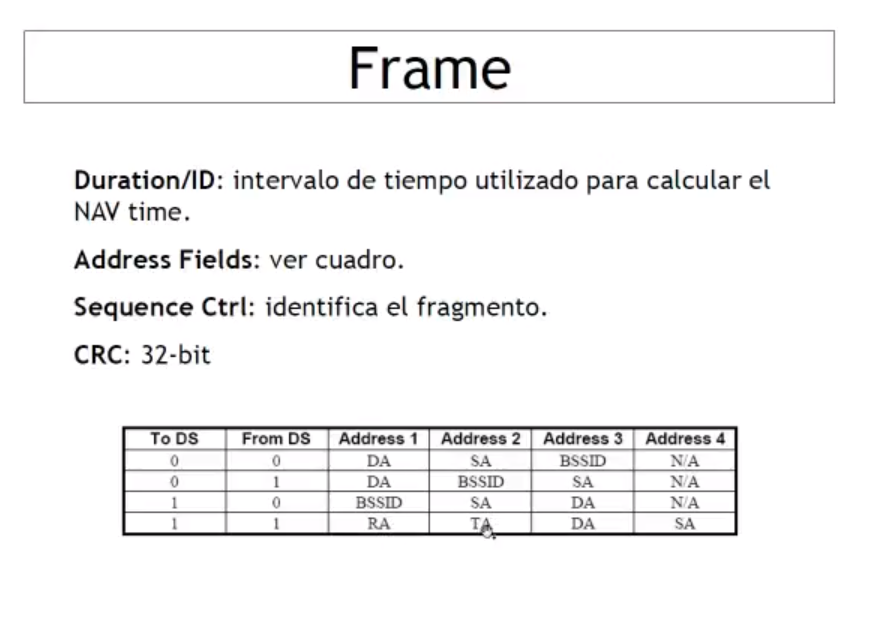
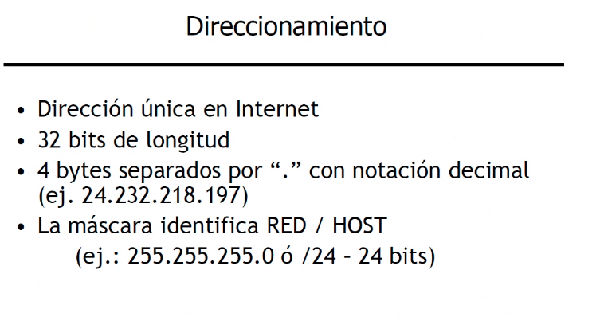
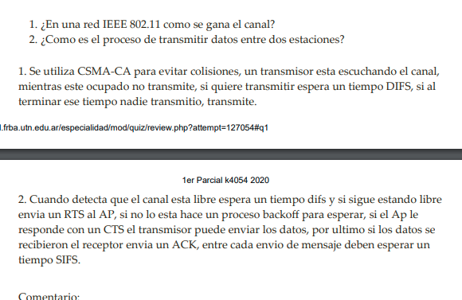

# 1RA PARTE
# **REDES DE INFORMACION** K4053
```python
- 2 parciales teoricos
- 2 trabajos laboratorios
```
 
# **Clase 1 - INTRO + Modelo OSI**
## Redes
Sirve para compartir recursos, es la infraestructura que nos permite acceder a esos recursos \
Clasificaciones de las redes: \
**De acuerdo a su extension**:
- **LAN** (Local Area Network) e.g: edificio, casa -> 
- **WAN** (Wide:amplio Area Network) e.g: interconecta redes lan, ejemplo campus y medrano
- **GAN** (Global Area Network) e.g: red de redes, tambien llamado **INTERNET**

<ins>Caracteristicas - Diferencias </ins>
- **Publicas/Privadas:** publica cualquiera puede contratar el servicio, en cambio la privada es como mi red local, e.g la publica podria ser la red de medrano y campus.
- **Diferentes anchos de banda, velocidad de transferencia y tasa de error BER:** como por ejemplo los cables, viste que los ethernet vienen de 10GB/s de 5 GB/s, etc \
la tasa de error esta relacionado con la infraestructura
- **Gestion del enlace:** referencia a lo que es la gestion de los cables de conexion
- **Redes de conmutacion de circuitos/paquetes:** mas abajo
- **Protocolos diferentes:** un protocolo es un conjunto de reglas establecidas. Cuando yo quiero transmitir informacion de A hasta B , voy a utilizar un protocolo, existen protocolos diferentes para entornos diferentes por varias diferencias de conexion entre las redes, es decir, si tengo 10GB/s me comporto diferente si tengo 5MB/s, en uno lo haria mas rapido, en otro mas lento (hablando de la transferencia de informacion) \
No solamente se habla en cuanto a las caracteristicas, sino tambien la clasificacion de las redes, osea, WAN tiene un protocolo , LAN otro.
Aca puede entrar tambien las tecnicas de correccion de errores, pueden ser distintas en varios protocolos, en algunas puede haber CRQ, en otra ARQ, y hasta en otra **NO HABER NINGUNA** \
otro ejemplo, que en un protocolo se divida el mensajes en distintos sizes, mayores, menores (paquetes, acordate)

---
## Conmutacion de circuitos
```python
vas a tomar como referencia el grafico del profe,
de una conexion entre un dispositivo A hasta un B, 
y vas a ver todo lo que pasa
adentro de la nube(red)
```
En la conmutacion de circuitos, el proveedor de internet, interconecta todos 
los nodos entre si creando un circuito. \
Fijate que en el grafico se puede ver como 'se establecio el circuito', esto significa que se reservaron recursos en este vinculo y se conectaron todos los puertos/nodos 
para que efectivamente viaje la informacion mediante el mismo, esto es un 
**circuito fisico** , el mismo esta bloqueado, quiere decir que solamente opera y
esta reservado para la comunicacion de estos dos dispositivos, uno en baires, el otro
en salta, lo mas parecido es un **llamado telefonico**\
 

---

## Conmutacion de paquetes
```python
* ejemplo con los mismos nodos, mismos dispositivos
```
Como yo voy a intercambiar paquetes entre estos dos extremos, la red esta diseniada 
para manejar paquetes, mensajes (NO CIRCUITOS).
Entonces cuando yo le contracto al proveedor un servicio de interconexion para bs y salta pidiendole conmutacion de paquetes, lo que va a pasar es que se va a establecer la configuracion en los nodos que permita que los paquetes lleguen desde A hasta B,
aca la diferencia es que se crea un **circuito virtual**(rojo) 'vc'. \
Este circuito virtual no esta asignado a mi, es un camino que yo uso para transmitir 
la informacion, quiere decir que lo pueden usar varios demas dispositivos, es mucho mas barato y mas eficiente, mejor para todos.. porque lo pueden usar varios clientes, pero SINCRONIZADAMENTE, es decir, aca no la pueden usar todos los clientes al mismo tiempo.
```python
ahora sabiendo esto:
# TODO, preguntar? 
REDES LAN: es conmutacion de circuitos
REDES WAN: podria estar usando conmutacion de paquetes 
```
 
 

---
## Topologias
Cada una de estas topologias tienen sus protocolos asociados
- Bus o Barra / Arbol
- Anillo
- Estrella
- Hibrida: cualquier combinacion de todos

**BUS**: ya sabes lo que es 
```python
----------------------- BUS
 |        |         |
[ ]      [ ]       [ ]   <--- dispositivos

```
**ANILLO**: \
 

**ESTRELLA**: \
 

**HIBRIDA**: podria ser una comparacion entre todas las anteriores
---


# **Modelo OSI**: open system interconection
* Protocolos entre dos capas iguales, servicios entre capas adyacentes. Una capa brinda servicios a la capa superior y consume servicios de la capa inferior. 
* Se ingresa por la capa 7 - Usuario. 
* Protocolo de capa par entre cada cada de emisor-receptor (ej; una comprime la otra descomprime)
* Cada capa agrega un header o cabecera de capa (Ej: Cabecera de aplicación). Este header sirve para que el receptor (la misma capa pero del dispositivo receptor) pueda a través de un protocolo en común obtener el mensaje original que tiene datos adicionales para el envío. Ej: Separar un mensaje en paquetes y mandarlo, necesitas agregar info de orden por ejemplo, que el receptor debe sacar para obtener solo el mensaje. Encapsulamiento: Lo que me pasa la capa anterior lo agrego a un header.
La capa de enlace agrega un trailer para delimitar de los 1 y 0 dónde arranca y termina.


 


- cada capa brinda servicios a la capa superior y tambien
  usa servicios de la capa inferior
- en cada capa hay funciones, cosas que hacer, etc. cada una de las capas procesa el mensaje de una manera, 
  agrega una funcionalidad, hace algo util
- e.g: una aplicaicon de usuario le va a avisar a la CAPA 7 que quiere
  enviar un mensaje determinado, esta capa 7 va a realizar alguna funcion
  con esa mensaje y se lo va a pasar a la capa inferior, y a su vez
  la CAPA N se conecta con las demas capa usando lo que se conoce como
  "protocolo de capa par"
- esto pasa hasta llegar a la CAPA 1, y que es la CAPA 1? :
  'TODO LO QUE VISTE EN COMUNICACIONES' relacionado 
  a cables, transferencias, antenas, radiofrecuencias, optic fiber etc.


---

## **Ejemplo con 2 hosts:** aplicacion cliente y aplicacion servidor
 

```go
Para entender el modelo OSI, es necesario que pienses que se esta enviando
un paquete desde A hasta B, todo lo que va a ser el modelo OSI es ir pasando
ese paquete entre las diferentes capas.
```
### 1. <ins>CAPA FISICA </ins> (electrico, bits, protocolo capa par, voltaje, medio de comunicacion a usar como tanto codigos de linea, inalambrico, cables, antenas, etc)
- El "PROTOCOLO DE CAPA PAR" es la linea esa que interconecta ambos hosts
es usado en  **TODAS LAS CAPAS**:
  - Encuentro Bits 
  - Protocolo de capa par determina que **códigos** usar, de banda base como Manchester, HBN 3, Manchester diferencial, etc o **modulación**. Determina el medio de comunicación a usar. Determino en los dispositivos que significa un uno y **un cero, el amperaje, el voltaje**, etc.
  - Encuentro un medio de comunicación (alámbrico, eléctrico, una señal de radio frecuencia o fibra óptica).
  - No hay control de errores porque no se puede dar cuenta si un 1 o 0 está bien.

- Aca se esta hablando de la capa 1: ambas capas
deben establecer todo, que modulacion usar, que voltaje
que medio, que codigo de linea, etc..
todo eso forma parte del protocolo de capa par, es decir
ambos extremos deben estar de acuerdo para las conexiones,
si hay un corriente en A debe haber en el B, y asi con todo...
"**EN TODAS LAS CAPAS DEBEN COINCIDIR**"
'obs': notar que esta capa solamente transmite BITS, unos y ceros
nada de correcion, ni logica complicada, solamente informacion
que puede referenciar cualquier cosa: 1(una letra), 1(prendido)
0(apagado), etc..

### 2. <ins>CAPA ENLACE (link)</ins> (tramas, correccion y deteccion)
- Encima de la capa fisica, tenes la capa L de enlace (LINK)
esta capa de enlace debe delimitar las **'TRAMAS'**. es la encargada
de determinar donde arranca y donde termina el mensaje, porque
en la transmision de la capa 1 podria haber bits adicionales 
entonces la de enlace te acomoda todo. \
Aca si hay **correcion y deteccion de errores**, se encarga de determinar de todos los unos y ceros que llegan donde empieza y termina el mensaje. Porque de lo que se manda hay bits auxiliares y esta capa descarta todo eso y se queda solo con el mensaje.
 - **Garantiza entrega libre de errores**, ejecuta mecanismos de detección y corrección de errores. Entre el emisor y el dispositivo siguiente (por ejemplo entre nodos).
Por ejemplo: Le calcula un CRC al mensaje y se lo adosa al envío.
El header y el trailer permite delimitar el comienzo y fin del mensaje.
Tambien recupera datos perdidos, duplicados o erroneos.

- Que el mensaje sea de 42MB te ayuda a entender porque combiene
transformarlo en varios paquetes, pensa que si tenes un BER 
de 1 error en 420, si transferis todo de una, vas a tener
varios errores hasta que efectivamente el paquete de transmite
en cambio si dividis todo en 420 paquetes, vas a tener la posibilidad
de enviar 419 y despues solamente re-enviar ese paquetito que tuvo error


### 3. <ins>CAPA RED </ins> (camino del mensaje, origen y destino, interconecta redes)
- Debe encontrarle un camino al mensaje, tiene un origen y destino.
Indica por ejemplo: Mi comunicación es con GMAIL si quiero abrir esa página y no con Fibertel.
Me permite ir más allá de quien tengo conectado adyacentemente.
Ej: IP,  IPX, X.25.
* Gestiona las prioridades, interconecta las redes y hace todo lo relacionado a las funciones de conmutacion.


### 4. <ins>CAPA TRANSPORTE</ins> (errores de ambas partes emisor y receptor)
- Control de errores de extremo a extremo (emisor y receptor y no nodos como capa de enlace porque puede ser que uno de los nodos no haga detección, por ejemplo el cable modem, el router, etc.).

### 5. <ins>CAPA SESION</ins> (determina si la comunicaicon sigue activa, reinicio)
- Detecta si la comunicación sigue activa, si se cayó, si hay que reiniciarla, etc.
los mecanismos de esta capa suelen implementarse en la siguiente: Capa aplicacion


### 6. <ins>CAPA PRESENTACION</ins> ( La encargada de encriptar y desencriptar datos.)
- La encargada de encriptar y desencriptar datos. Genera compresión, indica formato de compresión para que el receptor pueda descomprimir el mensaje.

### 7. <ins>CAPA APLICACION</ins> (datos de usuario y demas)
- Toma los datos de usuario y agrega una cabecera de aplicación (Lo que necesita la capa de aplicación del receptor para captar el mensaje original a través del envío).
Aca esta todo lo que se relaciona con aplicacions de uso general, tales como correo electronico, accesso a terminales, transferencia de archivos, etc.
Ej Telnet, FTP, SMTP , etc


- Notar que si vas a desfragmentar todos los paquetes, va a existir
la necesidad de fragmentarlo (o re-ensamblarlos) del otro lado.
para esto se crean los llamados numeros de orden (1,2,3...,n)
tambien llamados 'HEADERS' propios de la capa.
esto lo realizan 'TODAS LAS CAPAS' , entonces, todas las capas
agregar un HEADER.

---

| Capa N       | Dispositivos, Protocolos            |
|-----------------------|------------------------------------------------|
| Capa 1 : fisico       | HUB, Repetidor regenerativo, Antena            |
| Capa 2 : enlace       | Switch, Bridge, CSMA/CD, Wireless(802.11), STP |
| Capa 3 : red          | Router ,IP , ARP , ICMP < RP                   |
| Capa 4 : transporte   | TCP , UDP                                      |
| Capa 5 : sesion       | HTTP, FTP, TELNET, SNMP, SSH                   |
| Capa 6 : presentacion | HTTP, FTP, TELNET, SNMP, SSH                   |
| Capa 7 : aplicacion   | Firewall, HTTP, FTP, TELNET, SNMP, SSH         |

```go

'Repetidor' → Capa 1
'HUB' → Capa 1
'Bridge' → Capa 2
'Modem' → Capa 1
'LAN switch' → Capa 2
'Router' → Capa 3
'Firewall' → Capa 7
'Switch' -> capa 2

```

--- 

**PDU**: Protocol Data Unit, son los datos que toman las capas entre si de las anteriores \
En la capa de enlace, se lo denomina "trama" al PDU y en la de red, se lo denomina "paquete". 
**H**: los headers, ejemplo 'TH': transport header
 

- La transmision va en el sentido de arriba para abajo
y despues de abajo para arriba en el otro lado

- Algo muy practico para entender los headers una 
request HTTP, viste que tiene headers? cada uno dice cosas 
distintas, como el 
```json
{
  "applicaction": "json",
  "encoding" : utf-8,
  "etc" : ..
}
```
bueno, como que te dice todo lo que hizo , con que comprimio
que algoritmo uso, etc.. para que la otra capa entienda
y pueda hacer el proceso inverso 

---
# **WIRESHARK**: Sniffer, o olfateador
 
```python
Este software escucha y ve todo lo que pasa en la red, seteandole una interfaz, como podria ser 'WIRELES' que es tu wifi 
```
 
```python
OBS: notar que no se asemeja al modelo OSI, sino
que se asemeja al modelo de Ethernet

- Cada fila es un HEADER fijate.
 el profe lo dibuja asi mira
```

### RS 232
RS-232 (Recommended Standard 232, en español: "Estándar Recomendado 232"), también conocido como EIA/TIA RS-232C, es una interfaz que designa una norma para el intercambio de datos binarios serie entre un DTE (Data Terminal Equipment, "Equipo Terminal de Datos"), como por ejemplo una computadora, y un DCE (Data Communication Equipment, "Equipo de Comunicación de Datos"),

---

# **REDES LAN**: Ethernet / 802.3
 \
Las redes ethernet/802.3 (basicamente lo mismo por una diferencia) son redes
peer-to-peer, porque todos los nodos que participan en la red, son iguales, 
es decir, todos operan de la misma manera no hay prioridades. 
Cada NODO corre una instancia de su propio 'CONTROL DEL ACCESO AL MEDIO'
estas redes son de acceso aleatorio, al estar el control distrubido, no 
provee una estrategia para saber cuando a un NODO le va a tocar.
Operan en HALF-DUPLEX, es decir, solamente uno puede hablar a la vez, onda los 
walkie-talkie. 
- **Peer to peer**: todos los miembros de la red son iguales, no hay más ventaja o mayor prioridad. 
- Redes de acceso aleatorio porque no sabe cuando va a poder emitir.
- Opera con mecanismos de control de acceso al medio (**CSMA/CD** - Acceso múltiple por detección de portadora con detección de colisiones) → habitación con una mesa y gente que quiere hablar (ejemplo de resumen de final). 
- Con los años los estándares de ethernet fueron aumentando (10Mbps, 100Mbps… 10Gb) pero perdura la estructura.
- No pueden emitir más de uno a la vez, se aplica TDMA (transmisión por división de tiempo) en esta primera versión es half-duplex.
- **No existe confirmación**

<ins>Ubicandonos en el modelo OSI</ins>

 

## **Ejemplo de TRAMA: 802.3 y ethernet (son dos cosas distintas, por el len/type) SIZE: 64bytes + datos (0-1500bytes)**
 

- Es necesario tener **direccionamiento, para saber quien envia
el mensaje y quien lo debe recibir**, por eso se establece
el formato de una trama, cuando una estacion quiere enviar
un mensaje, debe difundirlo por el medio y todas las estaciones
deben recibir el mensaje, cuando una transmite, todas las demas
escuchan, al ser half-duplex.

* **PREAMBULO**: secuencia para sincronizar las estaciones, esto
da la oportunidad a todas las estaciones de sincronizarse [[7 bytes]]
* **SFD**(Start Frame Delimiter): Delimitador de comienzo de trama.
este octeto indica el fin del preambulo y el comienzo de la trama
* **DA**(Destination Address): direccion destino, el destinatario del mensaje, a quien le 
interesa leer el contenido del mensaje [6 bytes]
* **SA**(Source Address): direccion origen, esto es lo llamado direccion 'MAC', que referencia
al que envia el mensaje [6 bytes]
* **LEN/TYPE**: este es el que tiene 2 significados, uno en el ethernet y otro
en el 802.3.
  -En ethernet, este campo se llama 'type' o 'ethertype' y nos indica que hay
  dentro del campo de datos. por ejemplo si es ipv4(0800) o v6(86),0806 → ARP
  -En 802.3 es el campo longitud, e indica la longitud del campo de datos
  (esto puede ser variable) [0-1500 bytes]
* **DATOS**: tienen longitud variable, pero tiene una longitud máxima de 1500 bytes por estándar.
* **Pad**: campo opcional de relleno [0-64 bytes] para asegurarnos de llegar al mínimo de longitud (64 bytes) y que no se generen colisiones entre estaciones.
* **FCS**: (frame check sequence) es un CRC de [4 bytes]

 
obs:
* el IPV4 manda un numerito 0800 que indica que en la trama
va a existir un datagrama ipv4

* el IPV6 manda 86dd y lo mismo


# **Colisiones, CSMA/CD**
## CSMA/CD : Carrier Sense Multiple Access / Colission Detection

- Colision: significa interferir con otros, se dan particularmene en ethernet. A medida que aumenta el número de nodos que pueden transmitir en un segmento de red, aumentan las posibilidades de que dos de ellos transmitan a la vez.

### **CSMA / CD (detectar colisiones)**:
- Las estaciones escuchan (lo que hay en el medio) y transmiten al mismo tiempo, transmiten si ven libre. Si ambas transmiten al mismo tiempo se generan colisiones. Cuanto más largo es el medio mayor es la probabilidad que dos estaciones piensen que esté libre y transmitan al mismo tiempo.
**el 'CSMA' define quien puede acceder al medio**, mira la imagen, todos estan peleando
para acceder al medio
(acceso multiple por deteccion de portadora)

- Para controlar colisiones el estándar plantea una longitud máxima del medio (2500m con 4 repetidores). 5 segmentos con 4 repetidores máximo. 2500 metros total con segmentos de 500 m.

ej:
`UN PROTOCOLO DE CAPA SUPERIOR SOLICITA ENVÍO → `
-Envío el mensaje, colocó señal sobre el medio, se propaga, todos los receptores reciben el mensaje, chequean CRC y si está ok se fijan la dirección destino a ver si ellos son los destinatarios.
-Todas las estaciones escuchan todos los mensajes pero chequean a través de la dirección destino si son para ellos o no. Si no son, los descartan.

- En ethernet no existe confirmación de llegada. Si hay un error no lo corrige porque se maneja en entornos con alto ancho de banda y pocos errores, se puede asumir que casi siempre llega correctamente a destino. 

**Por qué la longitud mínima**?:
  - Cuando una estación comienza a transmitir, la señal se propaga con una velocidad de 10Mbits, voy a necesitar transmitir 512 bits (64bytes) para llenar el medio (llenar los 2500 metros). Los primeros 64 bytes son la ventana de colisión para que si mando un mensaje más corto otra estación no me colisione sin darme cuenta.


---
## **Algoritmo Exponencial Binario**: backoff (algoritmo de espera)
 
```go
*// aplicado a cuando un dispositivo quiere enviar un mensaje
```
- Si lo que escucha es distinto a lo que transmite, se produce
una colision, si no se produce, termina la trama y se envia el mensaje

- Si hay colision, debe hacerse un **'JAMMING'** (que significa interferencia)
esto dice que **se debe sostener la condicion de colision para que todas**
**las estaciones se enteren que hubo una colision**. Si la estación detecta colisión debe mantener la transmisión a pesar de no ser exitosa, sostiene la colisión un tiempo para que **todas las estaciones sepan de esa colisión**, así no cae ninguna más.
Eligen un tiempo random de espera para volver a intentar.

- el contador de colisiones va aumentando, espera un intervalo
de tiempo segun ese numero y vuelve a intentarlo (fijate que
esta ese delta T que depende del N)

- mientras mas grande es el n , mas grande es el N y mas chica
es la probabilidad de que vuelvan a coincidir en el tiempo.
ese n puede valer hasta 10, y N hasta 1023, entonces los dispositivos
tienen un rango para elegir esperar. 

- el estandar define 16 re-connects 

### **HUBs + cable coaxil**
 

- Se dejan los cables coaxiles y se usan cables UTP conectados a un HUB (**conecta eléctricamente a todos sus puertos**). Opera lógicamente como un bus porque el HUB cuando una estación transmite todos los demás puertos lo reciben, no se puede transmitir más de uno a la vez. Compiten por el uso del canal.

- aca hay ACCESO ALEATORIO AL MEDIO, nadie sabe cuando va 
a ser su turno, esto es un dominio de colision simple.. porque todas
las estaciones compiten por estos unicos 10 MB/s, se lo van peleando
entre dispositivos.
el rendimiento esta muy lejo de los 10 MB/s. 
el HUB en si es un repetidor regenerativo 

- **tambien llamado dominio de broadcast**, porque cuando una estacion
envia un mensaje a esa direccion MAC destino, se los esta enviando
a todos en la red

**HUB** [capa 1]: 
- Inteligencia de capa 1, capacidad eléctrica, básicamente conecta equipos como un bus. Lo que se transmite se propaga eléctricamente a todos los puertos.
Cuando uno transmite todos escuchan en cambio un switch puede tener escuchando y transmitiendo muchos a la vez.
- Puede ser un switch o cualquier otro dispositivo que físicamente es igual pero tiene distintas características. 
- Opera lógicamente como un bus.
- Podés conectar HUBS con un cable cruzado (uplink) si te quedas sin puertos.

---

## Tipos de trafico

* **'TRAFICO UNICAST'**: de un origen a un destino
* **'TRAFICO BROADCAST'**: va para todos, la dirección broadcast es la dirección ip cuyos bits de host son todos 1
* **'TRAFICO MULTICAST'**: un mensaje que envia una estacion , no a uno, no a todos, sino 
a 'ALGUNOS', esos algunos son los miembros de un grupo de multicast
hay un grupo de direcciones MAC reservadas para eso, cuando se envia un mensaje aca
se entiende que va para todos los miembros de ese grupo, quien no perteneza al grupo
simplemente la ignora.

---

## Interfaz FULL-DUPLEX
 
- Caminos de transmisión y recepción independientes que operan en simultáneo.
- Dos estaciones conectadas punto a punto con un vínculo full duplex.
- No hay contención, **se elimina el CSMA/CD**, pueden escuchar por un lado y recibir por otro. Porque el camino siempre está libre (son 2 pcs) y no un dominio punto multipunto.
Si conecto la pc con un EDT tengo todos los puntos iguales, si los cruzo tengo caminos independientes y puedo transmitir y recibir a la v

---

# **Bridge | bridiging** [capa 2]: el que puede leer e interpretar la trama
 

**'BRIDGE'**: pasa las tramas de un lado para el otro, o las descarga.
ninguna estacion conoce de la existencia del bridge, ellas siguen
operando como si no existiera, es decir, las estaciones siguen
operando como si este bridge no existiera.(no interfiere en el protocolo)
el bridge controla todo. [es dispositivo de capa 2] por lo tanto puede
identificar varias cosas que el HUB de capa 1 no podia, sabe cosas de la trama
a quien enviarsela, etc, porque puede leer todas las cosas de la trama, como 
el remitente, el receptor, etc.
Principal objetivo? **reducir colisiones, separando los DTE en dos o mas dominios**.
- El bridge pasa el trafico de un lado para el otro: filtering 
  y forwarding son sus 2 funciones.
- Este brigde introduzco la separacion entre dos dominios
  de colision, porque fijate que ahora tenes 10 MB/s de un lado
  y 10 MB/s de otro lado (arriba y abajo). este dispositivo
  introduce una mejora.
- El trafico local queda en c/u de los segmentos, tiene un CSMDA en cada
  extremo
- El BRIDGE aprende las direcciones origen, osea, entiende cual es 
  el remitente y se lo anota en una tabla, como ves ahi
  entonces aprende quien esta en el dominio 1 y quien esta
  en el dominio 2: DONDE "port" en el bridge = "dominio"
- Estoy dentro de un mismo dominio de broadcast, es decir
  que cuando cualquiera estacion manda un mensaje, todos los
  dispositivos van a recibir ese mensaje y lo van a procesar
  porque pertenecen a ese dominio broadcast
- Notar que el bridge no existe mas, ahora se usan los switchs.

 
 

---

# **Switch | Switching**: es el nuevo bridging, eliminando dominios de colision
**SWITCH**: si unieramos todo de una al bridge, pasaria a cambiarse 
de nombre y ahora se llamaria 'Switch'. que hace el switch?: bridging. \
Fijate que en el grafico, ahora tenes mas puertos que en el bridge, donde
solamente tenias 2. \
Pensa que esto te elimina totalmente el dominio de colision porque ahora cada puerto 
peretenece a un DTE, y no pertenece a un dominio entero.
**cada puerto del switch conoce un dispositivo.**
- Hace bridging. Vincula cada puerto con una dirección mac 
- En un inicio el SWITCH **inunda todos los puertos**, es decir, envia
  el primer mensaje que recibe por todos los puertos para poder
  guardarse en su tabla todas las MAC
- **Elimina los dominios de colisión**, aca cada puerto de es un dominio de colision independiente.
- Puedo tener conexión simultánea (una estación enviando trama a una estación y otras dos haciendo lo mismo, no compite

 

 
```python
- se comporta parecido a un HUB
- el grafico de la derecha es un 'SWITCH'
  el HUB es un dispositivo de capa 1, en capo el SWITCH y el BRIDGE 
  son de capa 2.
```

## Modos de operacion de switching
 

- **'Cut-Through'**: Si yo tengo una trama ethernet, el switch necesita
saber a quien va dirigida la trama, para eso necesita analizar
la **MAC destino** y da la casualidad que la MAC destino es el **primer campo de la trama**, entonces basta con leer los primeros
**6 bytes** de la trama para poder tomer una decision de conmutacion.
basicamente en este modo, al leer los primeros 6 bytes de la trama
ya se transmite.
  * tiene errores ya que pensa que si la trama nunca se termino, o 
  tuvo un error, o lo que fuese, si se leyeron esos primeros 6 bytes
  ya se paso de una.

- **'Fragment tree'**: espera a recibir los primeros 64 bytes porque 
en esos primeros 64 bytes solamente puede haber colision, entonces
espera esos 64, y los envia asegurando que no existe colision.


- **'Store and forward'**: el switch espera a recibir la trama completa
, le calcula el FCS y si le da correcto, toma la decision de conmutar
tomando la MAC destino.


## Solucion al SPOF que genera tener un bridge
 
- se introduce un 2do bridge asi el primer no es un 'SPOF'
- y tenes las copias de todas las mac en los dos bridge
  por lo tanto los dos tratarian de transmitirlo.
- si un bridge gana, (transmite la trama primero)
  le llegaria tambien la trama al segundo bridge
  y se podrian empezar a confundir en donde esta
  la trama, osea , de que lado del dominio
  podria estar en el port1 o en el port2, mira el grafico
  y la linea.
- y si llega un broadcast? (trama para todos) mamita
  terrible quilombo, tambien llamado, : 'BRIDGE LOOP'


## Bridge Loop
 
- al tener dos bridge operando en paralelo, ninguno
conoce la existencia del otro y se produce el briding loop.

---
# **Spanning TREE Protocol = STP (arbol de expansion) : ANTI-BUCLES de bridge/switch**
- Este protocolo interpreta la topologia,  elije a una raiz 
(root) que es el primer dispositivo del cual partir y a partir
de ahi asegurarse que no se produzcan bucles, que todos los demas
nodos sean hojas o ramas.
Los bridge ejecutan el protocolo, periódicamente envían una trama que indican que son un bridge, delatan su presencia y se reconocen. La idea del algoritmo es detectar un loop de capa dos, bridge loop y **desactivar un puerto lógicamente**. 
- Los bridges se designan en un root y demás leafs (hojas). En caso que un link se desconecte se activa nuevamente el STA, TODOS los bridges tienen que participar del proceso de elección de root.
- Se envían BPDU cada 2 segundos para anunciarse (los switches mandan BPDU por cada puerto), según el **Bridge ID**, en el Bridge Protocol Data Unit va el BID, lo que sirve para saber quien va a ser designado el root.
```go
BID [bridge id] = (mac address + bridge priority)
```
El que tenga menor prioridad se designa root, si la prioridad es la misma desempata el mac address.


 

## **Funcion del STP**
Su función es la de gestionar la presencia de bucles en topologías de red debido a la existencia de **enlaces redundantes**, como en el TL1 (necesarios en muchos casos para garantizar la disponibilidad de las conexiones). El protocolo permite a los dispositivos de interconexión activar o desactivar automáticamente los enlaces de conexión, de forma que se garantice la eliminación de bucles. STP es transparente a las estaciones de usuario.


## Bridge Protocol Data Units
**'(BPDU)'**: es un mensaje transmitido para detectar loops en una
determinada topologia de red, un BPDU contiene **informacion sobre puertos, switches prioridad de puertos y adressess**. \
El BPDU contiene la informacion necesaria para configurar y mantener la topologia del
spanning tree, estos BPDUS '**NO SON FORWARDEADOS POR LOS SWITCHES**' por mas que sean ellos quienes los envian, pero si los switches
toman la informacion para calcular sus propios BPDUS.
- son enviados cada 2 segundos


 

- en caso de misma proridad, desempata el MAC Address (el mas bajo es el root)
- OBS: cuando conectas algo a un switch, viste que cambia
de varios colores, rojo, amarillo, naranja, verde.. esto no es 
nada mas que una representacion de los estados por lo que 
pasa el puerto. (BLOCKING -> LISTENING -> LEARNING -> FORWARDING)
- entonces, sabiendo el root y la topologia, este protocolo
va a bloquear algunos puertos para que no se envie informacion
y se genere un camino

 

- aca se simulo fijate y se bloqueo un puerto (el naranja)
- vos podrias igual elegir cual es el root, eligiendo la prioridad
, es decir, seteandola baja y que asi el root sea el de menor prioridad.
en la simulacion se hizo, y el switch ese empezo a mandar los BPDUS para
indicarle a los otros que era el mas bajo, y asi se empezaron a coordinar
para bloquear otros puertos

---
**NOTE**
```python
- la principal diferencia de un router a un switch
es que el router entiende de tramas, por lo tanto
puede recibir una trama e interpretarla..
el switch no tiene capacidad alguna, solamente es 
capaz de interpretar mensajes y direcciones MAC.
solamente puede procesar tramas Ethernet.
el router agarra las tramas de los dispositivos
que quieren conectarse con la red lan para poder comunicarse
con otro dispositivo fuera de su red.
```

---

## **Virtual LANS (VLANS)**
 \
LAN Virtual, tener una LAN virtualmente dentro de una LAN física, mismo dispositivo físico permite partirse lógicamente. El switch permite asignar puertos a LANS virtuales como si estuvieran físicamente separados.

* Los dominios de Broadcast pasan a ser los puertos designados para la misma VLAN. **Una VLAN es un dominio de broadcast**, las vlans permiten aislar las redes, como viste en el TL1, podes separar una red de contadura y la de ingenieria. El trafico solamente lo conoce cada uno por mas que la red fisica sea la misma.

Hay maneras de designar VLANS por: 
  - MAC ADDRESS: solo pueden estar en la VLAN los que sean parte de una lista de VLANS. Si bien ofrece MAYOR SEGURIDAD, también requiere MAYOR ESFUERZO administrativo. Disp. que sin importar a qué puerto se conecten pertenecen a cierta VLAN.
  - Puertos: los equipos que se conecten a ciertos puertos pasan a ser integrantes de la VLAN.


### **SWITCH que soporta VLANs**
 \
Un siwtch que sporte VLANS nos permite tomar algunos puertos (marcados en rojo)
y crear redes lan virtuales.
entonces cree 3 filas fijate:
* negro: vlan negro
* rojo: vlan roja
* azul: vlan azul
Que logro con esto? lo que logro simular 3 switchs uno rojo, 
uno azul y uno negro.
Esto significa que dos equipos conectados no se van
a ver entre si: es decir, cree 3 dominios de broadcast diferentes.
'los puertos rj45 EXISTEN fisicamente.'

**'TRUNK':** puerto que no pertenece a ninguna VLAN
es una conexion en la que dos puertos se pueden comunicar
pasando cualquier tipo de paquetes, rojos, azules, etc..
esta creado para usarse entre switches (generalmente los ultimos, fastEthernet 0/24)
para que asi, los switches puedan reconocer las vlans creadas y por ese puerto de trunk poder transmitir el trafico.

 
- obviamente voy a necesitar un router, para (si quiero)
con ese router, conectar los dispositivos entre si.
entonces esto se ven en 'NIVEL 3' no en NIVEL 2.
- al separarlos puedo permitirme seguridad en el nivel de trafico
dado que un sniffer no te anda para ver el trafico de otra lan.

 

### Puerto que conecta multiples vlans (multicolor) TRUNK
 
Esto es posible si los switches soportan el "802.1Q"
tambien llamado "etiquetado de vlans".
Ese link que conecta un puerto de switch con otro switch
no esta asignado a ninguna VLAN.
entonces esto permite agregar una etiqueta para poder
indentificar el color de las tramas, es decir, para que
sepan donde propagarse.

'TRUNK': puerto que no pertenece a ninguna VLAN
es una conexion en la que dos puertos se pueden comunicar
pasando cualquier tipo de paquetes, rojos, azules, etc..


## **802.1Q VLAN TAG**
 \
Para que los paquetes de la misma VLAN puedan viajar entre Switches, se requiere un mecanismo para asignar el paquete a una VLAN (un flag). Este mecanismo le asigna una etiqueta a la trama para enviarla, al recibirla se le quita la etiqueta y la pega en los puertos de esa VLAN.
- notar que todas estas PCS no conocen ni saben si 
existen vlans, otras pc, o lo que sea.
- este puerto es llamado 'puerto de TRUNK'
entonces esto permite que existan miembros de la lAN ROJA
en otro dispositivo \

## Router que soporte VLANs
 
```python
- con un unico puerto fisico, le permitimos al router acceder
a todas las demas VLANs
- hay que tener un ROUTER que soporte el 802.1Q para que podamos hacer esto
'ESX': VMware, es el que emula el sistema fisico con todas las caracteristicas

```
---

# <ins>**Wireless LANS** IEEE 802.11</ins>
 \
**ACCESS POINT**:Los AP o WAP (Access point o Wireless Access point) También conocidos como puntos de acceso. Son dispositivos para establecer una conexión inalámbrica entre equipos y pueden formar una red inalámbrica externa (local o internet) con la que interconectar dispositivos móviles o tarjetas de red inalámbricas. Esta red inalámbrica se llama WLAN (Wireless local área network) y se usan para reducir las conexiones cableadas. Fundamental, donde se conectan los terminales, tiene una antena y cubre un área BSS. Lo que brinda el AP es un servicio de integración con el servicio de distribución (lo que está atrás). Básicamente nos permite conectar dispositivos wireless a nuestra red cableada.
Cuando tengo múltiples AP → configuro un ESS (extended) cubro más de una celda.

**AD-Hoc**: cuando una notebook brinda servicios de wifi
a otra, dado que no existen AP


## Canales - Banda 2.4Ghz
 \
Dentro del espacio radio-electrico existen dos **'bandas no licenciadas'**
que basicamente no hace falta obtener una licencia de la ANACOM para operar
porque son bandas de uso libre, todos los dispositivos wireless pueden
usar estas bandas. (2.4Ghz, y 5Ghz)

- esta banda usan los blueetoths, los inalambricos.. dentro
de esta banda hay dependiendo el pais hasta 14 canales, con la 
particularidad de que los canales se solapan, a excepcion de 3
el 1, el 6 y el 11 que no se solapan, estos son lso que me dan
la capacidad de la banda para utilizar

- aca tenemos la posiiblidad de menor atenuacion y mayor alcance
pero menor capacidad


## BANDA 5Ghz
 \
Aca hay mucha mas amplitud, hay mucho mas ancho de banda
pero duplique la frequencia y aumenta la atenuacion..
aca tengo mayor capacidad, mas atenuacion y menor alcance.
- ningun canal se solapa, aca se hace algo llaamda channel banding
que es agrupar canales porque no se solapan
- ya aca no existe el BUS, todo es mediante el espacio radioelectricio


## Como se ordena el CSMA? (acceso al medio?)
### DCF (Distributed Control Function): el CSMA de WLANS
 
- Aca no es tan efectivo escuchar el medio porque hay 
muchas interferencias y demas...
Las terminales asociadas a un access point, como se ordenan para poder transmitir.
En wireless, no conviene escuchar el medio porque en este hay mucha interferencia y no es tan fácil captar la señal (como en LAN con manchester diferencial). Cronológicamente DCF con RTS/CTS y luego derivó en DCF. **Se intenta evitar la colisión más que detectarla como pasaba en ethernet.**

- Se le llama distribuido (distributed) porque cada estacion
lo corre por su lado


**NAV**: [network allocation vector] es unaayuda que nos indica si el canal esta en  uso o no. (tiene unidades de tiempo)\
Cuando una estacion recibe una trama, se transmite un ACK (Acknowledge)
si no recibo este ACK hubo colision.
- 'Random Backoff Time': tiempo de espera aleatorio antes de volver
a intentar el algoritmo.

### como es el procedimiento de transmision?
**- DCF - Quiero transmitir:**
Si la variable NAV nos dice que el medio está libre (=0) escucho el medio, si está libre, transmito, si no hubo colisión, fin de la transmisión. Si hubo ACK asumo que llegó bien, si no recibo confirmación, asumo que no llegó, entonces espero un tiempo aleatorio para volver a intentarlo. Esa es la diferencia con cableadas, **existe la confirmación.**


## DCF con RTS/CTS(esta era la primera) | DCF : Distribution Control Function
 
3 vistas: SRC , Destino y Otros medios
DIFS: espacio entre tramas distribuido

* **'RTS'**: ready to send 
* **'CTS'**: clear to send 
* **'DIFS'**: distributed inter frame space (el espacio mas largo)
OBS: la comunicacion en wireless la comunicacion NO es entre dispositivos
inalambricos, toda la comunicacion es hacia y desde el 'ACCESS POINT'
si dos dispositivos hablan entre si, pasan primero por el AP.

### como es el procedimiento de transmision?
- **DCF con RTS/CTS** - Quiero transmitir:
El origen escucha el medio durante un intervalo de tiempo (DIFS, espacio entre tramas distribuido), si está libre durante ese tiempo envía RTS (ready to send), que dentro del RTS se indica el tiempo que necesita la estación para transmitir, al access point ya que toda la comunicación pasa por ahí. El destino recibe esa trama y devuelve un CTS (clear to send, con el tiempo que le queda al emisor para transmitir), el origen envía datos y el destino retorna ACK.

Las otras estaciones escuchan el RTS y el CTS colocando NAV en ocupado según el tiempo que solicitó el emisor.


## **PCF - Función de control puntual:** (Puntual Control Function)
 \
El PCF se implementó alternadamente para darle certeza, que no sea 100% aleatorio. Para acotar la incertidumbre del cliente para que pueda transmitir.
Se fragmenta el intervalo total de tiempo entre DCF y PCF donde en PCF el access point toma el control total de la celda de tiempo y le asigna a un equipo el turno de transmisión, durante este período los equipos no escuchan para transmitir si no que el AP los designa, cuando se conecta un dispositivo avisa si quiere participar en la lista de dispositivos para transmitir en PCF o no. Luego se vuelve a DCF donde nuevamente compiten por la oportunidad de transmitir.
Durante PCF se va preguntando a los de la lista si tienen algo para transmitir, mientras a la par les envía datos en la trama, y sondea al siguiente.

* **Beacon**: trama administrativa que emite el access point, 1 cada 100 ms, 10 por segundo. Anuncia el comienzo de intervalo PCF
* **CF-End**: indica el fin del periodo PCF.

## CSMA / CA
 

## TRAMA
 

## FRAME CONTROL
 
 
```python
- el management es el primer paso cuando te conectas a un 
access point desde tu telefono por ejemplo, primero esta el
HANDHSAKE, despues la autenticacion en caso de tener password
y el AP emite periodicamente Beacons, uno de estos beacons
es el que tiene el nombre de la red.
```
 

## Diferencias con Ethernet
 
- Fragmentación y reensamblado que no hay en ethernet:
Debido al alto BER en capa 1 por las distancias y atenuación (rayitas de señal en tu celular por ejemplo) que no ocurren en cableado estructurado pero acá sí por las antenas, conviene dividir los 1500 bytes de ethernet en fragmentos menores, así en caso de error solo transmitís el fragmento con error.


## Wireless LAN
 

- la lista de redes disponibles se conforma de la siguiente forma:
la estacion escanea el medio en las dos bandas, va a la 2.4 , va a la 5.2
y escanea todos los canales ,en la presencia de un access point, y como 
lso detecta? con el 'Beacon'. o beacon frames (es lo mismo)
El 'SSID': es el que vos ves como nombre de red.

**'Beacon Frame'**:(trama beacon) se envia cada 1000 [ms] para que pueda 
ser descubierto como una red wireless
abajo tenes una imagen fijate

- mientras + cerca del access point + fuerza de signal tenes

## Conectarse a un AP
Para incorporarse a una celda (AP), la estación debe:
1. **Sincronizarse**: por medio de beacons enviados por AP
Modo pasivo: Escucha, el disp. escanea todos los canales de las bandas 2.4 y 5.0 buscando el beacon del access point (SSID).
Modo activo: Envía un prompt (trama) donde la estación pregunta al AP si está disponible.
2. **Autenticarse**: intercambio de clave entre AP/terminal.
3. **Asociarse**: se vincula el equipo al AP permitiendo la transmisión. 


 
## Comparacion
 

---


---

# <ins>**Protocolo TCP/IP o Suite TCP/ip - capa 3**</ins>
## OBS, TCP = CAPA 4, IP = CAPA 3
 
- Cuando hablemos de TCP/IP vamos a hablar de todo el conjunto 
de la suite.
impuesto por los mejores: **darpa ;)**

- Este modelo comienza en la capa 3, 
abajo cada capa usaba sus propios medios, TCP/IP lo llama "interfaz de red", no le interesa que es. \
TCP/IP deja las capas de enlace y la fisica a lo que 
quiera implementar cada uno... \
Este protocolo propone que para poder comunicar 2 dispositivos, planteamos
un protocolo de **capa 3 que los vincule SIN IMPORTAR** lo que 
halla debajo.
e.g: tengo un dispositivo con un cable en casa y una notebook
pc: ethernet
notebook: 802.11 

La capa 3 permite dos grandes cosas:
- **direccionamiento**: puede indentificar quien es el emisor y receptor
y como encontrar el camino hacia ese destino a travez de la red.
- **enrutamiento**: buscar el mejor camino para el paquete

todo tiene direcciones IP, mi televisor, mi pc, etc.. hasta el servidor
final.

- nota que el protocolo de capa 3, el que mas te va a interesar es el IP
los demas, solamente dan soporte.

## Filosofia de internet
 

## Conectionless: TCP/IP no es orientado a la conexion, que significa que los paquetes se tratan independientemente
 
```//ejemplo: file transfer desde cliente a servidor```

- Ese paquete va a ser fragmentado en varios paquetes de bajo size.
los routers que interconectan redes, no guardan un estado...
esto quiere decir que tratan a cada paquete de esa comunicacion
de manera 'independiente'. y los va conmutando, sin recordar
lo que hizo con el anterior, no se guarda una idea de conexion o
de flujo de paquetes. \
Esto es un atributo de robustez dado que lo hace resiliente a los
fallos de la red, es decir, la red encuentra exitosamente el camino
a destino. Esi es en IPV4, en IPV6 dsp cambia.\
si fuera alreves, deberiamos fijar una secuencia y asegurarnos
que todos los caminos vayan en el orden que deben ir, eso 
TCP/IP no lo hace.

- TCP/ip **no tiene una entrega garantizada**, los paquetes pueden ser perdidos, la capa de red no ofrece confirmacion y no avisa que se perdio, esto es responsabilidad de la capa de transporte.

### Caracteristicas: Sobre paquetes independientes, best effort:
* Paquetes tratados independientemente. No existe un estado en los routers acerca de cómo fueron tratados los paquetes anteriores, ni qué contenían.
Aunque se separen en varios paquetes/datagramas en orden una trama, a cada paquete/datagrama el conmutador lo trata como independiente y le calcula la mejor ruta. Es una ventaja porque a pesar de los errores de la red todos los paquetes siguen.

* Entrega Best-effort: El software realiza un serio intento por entregar el paquete (sin garantía)


## **Datagrama IP o cabecera IP**
 
### Versión:
Ej: IPv4 : 0100. o IPv6: 0800
### HLEN: Header Lenght: 
Longitud de la cabecera, esto es variable. Dependiendo de cuanto vaya aca, el paquete va a ser mas grande o mas chico. solamente tiene 4 bits.
Indica cuantas palabras de 32 bits ocupa la cabecera. Pero hay una cabecera mínima de 5 palabras, 20 bytes (hasta dirección IP destino en la foto).
Valor máximo 15, 60 bytes.
### Longitud Total:
Esto dice cuanto mide el **datagrama completo**. \
ej si **LT** = 16 bits, me permite 64Kb, esto es la longitud maxima
de un datagrama IP. [2^16]

### IDENTIFICACION: 
Campo de indetificacion, cada datagrama obviamente sale con un **id diferente**.
cada paquete ip tiene su identificacion propia. (2^16 posibilidades)

### TTL: Time to Live: 
Al no haber una conexion, podria suceder que la RED no encuentre un camino al destino, es decir, no lo haya.. o se produzca un bucle de ruteo(el paquetito empieza a dar vueltas). \
Pasa por routers creyendo que esta viajando pero va y vuelve por varios
routers.. para evitar esta condicion, el TTL es el encargado de manejar esto
porque se asigna un tiempo a la circulacion del paquete, o 'segundos de
'vida del paquete'
* este 'TTL' se transformo en una cantidad de saltos, llamados **'hops'**.
que referencia la cantidad de saltos que hizo un paquetito entre routers.
TTL no existe mas, ahora es 'HOPS'.

### Protocolo:
Indica mediante un codigo que hay dentro del campo de datos. Igual al campo ethertype. 
```go
ICMP  = 1 ,TCP = 6, UDP = 17.
```

### Checksum del encabezado:
Mecanismo de deteccion de errores, visto en comunicaciones.
este se calcula exclusivamente sobre el header, IP no detecta errores dentro
del campo de datos, solamente en la cabezera, pero "DETECTA" acordate, no corrige.

### ip fuente:
quien lo envia
### ip destino: 
quien recibe

### 'Opciones(Si las hay)':
Medio deprecado hoy en dia, son onda parametros `--params`. 
(por lo menos en ipv4), siguen vigentes obviamente.. hay varias opciones para
usar..
una de ellas es; \
- **'source routing'** (ruteo de origen): suponer que queremos elegir el camino
  entre una comunicacion entre A->B , esta opcion le permitia al host A
  COMO LLEGAR a B, es decir, permitia agregar al datagrama las direcciones
  IP de todos los routers que construyen el camino, como una list de ips de routers.
  des-uso tambien por la misma razon que no se implementa el ToS.
  los routers no le iban a hacer caso a ese camino.
  el ToS se deshabilito porque no le conviene a los proveedores.

### 'Relleno':
para rellenar el paquete si es necesario

### 'Datos':
datos a enviar, de longitud variable

## TOS (Type of service): 8 bits (antes eran 4)
 
- solamente uno de esos bits puede estar encendido.
estas configuraciones las agarran los routers y definen
que hacer..
es un campo totalmente en desuso, dado que hoy en dia el proveedor de internet hace lo que quiere.


### Ejemplo de direccionamiento
 
* aca esta el ejemnplo de como hacen los routers el direccionamiento
cada caminito ese fue el que decidio el router que era el mejor.

 


## Fragmentacion y reensamblado
 

### Flags: 
Si se tiene un mensaje mayor que el máximo, no se puede encapsular, ejemplo: más de 1500 bytes en una trama ethernet. Para poder hacer eso sin exponer los datos a la capa superior, IP ofrece este servicio, le oculta a la capa de transporte los detalles de la interfaz de red, encargándose de fragmentar el mensaje si fuese necesario.
IP toma el mensaje de la capa de transporte lo encapsula en un datagrama IP y luego fragmenta ese datagrama para asegurarse que entre dentro de la trama.

**MTU**: Maximum transfer Unit:
Cada tecnología de conmutación de paquetes, fija un límite máximo para la cantidad de datos que pueden transmitirse en una única trama.


## Ejemplo
 
- El dispositivo A quiere enviar algo al B de, el MTU de la conexion
ethernet es de 1500, cuando el router lo agarra determina que tiene
que pasar por NET2 que soporta el MTU de 620, entonces lo fragmenta
asi llega al r2 y esto la inversa. \
OBS: 'B' es el unico que re-ensambla el datagrama, acordate
que los routes tratan todos los paquetes independientemente.
'NINGUN ROUTER RE-ENSAMBLA', **si podria pasar que algun router vuelva a fragmentar por un tema de MTUS**


## Datos del header modificados y estables ante fragmentación:
Cada fragmento tiene una copia del header con algunos datos modificados para indicar que es un fragmento.
- offset (desplazamiento del fragmento respecto al datagrama original) expresado en bloques de 8 bytes porque es pequeño y no acepta nros muy grandes. Un valor * 8 = desplazamiento real. \
- Flag “más fragmentos” = 0 si es el último o el único.
- Flag “no fragmentar” impide fragmentación, envía mensaje de error al origen notificando que descarta y notifica el MTU del salto que no pudo realizar así el origen sabe la manera correctiva para que se realice la comunicación.

### Campos de la cabecera que permanecen invariables: 
- Mismo origen y destino
- identificador: Todos los fragmentos tienen el mismo.

 

## campos FLAGS y los que quedaron
 
```python
- los routers trata cada fragmento como datagramas independientes

- IMPORTANTE: la mayoria de las comunicaciones van con el flag(bit)
de no fragmentar en encendido, para reducir la probabilidad de errores
porque se triplicaria por 3

```
## Desventajas de fragmentar paquetes


Muchas apps prefieren poner bit de no fragmentar encendido. Era necesario al comienzo del uso del protocolo para adaptarlo con otros. Ahora otros protocolos tienen la posibilidad de adaptarse al tamaño del datagrama.
  * Duplica la probabilidad de pérdida de un datagrama:
  Da error en la transmisión, no llega a destino aunque llega una parte y ocupé recursos de red en transmitir medio mensaje que no sirve para nada. Ya que el origen no es consciente de la fragmentación y no va a retransmitir.

  * Genera mayor carga de procesamiento en los routers: 
  Tiene que partir el mensaje, generar nuevas cabeceras, calcular nuevos checksums, reenviar mensajes, etc.

  * Puede producir excesivas retransmisiones si hay pérdida de paquetes: 
  Si tengo una tasa de pérdida de paquetes elevada y además hay fragmentación el resultado es caótico. 

## **Direccionamiento (ultimo campo para analizar) / ip**
 
 
- las IPS son 'unicas'
una IP de 32 bits esta compuesta por 2 partes:
  - **la red**: una parte de la ip identifica a la red
  - **el host** y la otra identifica al host como unico

ahora vos decis, quien mierda determina esto? la mascara de SUBNET
## **'Subnet Mask'**
Los 255 de la subnet mask, esta representada por 8 unos, que indica
que los 8 primeros de la direccion IP identifican a la red, entonces
ese 255 dice que ese 210 es parte del identificador de red
esos 255 siguientes, tambien dicen que el 1 es parte de la red
y lo mismo con el ultimo que es el 4
`210.1.4 = red
0-256 = host` - 2 = 254 , porque no se pueden usar dos aca?

el 0: identifica a la red, es decir, '210.1.4.0' es la red
el 255: identifica al 'BROADCAST' que es usado para que si quiero
enviar un mensaje, llegue a TODOS los dispositivos de la red '210.1.4.255'
La dirección broadcast es la dirección ip cuyos bits de host son todos 1
si tenes 8 bits para hosts, tu direccion de broadcast serian todos esos 8
bits en 1 = 2^7 + 2^6 + ... + 2^0 = **255**

obs: nota que todos arrancan con 10.1.0 , porque tenes tres 255.

## 'Default gateway': 
Es mi vecino, que me permite salir de la red.
192.168.1.1 (192.168.1.1 igual que yo, porque es de mi red) y el ultimo
numerito es mi punto de salida de la red, quien sera? **'EL ROUTER'**
es a donde envias la peticion, y el router te la saca al internet

Pensá en la red de tu casa. Vos tenés un modem que te da el isp y es al que vos te conectás desde tu computadora y tu telefono
Todos los dispositivos conectados a ese modem/router pertenecen a la misma red: tu red LAN
y cada uno de ellos tiene una dirección IP asignada
que tiene el mismo prefijo de red
A su vez, el router también tiene una dirección ip dentro de la LAN
Ahora, tu unico punto de salida para salir de tu red local a internet es por ese router
Si querés mandar un mensaje a internet, necesariamente tiene que pasar por ese router
Por eso es que el "default gateway" es la ip que tiene tu router dentro de la red LAN
Por defecto, en las redes LAN terminaría siendo 192.168.0.1 la dirección ip del router
Las de nuestras casas, me refiero
Pero porque así viene configurado el router que te da el proveedor de internet
de la misma forma, porque así viene configurado por defecto, la máscara de subred es 255.255.255.0
192.168.0.XXX * o 192.168.0.0/24

"obs": si vos tenes una IP donde los 3 primeros segmentos de bits (xxx.xxx.xxx)
difieren de tu red, vos no vas a poder conectarte con NADIE, dado que no pertenes
ni a la red.

 

---
```go 
off-mind: friday 29 april, 19:10
```
---
## Direccionamiento, restricciones - ejercicios y demas yerbas
Recordar que cada ip es unica, la tarea de administrar las direcciones IPS
es lo que se le encomendo a la IANA es un organismo que organisma el espacio
de direcciones. \
```go
'IANA': internet assigned numbers athority 
```
Cuando nos asignan el bloque, se nos asegura que es UNICO, no se repite
en ningun lugar. \
 
```json
"RED CLASE A": redes grandes
Clase A: 10.0.0.0 a 10.255.255.255

"RED CLASE B": redes medianas
Clase B: 172.16.0.0 a 172.31.255.255

"RED CLASE C": redes chicas
Clase C: 192.168.0.0 a 192.168.255.255
```

### **ALGORITMO PARA DETECTAR REDES**:
La IANA propuso el **`Classless Interdomain Routing`** porque no era redituable el uso de las clase A, B , C y etc...
Ejemplo, si tenes: 
```go
"IP": 192.168.0.0/16
```
ese ultimo **`/16`** te esta diciendo que tenes 2 octetos que pertenencen a la red
```go
es decir..
16 = 8 + 8
entonces vos sabes que los primeros 16 bits corresponden a tu red
"RED" 192.168
"HOST" 0-255 . 0-255
la subnet mask seria:
"SB": 255 . 255 . 0 . 0
      red   red host host
```

otro ejemplo, **IP: 192.168.0.0/24**
```go
tenes 24 bits, es decir, 3 octetos para identificar la red
24 = 8 + 8 + 8

"SB": 255.255.255.0
"HOST": 0-255

OBS: la red es llamada prefijo a veces, y el otro el host
```

## **Subneting**: partir una red que te dieron para armar subredes
`suponer que nos asignaron el segmento de red: 200.10.10.0/24` \
```go
Voy a tomar bits de lo ultimo, osea, tenes 200.10.10.**0**
donde ese 0 es = 00000000 \
y vas a ir desarmando esos bits de la sigueitne manera

SS: subred 
HHHHHH: host
```
 
**Notar que vas perdiendo 2 hosts por cada division, por el tema de 64 - 2**
 
```
routers:
[.1, .65, .129, .254]
```
 
```go
MIRA ESTO, FIJATE QUE AHORA, TAMBIEN CAMBIA TU SUBNET MASK
porque antes tenias 255.255.255.0
peeeeero ahora agregaste 2 bits para las subreredes
entonces te queda 255.255.255.192
porque 192 = 128 + 64
```

 
En realidad, antes eran mas... estas IPS ahora las puede usar todo el mundo, PEEEERO ESTAS REDES **son sola y exclusivamente locales**, no te podes conectar a internet con una de estas. Fijate que todos tenemos el mismo localhost: 127.0.0.1, y es un problema? na porque tenemos nuestras propias redes locales \
* Si te queres conectar mediante internet, eso lo organiza un organismo de argentina llamado NIC (el mismo que organiza los DNS)
* Mi proveedor me presta una direccion que si es publica o registrada que estan fuera de nuestra LAN y esas si, siguen siendo unicas en el internet.

mira esto:, fue el resultado de whatismyip.com/es: esto es mayormente **DINAMICO**
```go
Su IPv4 público es: 186.22.56.178
```

el /24 indica los 8 unos de la subnet mask : 24 * 3 = 32
el /8 indica los 24 unos de la subnet mask : 8 * 3 = 24


```recontra rever```
 
Cuando hay dos redes intercoenctadas entre si por un punto a punto
no podes tocar las redes locales 192.168.0, solamente podes tocar
la ultima, para poder crear sub-redes. \
Esto es llamado **subneting**.
## IMPORTANTE, lo del broadcast y primer host, notar que siempre agarra un host mas adelante(porque el primero esta reservado para identificar la red) y tambien uno menos respecto del ultimo(porque esta usado para el BROADCAST)
 

# **EJERCICIOS**
 
###  <ins>**ejercico 5.4.1**</ins>
```go
"5.4.1": planteas de uno el escenario futuro (55 subredes)

IP original: 173.30.0.0/16
inicialmente vos tenes que jugar con los ultimos dos bytes (es decir los
ultimos dos ceros) porque lo primero acordate que te referencia a la red
entonces vos tenes: 
0.0
que en realidad es : 0 0 0 0 0 0 0 0 . 0 0 0 0 0 0 0 0

si vos tomas 6 bits para las subredes, te permite 64 subredes (2^6) 

entonces te queda:

1 1 1 1 1 1 0 0 . 0 0 0 0 0 0 0 0

y todos esos 0 que te sobraron (que en total son 10), los podes usar para HOSTS
lo cual te da 2^10 = 1024 "-2" => 1022 hosts

entonces ahora te queda: (ese /16 + /6)
172.30.0.0/22
"OBS: olvidate de que ese 22 tiene algo que ver con el ultimo 0, lo unico
que indica es que 22 bits son para identificar la red(lo cual incluye la subred tmb)"

de donde 

"SUBNET MASK": 255 . 255 . "252" . 0 

y ese 252 sale de agarrar 6 bits, osea
vos tenes inicialmente 0 0 0 0 0 0 0 0
y agarras 6:           1 1 1 1 1 1 0 0
y eso pasado a decimal es ;
2^7 + 2^6 + 2^5 + 2^4 + 2^3 + 2^ 2 = 252

```

---
### <ins>**ejercico 5.4.3**</ins>
```go

al ser clase B ->  la original:
172.30.0.0/16 (tengo 16 bits para identificar la red)

si quiero 2500 HOSTS deberia tener 12 bits (2^12 = 4096)
entonces si yo tomo esos 12 bits de los 16 que tenia originalmente

original:        0 0 0 0 0 0 0 0 . 0 0 0 0 0 0 0 0
tomando 12 bits: 1 1 1 1 1 1 1 1 . 1 1 1 1 0 0 0 0

me quedan 4 bits para las subredes, 2^4 = 16 subredes , encima
es el doble del original que tenia 8. No hay problema,

"SUBNET MASK:" 255 . 255 . 255 . 240
"IP FINAL" 172.30.0.0/20

```
---
### <ins>**ejercico 5.4.4**</ins>
 
```go
si mi "SB" : 255 . 255 . 224 . 0

tengo (dos ultimos bytes)
1 1 1 0 0 0 0 0 . 0 0 0 0 0 0 0 0

"3 bits para identificar las subredes:" entonces, esos 3 bits 
son el prefijo, es decir, el que tienen que compartir las subredes

tenes que rescatarte que el que te importa es el tercer octeto (224)
aca vas a determinar el limite que tienen que cumplir cada una de las ips

entonces basicamente tengo que pasar a binario los tercer octetos de cada ip

"pones el separador para 3b its"

"66" -> 0 1 0 | 0 0 0 1 0
"65" -> 0 1 0 | 0 0 0 0 1
"64" -> 0 1 0 | 0 0 0 0 0 
"63" -> 0 0 1 | 1 1 1 1 1

y notar que todas comparten el prefijo menos la ultima.

```
---
<ins>**ejercico 5.4.4**</ins>: cuales de los siguientes son direccionamientos validos de clase B? 
 
```go
facil:

CLASE A [0] : empieza con 0 
CLASE B [10]: comienza con 1 y sigue con 0 
CLASE C [11]: comienza con 1 y sigue con 1 

o las pasas a decimal y te fijas los rangos.

```

### <ins>**ejercico 5.4.4**</ins>: se tiene una IP **172.17.111.0 SB: 255.255.254.0, cuantos subredes y hosts validos habra por subred?
```go
IP: 172.17.111.0
SB: 255.255.254.0

0 1 1 1 1 1 1 1 . 0 0 0 0 0 0 0 0

hosts = 2^9 = 512 hosts validos "-2" => 510 hosts
subredes = 2^7 = 128 subredes
```

### Ejercicio parcial
 
 
 


### Ejercicio A TENER ENCUENTA

```go
a) 22 hosts
tengo 172.16.21.128/25 , 25 bits identifican a la red y 7 a los hosts
entonces: 
'SM': 255.255.255.128

busco reducir porque en un principio tengo 7 bits para los hosts,
porque serian 128 hosts y me esta pidiendo 22.
entonces con 2^5 = 32 "-2" (por el broadcast y la red) me quedan 30 hosts.
desperdicio unicamente 8 direcciones.
entonces agrego esos 2 bits que me sobraron para subredes, lo cual me queda
25 + 2 = 27 bits para red

entonces =>
nueva 'SM': 11111111 . 11111111 . 11111111 . 11100000
            255 . 255 . 255 . 224

y la IP me queda 172.16.21.128/27
que va a ir hasta 172.16.21."128 + 32 hosts"
quedando 172.16.21.160, PEEERO EN REALIDAD va hasta '172.16.21.159'
porque esa ya es otra red.

"BROADCAST"? todos los bits de host en 1
172.16.21.100|00000 -> 172.16.21.100|11111
'queda 172.16.21.159'

b) 6 hosts? 
con 2^3 = 8 "-2" = 6, ando justo.. entonces 
de los 25 bits que tenia para la red, le sumo 4 que me sobraron del total de 7
ahora
SM: 255 . 255 . 255 . 240

ip: 172.16.21.160/29 (que el 160 es de donde tengo que partir para no pisar
los hosts)
y va hasta 172.16.21."168" (que sale de sumar los 8 hosts que asigno)


C) 5 hosts? denuevo, con 2^3 ando = 8 "-2" = 6 y me sobra 1 host
172.16.21.168 , parte de aca
y va hasta 172.16.21.176
```


- Acordate del tema de los hosts, si estas buscando cierta cantidad de hosts, y encontras el numerito con 2^N , siempre acordate de hacer N-2. Donde uno es para el broadcast (255: todos unos) y otro para la red (0: todos ceros).
- Cuando armas las IPS, acordate de que el ultimo numero representa los HOSTS, entonces vos tenes que ir sumando los hosts que te piden para armar distintas subredes y que te entren todos, como en el ejercicio del parcial
Si te piden 22 hosts, con 2^5 = 32 -2 = 30, andas mecha.. entonces si tu IP es 192.168.0.128 , tenes que sumarle **32** entonces un dominio de subred te queda desde: \
```go
192.168.0.128 hasta 192.168.0.(128 + 32) = 192.168.0.128. 160
```
(lo mismo para la siguiente subred)

---
# **TRIX R4 KIDS**
### IPS - Subneting
```go
- Si te dan una ip onda 172.18.71.2/21
binario: 10101100 . 00010010 . 01000111. 00000010
fijate que 21 bits son para la red, es decir que :
10101100 . 00010010 . 0100|0111. 00000010
"hasta aca, es la red", lo de la derecha estan algunos en 
1 porque pertenece a cierto HOST, entendes? esta identificando 
una cierta pc. entonces rey, tu 'IP QUE IDENTIFICA A LA RED' es :

ip:   '172.18.64.0',
bin: '10101100. 00010010. 0100000. 00000000'
(cual sale de borrar los 1 que tenia puesto para cierto HOST)
y ACORDATE<que esto tambien referencia a la 'SUBRED'> dado que
te dieron una IP de clase B, cual tiene 16 bits de prefijo de red
y vos tenes en total 21, lo cual 5 bits mas son para la subred
entonces esa ip que tenes ahi en realidad identifica la red y 
la subred de la pc

ahora, la direccion de broadcast de esta red? cual seria? acordate
"TODOS LOS BITS DE HOST EN 1" vos tenes 11 bits de hosts por lo tanto
10101100 . 00010010 . 01000000 . 00000000
rrrrrrrr . rrrrrrrr . rrrrrhhh . hhhhhhhh
entonces queda asi el broadcast:

bin:          '10101100 . 00010010 . 01000111 . 11111111'
ip broadcast: '172.18.72.255'

------------------------------------------------------------

- Siempre que te den una IP y te digan que es clase A,B o C, 
vos tenes que asumir que se usa el prefijo en general.

- si te dan una subnet mask algo asi: 255.255.254.0 
vos de una ahi tambien tenes que asumir que ese 254 hace 
referencia a todas las subredes es decir, 7 bits para 
subredes => 2^7 = 128 subredes

- recorda que en general
  "CLASE A": 10.0.0.0/10
  "CLASE B": 172.16.0.0/16
  "CLASE C": 192.168.0.0/24

- recorda que en RFC 1918: 
  "CLASE A": 10.0.0.0/8
  "CLASE B": 172.16.0.0/12
  "CLASE C": 192.168.0.0/16
```
### Ventajas de una red conmutada con un switch vs una red compartida con hubs
```go
- El switch entiende de tramas, es un dispositivo de capa 2
a diferencia del hub que es de capa 1. Lo que quiere decir, 
que el switch entiende a quien enviar las tramas, de quien las recibe,
sabe de direcciones MAC, etc... elimina por completo los dominios
de colision porque c/pc pertence a un puerto del switch.

- Con el switch, podria crear VLANS, para poder separar 
dispositivos de distintas areas (ingenieria-contaduria) por ejemplo.
Tengo varios puertos y cada puerto podria pertenecer
a una PC, y con ayuda de las vlans, podria hacer que ambas redes
se desconozcan.

- Posibilidad de conexion simultanea, es decir, puedo tener multiples
estaciones enviando tramas a una estacion y otras haciendo lo mismo
no hay competencia por el medio.

```
 
 
