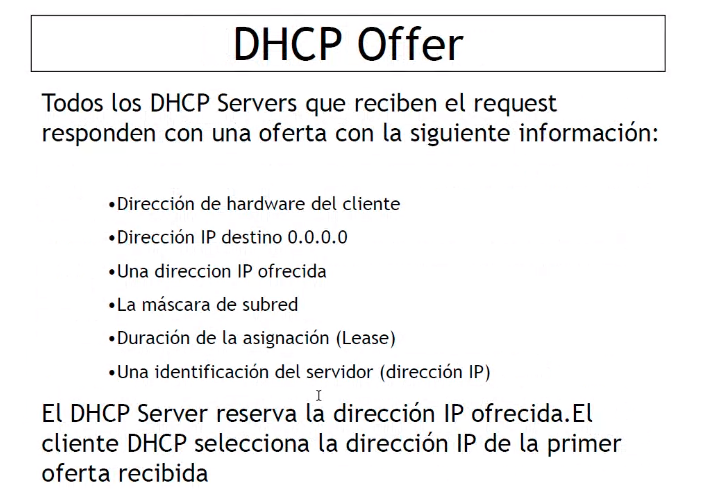
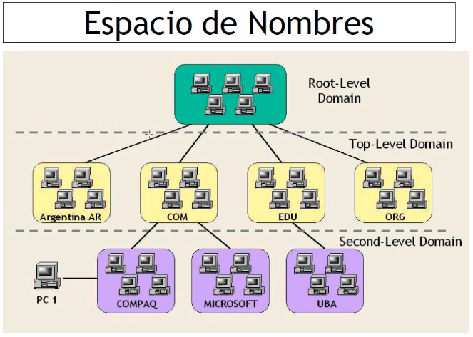
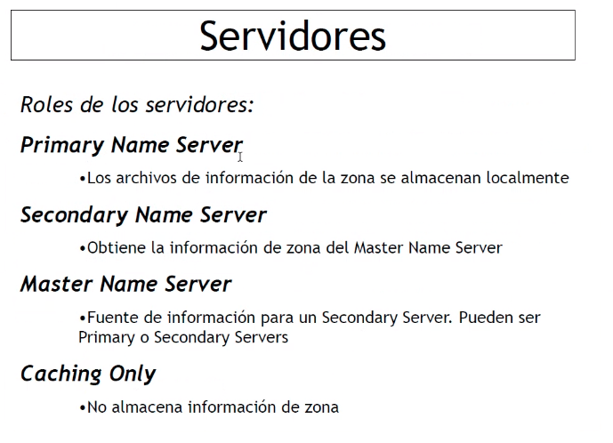
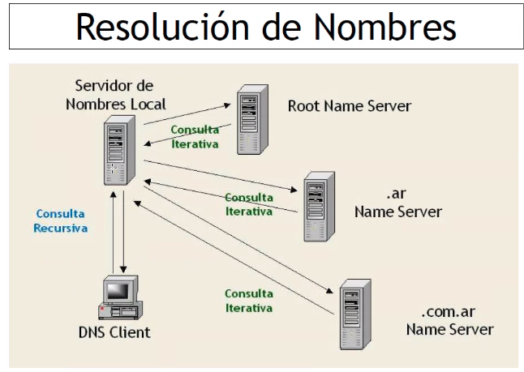
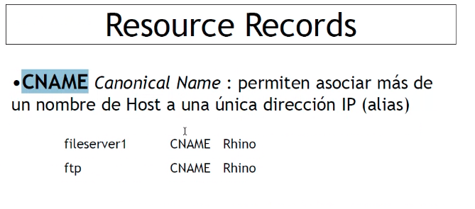
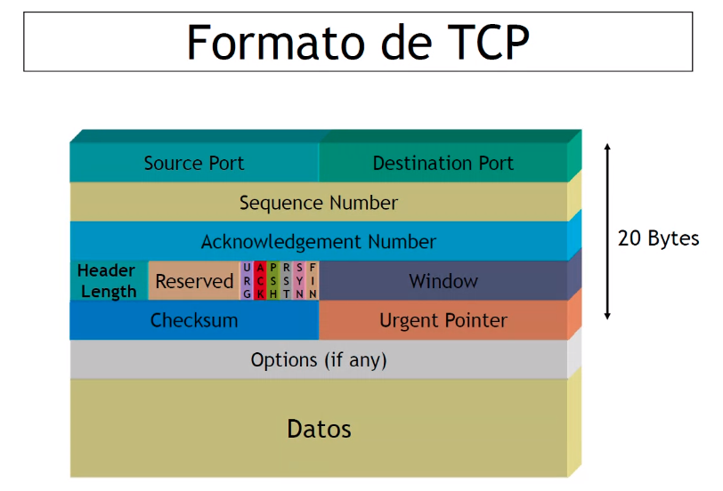
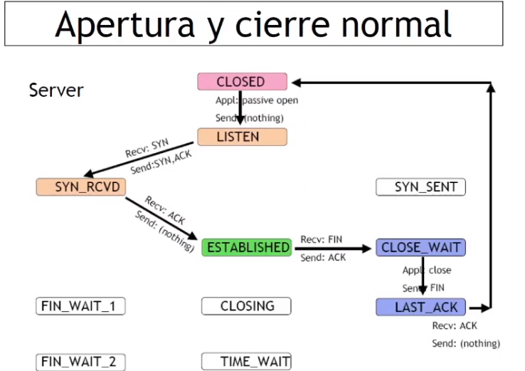
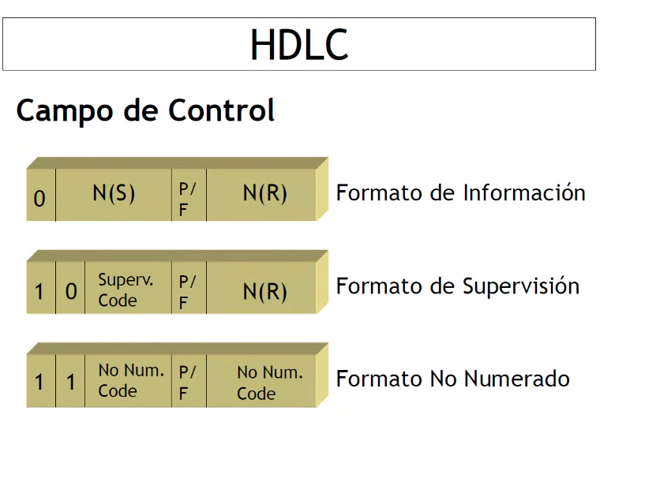
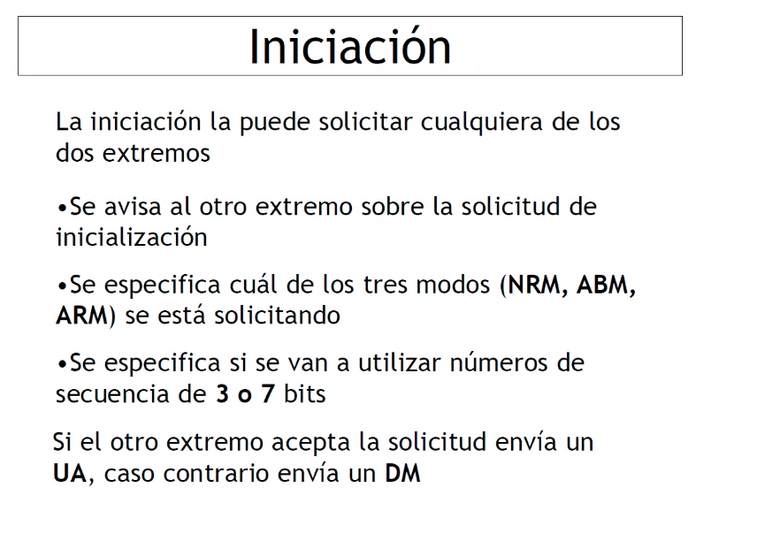
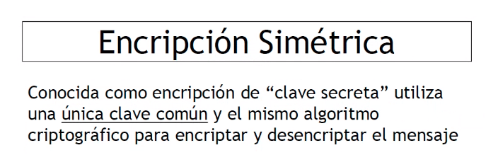

# 2DA PARTE
# **REDES DE INFORMACION** K4053
 


# ARP : Address Resolution Protocol [capa 3 model OSI, capa 2 model TCP/ip]
Destino inalcanzable</ins>
 

Motivos:
- **Network unreachable**: red inalcanzable, es decir, no sabe como llegar a la red.
 El router descarta el datagrama si no puede hacer la conmutacion (buscar el mejor camino al destino), es decir, no lo envia por ninguna interfaz. Antes de descartarlo, toma la cabecera de ese datagrama, lo pone dentro de un mensaje y se lo envia al remitente, indicandole que no puede llegar a la red
- **Host unreachable**: no sabe como llegar al host, aca son los mismos pasos que arriba. Si la red es alcanzable pero el host no, la situacion se da cuando el datagrama llega al host destino pero el HOST no responde a un ARP, porque esta apagado.. ahi se genera un host inalcanzable
- **Protocol (TCP/UDP) not enabled**: el protocolo no esta habilitado, muy poco comun que pase, porque siempre estan corriendos
- **Port not bound to a service**: el puerto no esta vinculado a ningun servicio, relacionado a TCP.
- **Fragmentation needed, but DF flag is set**: se informa el MTU aca, para que puedan acomodar el mensaje y dar el proximo salto
- **Source route failed**: fallo en el routeo de origen

## <ins>Tiempo de espera agotado [timeout]</ins>
 

Motivos:
- **TTl llega a 0**: basicamente te quedaste sin nafta
- **El host destino ha desistido a la espera de un fragmento**: le falto un fragmento al host, acordate que el host espera a recibir todos los fragmentos para re-ensamblarlos, entonces si no recibo todos, genera un error.

## <ins>Echo request/reply</ins>: el que usa PING xxx.xxx.xx..
 

- Si envio el REQUEST y recibo el REPLY, significa que existe un camino/ruta al destino y que tengo visibilidad a nivel 3, no garantiza que me voy a poder conectar, pero nos dice por lo menos que hay una ruta.

### Ejemplo PING:
 

el `time=..` tambien conocido como Round Trip Time, que nos dice lo que demoro en IR el request y VOLVER el reply, nos da info sobre el delay que tengo en la red.

## Traceroute(usado cuando no tenes respuesta del PING)
 

El traceroute te lista todos los saltos que va dando el paquetito hasta llegar al destino, puede ser que este trace se complete, o que no se complete.
tambien funciona con ICMP.
- Siempre el primer salto, es mi default gateway: el router
- Utiliza el mismo mecanismo del ping, pero aprovechando que el ICMP me va a enviar el mensaje "tiempo de espera agotado"
- El TTL en la rta del ping te da saber cuantos saltos hubo de tu paquetito a donde lo mandaste

command: 
```go
traceroute www.google.com.ar

1  _gateway (192.168.0.1)  1.170 ms  1.207 ms  1.245 ms
2  10.37.96.1 (10.37.96.1)  8.596 ms  8.728 ms  8.801 ms
3  100.72.6.109 (100.72.6.109)  13.330 ms  13.580 ms  13.680 ms
4  192.168.64.66 (192.168.64.66)  13.751 ms  13.858 ms  13.380 ms
5  100.72.9.189 (100.72.9.189)  13.609 ms  13.969 ms  13.885 ms
6  100.72.9.185 (100.72.9.185)  13.233 ms  9.926 ms  9.811 ms
7  10.242.12.18 (10.242.12.18)  10.610 ms  11.064 ms  11.207 ms
8  10.242.20.2 (10.242.20.2)  10.969 ms  10.879 ms  11.256 ms
9  cpe-200-115-194-182.telecentro-reversos.com.ar (200.115.194.182)  10.817 ms  10.599 ms  10.475 ms
10  74.125.242.209 (74.125.242.209)  12.492 ms  12.555 ms 74.125.242.193 (74.125.242.193)  11.044 ms
11  142.251.79.5 (142.251.79.5)  16.666 ms 142.251.79.175 (142.251.79.175)  10.321 ms  10.229 ms
12  eze10s03-in-f3.1e100.net (142.251.133.67)  11.924 ms  12.224 ms  20.298 ms
```

## <ins>Ejemplo traceroute</ins>
- Cuando el host A hace un ping a B, entonces se encapsula un mensaje `echo/request` en un datagrama IP con DA: B , SA: A. 
El router mira los ip, toma decision de conmutacion y lo conmuta. \
    - Que sucede si un router de todos los que estan ahi, no puede hacer esto? `destino inalcanzable = du `

- El host, ahora vuelve a hacer lo mismo pero lo envia con un TTL=1, entonces, ese mensaje cuando el primer router lo recibe decrementa el TTL, entonces pasaria a ser 0 -> lo cual genera que el router lo descarte. \
Al descartarlo genera un reporte de error al origen, ese reporte de error lo genera el **router** con
    - direccion destino : A
    - direccion origen: Router
obs: notar que el mensaje de error es "tiempo de espera agotado" [Request-timed-out]

A continuacion se envia otro mensaje pero con TTL=2, y pasa todo lo mismo pero con el segundo router.. \
 

- Haciendo esto, puedo determinar la direccion del router, lo cual me es util si veo que un router no puede hacer un envio, con esto se que router es.. y arreglo directamente ese router. \
Se aprovecha el error del timed out para determinar esto.


- OBS: **Reverse Lookup** con una IP, saber el DNS
- OBS: en el grafico primero, fijate que nos cuesta mas ir y volver al 8, que ir al destino final, esto pasa porque en el 8 es un dispositivo gigante que recibe una banda de requests o porque prioriza mas el paso de trafico que el lanzamiento de errores.

---

# Ruteo y Routing protocols [capa 3]
 

- **Determinar el mejor camino a destino**: consiste en revisar todos los caminos disponibles a la red destino y elegir el camino optimo.\
La informacion de topologia de red uitilizada para determinar la ruta otpima es almacenada en "tablas de ruteo"
- **Conmutar el datagrama**: conmutarlo consiste en encapsularlo en el protocolo de capa2, es decir, conmutar el datagrama signfiica cambiar la direccion destino fisica de la trama por la del proximo salto.

##  Tabla de routeo
Es donde se almacena la informacion de topologia, esto es, la informacion que tiene el host dispositivo acerca de la red. \
Basicamente te dice como va a ser el proceso de salida de la red, fijate que dice el gateway, en que interfaz esta, varias cosas.
 
- **Gateway**: proximo salto , es siempre un vecino. Cuando el proximo salto es `on-link` significa que voy a ejecutar un ARP.   
- **Metric**: calificador que me permite determinar (si tuviera dos entradas identicas) cual es mejor, cual gana... gana la que tenga **menor metric**


### Ejemplo
 

Cuando haces un 
```
ping 192.168.0.1
```
Se va a ir a fijar a la tabla de routeo y va a ir comparando entre todas las entradas, y se va a quedar con el "Longest-Match" que es el que coinicida con la mayor cantidad de bits.

- El primero fijate que coincide
- El segundo coincide todavia mas , fijate que es 192.168.0.0, pero la subnetmask es 255.255.255.0 lo que quiere decir que los primeros 3 octetos son iguales y de red
- El tercero lo mismo, pero desempata la METRIC
- El **cuarto** es el chosen, fijate que tiene todo `255.255.255.255` es una coincidencia exacta, por lo tanto, es esta quien se elije.  

**Siempre hay una entrada que coincide con todas, llamada la peor**
 

Que fijate que apunta al router (el gateway es 192.168.0.1), por eso no te tira un timed out si haces ping a una IP que ni esta en tu tabla.

OBS: el que llena toda esta tabla es el protocolo DHCP

### **Tipos de ruteo**
El ruteo puede ser:
- Estatico: configuracion de un admin , o un usuario. Tiene de malo, que no podes tener varios caminos para llegar a un destino, por lo que si se cae, cagaste.. eso no quiere decir que no exista el camino, sino que nunca lo configuraste.

- Dinamico: configurado por aplicacion. Gana en todo, como el problema de lo anterior, varios caminos, auto-busqueda y cambio de camino.

---

# Protocolos de routeo
## <ins>Objetivos de un Routing Protocol</ins>
- **Flexible**: respecto a la posibilidad de configurarlo
- **Optimo**: a partir de una topologia dada, el protocolo de roouteo encuentra el mejor camino para llegar de A hasta B. Piensa por vos, en vez de hacerlo estatico
- **Rapida convergencia**: si se rompe un link, mientras se propaga esa informacion de cambio de topologia en el link se dice que el protocolo esta convergiendo, y que convergio cuando termino de elegir el **camino nuevo** y se definio la nueva topologia
- **Robusto**: capaz de operar ante fallas
- **Simple**: pones una aplicacion que corre en los routers, es onda un algoritmo.

# Clasificacion de protocolos de routeo
 

- **Estaticos | Dinamicos**
- **Single-Path | Multi Path**: pueden elegir solamente un camino a la vez, en cambio los multi pueden elegir mas de un camino a la vez.
- **Flat | Hierarchichal**: (plano o gerarquico): si el protocolo es plano significa que el proceso corre en todos los routers y todos intercambian informacion entre si, esto es poco escalable, cuanto mas routes + volumen de informacion. El esquema gerarquico permite hacer areas, de manera que puedo armar areas entre una cantidad de routers y esos dialogan entre si, y las areas se conectan, entonces mantengo procesos reducidos de routeo.
- **Interior | Exterior**: el interior es el que corro dentro de mi organizacion, un protocolo diseniado para correr en mi red interna, si me quier oconectar con un tercero, deberia usar un protocolo exterior (como si fueran 2 companias).
- **Distance vector | Link State**: vector distancia o estado del enlace, son dos formas de hacer el calculo para definir cual es el camino al destino.
Los de distance vector calculan la distancia, es decir, cuantos hops hay de un lado al otro, y los de link state hacen un calculo mas complejo, toman en cuenta la distancia tambien entre una red y la otra y tambien los enlaces que interconectan a los nodos, la capacidad, el retardo, la confiabilidad, el **LINK state** es bastante mejor dado que toma several variables.

## RIP
 
 

Un router cuando uno activa RIP, empieza a enviar periodicamente por todas las interfaces donde yo activo el protocolo, un mensaje que contiene toda la informacion de routeo.

---
# **DHCP (Dynamic Host Configuration Protocol)**
### Protocolo de configuracion automatica.
Si bien yo puedo ir a configurar todo lo que es subredes, subnetings, metiendome a la interfaz de mi red y configurarlo... andaria bien y todo, no hay ningun inconveniente en eso. \
Pero el inconveniente cual es ? -> si yo lo hiciera en mi casa, y mañana me llevo el laptol a la oficina, me va a decir que no tengo red.. porque la red de mi oficina es diferente, entonces es clarisimo que la asignacion de las direcciones IP se hagan dinamicamente (es usado asi hoy en dia).
 

Hay un servidor DHCP en la red que es el encargado de asignar las direcciones IP en la red. 

### --->>>> EL SERVIDOR DHCP ESTA EN EL ROUTER <<<<-------

## Funcionamiento
Antes de activar la interfaz, se solicita una direccion. El servicio de DHCP corre sobre IP, entonces el DHCP client utiliza el protocolo IP para pedir una direccion IP, como lo hace? existen dos direcciones especiales que se utilizan exclusivamente en estre proceso que son las direcciones todos 0 y todos 1
 

- **DHCPDiscover**: se hace en forma de broadcast, le pide a todos los destinos en la red y le pide
- **DHCPOffer**: te ofrece una direccion IP
- **DHCPRequest**: si acepta te madna esta respuesta
- **DHCPAck**: akcknowledge, y el server se queda con que vos tomaste la direccion IP que te ofrecio
 

Aca fijate que al tirar el `ifconfig` te dice que DHCP server te dio esa ip

obs:
```
ipfconfig /renew
```
te pide una IP nueva al DHCP, te reincia la red obviamente.

### DHCP Discover (desde el cliente)
 

- Se envia como BROADCAST porque podrias tener mas de un DCHPServer.

### DHCP Offer (desde el server)
El que te da el server como "oferta"
 
- **Lease**: te dice por "cuanto tiempo presta" esta direcciones IP, te dice cuando la obtuviste y cuando caduca, el server te la presta por un intervalo de tiempo. \
Tiene una duracion porque es dinamico, la idea es que cuando yo la deje de usar, esa direccion la pueda tomar otra pc.

### IP Lease Selection (este es el DHCPRequest)
 

### IP Lease ACKnowledge
 

### IP Lease NACK (el cliente rechaza la direccion)
 

Esto podria pasar porque el host antes de aceptar esa direccion, lo que va a hacer es generar un ARP gratuito, es decir, el host pregunta en la red si alguien tiene la ip 192.168.0.100 , si alguien respondiera a esa peticion, tenemos un problema. Entonces el host le diria al server que horaesa IP no la quiero, eso puede pasar si el server te da una ip que la tiene configurada otro host estaticamente
---

### Intento de renovacion
 

Si el router me dio una ip y me deja usarla por 2 hs y 20 , cuando llegue a 1hs y 10 ,va a tratar de renovar el Lease, entonces se envia el DHCPRequest diciendo que te queres quedar con esta direccion, el server generalmente te dice que si.. y te dice "bueno quedatelas otras 2hs y 20" si el server no respondiera a este intento, el host sigue trabajando sin problemas, porque me la dieron por 2hs y 20, lo que va a pasar es que el cliente va a esperar a que transcurra la mitad del tiempo restante, es decir, 35 minutos y volver a intentarlo nuevamente, si te dice que no nuevamente, puedo seguir operando la mitad 17.5, en el cual intenta por tercera vez renovar el lease... insistiendo que se quiere quedar, si el SV no responde ese 3er intento, lo que tiene que hacer el cliente es volver a iniciar, soltar la direccion IP y pedir una con un DHCPDiscover. \
(notar que es RE poco probable que el DHCP te diga que no, en los inicios, si pasaba)

### Consideraciones de diseño
 

### DHCP Options
 

## Ventajas
 

---

# DNS (Domain Name System) : sistema de nombres de dominio
Diseñado para evitar el "recordar" las direcciones ip, el DNS simplemente nos permite asignar un nombre a una direccion IP. \
La imagen usa un archivo `hosts` que era usado antiguamente asi, y se almacenaba en el Stanford
 
 

- Resolvers: hacen consultas
- Name Servers: responden

## Espacio de nombres
El sistema de nombres de dominio tiene un espacio de nombres jerarquico, donde cada .ar.edu.etc.. referiere cada dominio.
 

- root level: generalmente no se escribe, pero es un solo punto
ej: `yahoo.com.` ese punto final dice "aca finalizo", el "com" es el top level domain, el "yahoo" es el mid leve domain
```go
frba.utn.edu.ar. // aca el top level domain es .ar
```
 
 

## Zonas
 
- El archivo de zonas tiene la asociacion final entre el nombre y la direccion IP
- Uno cualquiera no tiene un DNS server, uno usa un sistema de hosting donde me dan el servicio y un tercero se encarga de la parta de operaicon

## Servidores 
 

## resolucion de nombres
 

- EL resolver intenta de contactar a los server DNS para encontrar el nombre
- Cuando hago una consulta recursiva, el SV si esta disponible me da una rta final
- La consulta tiene caracter recursiva cuando existe una rta final
- El server de nombres local suele ser de caching only, es el que busca la asociacion empezando en:
    - root name server: aca busca el `.frba` , el root name server, sabe que .ar es responsabilidad de este servidor y le envia al otro
    - name server: lo mismo, dice "yo no se que es" y le devuelve la referencia del name server yendo al ultimo
    - ....

## tipos de consulta
 

## Caching & TTL
 

**OBS**: el famoso 8.8.8.8 es un servidor DNS de google, que es usado cuando el de tu proveedor es una proonga y no sabe resolver los DNS, el de google es publico.. y te ayuda mucho cuando no te anda

## Protocolos y puertos
 

## Resource Records
 
 

## Registracion de nombres
 

---

# VPN (Virtual Private Networks): red privada virtual
Tunel a travez de internet. 
 

Existen dos formas de hacer una VPN
- User Access: un unico usuario accede a una red remota
- Site to site: red a red

## Variantes de protocolo
 

- EL estandar hoy en dia es **IPSec**

## IPsec
 

### MODOS
- **Modo transporte**: forma mas simple de verlo: 2 hosts en la internet cualquiera, establecen una conexion y utilizan IPsec en modo transporte. Significa que esta conexion TCP va a estar **encriptada** es decir todo lo que haya dentro del cmapo de datos de protocolo TCP en capa 4 va a estar encrypted, entonces nadie que esta en el medio puede entender de que se trate, sin embargo, pueden ver **quienes estan dialogando** , porque solamente los datos estan encriptados
- **Modo tunel**: dos dispositivos gateways establecen un tunel de manera que van a encryptar todo el trafico de una red a otra red (no es entre 2 hosts, sino que es entre 2 redes). Aca solamente podes ver las direcciones IP de los gateway, no sabes ni quienes hablan.

### PROTOCOLOS
- **Porotocolo AH**: Autentication Header -> garantiza que el intercambio es entre los hosts que dicen ser
- **Porotocolo ESP**: Encrypted Security Payload -> garantiza lo de arriba y privacidad, es decir, encrypta la comunicacion entre dos gateways

 

## AH en modo transporte
 

## ESP en modo transporte (el mas utilizado)
 

## Implementacion
 
 
Lo que sucede es que vamos a configurar los dispositovos para hacer el tunel
el IPsec tiene dos fases:
- **Fase 1**: trata de la autenticacion y conexion de los gateways, permite que los 2 gateways se conecten y se identifiquen como "extremos" de un tunel. Si configuro lo mismo en los dos extremos, se elije el mecanismo de encripcion y algoritmo HASH en ambos extremos para que sean iguales, voy a tener completo lo que es la fase 1. Despues con el ultimo comando fijate que pones cual es el otro extremo del tunel y cual es la private_key que vamos a utilizar.
- **Fase 2**: una vez ya definido todo lo de arriba, tengo que definir "que va dentro del tunel y como voy a encriptar esos mensajes". Aca se define el "dominio de encripcion"= "que va dentro del tunel".
    - defino un crypto map en la interfaz publica de cada gateway
    - en el crypto mas podes tener multiples tuneles = multiples definiciones
    - el IPSEC 20 , ese 20 es el orden en el cual van a ser evaluados
    - el **peer remoto** es 192.168.3.1, que indica el gateway
    - el **transoform-set** es la forma en que define cisco como voy a encryptar los datos de fase 2 : ESP-3DES-SHA esp-3des esp-sha-hmac, entonces con el set transform-set le decis que voy a usar esta forma en este tunel 20
    - **match address 102** con esto digo que lo que va dentro del tunel esta con un access-list , es decir, el dominio de encripcion de este tunel lo define el acess list 102

---

# **TCP** : Transmission Control Protocol [CAPA 4]
- Protocolo punto a punto: solos 2 intervienen una comunicacion en TCP. Si quisiera hacer punto-multipunto TCP no es opcion.
- Orientado a la conexion: ambos extremos mantienen un control de la conexion, van llevando l;a cuenta de cuanta informacion transfirieron, cuanta mal, cuanta falta recibir, etcc.
- Segmentos: PDU de capa 4, 
- Confiabilidad: (confirma que la info llego a destino o que no llego)
    - Confirmaciones 
    - Timeouts
    - Retransmisiones
    - Checksum de la cabecera y el cuerpo(el control de errores esta en la cabecera y en el campo de **datos** , es decir, a la PDU de la capa de aplicacion)

 

## <ins>Cabecera TCP</ins>
 

## <ins>Source port y Destination port</ins>
 
- Conexion: par de extremos o endpoints
- Para una conexion tengo 2 extremos
    - ip local puerto local
    - ip remota puerto remoto
- Puedo iniciar multiples conexiones con un destino en un port determinado pero tiene que haber algo que varie en esa conexion, que varia? el extremo local. si yo abro un browser para ir a google (port 80), si abro una nueva ventana, me estoy conectando al mismo host, mismpo port, etc.. para poder mantener esto levantado por separado, el origen elije un puerto cliente diferente para no pisarse.
```go
Ej: (nota como cambia del lado del cliente el puerto 
de cada conexion, pero la ip destino no cambia)
- Al fin y al cabo, terminas siendo 3 clientes
```
 

## <ins>Secuence Number</ins>
```go
" se establece lac onexion entre los dos extremos " 
- context: el cliente envia un mensaje como si fuera un 
"GET" de http al server (de la derecha)
```
 
- TCP maneja todos esos mensajes rojos de retorno como si fueran una **secuencia de bytes**, es decir, como que cada mensaje es un byte.
- TCP va numerando los octetos con todos los mensajes que reciba, entonces cuando TCP envia ese mensaje al otro lado, se espera que se confirme, le dice "te estoy enveiando el sequence number 1" que indica que es el primer octeto en la secuencia de bytes que se intercambia en la conexion...
datos: 
- NOTAR QUE CADA MENSAJE PESA 200 Bytes, el byte 1 siempre va
- Si es el primer segmento, siempre el sequence number dice 1
- Al confirmar (ACK) te dice "Recibi bien 200 bytes, recibi bien 400 bytes, o recibi bien 600 bytes" sin inportar la cantidad de segmentos que se necesito para enviarlos. Porque la informacion es acumulativa, es decir, el receptor podria recibir el primer segmento y no confirmarlo inmediatamente, asi con el segundo, el tercero y recien con el 4 decirte "recibi 600 bytes"
- TCP no se maneja contando segmentos, se maneja contando bytes.. como si fuera todo una gran secuencia de octetos

- EL ACK siempre viene con [tam byte] + 1 , eg: 201 si son 200 bytes

## Header length
donde termina la cabecera y donde comienzan los datos

## Reserverd
Bits reservados

## 6 flags, URG, ACK, etc..
flags

## Windows
Mecanismo de control de flujo

## Checksum
Codigo de deteccion de errores

## Urgent Pointer (flag URG)
- cuando el flag URG esta prendido, este campo tiene sentido, es decir, "es valido".
- datos urgentes: la posibilidad de enviar en un mensaje datos adicionales que no forman parte de esta secuencia, esos datos son los conocidos **Datos urgentes**
- cuando hay datos urgentes, estoy mandando un mensaje adicional encima de los datos , entonces, si URG esta encendido el campo URGENT POINTER es valido.
- Imagina que el campo de 200 bytes le vas a agregar datos urgentes


### Como queres agregar datos urgentes (suponer 20 bytes urgentes, 200 bytes normales) 
- los datos urgentes se **Acomodan al comienzo**
- el puntero urgente apunta al **ultimo byte de datos urgentes** entonces, en realidad apunta al 20 + 1, para identificar que lo que sigue son los datos normales. \
    

## Options (if any)
 
En tcp las opciones hay algunas que son muy populares a diferencia de IP que ni se usaban, algunas famosas:
- MSS (maximum segment size)
- Timestamp
- Windows scale factor
- SACK (Selective ACK)

## Flags
 
- PSH: (push) -> le indico al destino que procese el mensaje tan pronto como pueda, no que espere queseyo.. 500 bytes, sino que lo haga tan pronto y que tambien me lo confirme. Muy usado cuando quiero algo inmediato
- RST: (reset) -> cuando uno de los dos extremos envia un RST se termina todo, es onda un `kill` , se da cuando uno de los dos extremos pierde el contexto, osea, no se sabe que se esta transmitiendo
- SYN: sincroniza numeros de secuencia
- FIN: el emisor no tiene mas datos para enviar

## <ins>MSS Option (maximum segment size)</ions>
Parecido al MTU de ip, pero de segmentos.
 
 

`A se comunica con B`
- A esta conectado a una red con un protocolo de capa 2 con un MTU = 296 bytes 
- B sabe que esta conectado a una interfaz con un MTU de 1500 bytes
- Si ninguno de los dos se dijera nada, que pasaria?
    - b armaria paquetes de 1500 bytes de grandes que al llegar al A deberian ser **fragmentados**
    - en el sentido contrario no habria problemas
- Basta informar el valor para evitar la fragmentacion porque los dos estan conectados a la misma interface.
- Con los mensajes SYN de cada uno
    - A arma bloques de 256 , no puede armar mas grande
    - B tambien los va a hacer de 256 porque A se lo pidio
    - Uno adopta el menor xq el otro se lo pide y el otro adopta porque es lo unico que puede hacer
- Como se pasa de 1500 a 1460? : `MTU - 40 bytes` (40 bytes porque lo que tengo como campo de datos de TCP le voy a teener que agregar un header TCP que ocupa 20 bytes y todo eso tengo que encapsularlo en un datagrama IP que ocupa otros 20 bytes, entonces si le quito 20 bytes de la cabecera IP y 20 de la TCP me quedo con un tam maximo de 1500 - 40  = 1460)
- Objetivo del MSS: fijar un size de paquetes que ambos extremos puedan manejar, y que se puedan hacer segmentos tan grandes como se puedan pero **evitar la fragmentacion**, si los haces demasiados grandes.. hay que fragmentar, entonces el MSS busca que no se fragmente.


## Timestamp Option
 

---

## **Three-way Handhsake (handshake de 3 caminos, establecimiento de TCP)**
La conexion TCP se establece en este intercabmio de 3 pasos
```go
context: se conectan A com B
- Entidad A: cliente (suele ser anonimo)
- Entidad B: servidor (suele ser conocido, sino no se le coencta nadie)
```
 

### Pasos:
```go
1. el cliente envia un SYN al server
2. el servidor retorna un SYN + ACK
3. el cliente establece la conexion enviando un ACK
```

Al terminar esto, se realiza la conexion TCP, esta es la primer etapa, el **establecimiento de la conexion** \
`(todos son segmentos TCP)`


- **`Segmento 1 SYN`**: Contiene un puerto origen y un puerto destino. \
el `SEQ=x` ese x es el 0 relativo, es decir, yo empiezo a contar a partir de X, X es como 0 para mi, si estuviera en el ejemplo de datos emergentes seria X=21, acordate, (20 datos emergentes + 1). X tambien es llamado el numero de secuencia inicial, es como que A le dice a B "yo empiezo a contar a partir de X"
- **`Segmento 2 SYN + ACK`**: Segmento vacio con el flag SYN encendido, el flag ACK encendido y algo en el campo ACK, que es el X que le informe en el primer segmento + 1, porque ACK es el proximo byte de datos que espero recibir. \
Aca tambien se envia un SEQ pero distinto, fijate que aca es Y
- **`Segmento 3 ACK`**: A toma nota de ese Y y te devuelve un Seq = X+1, ACk = y + 1 y los datos.. dado que ya no se espera ninguna respuesta (aunque en la practica el segmento 3 viaja vacio y no se envian datos)

## Apertura y cierre normal desde el lado del cliente
 

## Apertura y cierre normal desde el lado del server
 

---

## **CONTROL DE FLUJO**
Dos extremos intercambiando informacion tiene diferentes capacidades, no necesariamente los dos intercoluctores tienen la misma capacidad de procesamiento o el mismo poder de calculo... entonces como hago para que uno de menor capacidad dialogue con un server de mayor capacidad de ancho de badna, memoria, procesamiento, etc... incorporando un mecanismo que le pida que transmita mas lento y con menos cantidad de informacion. Esto es controlar el flujo, evitar que uno de los dos extremos sobrepase la capacidad del otro.

Se usa el famoso **STOP && WAIT**

## STOP AND WAIT
- A le envia un mensaje a B que B va aconfirmar
- si A tiene muchos mensajes para enviar, envia el primero y espera
- Es poco eficiente porque en todo momento hay solamente un mensaje viajando en uno de los dos sentidos, es HALF DUPLEX.
- Lo que debo hacer es permitir que se intercambien mensajes con una frecuencia que me permita hacer uso de ese ancho de banda.. : SLIDING WINDOWS

## SLIDING WINDOWS
 

En lugar de enviar un mensaje y esperar el ACK para enviar el siguiente, se establece una window = ventana, que es una cantidad  de mensajes que A le puede enviar a B sin esperar confirmacion. \
`W=7`: envio 7, pero tengo que esperar que me confirmen para enviar el 8avo, el 9eno, etc.. \
Ah pero, cual es el valor de ventana que mejor se ajusta?

# <ins>COMO HACE TCP EL CONTROL DE FLUJO</ins>
 

- Usa algo parecido al sliding windows
- Si usas W=7, a tiene la posibilidad de enviar 7 mensajes, en cuanto B confirma que recibio correctamente el primero, le esta habilitando a A a enviar el 8avo.. cuando le confirma que recibio el 2, le habilita enviar el noveno.. es decir, la confirmacion de que recibio correctamente los datos esta directamente ligada a el permiso a enviar mas
- TCP separa confirmacion de datos de permiso para enviar mas, entonces como lo hace? hay un ACK que permite confirmar y ademas hay un campo **WINDOW** que es el que permite indicar el tamanio de la ventana, ahora la ventana tiene tamanio **VARIABLE** en el tiempo.
- ACK=i, W=j , que es window? recorda, el campo de la cabecera TCP que dice que tiene 16 bits con la cantidad de bytes comenzando por el campo ACK que el receptor esta dispuesto a recibir, es decir, cuando uno de los dos extremos envia un segmento al otro le dice en el campo window cuanto credito esta dispuesto a recibir.
    - ACK=i, significa que recibi correctamente hasta i-1, espero recibir i
    - W=j, indica "podes enviarme HASTA j octetos" (comenzando por i)
    

## Ejemplo
 
A y B estan conectados.
- El tiempo transcurre hacia ABAJO, es decir, que en el primer instante de tiempo tenes esta situacion:
    - A puede enviar 1400 octetos a B, comenzando por el 1001 hasta el 2400, B esta preparado para recibir 1400 bytes, desde el 1001 hasta el 2400 (es identico)
    - Sucede que A tiene un segmento para enviar, porque A tiene un segmento para enviar? porque esto funciona asi, hay una aplicacion que le envia a TCP un segmento para enviar.. en este escenario y para simplicidad todos los mensajes tienen 200 bytes de longitud (elegido para simplificar).
    - A encapsula esos 200 bytes de paquete y los transmite, que es ese primer SN = 1001
    - Consumo 200 bytes del credito
    - En un instante siguiente otro mensaje de 200 bytes a transmitir, que hace la entidad A? lo puede transmitir porque en tu ventana, es decir, tu credito que B te dio te entra, entonces envia otro segmento de 200 bytes donde el numero de secuencia ahora es `1201` , y se consumen 200 bytes mas de credito
    - Nuevo segmento, pasa lo mismo (`CADA SEGMENTO ES UNA LINEA SN`) y ya me consumi 600 bytes del credito, y por lo tanto me quedan 800 \
    

## Pasando al segundo escenario
- Consumi 600 bytes, por lo tanto me quedan 800 (esos 3 mensajes de arriba estan viajando)
- Supongamos que B recibe los 3 mensajes bien, al momentos que los recibe, envia un mensaje donde le indica `ACK=1601` que es decir, "**Recibi correctamente hasta el byte 1600**" y ademas te envia un `WINDOW=1000`, es decir, te aumenta la ventana.
- AL recibirlos correctamente, te da mas credito y te setea ese 1000 a la ventana, es decir, te sumo 1000 mas a tu credito
- Entonces ahora podes enviar desde el 1601 hasta el 2600 (peeeeroo.. fijate que tarda mas en llegar ese mensaje, mientras tanto A sigue usando el credito inicial) \
 
    - desde el lado de A, ya te habia enviado 3 no??? 3 enviados, suponete que la aplicacion te envia un 200 mas, entonces como te quedaban 800 de credito todavia, lo envias mientras esperas la confirmacion de B
    - Llega otro, y consumis otros 200 , con un total de 400 y te quedan todavia 400 de credito
    - Entonces en este instante es como se ve en el lado de A, se enviaron 5 segmentos (1000 bytes, ninguno confirmado) y todavia te queda un credito de 400 bytes.. hasta que se da este punto
    - Al recibir el A de 1600, corres la ventanita mas adelante, entonces com ote llega el 1000 te adelanto la ventana hasta el 2601.., que te da entender que **SE ENVIO CORRECTO HASTA EL 1600** entonces esa window se aumenta hasta el **2600** por lo que tenes mas, pero hasta ese momento ya habias enviado 400.
    
- Si B te evnia una `W=0` te mata la conexion, es decir , "NO SE ENVIA MAS"

    
## Mecanismo visto desde el transmisor
 

---

## Mecanismo de control de errores de TCp
`RTO: retransmission time out` 
 

- si recibis un mensaje con error, TCP solamente puede descartarlo.. es lo unico que se puede hacer con un mensaje que contiene errores porque yo no puedo saber donde esta el error.

- A envia un mensaje y se recibe un ACK, cuando yo recibo el ACK tengo la confirmacion de que el mensaje fue recibido, fin de la historia.. si no recibo el ACK debo re-transmitir, cuanto tiempo espero por esa confirmacion? es lo que se conoce como RTO (retransmission time out) o timer de retransmision, es el tiempo que espero por la confirmacion. SI no llega dentro de este intervalo, se desipara la retransmision automatica

## EJ
 

- Tardo de salir de la red 1ms
- De mi host a europa tengo un camino mucho mas largo, lo que se tarda en ir y volver (ROUND TRIPE TIME) , si RTT = 250 ms , si mi PC tiene dos conexiones:
    - una con mi vecino que toy chateando
    - otra con un cliente que estoy en espania \
esta claro que estas dosconexiones no pueden esperar en la misma cantidad de tiempo por una respuesta, porque si estoy contectado con este a un RTT < 1ms, peudo tranquilamente suponer que que que que 3 RTTs es una exageracion de tiempo, es decir, que yo al respuesta de mi vecino la deberia recibir en el orden de los 3 milisegundos, ahora la respuesta del que esta en europa, la tendria que esperar por lo menos 500 milisegundos, que eso es medio segundo.
- se trata de hacer un calculo del RTO para que sea proximo al RTT.

## Volviendo a la opcion de tiemstamp
Esta opcion de timestamp me permite hacer un calculo preciso de cuanto tardo en ir y volver al otro extremo.

## Manejo de la ventana de congestion
 
 

- Suponer que al router le llegan multiples conexiones, podria darse que a un router le suceda una congestion.. que se da cuando todas las conexiones quieren usar el mismo canal de salida.

# COMPLETAR CON EL RESUMEN

---
# **HDLC + Frame Relay**
---

# HDLC: [High-Level Digital Link Control]
## El profe dijo que se va a ver medio por arriba, capaz completalo con el resumen de la mina - PERO DIJO QUE NO ENTRA LO OTRO JOJO
 

Cuando hablamos de un protocolo de WAN, estamos hablando de interconexion de redes.. es decir, un vinculo que conecta dos routers (en las redes LAN es el Ethernet). \
En cambio WAN suele haber variantes. (cada vez menos, el mundo va hacia Ethernet en todos lados). 

- Si yo en los dos routers no defino , el router por defecto usa el HDLC como protocolo de capa 2, esto permite mover paquetes (PDU de nivel 3) entre un router y otro a travez de este enlace, encapsulandolos en trama de este protocolo.

## Trama HDLC
 

- FLAG x2: indican el comienzo y fin de la trama (puede delimitar las tramas)
- Campo de datos: 
- Direccion: es irrelevante si el mensaje va de A a B o de B a A 
- Control: el posta... ahora lo evaluamos
- FCS: un CRC para control de errores

## Campo Control
 

- Hay 3 tipos de tramas porque HDLC es orientado a la conexion.. en las etapas (establecimiento y liberacion de la conexion) se realizacon con estas tramas no numeradas. (que son para iniciar y terminar la conexion)
- Tramas de informacion: informacion
- Tramas de supervision: interviene para funciones de control del enlace *(flujo - errores) si son numeradas

**El campo CONTROL nos dice que tipo de trama tenemos** (de las de arriba)
- Se define con los primeros bits que tipo de trama es (fijate la imagen)

## Iniciacion
 

`DM: disconect mode`

## Ejemplo de conexion
 
- Se envia la trama (peticion de conexion)
- Corre el Timer, si no hubo transmision , se re-transmite automaticamente 
- B responde con una Unumber Acknolwedge (que es la trama no numerada), en este punto queda conectado en enlace, a partir de aca se envian las tramas de informacion
- DISC es para desconectar
- UA para confirmar la desconexion

## Transferencia de datos
 
 

Parecido al SLIDING WINDOWS, te van dando mas credito y vas enviando
`NS`: numero de secuencia de las tramas
`NR`: el numero proximo de secuencia que espero recibir

## Intercambio de informacion
 
- A le envia a B un I,0,0 , NS es el enviado NR el proximo que espero recibir, si A envia una trama de info con esos valores
    - la I adelante de todo dice que es trama de informacion
- B recibe ese valor correctamente y en este caso es un ejemplo de que esta funcionado el `piggy-backing` que es montarse sobnre una trama que voy a enviar en sentido contrario y aprovechar esa trama para confirmar la correcta recepcion de la anterior.
- NR = 1 dice "espero recibir la trama numero 1" con lo cual te confirmo la correcta recepcion de la 0
- I,2,1 envia esto con NS=2 y sigue confirmado con el 1, porque B no envio nada mas
y asi... va muy rapido hoy el profe

- I,3,4 la envia B, el NR=4 dice que recibio la 3
- A cuando recibe esas dos tramas, NO TIENE NADA PARA ENVIAR, por lo tanto no tiene datos para enviar (este protocolo de data 2 funciona con ARQ, es decir, A debe confirmar la rececpcion de la trama xq sino se la van a retransimitir) y en este caso lo que hace es enviar una trama de confirmacion
- RR, 4 es la trama de confirmacion (RR: receptor preparado - receptor ready) entonces con esto te dice que esta preparada y te confirmo que recibi la 4.. a este punt oestan todas las tramas confirmadas, y nunca se cancelo el timer.

## Ejemplo 2 de intercambio de informacion
Como hace una estacion para suspender la conexion
 

- B envia un I,3,0 que dice que espera recibir la 0 y envia la 3 
- A confirma esa trama dentro de un intervalo T=1 
- (se plantea en este punto que A esta ocupado)
    - entonces lo que hace es enviar un RNR (receiver not ready) que le indica a B que no puede recibir mas tramas, sin enmbaro ese 4 le dice que recibio bien la trama numero 3, y que espera reciibr la 4
- en este punto queda temporalmente suspendido este enlace y B no puede enviarle mas tramas a A porque A se lo pidio
- B le pregunta a A si sigue ocupado, con una trama RR,0,P (esa P es el **Poll**) de esa manera le dice "no te estoy enviando nada , pero respondeme"
- A responde con un RNR, 4 , F (**Final**) que dice que "sigue ocupado"
- B vuelve a enviar un RR,0,P
- y en este punto A dice "OK, Receiver Ready, "ya estoy listo nuevamnete"
- B envia I,4,0 que era la trama de informacion


## Mecanismo de control de errores
 

- A envia la I,3,0 , I,4,0 y I,5,0
- B recibe solamente la 3 y la 5
- B dice "REJECT,4" diciendo que recibio la 3 y que falto la 4
- A retransmite y envia algunas mas fijate

## Ejemplo de la recuperaicon de un timer
 

- al haber una trama 3 que B nunca recibio, se cancela el timer porque A envio la 3 y nunca recibio confirmacion, entonces del lado de A antes de retransmitirlo automaticamente se realiza un sondeo
- A sondea a B con un RR,0,P preguntando si esta disponibiel
- B responde que si con RR,3,F
- Envia la 3
- B responde con RR,4

---
# Frame Relay (derivado del HDLC + powerful) - repasar
Cumple la misma funcion que HDLC pero agrega algo importante: MULTIPLEXACION

 

Permite mas nodos- conexiones entre distintas sucursales y asi.. mas flexible que HDLC

 

## Caracteristicas
 
`PVCs`: permanent virtual circuits: la idea de que sean permanentes es que te duran en el tiempo weeee


## Trama
 
 

Con el DLCI le decis el color , es parecido al 801Q vlkan tag, que con ese color le decis a cual de los circuitos virtuales le mandas la trama..
- DLCI tiene 10 bits en total = 1024 bytes, es decir, tengo muchos colores.. por lo tanto peudo crear muchos canales virtuaels

- Flag x2: comienzo y fin de la trama
- FCS: lo mismo que HDLC, un crc
- DATOS: igual
- Direccion: dos bytes , de los cuales los primeros 6 bits y los priemros 4 bits corresponden a este identificador de canal logico. 
    - C/R : es como el poll/final de HDLC
    - EA 0: indica si la direccion continua o termino (extended address)
    - EA 1 : indica el fin del campo de direccion
- NO HAY CAMPO DE CONTROL, se modifica el campo de direccion

## PVC
 

- UN PVC es una concatenacion de DLCIS 

## GESTION DEL TRAFICO

---

# ATM: Asynchronous Transfer Mode (tercer variante de protocolo de WAN)
## Modo de transferencia asincronoco, esparecido al frame-relay y al HDLC
- Permite multiplexar conexiones logicas (varios caminos)
- Surge como "tenemos que crear un protoclo nuevo que atienda el siguiente requisito"
    - red de transporte que me permita transportar multiples servicios.
    - se puede transmitir un enlace telefonico, datos, es decir.. jkuntar los dos mundos: los circuitos con los paquetes
- ATM permite esto, circuitos y paquetes
 


**Diferencias entre paquetes y circuitos**: \
- Los paquetes no son tan sensibles a la latencia ye lretardo, son ams sensibles a la perdida, cuando yo lo envio mi objetivo es que llege
- En el caso de las seniaels isocronos, la retransmision es inpensable.. yo quiero que llegue rapido en tiempo real (si no llega no importa, puedo tolerar cierta perdida pero necesito que llegue rapido y NO quiero retransmitir)

**Que planteo ATM?**: imaginate en el ejemplo de la casa central y la sucursal que quieren realizar una comunicaicon de video.  \
ATM parte los PDUS en bloque pequenios que no tenga un gran paquete ocupando el nodo durante un intervalo de tiempo de longitud variable.. entonces ATM parte todo en fragmentos de `53 bytes`, no es logitud variable, ni 1500 como ethernet.. sol o53.
- De esta menra se logra hacer un manejo mas rapido porque para conmutar una celda yo no tengo que ver donde empieza y donde termina, ni tengo que esperar a que termine, porque todas duran lo mismo entonces las puedos procesar a todas mas rapido -> el tiempo de procesamiento es mucho menor.

**Calidad de servicio**: imaginate que le ocntartas al proveedor un enlace para conectar tu casa central con tu sucursal, pero le decis ademas "el retardo total no puede exeder nunca los 100ms" eso es un parametro de calidad de servicio. \
en los otros protocolos no se podia eso, con ATM si podes contratar calidades de servicio

## Arquitectura de ATM
 

- el ATM esta compuesto por dos subcapas
    - subcapa atm
    - subcapa aal (adaptcion al atm): necesitada xq la unidad de transmision es de 53 bytes, imaginate que no podes realizar una comunicacion entre TCP/ip entre atm.. entonces esta capa de adaptaicon evita que el protocolo de capa 3 vea esta MTU tan pequenia, basicamente lo adapta al protoclo de capa superior

## red ATM
 

## formato de celda
 

## formato de celda - UNI
este es el formato que tiene la cabecera en formato usuario-red
 

- VPI/VCI: equivalente al DLCI o al color del trunk que vimos en frame relay, esto me indica de que color es la celda y a que destino va.. ahora porque dos valores? se decidio partir este valor en dos valores, un valor de camino y un valor de canal
    - I: identifier
    - P: path
    - C: channel
- Payload Type: tipo de cargo
- CLP: equivalente del DE frame relay
    - 0: alta prioridad
    - 1: baja prioridad (descartable)
- HEC: octeto entero para Header Error Control
- DATOS: 48 bytes de datos


## formato de celda - NNi (network to network interface)
- lo unico que desaparece es el GFC
- el control de flujo solamente se realiza en el ingreso a la red, una vez que estas en la red, ya no se hace mas ese control
 

## VPI / VCI
Yo tengo una conexion , el VCC es la conexion extremo a extremo entre una red ATM.
Esta conexion se establece dentro de un camino.

 


 

Se armo de esta manera porque los proveedores tenian la necesidad de manejar "hazes de conexiones" es decir, todas juntas. De manera que si quiero redireccionar conexioens de un nodo o de un group de usuarios, muevo el path con todas las conexiones que lleva adentro
- VP SWITCH: virtual path switch, en este switch ingresa un path y sale otro, pero las conexiones son inalteradas
- VC SWITCH: switches capaces de conmutar conexions y caminos, las dos cosas a la vez.. pueden cambiar los dos valores de VPI y de VCI.

Conceptualmente en una red ATM voy a tener algo muy similar a frame-relay
 


## Conexion ATM

 

---
# Seguridad en redes
## Contratacion de servicios no entra en el parcial
## VER CLASE MPLS que si entra
Criptografia</ins>
## segun el profe, se ve maso por arriba porque ya lo sabemos
 
 
 

## Cantidad de combinaciones y eso
 

## <ins>Encripcion simetrica</ins>
Tiene el inconveniente de esta unica clave, dado que adivinas eso y tenes todo.
- Sigue vijente por terminos de complejidad algoritmica, dado que requiere menos esfuerzo.. los algoritmos son mas simples
- Pagas con velocidad a costas de seguridad
 
 

### Algunos algoritmos viejos, menos el AES
 

## <ins>Encripcion asimetrica</ins>
Se logra que todo el mundo tenga acceso a esta clave publica pero NADIE puede acceder a la clave privada.
 
 
 

## Mecanismo para tener no repudio de los clientes
Sirve para que se sepa que es bob quien lo envia y que no pued adecir "yo no fui"
- Notar que este mecanismo te deja de lado los primeros dos componente fundamentales de seguridad.
 

## Como hacer que se den las 4 condiciones:
Bob debe ecryptar el mensaje con su clave pr ivada y luego volver a encriptarlo con la clave publica de alice, con esta doble encripcion se llegan las 4.
 

 

---

## <ins>Funciones de HASH</ins>
- Aca se utiliza para garantizar la integridad.
- La funcion de HASH debe cumplir con las 4 condiciones nombradas en la ppt.
 

### Ejemplo: fingerprint = digesto
 

## Ejemplos de funciones de HASH
- MD4 y MD5 ya ni se utilizan
 

## Firma digital: combina ambos mecanismos (HASH Y encripcion)
 
 
 

---
# TLS
# <ins>Transport Layer Security </ins>
Hoy en dia utilizado para todo..
- HTTP viejo paso a ser HTTPS, ahora no se conecta mas en el 80, sino en el 443
```go
 encripcion asimetrica
## Cuando sucede?
Todo esto sucede ANTES de hacer el GET / POST, osea es justo cuando pones enter en una URL.. es indiferente del post/get.. peeero el GET va encriptado.

 

---
# IP V6
- Muchas MAS direcciones
 

## Administracion del espacio de direcciones
- EN IPV4 son todas las IPS/ 64, no hay que volverse loco con la SM, ni la RED.
- La primer mitad identifica a la red y la segunda a la interfaz(asi es como ipv6 llama host)
 

## IPV6 Header
- Muchos menos campos que IPv4
 

## Version
- Dice 6

## Traficc Class 8 bits
- Evolucion de lo que solia ser el ToS

## Flow Label
- esta etiqueta de flujo nos permite identificar a todos los paquetitos como a un mismo flujo, diferencia de IPV4, donde se definian a los paquetitos como independientes entre si
- no hay que calcular el camino de los paquetitos, con saber a que flow label pertenece, vas a saber por donde mandarlo.
- tiene ineficiencia porque revisa cada paquete para saber la computacion

## Payload Length 16 bits
- Longitud del campo de datos 

## Next Header
- proxima cabecera.. es como el protocol de ipv4, nos dice uqe hay dentro del campo de datos, cual es el next hedaer que encuentro en el campo de datos? "TCP" en este ejemplo

## Hop Limit
- es el nombre nuevo para el campo TTL (Time To Live), en hops tambien.

## Source Address -> 128 bits
## Destination Address -> 128 bits

---

# Campos que desaparecieron? -> cabeceras extensibles
Notar que varios campos de fragmentacion y eso desaparecen debido a que SA y DA tienden a ser muy grandes, tiene un tamaniuo fijo de 40 bytes
- Se agregaron **cabeceras extensibles**, 
 

## Unicast Address Format -> direccion IP
 

## Sintaxis de la direccion -> ahora son HEXAS, olvidate de los bits como en ipv4
 
- La notacion con supresion de ceros elimina los ceros significativos.. y hace la direccion ams corta, nota fijate que la primera tenia 0000
- La notacion con compresion de ceros reduce todavia mas una notacion con supresion,
    - fijate que esos :: significa que van todos 0 cuantos? bueno los que necesite para llegar eso a 128 bits... pueden ir 2 , 3 o n octetos.

## Loopback ::1 [LOCALHOST]
Esto es un bucle, envie lo que le envie me lo retorne, es como la 127.0.0.1 (LOCALHOST)

## Default Route ::/0 [GATEWAY]

## Prefijos IPV6
 

## Tipos de direcciones 
 
 
 

## MULICAST -> distinto de broadcast
- EL all-nodes es muy distinto que el broadcast.
 

---

## Identificador de interfaz
 
 

## ICMP v6
 


## FIN

---

## q incluye el segundo parcial?
