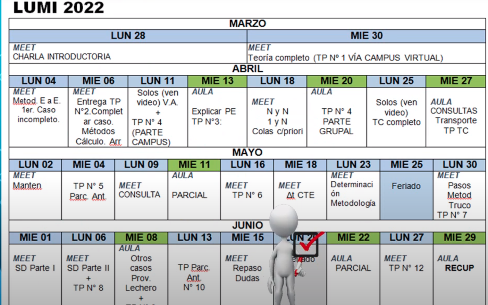
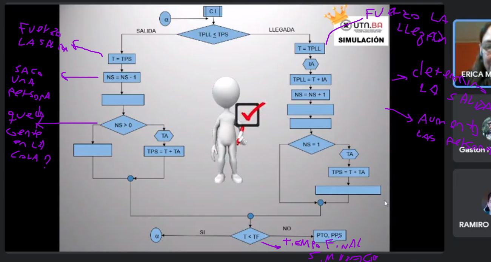
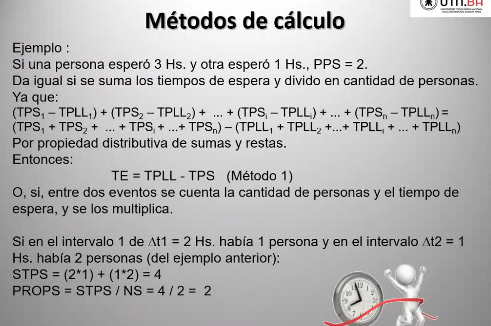
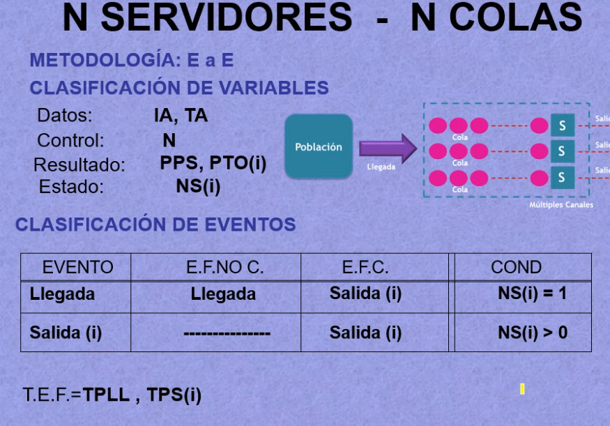
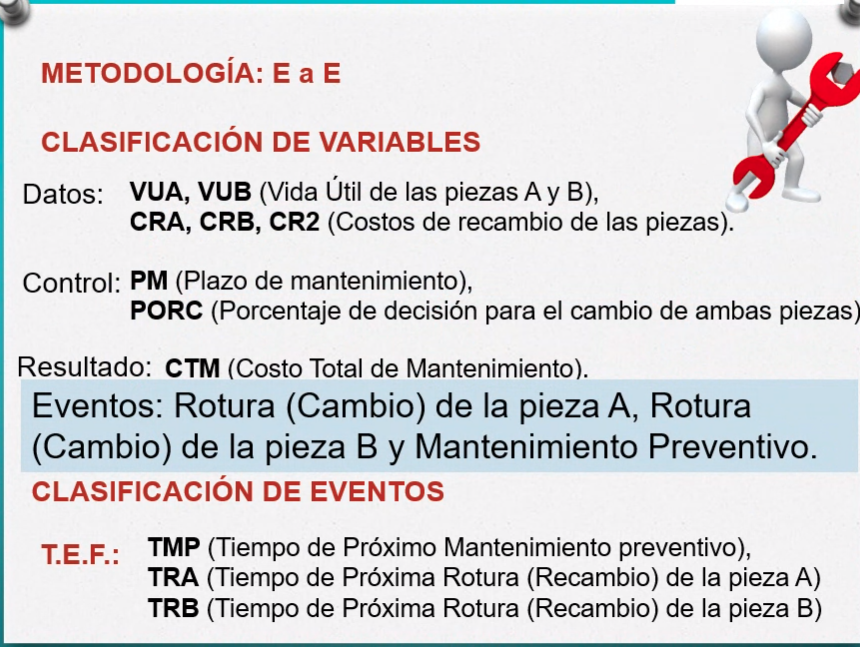
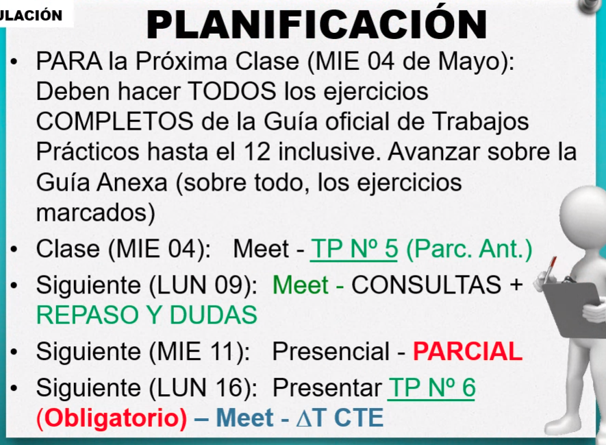

# **SIMULACION** k4053
### Horarios
## Lunes: **19:00**
## Miercoles: **18:40**


---

## **Simulacion**:
Herramienta que permite construir un modelo representativo de la realidad
cuyo objetivo es obtener informacion para la toma de decisiones. \
La siguiente simulacion simula poner ranas en cierto habitat y ver cuantas sobreviven


De la realidad yo tomo datos (fdp) que deben tener un limite, como por ejemplo la tasa de natalidad de las ranas


---

### **Clasificacion de los modelos**
```python
#POINTERS deterministicos estocasticos
# estaticos dinamicos exogenas endogenas ranas 
```


---

## **Metodologia de avance en el tiempo**
**Analisis Previo:** \
` exogenas endogenas datos control resultados estado `
- Clasificacion de las variables: EXOGENAS - ENDOGENAS
- Definicion de eventos 

ejemplos ranitas: 
- ((variable de estado)): N cantidad de ranas vivas
- **variable de control**: CC cajas de un supermercado
- **variable de datos**: NP cantidad de personas que ingresan, cantidad de personas que puede atender un cajero
- **variable de estado**: personas en una cola 
- **variable de resultados**: personas atendidas, arrpenetidas

### Eventos: 
Generalmente son verbos del sistema, es decir, 'ingreso de una persona', 'caida de una mesa' , 'choque de algo'


---

# **Metodologia de avance en el tiempo evento a evento** [a intervalos variables - irregulares]
```python
- a lo largo del tiempo ocurren determinados eventos (distancia variable)

- esta metodologia consiste en pararse en el primer evento, 
mirar todos los eventos futuros, una vez que ubico el futuro, 
me adelanto a ese evento, me ocupo de ese evento , hago lo 
mismo otra vez, me traslado, 

- la mirada es siempre hacia adelante (el futuro)

- en cada avance del tiempo me ocupo de uno y un solo evento
```
 
 
 
 
 

## **Regla tabla de eventos independientes**
 
 
```python
- cada evento debe ser el ownrer de su propia fila, es decir
  si tenes 4 eventos hay 4 filas, si tenes 2 filas hay 2 eventos, etc etc
- si un evento no te genera nada, deberia ir de todas formas en la TEI
- notar que en la segunda columna, si existe un e.futuro no condicionado
  si o si debe ir el mismo que en la primera
```
## **Ejemplo del perro muerto**
```python
ej:
- el evento 'TIRAR UNA MESA' no tiene nada que ver 
  con la 'MUERTE DE UN PERRO', es decir, yo no puedo decir
	que cada vez que yo tire una mesa, genero como 'EFNC' 
	la muerte de un perro.
```
 

```python
para que el evento futuro sea CONDICIONADO
deberia pasar esto:
```
 
 

### Importante
 

---
## **Caso de colas: FIFO**
 
```python
'OBS': para aplicar esta metodologia necesito un dato
que me concatene eventos, sino no la puedo usar.
por esto, a partir de la definicion de los datos / variables
decido que metodologia usar.
```
 
 
```python
- para llenar la columna de EFNC tengo dos opciones
o no pongo nada ('-') o escribo la palabra llegada.
aca como tengo el intervalo entre arribos , puedo determinar
cuando va a ser la proxima llegada, entonces aca va 
'LLEGADA'
TPLL = tiempo proxima llegada
```

```python
- 'OBS': solamente podes determinar un TPS si la persona
es la primera, pensa que si es la ultima no tenes ni 
puta idea de a que hora se va a ir
en este caso, es el 'INTERVALO ENTRE ARRIVOS'
```
 
```python
- el unico caso a partir de una llegada, en el que podes
determinar cuando va a llegar una salida, es con la primer persona.
sino no se puede.
es medio sentido comun, pensalo en un super.. vos si estas primero
y sos el unico, sabes cuando te terminan de atender (masomenos, por fdp)
entonces podes estimar cuando salir, en cambio si estas ultimo o al medio
no podes.
'la salida se da si NS = 1, '
cuando NS no es mayor que 0 , no puedo determinar el TPS
```
### Evento salida
 
 
```python
- sentido comun, pensa, si queda una persona en el sistema
es decir si NS > 0, entonces podes condicionar otra salida
- como no condicionado no te genera nada, no tenes ningun
IA que te diga cada cuanto sale alguien o algo por el estilo	
```

## Pasos de la metodologia
 
```python
1- 'determinacion del instante T en que ocurre el prixmo evento':
significa que "te vayas hasta la TEF y busca lo menor en todo lo que aparece"
porque si la TEF tiene variables que me indican las horas en que se producen
eventos, el menor es el que se va a producir mas proximo
2- 'avance del tiempo hasta el instante T '
3- 'determinacion del tipo de evento que ocurre en el instante T '
4- 'determinacion de los instantes en que ocurriran EFNC consecuencia del evento actual y llena la tabla de event os futuros'
5- 'actualiza el vector de estado del modelo':
aca es buen momento para actualizar las variables de resultados
6- 'determinar los instantes en que ocurriran EFC consecuencia del actual'
```

## Haciendo el modelo
 
### Calculando los resultados
 
```python
- TIEMPO OCIOSO: cuando no hay nadie para atender
- CONDICIONES INCIIALES: todas las variables = 0
- HIGH VALUE: el valor mas alto, sirve para forzar las salidas, generalmente
se pone en las condiciones indiciales 'TPS=HV'
```
 
```python
este programa finalizado tiene 2 errores, uno que hace
que entre en un loop o finalize el programa
y otro que tiene un error en los resultados

'EL ERROR': fijate que en ITO=T, no se esta modificando
ni el TPS ni el TPLL, por lo tanto nunca va a pasar que 
TPLL < TPS, por lo tanto entra en un ciclo infinito 
y asi no vas a poder salir nunca.
forzando TPS a HIGH VALUE, logras que sea mayor, entonces
entra una llegada.
```

# **Vaciamiento del sistema, metodos de calculo y arrepentimiento**
```python
- lo que paso en el modelo, fue que nos daba negativo
el Promedio de permanencia en el sistema PPS, porque nos 
daba negativo?
porque la resta de STPS - STPLL si esta resta dio negativa
significa que hubo personas a las que le sume cuando llego,
pero no les sume cuando salio porquie 'nunca salio', porque
yo corte la simulacion antes, entonces hubo gente que nunca
salio y nunca le sume el tiempo de salida.

```

## Vaciamiento del sistema
```python
- lo que sucede en los sistemas reales, por ejemplo un banco
 si son las 3 de la tarde, y quedan 5 personas, las atieenden
```
 
```python
esto lo voy haciendo hasta que NS = 0
onda un while 
```
 
```python
'SIEMPRE QUE SE PUEDA SE DEBE HACER VACIAMIENTO'
en caso de que el sistema no lo contemple, el metodo
de calculo apra determinar la permanencia es 
PPS = (STS - STLL) / CLL  {no funciona}
solamente funciona si 'existe vaciamiento'
```

## Metodos de calculo: usar siempre este
 
 
 
### probandolo con el nuevo metodo
 
```python
OBS: los delta T representan el tiempo que pasan
entre eventos sucesivos
```
 

---

# Arrepentimiento: cuando los clientes se arrepienten y se van
 
 
 
```python
- la rutina de arrepentimiento va justo antes
de aumentar las personas en el sistema, porque la persona
'mira' la cola y despues se fija si va a ser parte del sistema
o no
```
 

## Modelo con todos los agregados
 

```python
- para clase que viene:

1. crear ejercicio de victoria, con el ejercicio
n1 de la guia de trabajos practicos

1. el lunes ver la clase de variables alea
```

 
```
HACER TODO LO QUE DIJO LA PROFE SINO NO ENTRAS
A LA CLASE
```

---

# **Variables Aleatorias**
```python
- suponer que tiras un dado que 6 caras: 
```
 
```python
P(x): probabilidad acumulada: probabilidad
de que mas de una cara salga
ej: la P(2) es la probabilidad de que salga
la cara 1 o la cara 2
```

## **Metodo de la inversa**: que nos permite generar numeros aleatorios usado cuando la integral es facil
### pasos:
 

---

## **Metodo del rechazo**: integral dificl de calcular
 
```python
- este metodo nos dice agarra una f constante y ponela arriba
de la curva rara, llamado 'M'
- despues agarrar un punto que caiga abajo de la curva inclusive
si cae arriba, se descarta 'R1, R2' -> '(Xi, Yi)'
- si agarras un punt oque cae en la zona de aceptacion
lo retornas
```
 

### eficiencia del metoodo: como aumentar la eficiencia del method
```python
- 1 manera: bajas el M

```
 

---
# **N SERVIDORES N COLAS**
 
```python
'CONTROL': N (cuantas cajas usar)
'ESTADO': NS(i) las personas dejan de ser uan variable y ahora es un vector
```
 

### Modelo
 
### <ins>Rama LLEGADA</ins>
 
### <ins>Rama SALIDA</ins>
 

---

# N servidores 1 Cola (onda el correo argentino)
 

### <ins>Rama LLEGADA</ins>
 
 

### <ins>Rama SALDIA</ins>
 
 

## modelo
 


## COLAS CON PRIORIDADES
```python
CAJERO VIP: atiendo solamente vips, nunca atiende mortales
CAJERO NORMAL: atiende normales, y cuando termina de atender
se fija siempre en la cola de los vips, solo cuando no hay 
nadie en la cola de los vips, atiende a los normales.. esta ocioso
cuando no hay NADIE en ninguna de las dos colas.

```

## planificacion
 
```python
- HACER el 5 inclusive con prueba escritorio


```

---

# **TIEMPO COMPROMETIDO**
La diferencia de este loquito es que el tiempo de atencion TA se conoce desde que el **cliente llega al sistema**, no cuando empieza a ser atendido, entonces esto es SIEMPRE POR TC.
 
 
Tiempo comprometido: 
 

### <ins>ejemplo de ejercicio 1</ins> : 1 remis [1 servidor]
**OBS**: acordate que para llenar la TEI tenes que poner eventos que modifiquen
tu variable de estado, aca tu variabla de estado es el tiempo comprometido TC. 
Y como una salida no modifica el vector de estado, no va en la TEI.\
si "el tiempo de atencion se conoce desde que el cliente llego al sistema", se resuelve de una por **TIEMPO COMPROMETIDO**. \
Para aumentar el tiempo comprometido, tengo que saber si el remisero esta trabajo
o esta ocioso. \
**Por eso se pregunta T<=TC**:
- si es verdadero, el remisero esta trabajando. 
- si es falso, el remisero esta ocioso.
 

## **Arrepentimiento?:** pensa, si el cliente llama a las 21:00 y le dicen " no flaco, el remisero se libera tipo 23:00 lo queres igual? " el puede decir que no
 
 

### modelo completo con arrepentimiento
 

### condiciones iniciales
 

--- 

### <ins>ejemplo de ejercicio 2</ins> : 2 remises [2 servidores]
**Case**: le empieza a ir bien a la remiseria y agregan al hijo del remisero para tambien llevar gente, es decir, **2 tiempos comprometidos**.
- se comparan los TC1 y TC2, para buscar el menor.. pensa que vos le asignas el viaje al cliente con el remisero que este disponible, o mas cerca de estar disponible.
- si `TC1 <= TC2`: **el TC1 lo lleva*  *

 
 
obs: arrepentimiento y condiciones iniciales => iguales al anterior


### <ins>ejemplo de ejercicio 3</ins>: N remises (el verdadero caso de simulacion) [n servidores]
- menor TC[i]: el remis que esta mas cerca de atender al cliente
 
 

---
# VER CLASE DE TRANSPORTE Y ESO ACORDATE ( la que viste en clase )
---

# **Resolucion de casos especiales**: mantenimiento preventivo
## Ejercicio 12
 
 
```go
- ejemplo tuviste 2 piezas rotas una el dia 3 y el dia 9
y tenias mantenimiento el dia 10, lo que decidiste en este ejemplo
es arreglarlas vos y cancelar el mantenimiento sumandole PM=10 dias

```
 
 


## Rotura de A ( es igual que la rotura de B, no la hizo la profe)
* TMP - T : dias que faltan para el mantenimiento
 

## Mantenimiento preventivo
 

## TEI
 
 
 
 

---
## Ejercicio F1
 
 
 

## NEXT CLASS
 
se va a poder tener un MACHETE. hecho absolutamente a mano.
- calculadora, tabla de integrales, MACHETE


---
# PRACTICA PARA PARCIAL
## <ins>Parcial 2021</ins>
- Notar que si te dice la duracion de algo expresado en minutos, **NO ES UN DATO** a no ser que te diga que esta dado por una FDP o algo por el estilo.
- el TAD, era como algo general, fijate bien que siempre el enunciado te va a decir explicitamente cual es la variable de control, en este caso era ISS y IST 

**A)** \
 
**B)**  \
- Fijate que nunca te va a decir que hay varias "cosas" como en este caso eran ambulancias, te lo dice medio implicitamente, vos tenes que avivarte de que va a haber varias y poner el **(i)** al TC.
- Acordate que la unica metodologia que conoces es EaE, por lo que, siempre tenes que tener un dato concatenador de eventos, aca nunca te hablo de que el IA de las llamadas seguia una fdp o algo por el estilo, vos tenes que **PONERLO COMO DATO IGUAL**, sino no te anda.
- Siempre en la TEI van eventos que MODIFIQUEN TU VECTOR DE ESTADO. acordate de eso, siempre le erras y queres poner eventos de mas, aca solamente la llegada te modifica el vector de estado que es el tiempo comprometido, ninguno mas, ni la desinfeccion, ni nada.
 
