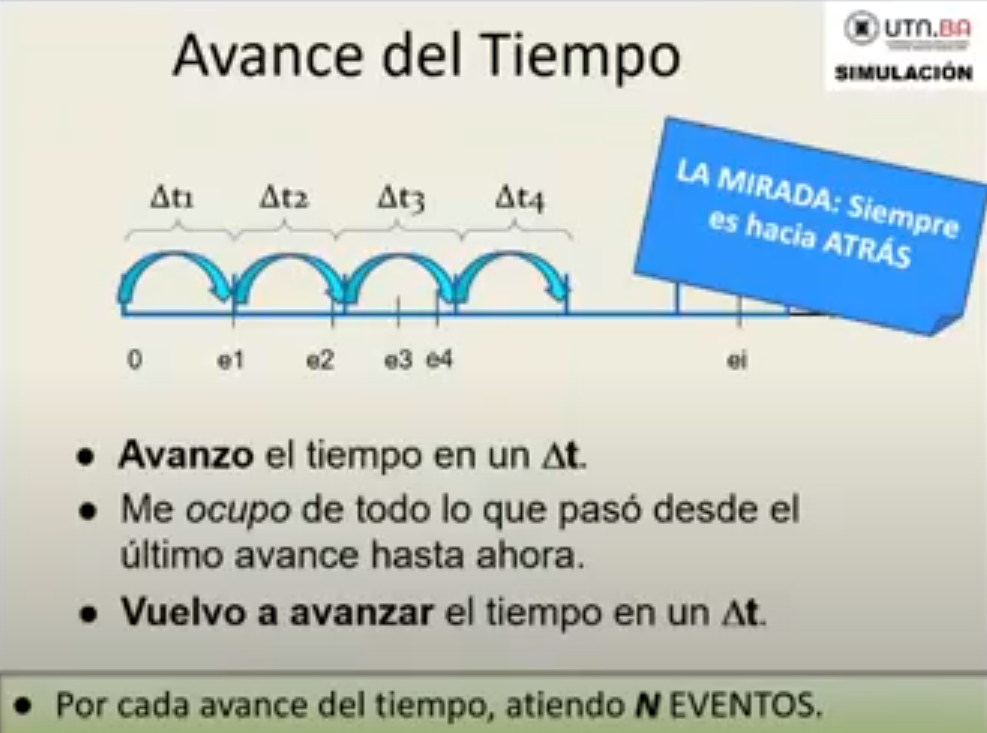
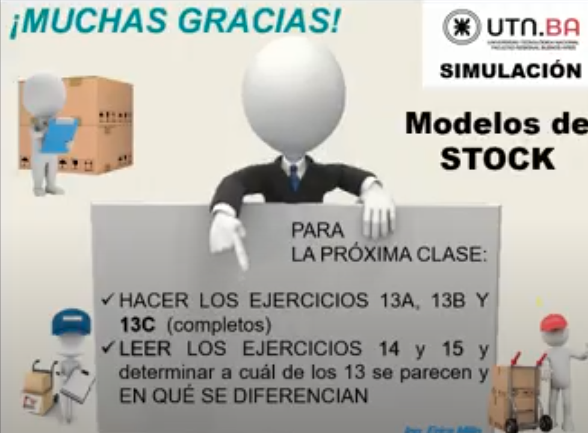
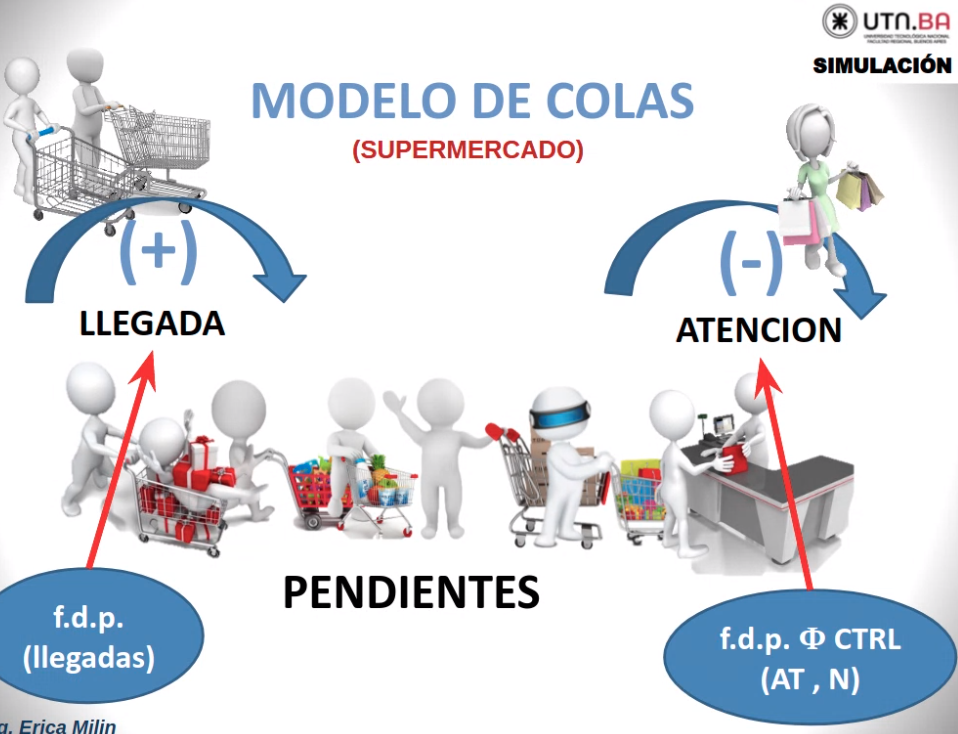
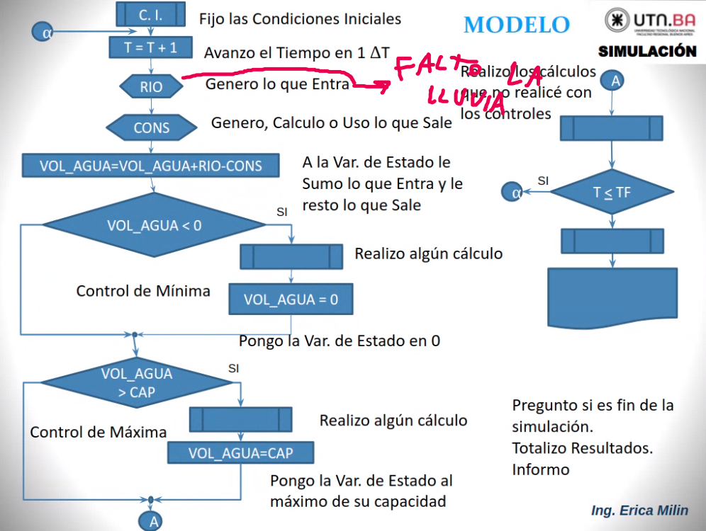

# **SIMULACION** k4053
### Horarios
## Lunes: **19:00**
## Miercoles: **18:40**

# **PROXIMO LUNES: TP6 -  19 hs**

---

# **Metodologia avance en el tiempo DELTA T CONSTANTE, o intervalos regulares**
- A lo largo del tiempo ocurren determinados eventos
- Entonces se divide el tiempo en intervalos de la misma longitud c/u, cada uno mide lo mismo
- Avanzo en el tiempo y me ocupo de todo lo que paso, vuelvo a 
avanzar, me ocupo de lo que paso, y asi..
 

### Diferencias con EaE irregulares:
- Por cada avance del tiempo, atiendo **N EVENTOS** 
- La mirada es siempre **hacia atras** porque miras lo que paso atras despues de que paso el tiempo
- Para poder aplicar la metodologia, debo determinarlo para cada caso.


## Eventos
 
 
LA TEI desaparece, ahora todo se clasifica en \
- **EVENTOS PROPIOS**: ocurren en el delta T actual y todos los delta T y lo mas importante, es que ocurren "porque si" es decir, si yo me pregunto "por que sucede este evento?" y la respuesta es "NOSE", al toque es -> **evento propio** \
obs: **pueden NO ocurrir en todos los delta T**

- **EVENTOS COMPROMETIDOS EN DELTA T ANTERIORES**: ocurre porque en el pasado se hizo algo para que asi sea y ademas ocurre en el momento que lo indica la **TEF**.

- **EVENTOS QUE SE COMPROMETEN PARA DELTA T FUTUROS**: son los encargados de 
lograr que en el futuro ocurra un evento, es decir, compromete un evento para el futuro y ademas son los **unicos** que pueden escribir en la TEF, si yo no tengo un evento que compremete para el futuro, no tengo nada en la TEF, es decir, la tengo vacia. \
**SON LOS UNICOS QUE PUEDEN ESCRIBIR EN LA TEF**


## Ejemplo eventos
 
 
 
 

# Pasos de la metodologia delta T constante
 

---
## <ins>Eleccion del delta T</ins>
 
Lo primero que se hace cuando determinas que estas usando esta metodologia, lo primero que tenes que hacer es definir este **Delta T**.: 

- El primer candidato, es la UNIDAD de tiempo en la que vienen los datos dados en densidades.
recordar:
    - dato en densidades: llegan entre 5 y 50 personas **por hora** a un supermercado
    - dato no en densidades: llegan personas entre 15 y 40 minutos \
Aca el primer candidato seria ese **por hora** es decir, DeltaT = 1hora

- El segundo candidato, es que yo tenga datos dados en distintas densidades/unidades ej:
    - Cantidad de personas que llegan **por hora**
    - Cantidad de atenciones que se realizan **por dia** \
### Aca se elije siempre la unidad **mayor**, es decir, el por dia

- El tercer candidato, es que algun valor fijo me **obligue/limite** a utilizar otra unidad de tiempo. ej:\
un hotel que me cuesta 2400 pesos por dia, llego a las 10 am, hago el checkin, y me alojo. Al otro dia me retiro a las 8AM , entonces estuve un total de 22 hs, por lo tanto lo que hago es mostrarle al tipo del reloj estas horas y le pago solamente **2200** pesos. \
nosotros hariamos esto? na, pero porque? porque 2400 por dia no esta dividio por hora , es decir, 2400 por dia no es lo mismo que 100 pesos la hora.
entonces los VALORES FIJOS no se pueden dividir. \
lo que si notar que vos podes **Estimar** valores, es decir, si te queres ir 10 dias de vacaciones a este hotel, vos podes estimar que te va a salir 24.000, hasta capaz te sale menos.
 

---
## Modelos de STOCK
 
 
- Notar que subiendo el grafico reducis las ventas perdidas 

## Clasificacion de variables
 

## Modelo
 

---
## Otro caso, RESERVAR VENTAS:
Esto pasa en los lugares monopolicos, donde las ventas que no se pueden cubrir por falta de stock, lejos de perderse lo que se hace es acumularse, es decir, se reservan.
Como por ejemplo la compra de una JOYA, si voy al joyero y no esta la joya que quiero, no voy a ir al kiosko de al lado y comprarme una joya cualquiera, lo que voy a hacer es preguntarle cuando trae joyas , por ej "3 dias" y espero 3 dias y voy la compro. \
En estos casos, las ventas **se acumulan** pero esto me genera un COSTO : (alfa4) \
 

### Modelo:
 
 
 

<ins>proxima clase</ins>
 

---

# Determinacion de la metodologia
 

## Ejercicio 13C
 
```go
'ATR': atraso = FLL - T
'ST': stock
'VD': ventas diarias
'VNE': ventas no entregadas = VD - ST
```
 

## Pasos para determinar la metodologia
Si uno saca la metodologia, lo demas los tiro, sino salgo con la metodologia, sigo con el siguiente paso
 

## Algoritmo
 

## Primer PASO: datos, en densidades? 
Si los datos vienen dados en densidades, la unica forma que tengo para resolver el caso es usando DT constante. No me queda otra, si tengo todos los datos dados en densidades -> DT constante, olvidate de la otra.
 

- Si tengo todo en densidades, chau papa.. adentro, DT constante.
- Si tengo los datos en encadenador de eventos: que hago? no se que es.. tengo que seguir con el segundo paso para determinar la metodologia

## Segundo PASO: valores fijo
- Si tengo un valor fijo dado por dia, no puedo iterar por menos de un dia, ni por menos, debes respetar la unidad de tiempo de los valores fijos(costos y eso)
- Ejemplo , si tengo un costo dado por minutos y los datos tambien por minutos, osea que si resuelvo por EaE voy a iterar por grupo de minutos, si lo resuelvo por DELTA T voy a ir minuto por minuto, por lo tanto no me saca con la metodologia

```go
AVER REY... esto es asi mira.
que mierda son los valores fijos? los COSTOS que te pide el enunciado,
VOS si tenes alguno de esos costos dado en una unidad de tiempo
que se repite entre ambos, ejemplo
- COSTO DE VENTAS ATRASADAS POR DIA
- COSTO DE ALMACENAMIENTO POR DIA

y tenes un intervalo entre arribos por ejemplo dado en minutos
entonces si yo resuelvo por EaE estaria iterando por minutos, no?
osea generas el IA, iteras y demas.. este paso te dice
" NI SE TE OCURRA HACER ESO " entonces de una salis con la 
DT constante, porque no podes iterar por minutos, entonces este
paso ahi te saca diciendo "che , sali con DT constante iterando
por dia "


```

 

## Tercer paso: informacion detallada
- Si el caso me pide informacion detallada a nivel evento, la unica forma de resolver es utilizando EaE. \
- No puedo obtener resultados detallados , como por ejemplo personas arrepentidas

 

## Cuarto paso: eficiencia del metodo

 

---

## Ejercicio 14
Diferencia: no tengo ventas diarias, tenes intervalos entre arribos y cantidad. \
Entonces -> aplicas los datos de la metodologia para saber cual vas a usar.
 
 
 

- Ya el paso 2 te lo determina que es por delta T constnate, porque si fuera por EaE estarias iterando por grupo de minutos. Aca te fuerza a iterar por un DIA y eso ya te condiciona que sea DT constnate.

 
 

### Rutina ventas diarias: esta rutina va a ser **Evento a Evento** y retorna las ventas diarias
 

---

## Ejercicio 15: parecido al 13A
Diferencias: IA y cantidad vs Ventas diarias
 
 

## Todos los pasos descartados menos eficiencia del metodo:
 
 

## **el que gana**:
se descarta por la complejidad algoritmica de la simulacion, fijate que es 4n si usas evento a evento porque vas evento por evento, si elegis DELTA T = 1 minuto, tenes que hacer 30 corridas para que pasen los 4 eventos

 
 


- Mi vector de estado ahora esta indicado por dos,
    - el indicador de pedido
    - el stock

### forma correcta de como deberia ser:
 

- notar que FLL == HV deberias preguntarlo, y no lo del FLL < T

### modelo:
 

### proxima clase
 

---

# Truco y verdaderos pasos de la metodologia
Este truco sirve solamente para cuando ya sabes que es delta T constante
- En un DELTA T no se puede determinar que eventos ocurren primero y que eventos ocurren despues
 

## TRUCO
**Algo que permanece**: estado
**Algo que sale y algo que entra:** eventos
 
 


## TIP PARA PARCIAL:
- Cuando en DELTA T solo aparece un evento.

## PASOS DE LA METODOLOGIA
 

## MODELO DE INVENTARIO STOCK
 
 

## MODELO DE COLAS
 
 

## MODELOS HIDRAULICOS
 
 
 

## MODELO POBLACIONAL
 
 

# Resumen modelos
 

## Proxima clase
 

---

# Simulacion dinamica, AKA continua, sistemas continuios, etc.. , [ultima clase]
 
 

## <ins>Pasos para hacer una simulacion dinamica</ins>
1. **hacer el mapeo de las variables**: es dibujar la relacion que tiennen las variables entre si en forma grafica, ver la relacion de las variables, con el analisis previo.. y asi hacer el diagrama de bloques o diagrama de forester \
esto es distinto de **DIAGRAMAS CAUSALES**.

2. **escribo la relacion matematica o logica entre las variables (sed):image.png**

3. **resuelvo el sistema de ecuaciones diferenciales por un metodo continuo**

4. **explotar los resultados mediante el uso de graficos/tablas**

- APRENDER EULER, RK II , RK IV

### software que resuelvan esto
 

## definiciones de dinamica de sistemas
 

---

# Elementos de los diagramas de bloques
## 3 BLOQUES:
 

1. **Variable de almacenamiento**: se usa cuando tengo una variable que varia durante la corrida, es decir, que no queda nunca fija ni estatica y que si o si tiene que tener variable inicial. Si se cumplen estas condiciones, no me queda otra que definirla como variable de almacenamiento, estan hechas para funcionar ocmo acumuladores, ej a++ a=a+b , etc... fundamentalmente el concepto es que si necesito ponerle valor inicial a una variable y luego va a variar -> es de almacenamiento
2. **Variable de flujo**: encargada de meter o de sacar cosas de la variable de almacenamniento, osea, es encargada de sumar/restar de la variable de arriba. En el dibujo es un flujo positivo porque fijate que tiene una nube a la izquierda y ala derecha la feclka
3. **Funcion constante**: sirve para poner ecuaciones, funciones o valores constante


 

4. **Conectores**: indican relacion, no flujo de informacion.. esta es una relacion de absoluta dependencia. Significa que si tengo un bloque a, b , c y se me ocurre unirlos, lo que estoy queriendo decir es que el valor de B depende absolutamente delos valores de A y de C

---
# Modelo de stock con simulacion dinamica
 

- Lo primero que hago cuando tengo que hacer un dinamica de sistemas es partir de la variable principal, cual es la principal aca? -> **el STOCK** , entonces partimos de aca..

## pensandolo con el truco: ( el truco en realidad es un diagrama causal )
 

## diagrama bloque
 

## creandolo y las ecuaciones con el software
aca T = TIME (en el software)

- entra ST fijate que se fija si esta FLL ocurriendo, osea, si FLL = TIMe entonces le asigna TP, sino )
 

- TP es circulo porque es constante en toda la corrida
- FLL es de almacenamiento

 
 
 


### ahora los resultados: cajas porque son almacenamiento y solo aumenta
 
 

## GRAFICO COMPLETO
 
 


## inicializando el CT(costo total)
 
 

### PROXIMA CLASE
- Hacer este

 
 
 
 

# TRIX R 4 KIDS

### BIFLOWS
 
- Se pone tambien una flecha que apunte hacia la nube
- USADO CUANDO QUERES REMPLAZAR EL VALOR, OSEA, NO ESTAS ACUMULANDO.

### SR : stock de reposicion
```go
Hace referencia al stock que vas a pedir para reponer
suele ser variable de control
```

## NO EXISTE NINGUN EJERCICIO QUE TENGA 1 SOLO EVENTO.

---

## DESBORDE NO ES UN EVENTO, ES AGUA QUE QUISO ENTRAR Y NUNCA ENTRO, NO MODIFICA TU VALOR DE ESTADO.

---

## MOD (TIME,24) y es obvio que es una hora

---

## MOD (TIME,7) y es obvio que es un dia
