# Redes 
Primer parcial 3/10
Segundo parcial 14/11

# Internet Routing - BPG: Border Gateway Protocol + summary latest cursada

**IGP**: Internal Gateway Protocols (dinsenioados para correr dentro de una organizacion)

Cuando mi red (de organizaicon) va a conectarse con otra organizacion, para esto existe una serie de protocolos llamado 

**EGP**: Exterior Gateway Protocols: diseniados especificamente para este caso.

Todos los proveedores de internet usan un EGP

-> En los clouds, por ejemplo, se usa **BGP**

# BGP: Border Gateway Protocol
Es el protcolo de ruteo utilizado en internet, utilizado por los ISP (internet service provideers) para comunicarse la informacion de rutas.

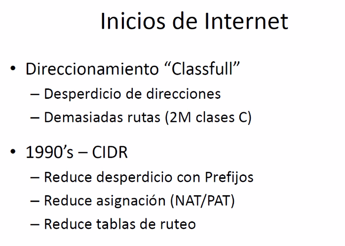 

-> CIDR inventado en 1990 : ahora no hay limites en las direcciones IPS, no existe desperdicio en los prefijos. la IANA solamente podia asignar una clase completa, no habia nada en medio, es decir 64k hosts o 265k (esto generaba desperdicio porque le dabas mas bloques a una organizacion que no utilizabas)

# Asignacion de direcciones

recordando:
- IP: `192.1.1.10`
- SM: `255.255.255.0` : es una maskara, dado que aplicado a la direccion ip de arriba, lo que es un 1 es red y lo que es 0 es HOST.

la mascara: 255.255.255.0 te dice que los primeros 24 bits de la direccion de red pertenecen a la red, (xq 24? 2^3 * 3 = 8 * 3 = 24)


el host todos 0 (QUE NO SE PUEDE UTILIZAR, porque identifica a la red): si tengo `198.1.1.0` y mascara `255.255.255.0` significa que todos los `0 < hosts < 254` estan en la red.
a esto se lo llama prefijo:

`198.1.1.0/24` = con esto estas diciendo que `198.1.1.0` y `/24` es el prefijo

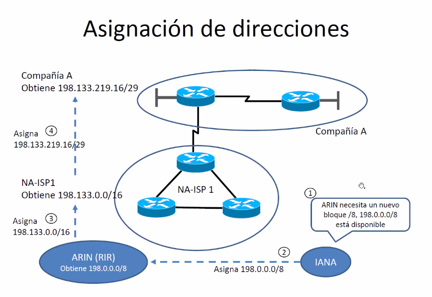 

1) ARIN:(American Registry for Internet Numbers) registro regional de norte america, le pide a la IANA un bloque de direcciones para repartir. (Esto ya no existe mas con ipv4 porque la IANA anuncio que se quedo sin direcciones ipv4 hace algunos anios, osea que esta funcion si bien no existe mas para ipv4, esta para ipv6)

2) asigna el bloque 198.0.0.0/8 entonces la SM: deberia ser `255.0.0.0` y los otros 8 son hosts(bastantes). esto esta hecho para poder dividr regiones

3) el RIR atiende a los proveedores de la region, porque estos proveedores necesitan estas IP para operar.
El arign en esta instancia asigna 198.133.0.0/16, lo cual indica que 198.133 es el prefijo de red y /16 la longitud.

NA-ISP1 obtiene 16 bits para repartir entre sus clientes (que son algo de 65536 (2^16))

# Agrupacion de rutas (maybe ver denuevo)
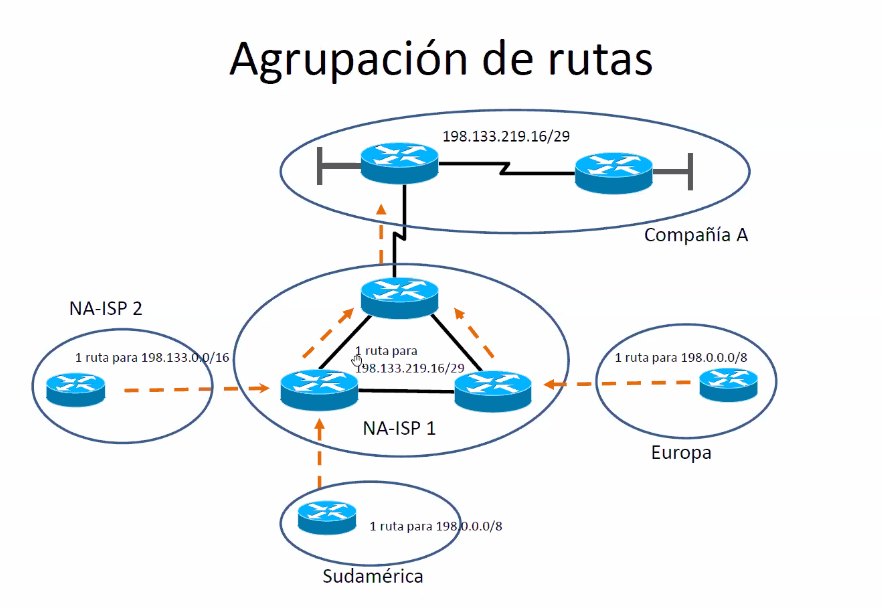 

Cada uno de esos circulos son servicios/provedores de internet, cada uno de esos nodos se comunican entre si con BGP

# BGP basics
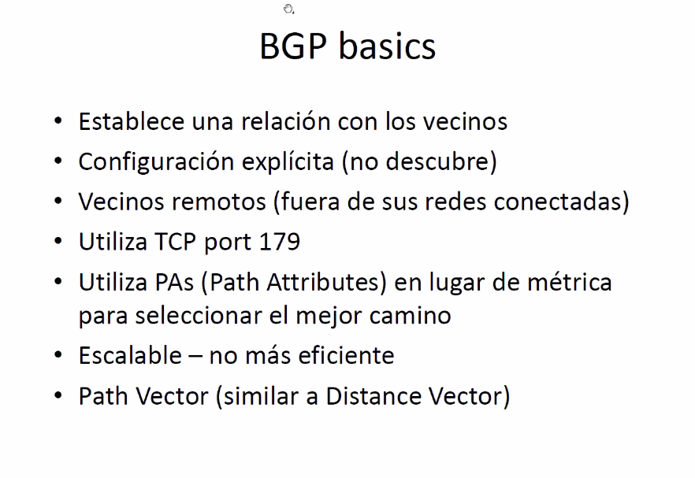 

Los ISP entre si usan este protocolo BGP

**Establece una relacion con los vecinos(routers)**: En BGP, hay ciertos controles de seguridad que nos interesan retener.. entonces, cuando conectamos dos dispositivos (dos routers) y queremos establecer una relacion BGP para intercambiar info de ruteo, debemos hacerlo de manera **Explicita** esto dice que c/uno de los rouyters debe configurarse de manera explicitca haciendo referencia al otro router con el que va a interactuar. (es tipo hardcodear las conecciones entre los vecinos, es EXPLICITO, no hay descubrienmiento ni nada)

**Vecinos remotos**(fuera de sus redes conectadas): BGP nos permite una relacion de BGP con un router LEJANO, es decir, un router al cual no estoy conectado pero puedo estar a algunos `hops` de distancia.

**Utiliza TCP port 179**: utiliza la coneccion TCP en el puerto 179

**Utiliza Path Attributes**: instead of "metricas para seleccionar el mejor camino (cuantos saltos)" . en BGP no hay un solo valor, hay varios en vez de "cantidad de saltos", sigue siendo un numero, que surge de otros factores: Atributos de camino:
"yo llego a este destino con todas estas X caracteristicas(Atributos del camino)" entonces el router en funcion de esa lista de atributos va a tomar la decision de cual es el mejor camino.
Lo importante de aca es que tenes mas cosas para comparar en vez de un simple numero

**Escalable**: dado que se utiliza en la internet, yo en mi red interna por mas grande que sea (miles de redes de prefijos para conocer), cuando hablamos de la internet, hablamos de cientos de MILES de prefijos (entradas en la tabla de ruteo) el BGP fue diseniado especificamente para poder lidiar con ese volumen de informacion

**PATH Vector**(similar a distance vector): lo que cuenta no son saltos, sino un "Sistema autonomo"

# ASN (Autonomous System Number)
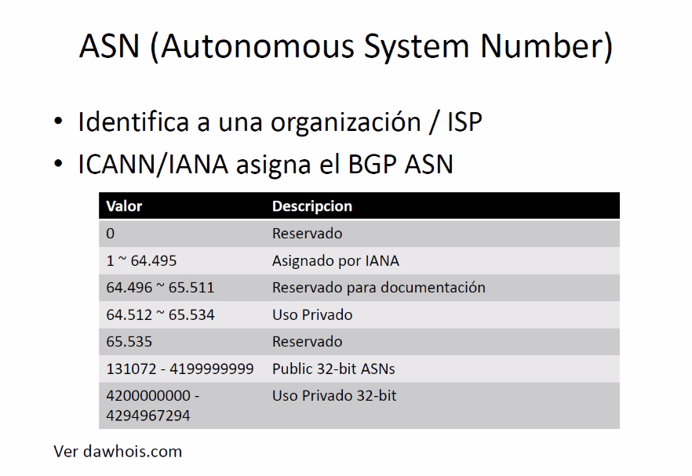 

Las direcciones IPS son agrupadas dentro de un sistema autonomo.

Existe en al internet un NUMERO de sistema autonomo: `ASN`: es onda un identificador de operador/ organizacion / ISP.

> La IANA es quien otorga el ASN
(paso lo mismo que con ipv4 -> se quedaron sin ASN) 

El ASN era un valor de 2 bytes de 16 bits

ahora se creo un nuevo ASN de 4 bytes: que identifica a la organizacion, 

## https://dawhois.com
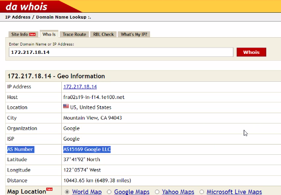 

Fijate como el AS number es de 2 bytes, entonces este numero significa que google es conocido en la internet con ese numero, es decir, las direcciones IPS estan "Agrupadas" dentro de un sistema autonomo.

```bash
(base) ┌──(guido㉿kali)-[~]
└─$ ping frba.utn.edu.ar
PING frba.utn.edu.ar (200.89.153.28) 56(84) bytes of data.
```
> 200.89.153.28

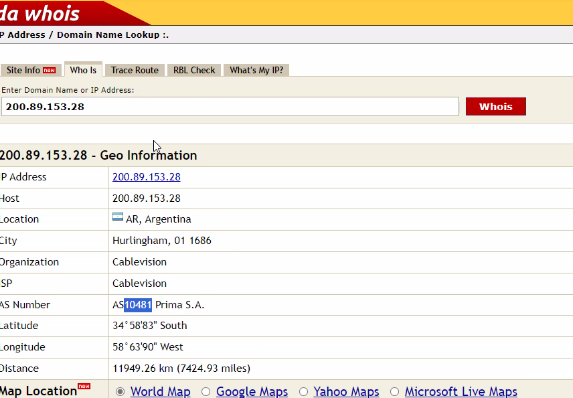 

(TODAS LAS DIRECCIONES IP PERTENECEN A UN SISTEMA AUTONOMO)

## https://bgp.he.net/{ASN NUMBER} 
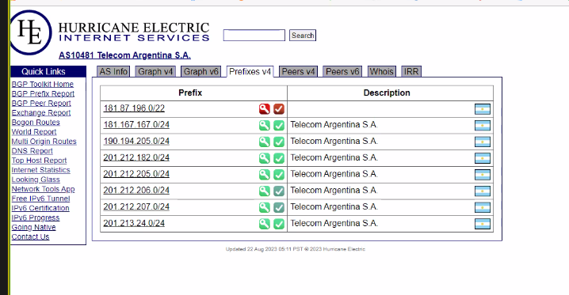 

> el Prefixes V4 te da todos los bloques de direcciones que pertenecen a ese sistema autonomo.

> GraphV4 te muestra de que manera estan vinculados los sistemas autonomos

porque hay varias sistemas autonomos? porque lo necesitaron o simplemente porque se fueron fusionando companias que tenian su propia sistema autonomo y esto no lo sueltan nunca mas, entonces es comun combinarse (es algo escaso).

# AS_Path PA: primer atributo del camino..
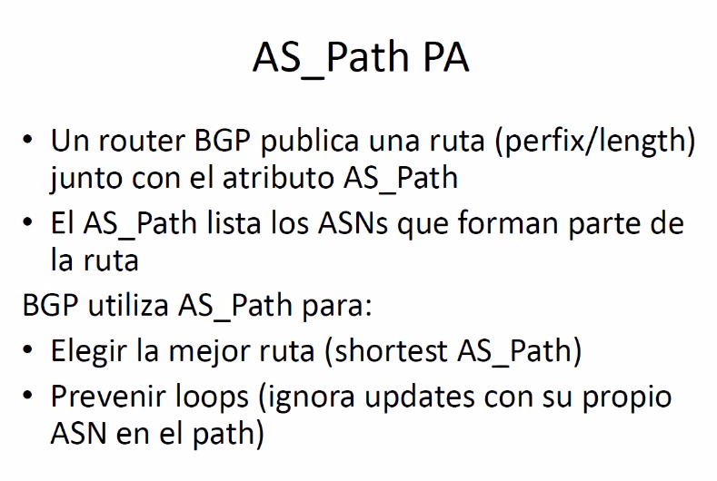 

- **Un router BGP publica una ruta (prefix/length) junto con el atributo AS_Path**:
- El AS path lista los ASNS que forman parte de la ruta

es utilizado para dos cosas:
- elegir la mejor ruta (shortest AS_Path)
- prevenir loops (ignora updates con su propio ASN en el path): previene bucles de la siguiente manera: hay un ASN que es el origen, el duenio del prefijo.. ese sistema autonomo lo va a compartir por BGP a sus vecinos (publicar) AS_Path indica cual es su sistema autonomo. entonces se va conformando una lista de sistemas autonomos que me indica todos los sistemas autonomos que tengo que atravesar para llegar a esa red destino. entonces la lista mas corta me da el camino mas corto, pero ademas, si recibo un update y encuentro que en la lista esta mi propio sistema autonomo, significa que por ese camino se genera un loop.

## Ejemplo de AS_Path (como se propaga la informacion de routeo)
Cuenta la cantidad de sistemas autonomos que hay que atravesar

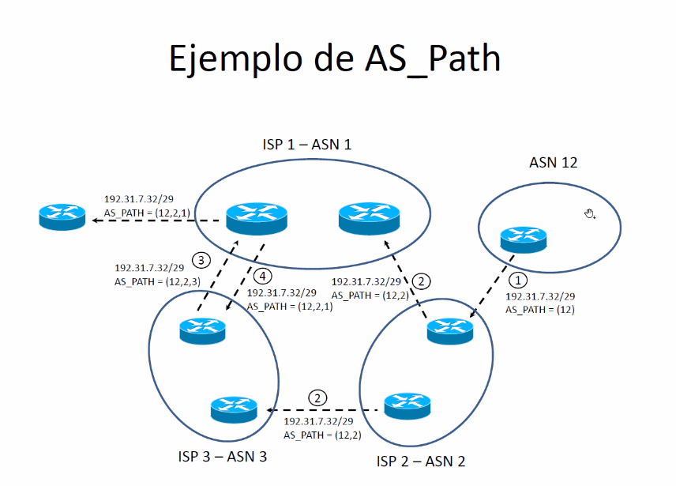 


- `ASN12`: ASN de origen, este router es el primero en publicar el prefijo en este escenario, este router se lo cuenta al ASP de la siguiente manera: \
> 192.31.7.32/29 , `AS_PATH = (12)` (que ese 12 es su ASN)

- `ISP2-ASN2`: conoce como llegar al ASN12 a travez del enlace que le hizo ASN12.
 Este le indica al `ISP1-ASN1` que conoce este prefijo, y le pasa
`AS_PATH` = `(12,2)``, es decir, agrega su ASN a la lista que le llego, lo mismo con el `ISP-ASN3`

- en el paso numero 3, el router le mandao AS_PATH = (12,2,3),

- en el 4, el ISP aprendio lo de arriba por otro lado, es decir una distancia mas corta, entonces el ISP1 elije el camino mas corto.

> NOTAR QUE EL CAMINO 2 ES EL MAS CORTO, y es el que eligiria el ISP1-ASN1

# Ruteo en internet 
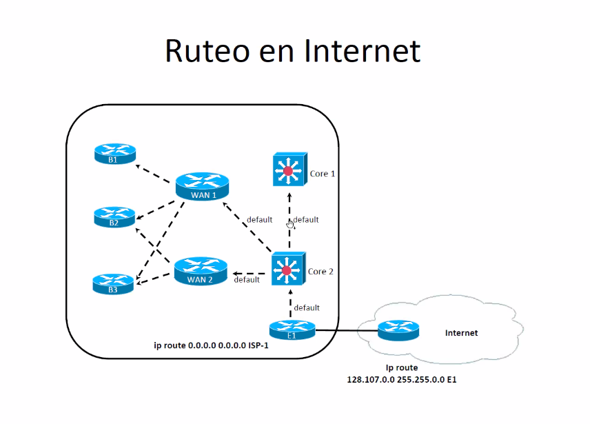 

> "Todo lo que no es conocido, esta afuera"

(esto es lo que pasa en la linea esa del E1 al internet)
`Default Route`: en mi tabla de ruteo yo tengo info de topologia, eso es la redes que conozco y por cual interfaz llego a ese destino, es decir cual es mi "proximo salto", pero tambien tengo una entrada conocida como `defualt-route` `0.0.0.0` y corresponde a la peor coincidencia - osea cuando entras a tu tabla y no tenes ninguna coincidencia, matchea con el default-route, y te dice `"ok, verdadero.. tu proxima salto esta en la internet"`

# Dual-Homed internet
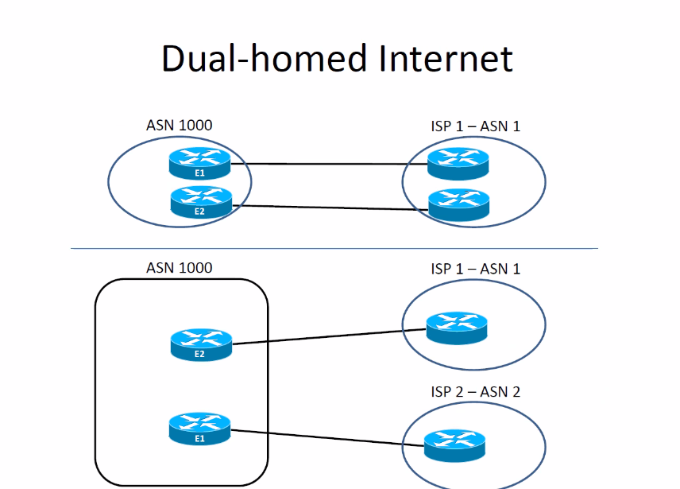 

> lo unico importante de aca es notar lo siguiente: 

solamente se puede acceder a los servicios por la derecha, es decir, por el ASN de los ISP.. no podrias acceder de una por los de la izquierda si se cae el servicio, porque ese webservice o lo que vos hayas publicado - pertenece al AS del ISP1.

Los dos caminos que ves en los de abajo son no redundantes e independientes.

# BGP updates
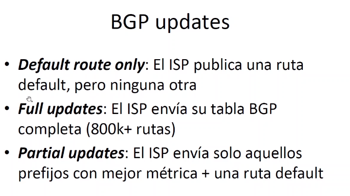 

- `Default Route Only` :
una pequeña empresa que se conecta a Internet a través de un ISP. En lugar de recibir todas las rutas individuales hacia diferentes destinos en Internet, el ISP solo envía una única ruta por defecto (0.0.0.0) a la empresa. Esto significa que cualquier tráfico que la empresa genere se enviará al ISP, y luego el ISP se encargará de enrutar el tráfico hacia los destinos correspondientes.

- `Full Updates` :
Un centro de datos importante, que opera múltiples servidores y servicios en línea, establece una conexión BGP con su ISP. Al inicio de la conexión, el ISP envía al centro de datos una tabla BGP completa con información detallada sobre todas las rutas disponibles en Internet, incluyendo alrededor de 930,000 rutas diferentes. Esto permite al centro de datos tener un conocimiento exhaustivo de las rutas y optimizar su enrutamiento interno en base a esa información.

- `Partial Updates` :
En este enfoque, el ISP solo envía al AS las rutas que han cambiado o las que tienen una métrica (preferencia) mejorada en comparación con las rutas anteriores. Además de estas rutas específicas, también se envía la ruta por defecto. Esto reduce el tráfico de enrutamiento y el procesamiento necesario en el AS, ya que solo se están actualizando y transmitiendo las rutas que han experimentado cambios o mejoras.

## More about BGP
BGP opera de manera similar a otros protocolos de ruteo:

- Aprende rutas de sus vecinos (como lo hace RIP x ej)
- Incorpora esta info en una tabla (la tabla BGP) - tiene varias entradas para ciertos prefijos, y de todos los updates se fija cual es el mejor y ese mejor se escribe en la `Tabla de ruteo` (esta es otra) - aca se escribe lo mejor.
- Analiza esta tabla para elegir la mejor ruta para cada prefijo y la introduce en la tabla de ruteo

### Configuracion minimia de BGP
- El propio ASN del router:
- La direccion IP de cada vecino, junt con su ASN:

- La configuracion de ASN local del router debe coincidir con la referencia configurada en el vecino: tambien llamada declaracion cruzada, es decir, del router A vamos a decir enfrente tengo al router B que pertenece al ASN2 y despues decimos del router B enfrente tenemos al router A y pertenece al ASN1 y esto tiene que coincidir, sino coincide? no se establece
- el BGP RID (Router-ID) debe ser diferente.
- La direccion IP del vecino referenciada debe ser alcan

# Tipos de mensajes BGP
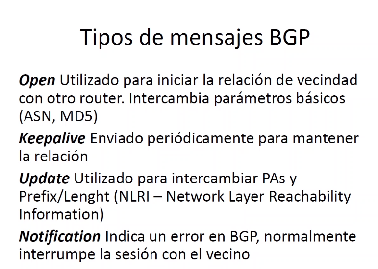 

## `Update`: cabecera, mensaje
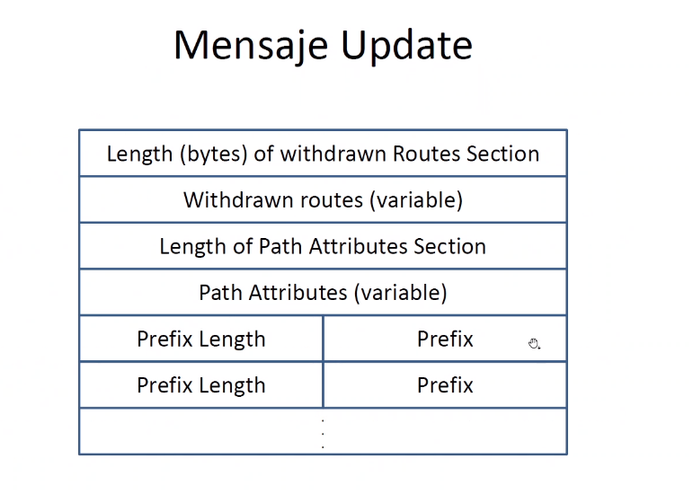 

este es el que contiene la informacion de ruteo, este es el mensaje que me da lo que yo quiero saber. tiene los Path attributes y los pares prefix/length que es la lista de prefijos que me esta publicando, es decir las redes que conoce mi vecino.

# BGP Pas : Atributos de camino | Path Attributes
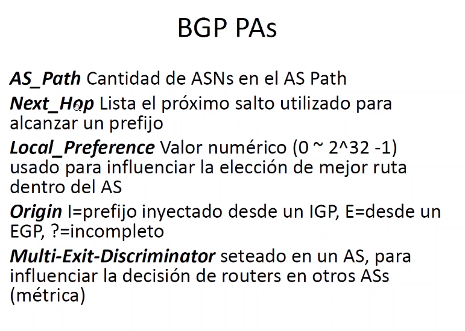 

`Next_Hop`: proximo salto, generalmente es el mismo del que lo envia
`Local_Preference`: usado para setear una preferencia sobre una determinada ruta

# Seleccion de rutas
Proceso de seleccion que analiza la tabla BGP para idtenficiar aquellas que se incluiran en la tabla de ruteo.

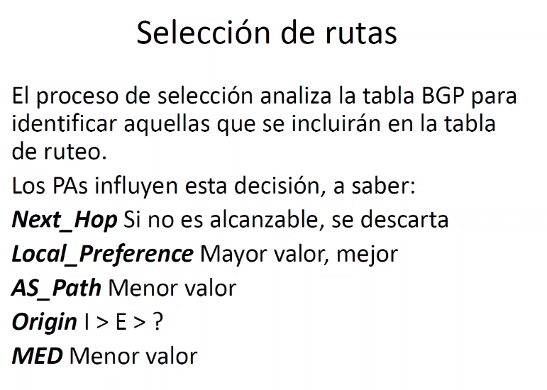 

---

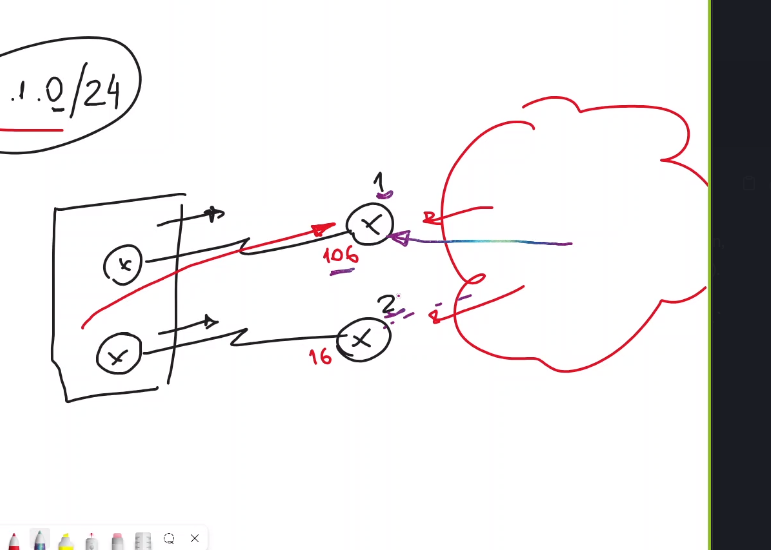 

Valor MED: menor valor: multiple exit discriminator: el menor valor es siempre mejor

--- 

# IP version 6  = IPV6
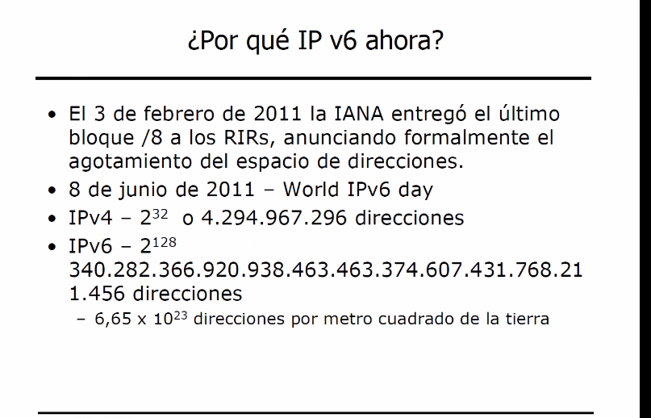 

`IPV4 = 2^32 bits de direccion = 4300M de direccioens`
`IPV6 = 2^128 bits de direccioens = impresentable`

## Administracion del espacio
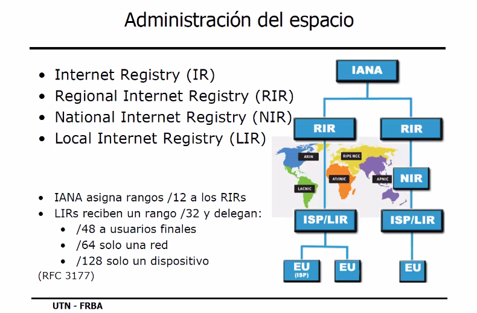 

- si queres un bloque de direcciones hoy en dia - si o si tenes que ser un ISP

- en IPV6 no se juega tanto con el subnetting y demases


# IPV6 Header
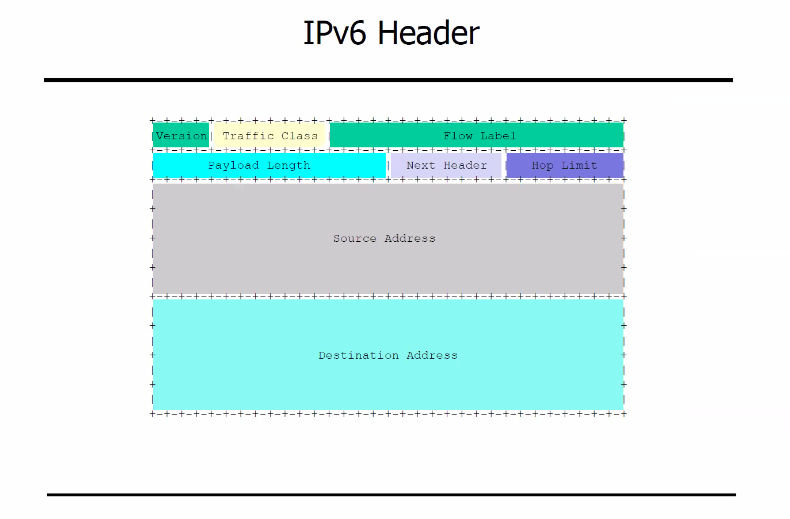 

> para comunicarse la entidad origen con el destino, usan la cabecera del protocolo (es decir, este Header)

> cuando la cabecera es mas grande siempre estas sacrificando bits de informacion que podrian ser usado para eso.. la cabecera es tipo un overhead, es un gasto.. entonces cuanto mas reducida es la cabecera -> mas eficiente es la transmision: en un mensaje vamos a tener mas bits de informacion comparados con la cantidad de bits totales.
se quitaron varios de los campos IPV4 y reducirla.

#### Cabeceras extensibles
todos esos campos que ya no estan presentes en la cabecera minima, pasan a formar parte de una cabcecera extendida y opcional - solamente si la necesito la incorporo.

- `Version`: IPV6

- `Traffic class` (8 bits)
Es como el "Type of service" de la ipv4 - la idea es implementar algun mecanismo de calidad de servicio: poder clasificar el trafico de acuerdo a su prioridad/urgencia, lo que me permita manejar de manera discrimnada diferentes flujos: mas rapidos los urgentes y sin tanta urgencia los que pueden esperar.

- [NEW] `Flow Label (o etiqueta de flujo)`
en IPV4 cada paquete era independiente, aca si puede existir una relacion entre paquetes.. es justamente este label la que permite idetnificar al paquete que forma parte de un flujo. 
(en ipv4 acordate lo de la talba que revisabas - esa tabla completa, asi se hacia la conmutacion) 
que gano teniendo una etiqueta de flujo con esto? si recibo el primer paquete en un flujo, tomo una decision de conmutacion y el siguiente paquete viene identificado como parte del mismo flujo puedo reutilizar esa decision de conmutacion, en vez de irla a buscar.. es tipo un cache.
(esta tabla tiene mas de 900k entradas)

- `Payload Length`(16 bits): queda igual que en IPV4 

- `Next Header`
Permite implementar estas cabeceras extensbiles: nos dice **que hay dentro del campo de datos**, sino hay ninguna cabecera extendida y lo que hay dentro del campo de datos es un protoclo de capa 4, por ejemplo tcp, aca tendriamos los mismos codigos que aprendimos en redes: 6 para TCP, 18 para UDP .. y este campo se comporta igual que PROTOCOL de ipv4.
si tenemos una cabecera extendida, **esto va a ser referencia a que lo que tenemos dentro del campo de datos es una nueva cabecera**.. y (las cabeceras extensibles se van referenciando)

- `Hop Limit`
Es el TTL, pero con el nombre puesto bien finalmente.

- `Source Address`: 128 bits
Direccion origen

- `Destination Address`: 128 bits
Direccion destino 

# Cabecera Extensible
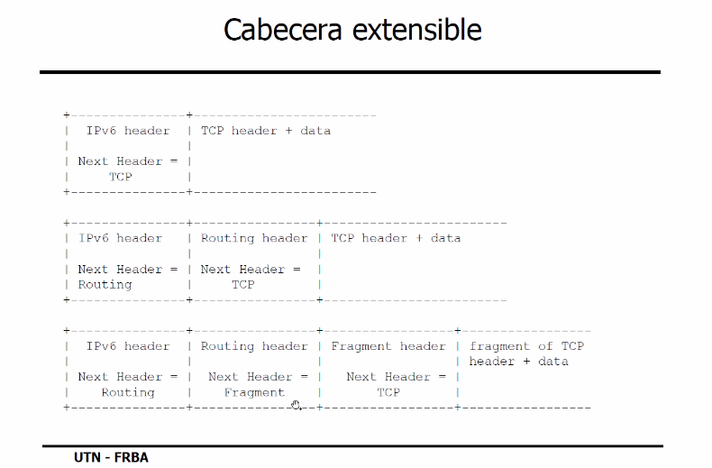 

- La fragmentacion es cada vez menos frecuente, por lo que, cabeceras como Fragment Header ya no son usados.

`Routing Header`: que habria en una cabecera de ruteo? "que camino seguir" - se suele ignorar este campo a veces por los routers.

# Unicast Address Format (RFC3587)
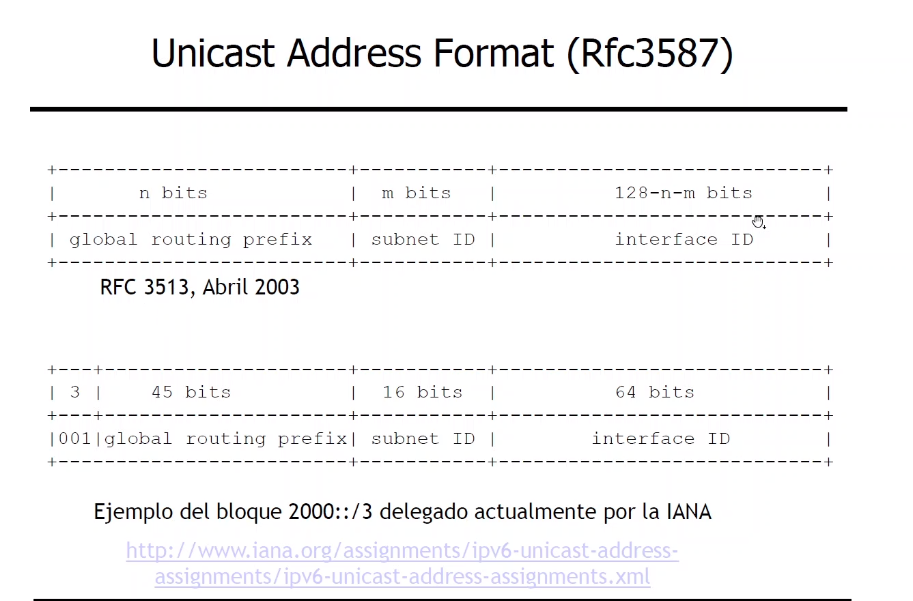 

> En IPV6 una direccion ip identifica a una `interfaz`, un host puede tener multiple direcciones IP.

Una interfaz es una placa de red en tu compu ponele, eso es una interfaz -> pero vas a ver que aca hay multiples direcciones IPS con diferentes propositos y son utilizadas para distintas cosas.

## Sintaxis de la direccion
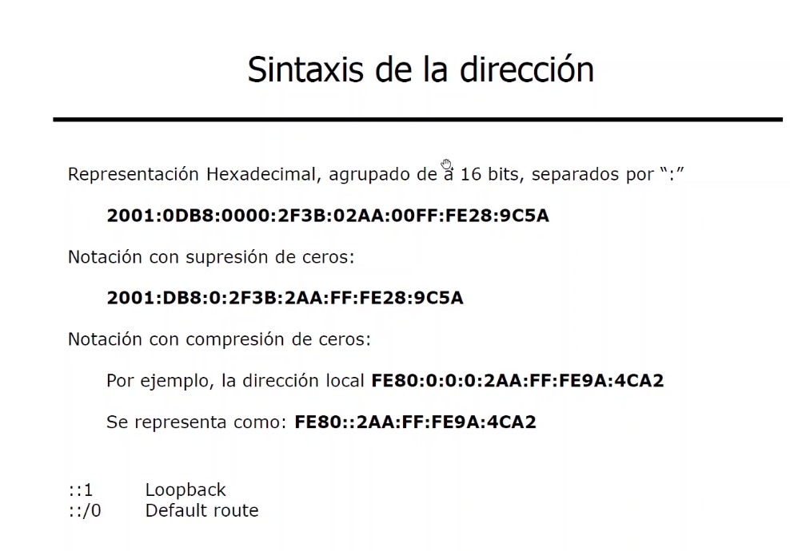 

 - Se completan las direcciones de IPV6 con ceros para rellenar los 128 bits.

`::1`: Loopback (equivalente al 127.0.0.1)
`::/0`: Default Route

## Prefijos
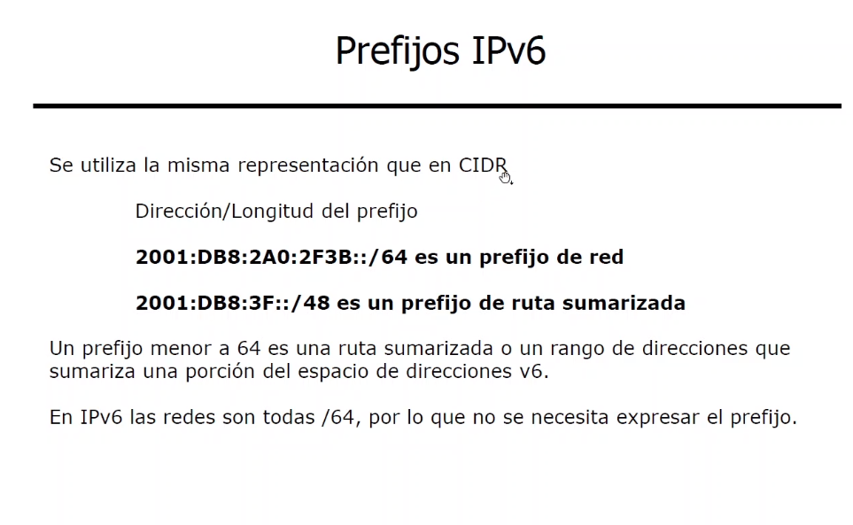 

> en IPV6 todas las redes son /64 => no hace falta expresar el prefijo

# Tipos de direcciones
En ipv6 hay muchos tipos de direcciones, como por ejemplo

## Global Unicast Addresses
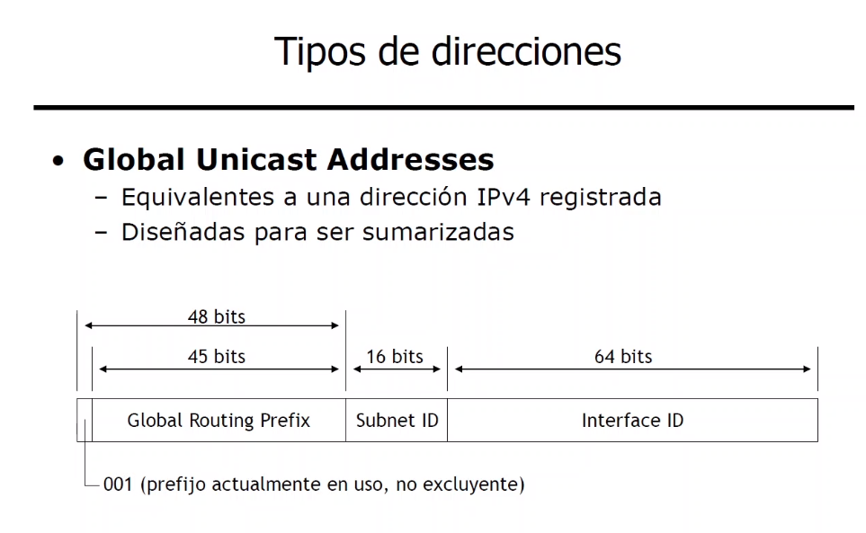 

Sumarizar? guardarse los primeros numeros que identifican a la red para agrupar en el router

esta direccion es publica, se me pueden conectar directamente de la internet y yo tambien.
```bash
eth0: flags=4163<UP,BROADCAST,RUNNING,MULTICAST>  mtu 1500
        inet 192.168.0.188  netmask 255.255.255.0  broadcast 192.168.0.255
 -->       inet6 2800:810:475:8948:ff1b:d9d8:c21f:e7d6  prefixlen 64  scopeid 0x0<global>

```


## Local Use Unicast Addressess
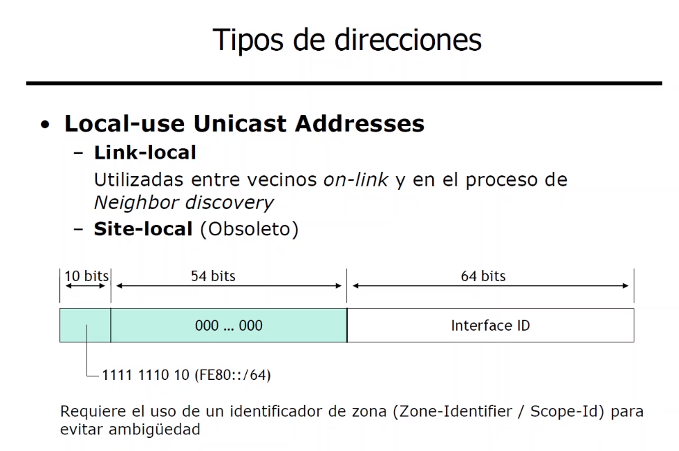 

- `Link Local`[FE80::]: una interfaz en un host, cuando activa ipv6 en una interfaz, automaticamente aparece una direccion llamada "link local" - utilizada para poder dialogar con vecinos directamente conectados, no la puedo utilizar para conectarme con alguien fuera de la red, sino que el alcance queda limitado a tus vecinos de la red (neighbors)
las que salen con Link Local tiene TTL=1 (es decir, 1 solo salto como maximo para que no se escapen del router y mueran ahi en el router)
todas arrancan con `FE80::`

nota como en tu `ifconfig` tenes que `fe80::` eso significa que toads tus inferfaces estan en esta red local fe80 todas conectadas.
esto genera ambiguedad porque sinno no sabes por cual interfaz salir, entonces para esto se usa un `Zone-Identifier / Scope-Id` para evitarlo.

> todas las interfaces estan conectadas a la `fe80`

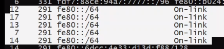 

aca por ejemplo deberias indicar el ID de la interfaz para saber por cual salir, como se hace? indicando el **porcentual**
```bash
ping fe80::1%22
```
ahi le estas mandando a la interfaz `22` 

> se utiliza fe80 cuando el ambito de esta comunicacion es local, es decir, cuando no debe salir de la red

- `Site Local`: deprecated, no se explica

## Unique Local Addresses
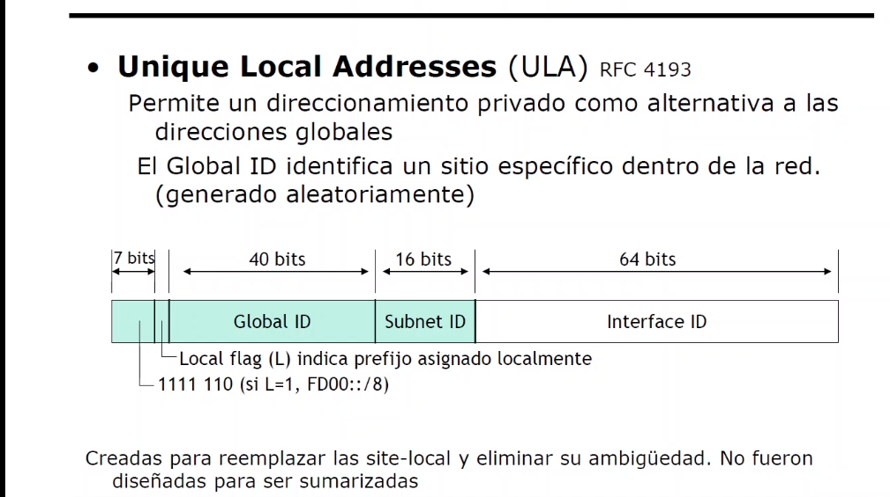 


Las famosas ULA, comenzadas con `FD00:/8`, es un bloque de direcciones reservados para uso casi **privado**, es algo muy parecido a lo que es la red `10`.
imaginate que uno arranca a usar ipv6 antes de estar conectado a la internet, es decir, queria meter el protocolo ipv6.
En lugar de ir a la IANA a pedirle un bloque de direcciones

Son utilizadas en entornos privados, es como el remplazo de las site-local.

`fdaa:bbcc:ddee:0:17f1:c583:e7dd:3645` por ejemplo es una ULA (la del profe)
ese prefijo `fd` lo identifica como ULA.

el protocolo IP elije por cual ip salir segun el ambito.

> estas IPS , todas, no son generadas por un DHCP como pasaba en IPV4, esto lo asigna automaticamente el S.O y se crea una IPV6
la autoconfiguracion es una gran ventaja del ipv6

es lo mas parecido si se quiere al direccionamiento ipv4 privado.

## Multicast Addresses
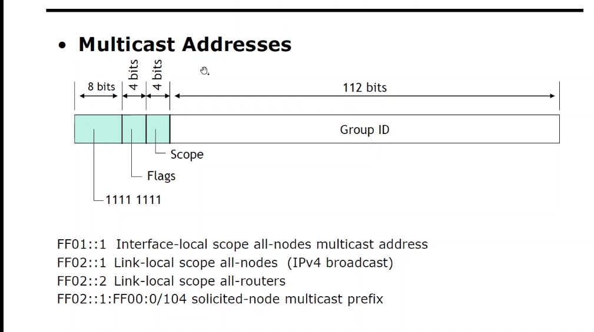 

El trafico multicast va dirigido de un origen a un grupo destino, no un host, no todos, un **grupo**.

hay direcciones ip multicast que representan diferentes grupos.

`FF02:11`: este es el equivalente a un BROADCAST de ipv4

En ipv6 **no existe el broadcast**, no hay una direccion 'todos 1' que represente a todos los dispositivos.
(el broadcast en ipv4 mandaba tambien a los dispositivos ethernet, entonces para no molestar a todos con mensajes que no quieren), ipv6 implemento esto.

(existen diferentes direcciones de multicast para diferentes cosas)

# Identificador de interfaz
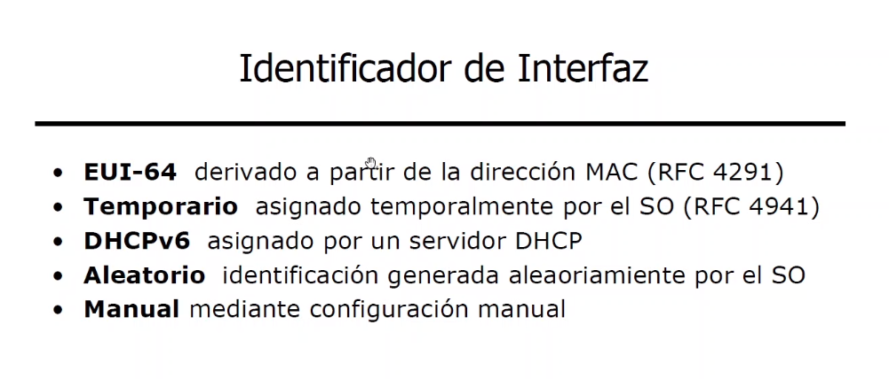 

- Linux(UNIX):
    - `EUI-64`: hacer el identificador de interfaz a partir del mac address de la pc, entonces con esto tenes la certeza que tenes un ID unico. (aca expones el OUI, al fabricante de la placa, estas exponiendo quien es el fabricante de mi placa de red en la IP)
    - `DHCPv6`: no se usa, la autoconfiguracion es mejor

- Windows:
    - `Temporario`: lo hace el S.O temporalmente
    - `Aleatorio`: random


- `Manual`: manual

## Eui-64, como se arma
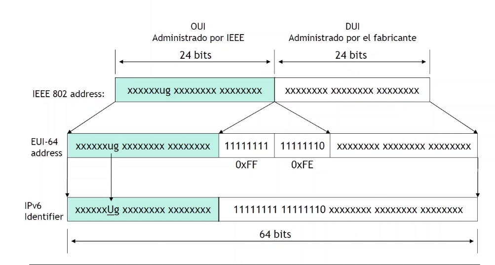 

---

# ICMPv6
Protcolo de mensajeria de control que provee mensajes de diagnostico y errores,  existe en ipv4 y aca se mantiene

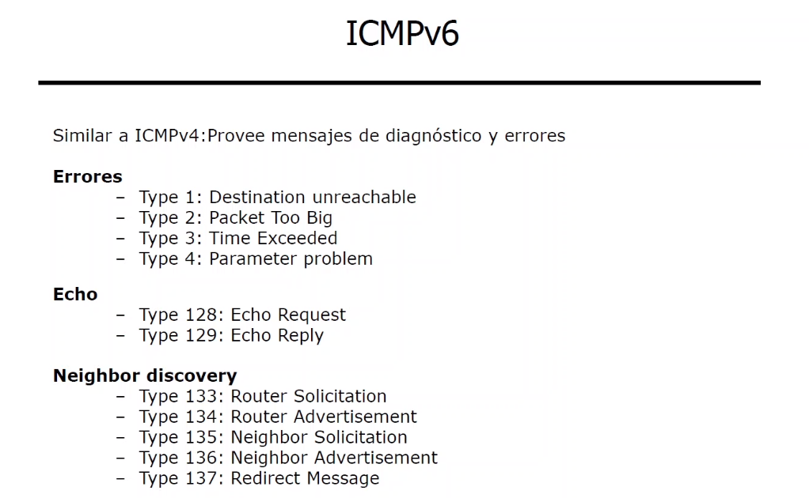 

Los nuevos son los listados en : **`Neighbor Discovery`**

`133: Router Solicitacion`: enviado cuando no recibe advertisment y se pide uno

`134: Router Advertisement`: cuando tengo un router en la red y configura ipv6 en su interfaz lan, por defecto el router va a empezar a enviar continuamente estos mensajes advertisement, el router toma el prefijo de esa ipv6 configurada en LAN y lo va a publicar en la red, diciendole a todos los que estan conectados que ese prefijo es el que hay que utilizar en la RED lan y que "él es un router y que lo pueden tomar como punto de salida de la red" (auto configurarse)

`135: Neighbor solicitacion`: evolucion del ARP
`135: Neighbor advertisement`: evolucion del ARP

## Autoconfiguracion
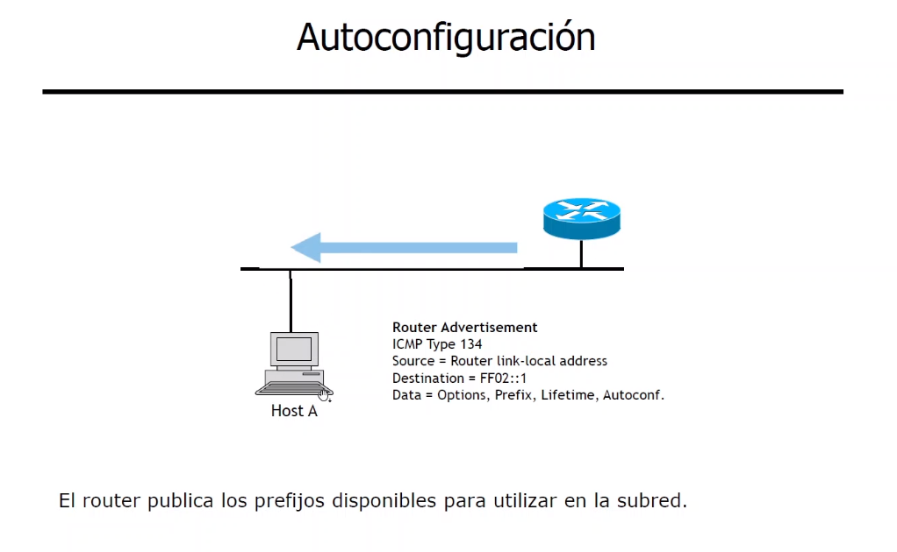 

## Neighbor Discovery
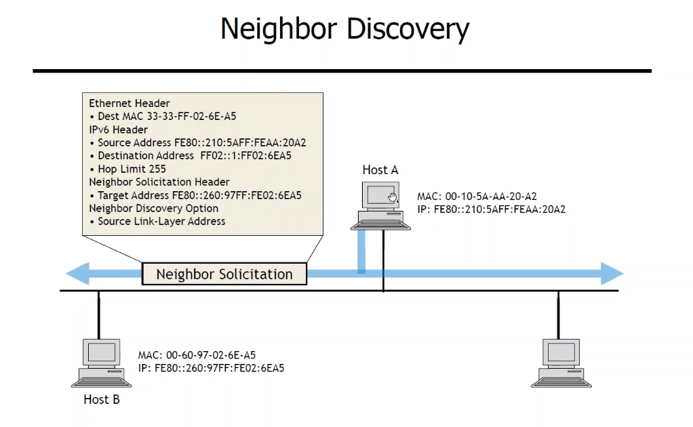 

Destination address: es una direccion ip multicast inventada, se llama "direccion multi cast de vecinos solicitado" y esta conformada por un prefijo multicast y los ultimos bits de la direccion IP que quiero alcanzar
`FF02::1:FF02:6EA5`

(direccion multicast): `FF02`
(direccion TODOS los nodos ipv6): `FF02::1`

y fijate que tu target es:
`FE80::260:97FF:FE02:6EA5`

con esto reducis el impacto de mandarle a todos tus vecinos y molestar, es mas directo el mensaje. 

es mucho mas eficiente que en ipv4

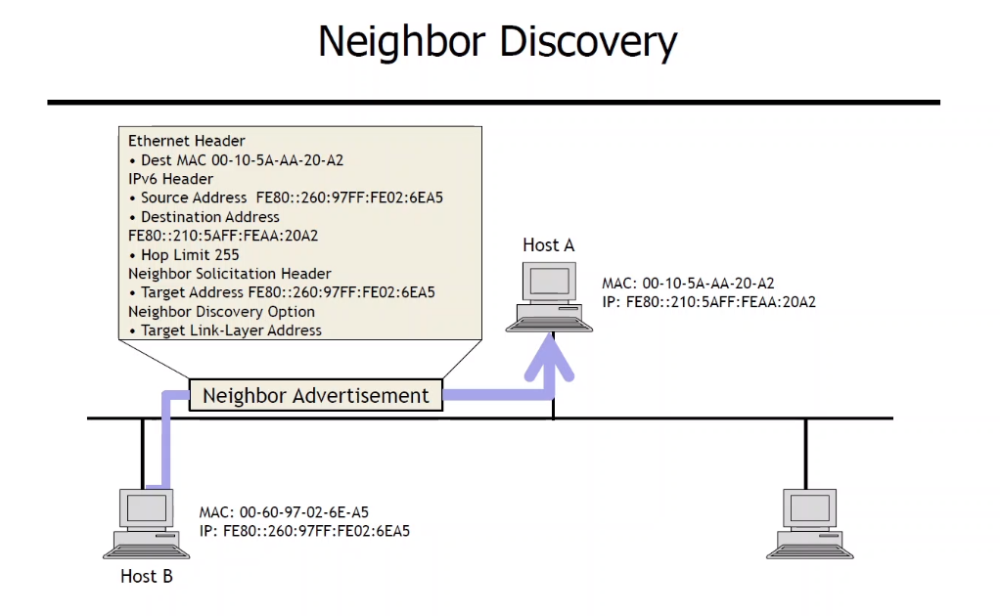 

## Solicited-node multicast address
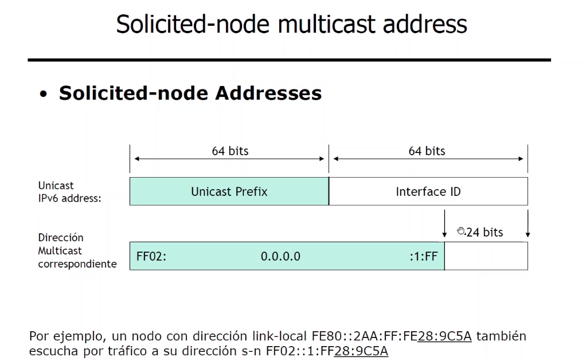 

# Mapeo de multicast a ethernet
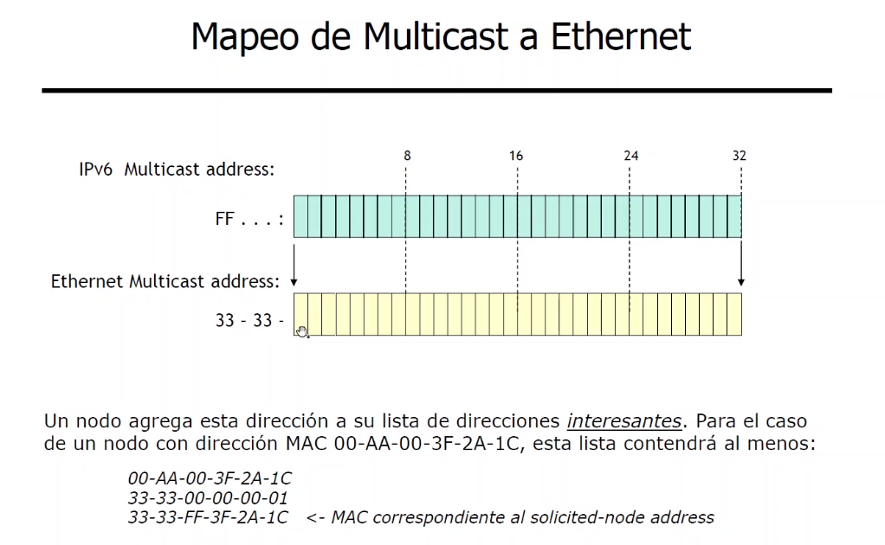 

# DNS en ipv6
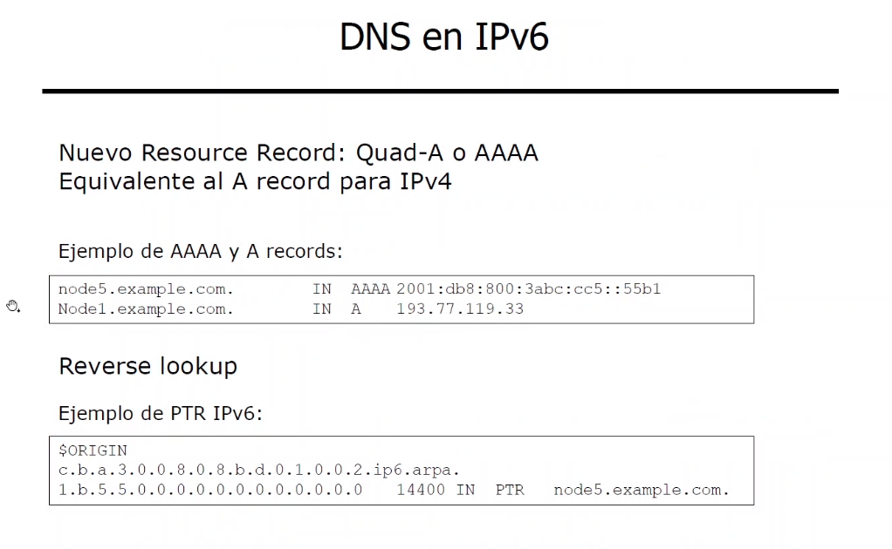 

Es esencial el uso de DNS en ipv6 en lugar de direcciones porque como habras visto, es casi imposible leer direcciones ipv6

# RIPng para ipv6
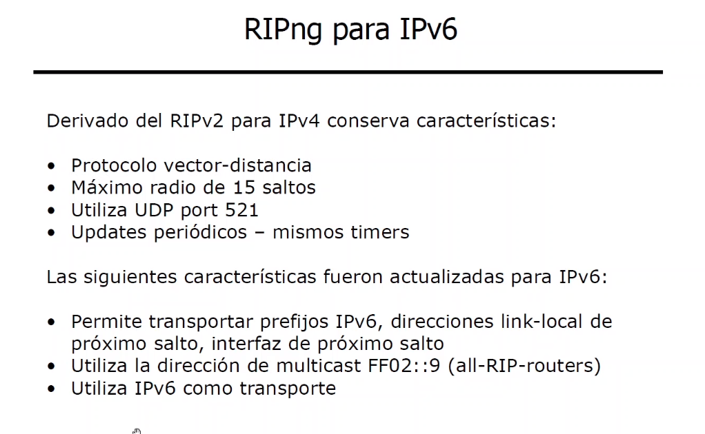 

este es el protocolo de ruteo que se usa en IPV6, se usa para intercambiar prefijos ipv6


