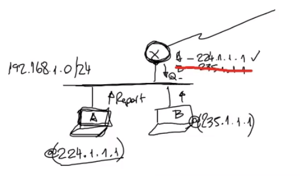

# Multicast: one-to-ALGUNOS
 

Ejemplos caros de multicast:
- Un video, que es transmitido por varios receptores (en youtube x Ej)
- Base de datos: muy comun cuando tenes un cluster donde tenes muchos miembros y uno de ellos envia un update que se tiene que aplicar en multiples destinos - multicast.

## Grupos de multicast
Conjunto de receptores
 

## Ip Multicast Addressing
La direccion que identifica al grupo.
 

- No puede ser un source address un grupo multicast, siempre son destination address
- No existen ICMPS aca, porque la fuente esta transmitiendo a multiples destinos, entonces tendrias miles de errores

 

y En ipv6 como es?

 

Lo bueno aca que podes elegir el scope.

## Ip Group Management
Como un miembro puede entrar y salir del grupo

## Multicast Routing
Es diferente a los ruteos tradicionales porque aca la IP es un **grupo** -> tenes que fijarte como hacer para que ese mensaje llegue a cada miembro de los grupos

# Escenario: multiples nodos partes de un grupo multicast en diferentes redes
 

- MulticastServer: va a mandar un mensaje multicast a todos esos grupos

el objetivo va a ser que el datagrama sea recibido por todos los miembros del grupos, entonces se plantean las siguientes opciones:

- **Broadcast**: a todos, le llega a toda la red y subredes- estaria mal porque estarias procesando mensajes que no le interesan

- **Multiples Unicast**: sabiendo los miembros, le mandas 1 mensaje a c/uno de los miembros (ASI FUNCIONA YOUTUBE) - abrimos un browser, nos conectamos al server de content y recibimos el contenido en HTTP , que inplica TCP y TCP implica UNICAST -> es decir, trafico UNICAST.  verga de esto? mandas 3 veces el mismo mensaje, necesitas el 3ple de ancho de banda. 3 copias

-  **Multicast**: la posta: que el server mande un solo mensaje a la red y que ese mensaje se replique en cada punto de **bifurcacion**.

# MULTI CAST: usa el concepto de un Spanning Tree
 
 

Los mensajes (naranjas) tienen una destination address que son la del grupo, en principio no se sabe quienes son, el server simplemente genera el feed con destino al grupo, y es la red quien hace la division de los mensajes para que estos lleguen a cada miembro.

 

# Group Management: manejo de los grupos, como hacen los nodos para suscribirse y abandonar grupos?
 

IGMP -> Internet Group Management Protocol: es un protocolo super facil como tu hermana que tiene dos mensajes nomas, `Membership Query` y `Membership Report`.

 

# BAJADO A TIERRA: Todo se basa en el simple IGMP
 

- El router guarda todo y sabe a que grupo pertenece cada nodo, este router envia periodicamente queries para ver si hay un miembro activo (Membership Query)

- Si manda query y no tiene respuesta, lo saca a la mierda de su "Tabla".

- Report: enviado por el host, es como decir "yo quiero participar del grupo `224.1.1.1`" entonces el router recibe el report y dice "tengo un miembro que es A,b,etc.."

- B tambien envia diciendo `"quiero participar de 235.1.1.1"`

- A podrian enviar un report diciendo "quiero seguir participando de la RED"

- Ponele que B deja de responder, entonces C deberia avisarle al router que esta activo y asi se mantienen ambos en la tabla

- Al finalizar las 3 queries sin respuestas, se termina la transmision.

# IGMP: GOLD
 

# Evolucion IGMP v2-v3-etc
- Incoporora un mensaje "Leave Group" para abandonar el grupo, entonces el NODO se va a la mierda y el router reacciona mas rapido a la desaparicion del ultimo miembro
- IGMP v3 incluye soporte para seleccionar la fuente de multicast, es decir, dentro de la mensajeria puede identificar cual de las multiples fuentes quiere utilizar
- Ipv6 incluye el "Multicast Listener Discovery" (no existe IGMP), sino que existen mensajes ICMPv6 que es basicamente un IGMP con diferente nombre

# IGMP Snooping
(recordar que en la practica existen los switchs)

 

- Los switch son capaces de interpretar los Memebrship Query/Report de los host, entonces el switch puede agregar el 224 en la interface.

# Ruteo Multicast - Multicast Routing
 

Como es el ruteo? es decir, como hago para que el mensaje que genera la fuente llega a estos suscriptores que le indicaron a su router el deseo de participar del grupo?

S: fuente
Los verdes oscuros: miembros del grupo multicast

## Solucion 2 - minimum cost tree (menos branches para recorrer)
 

## Solucion 3 - Core based tree
 

