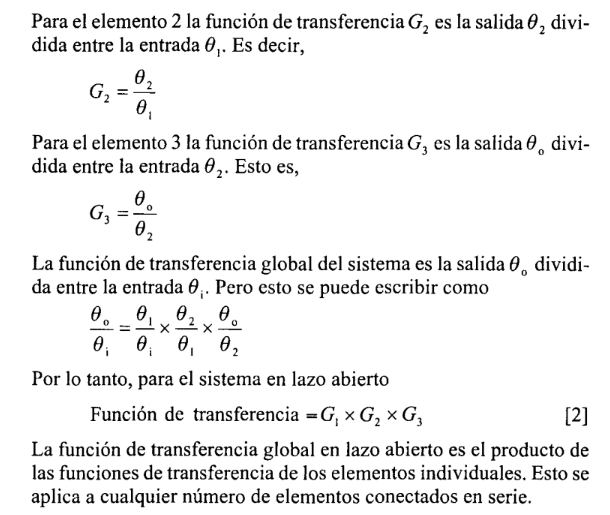
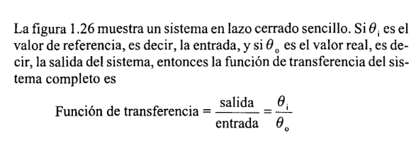
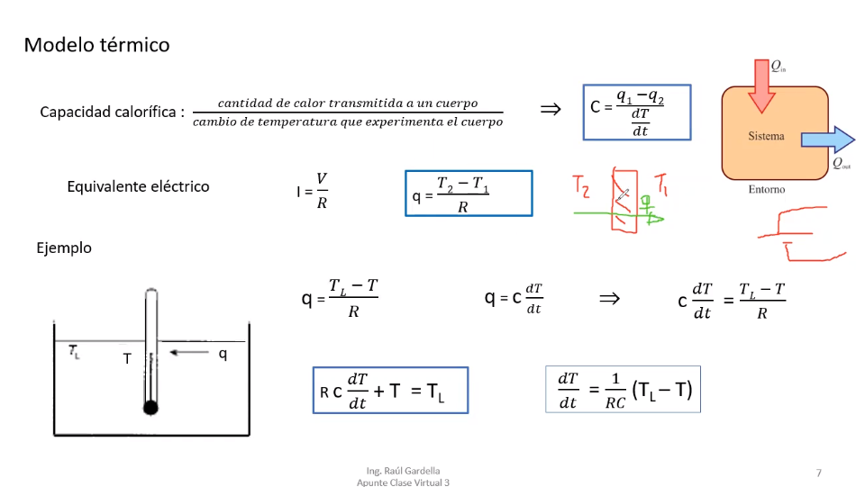
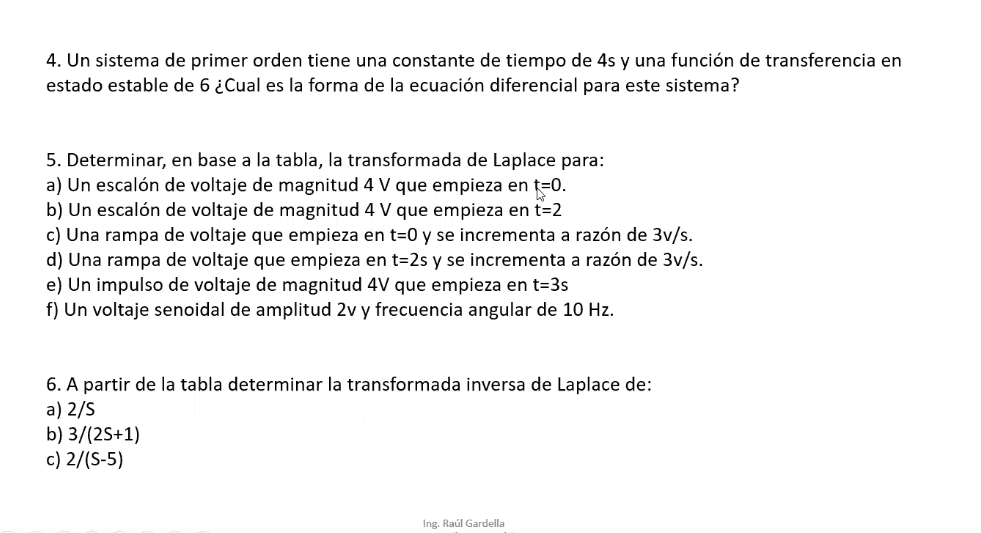
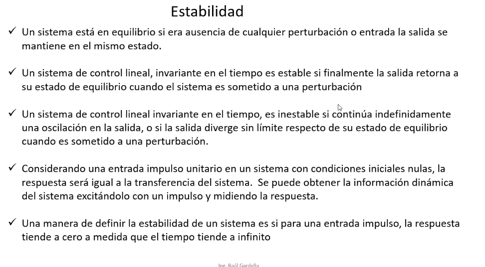
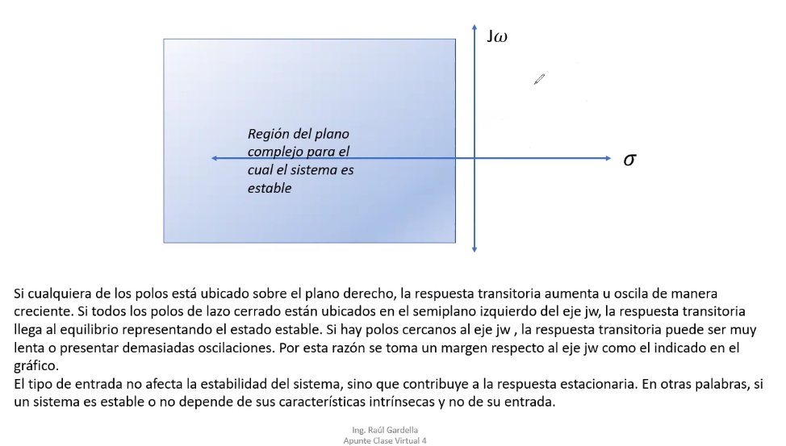
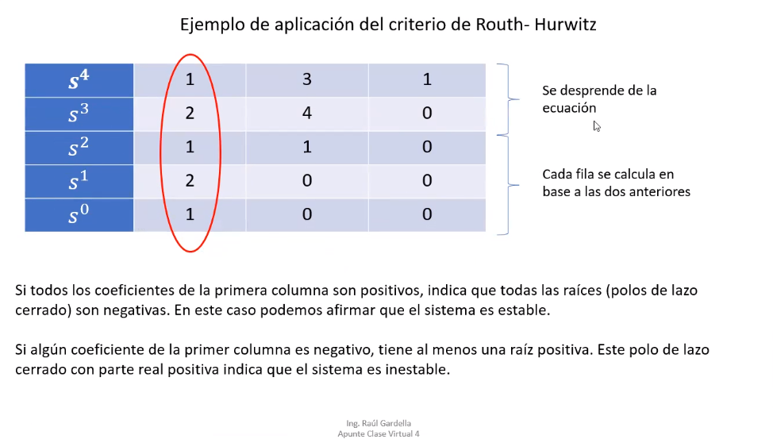

# Teoria de control [K4575]
## Wednesday - Night
<img src="https://utn.zoom.us/j/89180370566?pwd=TW8rZ3ZSSDVhbGxNWjY0R1UwUUlTQT09
- **ID de reunión**: `891 8037 0566`
- **Código de acceso**: `TDC2Q2022`

---
# Planificacion
 

---
# Resumen 1p
 

# Sistemas de Control
 

## Ejemplo de lazo cerrado
 

- Un lavarropa automatico es un sistema abierto, pensa que la salida (que es la ropa) no sirve para retroalimentar nada.

## Conceptos de los sistemas - Superposicion, Lineales, Caja negra
 

---
# Modelo matematico, funcion de transferencia, entradas y salidas
Considere un motor como sistema. La entrada al motor es un voltaje [V] y la salida es una velocidad angular [w] del eje. Para muchos sis-
temas existen relaciones lineales razonables entre Ia entrada y Ia sa-
lida. Esto significa que la salida es proporcional a Ia entrada y si la
entrada se duplica, entonces Ia salida tambien se duplica, es decir, si
 Ia entrada se multiplica por una constante multiplicativa entonces Ia
salida se multi plica porIa misma constante. Esto tambien quiere de-
cirque si Ia entrada 1 produce una salida 1 y Ia entrada 2 produce una
salida 2, entonces una entrada igual a Ia suma de las entradas 1 y 2
produce una salida igual a Ia suma de las salidas 1 y 2. De este
modo, si existe una relacion lineal entre Ia salida y Ia entrada para el
motor, entonces el modelo matematico es:
```
w=GV
```
 
 
 

## Elementos en serie (sistema lazo abierto)
"La funcion de transferencia global en lazo abierto es el producto de
las funciones de transferencia de los elementos individuales."

 
 

### Ejemplo
 


## Elementos en serie (sistema lazo cerrado)
 
 
 
 

### Ejemplo
 

---

# Modelos matematicos para sistemas en lazo cerrado con elementos multiples
 
 

### Ejemplo
 

# Error en estado estable
El error en estado estable `E` de un sistema es la diferencia entre la sa-
lida del sistema y su entrada cuando las condiciones estan en estado
estable.

 
 

## Ejemplo
La figura 1.31 muestra un controlador con una funci6n de transfe-
rencia de 12 y un motor con una funci6n de transferencia de 0.10 rev/min por V.
- Cual sera el error en estado estable cuando el sistema es un sistema de control en lazo abierto y como cambiara el error si, debido a cambios ambientales, Ia funci6n de transferencia del motor cambia en 10%?
- Cual sera el error en estado estable cuando el sistema es un sistema de control en lazo cerrado si ellazo de realimentaci6n tiene una funci6n de transferencia de l.O V por rev/min y como cambiara el error si, debido a cambios ambientales, la funci6n de transferencia del motor cambia en 10%?

 

a) lazo abierto

 

b) lazo cerrado

 

## Efectos de las perturbaciones (se suman al final de la salida)
 
 
 
 
 
 

---
# Sistema de control de lazo cerrado
 
```go
"θi": representa a la entrada, y la solemos llamar
el "valor de referencia" o "set point" que es el valor
que tiene que tender la variable controlada (o salida)
que es "θo"
```
## Trayectorias de prealimentacion(esto es paralelo en realidad) y realimentacion
 

## Bloques en serie - Paralelo - Prealimentacion
 

## Realimentacion
- recordar lo de los signos, cuando la realimentacion es negativa va un signo mas `"+"` sino un signo menos`"-"` en caso de ser positiva (fijarte el simbolo del input)

 

# Movimiento de un punhto de bifurcacion antes/despues de un bloque
- Si queremos dos salidas iguales, debemos agregarle la misma funcion de transferencia G al punto de bifurcacion

 

- Que pasaria al reves?, si lo quiero hacer despues del bloque pero quiero que se mantenga la misma funcion G? y... pura math, 1/G.. lo dividis por lo mismo que lo multiplicaste

 

# Ejercicio: reducir todo esto en un solo bloque
 

- G1 y G2 estan en paralelo = G1 + G2
- y abajo la formula de realimentacion (G / 1 + G.H)

 

# Ejercicio 2: lo mismo
 

- Arrancas por la retroalimentacion de abajo y despues la de arriba que estan en paralelo

 

# Ejercicio 3
 

- Mucha atencion aca, ni se te ocurra hacer G1 y G2 en paralelo, porque si haces eso y despues dejas G3 = G1 + G2, y haces la realimentacion con H, vas a asumir que la realimentacion esta dado en G1 tambien, donde claramente la realimentacion solo aplica a la felcha de G2.

- Entonces pasas el punto donde H toca a G2 al principio(es lo que aprendiste)

 

- el 1 viene de la G que es 1 acordate, porque arriba de la realimentacion no hay nada, entonces no se modifica nada, por lo tanto es lo mismo que asumir que hay una G que vale 1 (G=1) y de ahi viene la formula de realimentacion
- entonces fijate como te quedan los dos en serie despues

# Ejercicio 4 - varias entradas (principio de superposicion)
 

- vas tomando el sistema de una vista global, es decir, una entrada y una salida respecto de c/entrada diferente (pones algunas en 0, porque no te interesan)

 

### Resolviendo: 
- El de arriba es facil, las entradas esas valen 0 (o2 y o3) por lo tanto no los pones en el sistem y listo
- El de abajo, nota como te queda la salida multiplicada por -1 porque la entrada de Oi1 esta sumando (nota el signo mas) y la entrada de abajo OoH entra a un signo menos (nota el signo menos "-") por lo que, el resultado de ese coso te queda :
- Pones el signo porque tenes el comparador arriba simplementey despues le pones el + denuevo
 

- Lo mismo con la entrada 3, pasa lo mismo con el H ydespues todos en serie, anda raro
 

### Finalmente
#### OBS: SE PUEDE DEJAR EL SUMADOR CON EL - , no hace falta hacer todo esto del -1
 

---

## Efecto de las perturbaciones
### Lazo Abierto
En el lazo cerrado no influyen tanto las perturbaciones, en cambio si al lazo abierto...
- Notar como despues del sumador,  se suma la perturbacion al resultado de la multiplicacion de la entrada con la G1 (en serie)

 

### Lazo Cerrado (buen ejemplo para resumir cosas)
```py
factor reduccion de la perturbacion, error adicionado
```
 

## Consideraciones
 

---

# Modelos de sistemas
## Vamos a trabajar solamente con los sistemas **LINEALES**
 

## Modelos y respuestas de los sistemas - ecuaciones diferenciales
 

## Ejemplo circuito electrico con capacitor y resistor
 

## Ejercicios para hacer
### 1
 
### 2
 

---

# Clase 3 
# Modelos y respuestas de los sistemas
## Circuito RC
```go
tao, RC, circuito RC, constante de tiempo del sistema
```
 
 
 
Se cumple la ley de kirchoff siempre a pesar de que varias variables vayan cambiando, imaginate una foto del sistema.

 

## Circuito RL
 

# Ecuaciones diferenciales
## Ecuacion diferencial de primer orden
 

## Modelo termico
- La capacidad calorifica DEPENDE de la masa: cuanto + masa tenes - te calentas (es llamado inercia termica)

 

# Laplace - Transformadas
 

# TABLA LAPLACE


## Reglas basicas
 

## Teorema del valor inicial - final
### Forma general de la transferencia en el dominio S
 

# Respuestas en un sistema de primer orden
## Impulso


## Escalon unitario


## Rampa unitaria


# Ejercicios a realizar

 

- Hacer 5Tao = 12(que es cuando se llega al estacionario) estaria bien conceptualmente tambien
---
 

---

 
- La de transformadas de laplace es simplemente buscar la tabla y listo 

 
 

## Hallar la salida VC en el circuito RC, donde la entrada es un escalon de tension V que se aplica en t=0.
 

---

# Error en estado estable
 
 

# Entrada escalon unitario - tipos de sistema
## Recorda, la `'q'` arriba de la S define que tipo de sistema es: 
## S^0 = sistema tipo 0
## S^1 = sistema tipo 1
## S^2 = sistema tipo 2
 

# Entrada Rampa Unitaria
 

# Entrada Parabola Unitaria
 

# Tabla - Summary - Error en estado estacionario
 


---

# Estabilidad
- "

 

## Ejemplo [estable]
- Notar como este sistema termina siendo estable a pesar de que al inicio se produzca una variacion de la amplitud, es decir, que haya una alternancia del sistema al inicio... pero al final termina tendiendo a 0.

 
 

## Otro ejemplo [no estable -> la oscilacion crece en el tiempo]
 
 

## Criterio de Routh - Hurwitz
- Si **todos los coeficientes de la primer columna** son positivos -> entonces todos los polos (raices del denominador) van a ser **negativos** -> quiere decir que el sistema va a ser estable

 

## Coeficientes
 

# Ejercicios a realizar
 
 

## Analisis de estabilidad
 
 

---
# - esto no entra en el 1 par
# Ultima clase
# Lugar de Raices
 


