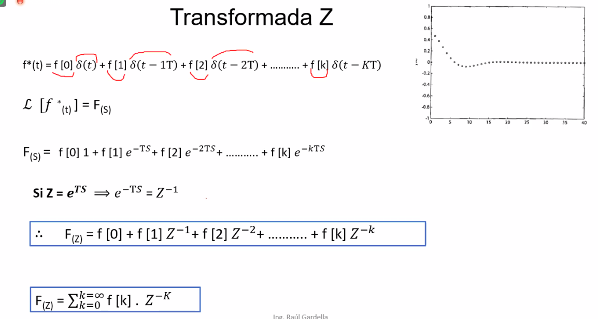

# Teoria de control [K4575]
# Lugar de raices
Simplemente un grafico que representa la posicion de los polos de la transferencia de lazo cerrado en funcion del parametro de sensibilidad estatica del lazo K.

 


## Condicion angulos
 

### Modulos + forma polar + euler
 

# Reglas construccion de lugar de raices
 
 
 
 
 

## Ejemplo ejercicio
 

## Otro ejemplo
 

# Muy mal explicado todo, vamos a "como hacer un ejercicio?"
 

1. **Encontra los polos** , los polos de la funcion son los que hacen 0 al denominador. Si tenes `3 polos => 3 ramas`
  - que son las ramas? nada, una linea que contiene las raices
  - **OBS**: recorda que si tenes algo como `S^2(S+1)` el S^2 tiene **`2 polos`**, +0 
  y -0 => entonces ahi tenes que sumar 2, no 1

2. **Encontra las asintotas**, la formula es :
    ```go
    Asintotas (B) = 180 / (numero de polos - numero de ceros)
    ```
3. **Encontra el centroide** o (centro de gravedad de asintotas), la formula es: (donde `p:polo ; z: ceros`)
    ```go
    Centroide = (pi + p2 +_.. + pn) - (z1 + z2 + .. + zn)
                ------------------------------------------
                  numero de polos - numero de ceros
    ```
4. **Distribui todo lo de abajo** para obtener la expresion posta
    

5. **Halla el punto de DESPRENDIMIENTO usando la formula**
    ```go
    G(S).H(S) + 1 = 0
    ..
    G(S).H(S) = -1
    ```
    Despejas todo en funcion de **`-K`** y despues derivas, ejemplo:
    ```go
    -K = S^3 + 4S^2 + 5S
    d(-K)/ds = 3S2 + 8S + 5
    ```
    Con esa funcion que te queda, encontra las **RAICES** , en este caso serian `S0 = -1 & S1 = -s/3`
6. **Halla la interseccion con el eje jw**, para eso planteas denuevo la formula
    ```go
    G(S).H(S) + 1 = 0

    juntas todo, es decir, si te queda algo como  
    1 + K/(S^3 + 4S^2 + 5S)
    aplica la suma de fracciones y te va a quedar arriba lo mismo
    que abajo pero con K, y listo, toda esa funcion aplicas criterio
    de routh-hortwitz

    --> con el critero hallas la K (en la primer intervencion
    , es decir, hallas la K que primero aparezca solamente
    en la primer columna, buscas el valor que haga todo eso 0) y 
    con esa K hallada, remplazas los valores en la fila anterior que
    la hallaste y asi encontras S
    ```

   

---

# Controladores
# **Control proporcional [Kp: ganancia proporcional]**: devuelve la misma forma de la entrada pero aumentada o disminuida
Basicamente un elemento que hace algo segun una entrada, nada nuevo.
- **No modifican el tipo de sistema**

 
 

### Ejemplo
- Recordar, a mayor `KP` menor error en estado estable

 

# **Control Integral [Ki: ganancia integral]**: la salida es la integral de la entrada
- Nota como se agrega un polo en el origen `Ki/s` lo que hace que cambie el tipo de sistema
- Esto es mejor porque aumentas el tipo del sistema, lo que lo hace mas compatible a diferentes entradas (rampa, escalon, etc)
- Nota en el grafico, la entrada era un escalon (1) y la integral es `x`, que es una recta y es la salida del controlador
- **Desventaja**: puede convertir al sistema en inestable, por lo que se lo suele utilizar en conjunto con un proporcional

 

# **Control Proporcional Integral [PI]**: los dos anteriores combinados
- Al sumarle el proporcional al integral disminuye la probabilidad de **inestabilidad**, porque estas agregando un polo y un cero a la vez

 


### Ejemplo
- Overshoot: es un sobre impulso, es la diferencia entre el pico y el valor deseado, es decir, ese incremento que tiene al inicio con respecto a la entrada escalon.

 

# **Control Derivativo [Kd: ganancia derivativa]**: la salida es la derivada de la entrada
- Notar como se pone un `0(cero = z)` en el origen `Kd . S` por lo que estamos reduciendo el exponente de la `S^q` por lo que le vamos a terminar bajando el tipo y aumentamos el error en estado estable 
- Un ejemplo muy piola para entender esto es tipo un sensor de **incendios** como trabaja el sensor de incendios? te avisa cuando todo llego a 200 grados?? y... no, ya estaria todo quemado, el sensor de incendios es un sensor de **Gradientes** es decir, la diferencia de temperatura alta y en muy corto tiempo , entonces ahi ==> avisa

 
 

# **Control Proporcional Derivativo [PD]**: combinado el derivativo con el proporcional
- Combinandolos agrega un `0` tambien pero **No en el origen**, en algun otro lado, que va a depender de la cosntante de tiempo derivativa
- Con esta forma minizamos el problema de largo plazo, ahora para largo plazo esta ayudado por la parte proporcional.

 
 

# El posta
# **PID: Control Proporcional Integral Derivativo**: la suma de los 3
- En funcion de la ubicacion de los polos y ceros de tu Gc(s) va a ser el comportamiento que va a tener nuestro controlador.
- Aca se ve el efecto de los 3 

 
 

# Resumen de los 3
 

# Sintonia del PID, como controlo las variables en el PID?
 
 

---

# **PLC**: Programable Logical Controler o (controlador logico programable)
Es una PC chiquita que sigue una serie de reglas para controlar como y cuando algo funciona , toma entradas y da salidas.

Puede ser un simple control de encendido o apagado segun la entrada o algo mas sofisticado, valuado en calculos.

 

## Programacion de un PLC - Ladder
 

### Simbolos
 

### Etiquetas
 

### Ejemplos
 
 

## Ejemplo bombilla electrica
### Enunciado 
 
 
 
# Ladder - Ejemplos
## Temporizador de pulso:
 

- Notar como aca la duracion del pulso (PT = Pulse Duration) nunca se modifica, porque este temporizador recibe un impulso IN y ya da una salida Q con ese PT predefinido
- La salida Q depende del tiempo PT que se programa

 

### Ejemplo
Se quiere prender y apagar un bombillo:
- Al apretar STARt el bombillo se prende y luego de 10 sec se apaga
- Pero si apretas STOP se apaga inmediatamente 
- Stop/Start son pulsadores

 

## TON: retardo a la conexion
```go
Q(salida): tarda en activarse segun el tiempo programado en PT, es decir
, llega una entrada "In" , entonces el parametro "PT" empieza a esperar 
el tiempo programado, una vez que se cumple ese tiempo "PT" , se activa
la salida "Q" 
```
### Ejemplo 
 

### Parcial
 


## TOF: retardo a la desconexion
## TONR: acumulador de tiempo


# Ultimo tema: Transformada Z
## Introduccion: <ins>Digitalizacion de una señal (analogica)</ins>
 


3 etapas para digitalizar una senial analogica (*tbt comunicaciones*)
- '**MUESTREO**': aplicar el teorema de nyquist ->
  `frecuencia muestreo >= 2fmax`
  al salir del muestreo, tenes muestras (que son como 
  lineas verticales) fijate que se parece a un tren
  de pulsos modulado por amplitud
  el muestreador nos da una señal de salida PAM

- '**CUANTIFICACION**': el cuantificador, toma como entrada
  cada una de estas muestras y genera niveles digamosle
  (transmision multinivel) llamados : 'niveles de cuantificacion'
  entonces lo que hago es a cada muestra le aproximo 
  un nivel de cuantificacion, obteniendo como salida una señal digital
  con valores discretos

- '**CODIFICACION**': cada uno de esos niveles de cuantificacion
   los codifico, por ejemplo:
   ```
   000
   001
   010
   ```
   etc.. cada nivel, en lugar de transmitir 1v, 2v, 3v, transmito
   000, 001 etc.. estas codificando los voltajes, y a la salida
   del codificador tengo una señal binaria '010010'

## Sistemas de datos muestreados (introducida la digitalizacion a un sistema de control)
 

## Tren de impulsos + Reten de orden cero
 

# Transformada Z
 

## Escalon unitario muestreado
 

## Rampa unitaria muestreada
 

## Tabla transformada Z
https://es.scribd.com/document/360144815/TABLAS-DE-TRANSFORMADA-Z-pdf

 

## Reglas transformada Z
 

## Procesamiento de señales en tiempo discreto
 

## Funcion transferencia de pulso
 

## Estabilidad de un sistema en tiempo discreto
 

## Ejercicios
 

1)
- a) esta en tiempo 5 o tiempo 4 , la unica diferencia.. despues es un escalon unitario
- b) ojo que este no converge a 0

2) pura tabla

3)
  - a) es 1
  - b) es (Z/Z-1) * 2 Z ^ -1

## Analisis de estabilidad
 


